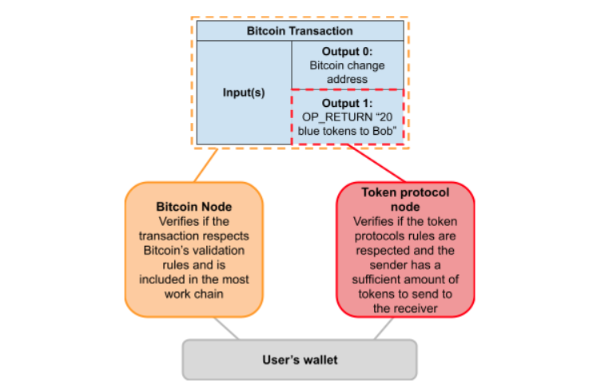
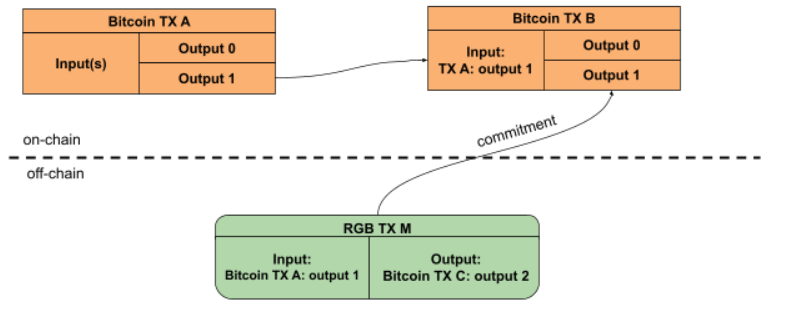
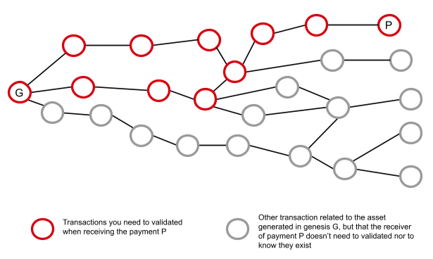
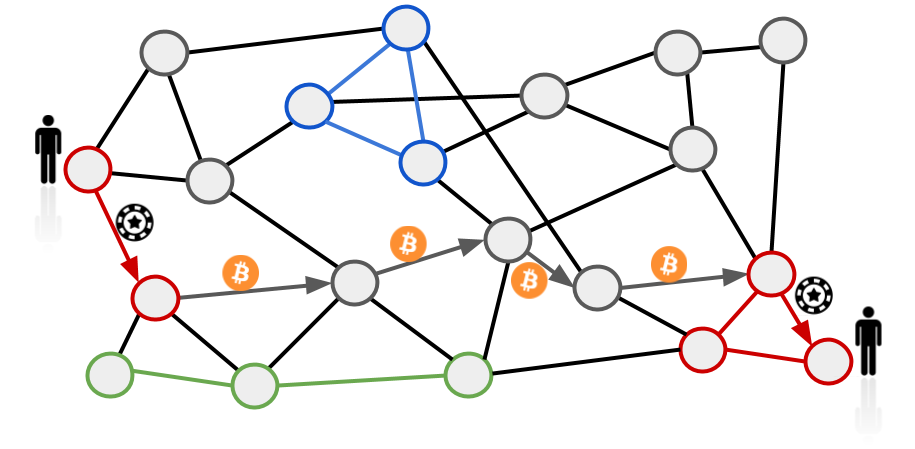

> *作者：Federico Tenga*
> 
> *来源：<https://medium.com/@FedericoTenga/understanding-rgb-protocol-7dc7819d3059>*

**免责声明**：出于教育目的，一些概念在本文中已经简化，以避免读者被新的术语淹没。它们也可能跟正式的技术规范有所不同。

最近，人们越来越表现出对在比特币和闪电网络上发行代币的兴趣。创建代币来代表资产、并让它们获得比特币当前的保管安全性和转让便利性，并不是什么新鲜的想法，在 2013 年就出现这方面的先驱了，比如 Counterparty  和 OmniLayer（前身是 “Mastercoin”）；这种想法也被以太坊和其它山寨币所继承，目前绝大多数的区块链代币都是在后者这些平台上出现的。但是，使用山寨币来保护金融资产是不理想的，因为它们无法提供比特币同样的安全性和去中心化。出于这个理由，许多年来，一些项目一直在尝试革新在比特币上发行代币的协议并使之与闪电网络兼容，代表是 RGB、OmniBolt 以及近期出现的 Taro。本文的重点是 RGB 协议，希望能提供一个讲解它如何工作以及价值何在的综合性概述。

## 比特币协议上的古典代币

老一些的在比特币上发行代币的协议，比如 Counterparty  和 OmniLayer，其工作原理是在比特币交易中插入元数据来 “染色”，并表示该笔交易应该被理解成一笔代币转移。这样的信号机制通常是用 OP_RETURN 操作码来实现的，带有该操作码的输出会被普通的比特币节点无视，但可以被能够感知这些代币协议的节点解释，这些节点会实施代币协议的验证规则。

虽然这种设计是很高效的，它也有一些缺点：

1. 与代币转账相关的信息量被限制在 OP_RETURN 输出可以容纳的字节数以内，一般来说是 80 字节；这个空间对普通的交易数据编码来说足够了，但对更复杂的应用场景就有点捉襟见肘。
2. 代币协议节点需要扫描整条区块链、在 OP_RETURN 输出中搜索可能与用户相关的代币转账，整个流程会因为比特币区块链体积的增长而更加耗费资源。
3. 用户的隐私性非常差，因为所有的交易数据对所有人都是可见的，而用户所用的 token 的匿名集比起比特币来要小上几个数量级。

## 在链下转移

怀着优化这种设计的目的，RGB 协议提出了一种更可扩展、更加隐私、更面向未来的解决方案，其基石是 [Peter Todd 在 2017 年](https://petertodd.org/2017/scalable-single-use-seal-asset-transfer) 提出的客户端验证（client-side validation）和一次性密封条（single-use-seals）的概念。

核心的理念是，仅在必要的时候才使用比特币区块链，也就是利用工作量证明和网络的去中心化来实现重复花费保护和审查抗性。所有的代币转移的验证工作都从全局共识层中移除、放在链下，仅由接收支付的一方的客户端来验证。

那么它到底怎么工作呢？在 RGB 中，基本上代币都归属于一个比特币 UTXO（无论是已经存在的 UTXO，还是临时创建的），而为了转移代币，你需要花费这个 UTXO。在花费这个 UTXO 的时候，比特币交易必须包含对一条消息的承诺，这条消息的内容是 RGB 的支付信息，它定义了输入、这些代币将被发送到哪个 UTXO、资产的 id、数量、花费的交易以及其它需要附加的数据。

- 如果你有一笔归属于比特币交易 A 的 #1 输出的代币，要转移这些代币你就需要创建一笔 RGB 交易以及一笔花费交易 A 的 #1 输出的比特币交易，并且这笔比特币交易承诺了 RGB 交易。如你所见，RGB 交易是把代币从比特币交易 A 的 #1 输出转移到比特币交易 C 的 #2 输出（这笔交易在图中没有表现出来），而不是转移给比特币交易 B。在大部分情况下，我们可以预期交易 B 的输出就是找零地址，为的是在减去矿工手续费后将剩余资金发回给原来的所有者；同时也是为了承诺 RGB 交易，以避免重复花费。 -

所以，为了转移归属于一笔比特币交易的 RGB 代币，需要发起一笔比特币交易。但是，RGB 转账的输出不需要跟比特币交易的输出相同！就像我们上面这个例子，RGB 交易的输出（比特币交易 C 的 #2 输出）可以跟承诺这笔 RGB 交易的比特币交易（交易 B）没有任何关联。这就意味着，RGB 代币可以从一个 UTXO “传送” 到另一个 UTXO 中，而完全不会在比特币交易图中留下任何痕迹。这极大地提高了隐私性！

在这种设计中，比特币的 UTXO 的作用是装载 RGB 资产的[一次性容器](https://petertodd.org/2016/commitments-and-single-use-seals#single-use-seals)，要转移资产，你只需要打开旧的容器、关上新的容器就好。

RGB 代币的具体支付信息在链下通过专门的通信通道来传输，从支付者的发往接收者的客户端并由后者来验证其没有违反 RGB 协议的规则。如此一来，区块链观察者将无法获得任何关于 RGB 用户活动的信息。

不过，验证发来的支付信息还不足以确保发送者真的拥有要发送给你的资产，因此，为了确保发来的交易具有终局性，你还必须从支付者处接收关于这些代币的所有交易的历史，即从当前的这一笔一直追溯到其最初的发行的那一笔。验证了所有的交易历史，你就可以保证，这些资产没有被通胀、附加在资产之上的所有花费条件都得到了满足。

这个设计也有益于可扩展性，因为你无需验证这种资产的所有历史，只需要验证跟你有关的部分就好。而且，交易不会广播到全球账本中的设计，也提高了隐私性，因为更少人知道了你的交易的存在。

## 盲化秘密值

为了进一步提高隐私性，RGB 还支持输出的盲化（blinding of outputs），意思是说，在你向支付方发送支付请求的时候，你无需公开自己用来接收代币的 UTXO，只需要求支付方把代币发给一条哈希值，这条哈希值是你用目标 UTXO 本身拼接一个随机盲化秘密值之后生成出来的。这样一来，支付方就无法知道代币会发送给哪个 UTXO，因此交易所和其它服务商也无法知道用户是否正在取款到被一些监管机构 “黑名单” 的 UTXO 中，也无法知道这些代币未来是如何花费的。

请注意，在代币被花费的时候，盲化秘密值必须向接收者公开，以便后者能验证交易历史中跟比特币交易有关的部分。这意味着，使用 RGB 的时候，你在当下拥有完全的隐私性，但未来的代币持有者将能看到自己手上的代币的转移历史中的所有 UTXO。因此，虽然在接收和持有 RGB 代币时你可以获得完美的隐私性，但用户过往金融活动的机密性会随着代币的不断转移而不断降级，最终趋向于跟我们的比特币交易历史同样的隐私性。

## 闪电网络兼容性

因为 RGB 是建立在比特币上的，使用闪电网络来转移 RGB 代币自然也是有可能的，而且已经有人在开发这样的技术了。闪电网络是一种基于支付通道的扩容方案，现实地来说，需要付出一些努力，来让每一种资产的通道流动性可以达到合适的水平，这即可以由资产获得越来越广泛的接受来实现，也可以由通道管理软件与支持同类资产的节点直接相连，创造某种资产专用的子网络来实现。

人们提出的另一种解决方案可以让不那么流行的资产也能在闪电网络中使用：引入一类提供比特币与小众资产交换服务的节点。如此一来，一旦换成了比特币，价值就可以利用比特币流动性在网络中路由；在到达支付路径的另一端时，另一个交换服务节点会将比特币再转换回原本的资产。这就不再需要为一种资产专设一个网络了。但是，要让这种思路称为现实，这样的对手资产跟比特币的交易量必须足够高，以激励做市商在网络的多个位置部署交换服务节点、提供足够低的买卖差价以避免价值在两个交换节点的转换中损失太多。

- 带有 RGB 染色通道的闪电网络图示。灰色的圆形代表普通的闪电网络节点，而染色的圆形代表支持某种 RGB 资产的节点。在资产通过一条闪电网络路径转移时，一些既有普通比特币通道、又有染色通道的节点将作为交易所，使得支付能利用比特币流动性来送达目的地。 -

## 高级智能合约

因为使用了比特币交易，RGB 自然也继承了比特币所有的智能合约功能，而且还不仅限于此。当你转移代币给对手方时，可以在支付信息中定义对方需要满足的额外花费条件。这些额外的花费条件不是由区块链的全局共识来实施的，而是由 RGB 节点的验证程序来实施的。这意味着，如果有人想在不遵守具体的 RGB 花费条件规则的情况下花费代币，接收方的节点将无法通过验证，并认为这笔交易不具有终局性，发送者将无法成功。事实上，当 RGB 交易失败时，花费代币所归属的 UTXO 的比特币交易依然有可能得到比特币的确认，这意味着这些代币将不再从属于 *任何* UTXO 了，所以也可以认为这些代币被稍等了，这也是一个在编写 RGB 智能合约时需要考虑的机制。

另一个需要记住的取舍是，RGB 智能合约合约可以提供其它一切替代方案所不能及的隐私性和可扩展性，但这些智能合约的状态不是全局可访问的，也无法变成无主的（unowned）（在其它区块链上则不然），这也可能会限制一些应用场景。

因为 RGB 的客户端本性，我们可以提出许多智能合约框架，并免信任地加以实现。在撰文之时，已经有一个项目在开发这个方向，叫做 “[AluVM](https://www.rgbfaq.com/glossary/aluvm)”。

## RGB 与其它方案的比较

有兴趣接受 RGB 协议的人可能会感到困惑，它跟其它代币协议相比如何呢？我们用几个例子来分析一下：

### 基于山寨币的代币

大部分基于山寨币的代币协议（例如 ERC-20）提供了具备全局无主状态（global unowned state）的智能合约，这使得部署去中心化交易做和其它金融应用变得很容易，但它们很难扩展、没有隐私性，也继承了这些山寨币所有的缺点，比如运行节点的成本很高、更低的去中心化和审查抗性。

### Liquid 资产

[Liquid](https://blockstream.com/liquid/) 是一个比特币的联盟侧链，提供了一些有趣的功能，比如原生的资产支持以及机密交易（可以隐藏被转移的资产的 ID 和支付的数量）。但是，联盟模式也一样有低去中心化和审查抗性较弱的问题。

### OmniBolt

[OmniBolt](https://omnilab.online/omnibolt/) 是 OmniLayer 的兼容闪电网络的版本。而 OmniLayer 在本文的开头我们已经简要介绍过了。它的取舍跟 RGB 非常相似，但隐私性和可扩展性更差，因为代币相关的数据都存放在链上。

### Taro

在 Bitcoin 2022 Miami 大会上，[Taro](https://docs.lightning.engineering/the-lightning-network/taro) 发布。Taro 背后是 Lightning Labs 团队，协议的目标是将资产带到闪电网络上。根据已经放出的技术规范，整个设计与 RGB 非常相似，特性和取舍基本上是一样的。在撰文之时，RGB 和 Taro 的主要区别似乎在于，RGB 已经放出了可以审核的代码，而 Taro 还只是一种规范，但另一方面，你也可以说 Taro 是由闪电网络生态中最棒的团队之一背书的，这给未来的实现创造了良好的预期。出于它们的相似性，如果 Taro 和 RGB 最终可以相互操作，那就最好了，但只有时间能告诉我们让这种互操作性得以发生的激励因素存不存在。

## 结论

如果你有兴趣在比特币上发行代币，RGB 显然是一个你可以了解一下的项目。想了解更多或参与贡献或想在 RGB 上开发，这里有一些链接可以帮到你：

**RGB 社区 Telegram 群**：https://t.me/rgbtelegram

**RGB 教育资源**：[ https://blueprint.rgb.network/](https://blueprint.rgb.network/)

**RGB 节点代码库**：https://github.com/RGB-WG/rgb-node

**RGB 节点教程**：https://grunch.dev/blog/rgbnode-tutorial/

（完）