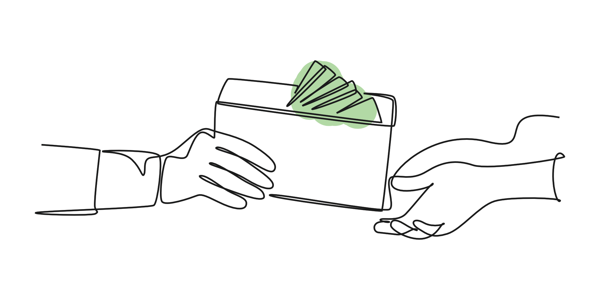
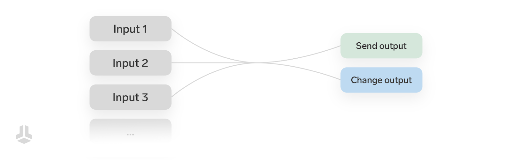
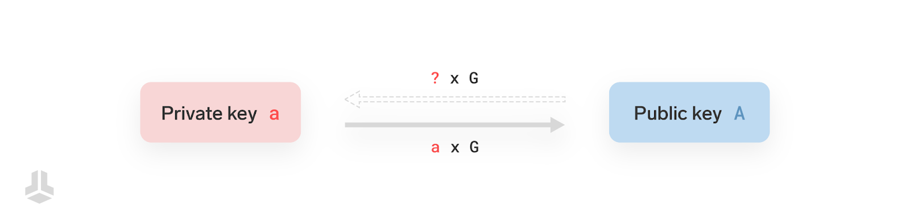
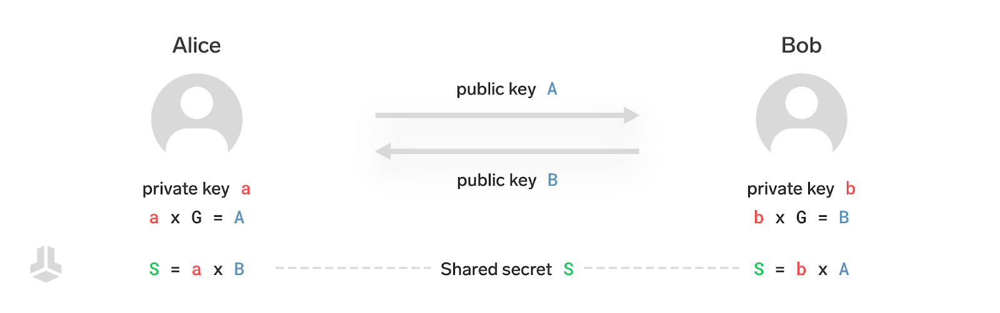
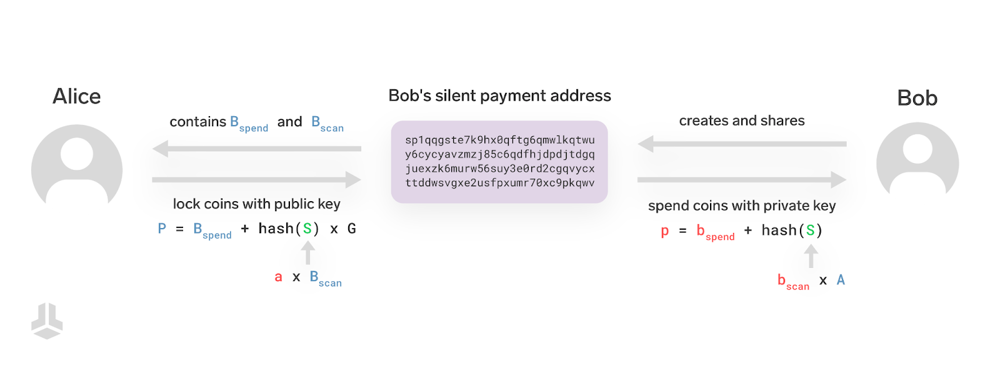
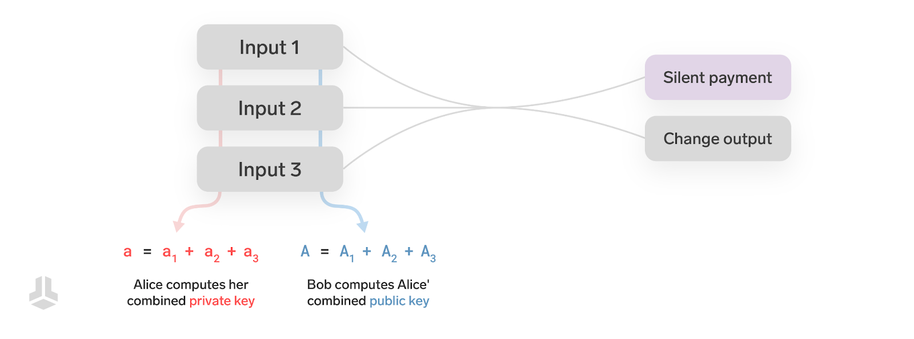
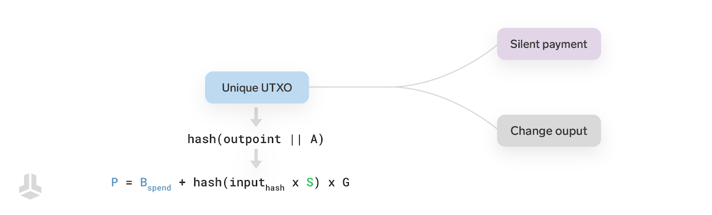

> *作者：benma & Sebastian*
> 
> *来源：<https://blog.bitbox.swiss/en/understanding-silent-payments-part-one/>*

我们骄傲地宣布， BitBox02 是第一款能够安全地执行比特币 “静默支付” 的硬件签名器。在这个系列博客中，我们希望展示静默支付的工作原理，以及在表象之下，BitBox02 做了什么，来让这些支付能够安全地执行。

发送到静默支付地址的支持将在未来的更新中提供给所有 BitBox02 用户。

- 第一篇将解释静默支付的工作原理
- 第二篇将展示为安全地支持静默支付，BitBox02 在背后都做了什么

[静默支付](https://github.com/bitcoin/bips/blob/master/bip-0352.mediawiki)是一个提议新的比特币地址格式的 BIP（比特币优化提议）。它的主要好处是能产生一种静态的地址。它消除了管理多个地址的需要，同时还能保护隐私性。如果你想了解更多基础概念，可以看看[我们上一篇关于可复用支付码的文章](https://blog.bitbox.swiss/en/reusable-payment-codes-exchanging-bitcoin-addresses-privately/)。

当前，为了保护隐私，链上支付的收款方必须在每一次收取支付时，给支付方提供一个新的地址。者导致了糟糕的用户体验，以及使用困难。

举个例子：

- 从交易所取款：在每一次取款的时候，你都要从 BitBoxApp 中找出一个新的、还没用过的地址，在 BitBox 和第二台设备中验证这是正确的地址，最后到交易所登记这个地址。
- 向交易所存款：每一次存款，你都要在交易所创建一个新的存款地址，并在发送资金之前在第二台设备和 BitBox 上验证它是一个有效地址。
- 接收捐款：你需要建立和运营一个服务器（比如 BTCPay Server），以为每一次捐赠生成一个新的地址。

许多比特币服务端和用户都不想处理这样的复杂性，所以他们直接重复使用同一个地址，这就牺牲了他们的隐私性，因为他们所有的交易都会关联到同一个地址，很容易被识别和分析。

静默支付的目标是解决上述挑战。其地址的设计目标是可以复用（静态），但发送到静默支付地址的交易将只有发送者和接收者（地址的主人）才能识别出来。所以慈善机构可以在网页中公开一个稳定不变的捐款地址，而不让任何人知道谁捐了钱、捐了多少。交易所也可以为你所有的取款登记一个静默支付地址。

## 比特币交易

比特币的交易由输入和输出组成。

输出会产生新的 UTXO（未花费的交易输出），而输入则是花费现有的 UTXO 。如果关于 “UTXO” 你想了解更多，可以看看我们[关于这个主题的文章](https://blog.bitbox.swiss/en/whats-a-utxo/)。

最常见的情况是，一个 UTXO 是用一个**公钥**来锁定的，而要花费它的时候，需要提供一个由该公钥背后的**私钥**所生成的签名。当你为比特币交易填入一个地址的时候，通常，这个地址就编码了一个公钥（或者一个公钥的哈希值）。

静默支付使用了一些有趣的密码学技术，为发送给一个静默支付地址的每一笔交易都派生一个新的、没有用过的公钥。现在，让我们来了解一下这背后的知识和直觉。下文是对静默支付工作原理的简化的、概要的描述。想要了解所有的细节，还是得看[它的 BIP 本身](https://github.com/bitcoin/bips/blob/master/bip-0352.mediawiki)。

## 迷你入门课：私钥和公钥

私钥就是一个很大的数字，长到无法猜测出来，比如说：

$92193805913277071008055984303319191614197341949664602874511898854633635443214$

每一个私钥都能生成一个对应的公钥。公钥不会暴露其背后的私钥的任何信息。

从技术上来说，公钥属于一个数学上特殊的 “群”，它有自己专门的假发。如果你想了解更多，《 *[椭圆曲线密码学：通俗介绍](https://andrea.corbellini.name/2015/05/17/elliptic-curve-cryptography-a-gentle-introduction/)* 》这个系列博客是非常好的材料。

从私钥生成公钥的公式是：

$公钥 = 私钥 \times G$

这里的 $G$ 是预定义的值，称为 “生成元”。生成元是一个特殊的公钥。所有其它的公钥，都是通过生成元和加法，生成出来的。

比如说，如果你的私钥是 $2$ ，那么，你的公钥就是 $2 \times G = G + G$ 。如果你的私钥是 $3$ ，那你的公钥就是 $3 \times G = G + G + G$ ，依此类推。 当然，在实际用途中，你的私钥会是一个非常大的、怎么猜也猜不到的数字，就像上面那个例子。

除了不能反向计算，大部分常用的数学，在公钥所在的群里也是一样的。比如大家熟悉的 “结合律”，依然成立：

$(a + b) \times G = a \times G + b \times G$

**在本文剩余的章节中，我们用小写字母来表示私钥，用大写字母来表示公钥。例如：**$a \times G = A$ 。

## 椭圆曲线上的 Diffie-Hellman 密钥交换

“椭圆曲线上的 Diffie-Hellman 密钥交换（[ECDH](https://en.wikipedia.org/wiki/Elliptic-curve_Diffie%E2%80%93Hellman)）” 是一套简单的协议，为两个参与者 Alice 和 Bob 创建一个他们共享的秘密值。

我们假设 Alice 要给 Bob 发送一笔交易。

- Alice 的公私钥对：$a \times G = A$
- Bob 的公私钥对：$b \times G = B$

只需要把自己的公钥交给对方，他们就可以创建一个只有他们俩知道的秘密值。

- Alice 计算共享秘密值： $S = a \times B$
- Bob 计算共享秘密值：$S = b \times A$

你可以看出，两个数值是一样的：
$$
S = a \times B = a \times (b \times G) = a \times b \times G = b \times a \times G = b \times (a \times G) = b \times A
$$
技术上来说，$S$ 是私钥 $a \times b$ 所对应的公钥，可以用在交易的输出中，作为锁定输出的公钥，但是，需要让 Alice 和 Bob 的私钥结合起来，才能花费它。

为了避免分享私钥，我们可以通过哈希算法，将它转化为一个新的私钥：$s = hash(S)$ 。从而，我们可以用这样的公钥来锁定输出：
$$
P = hash(S) \times G = hash(a \times B) \times G = hash(b \times A) \times G
$$
被这个公钥锁定的资金，可以被发送者和接收者任何一方（使用自己的私钥）花费。那怎么做到让它只能被 Bob 花费呢？接着往下看。

## 静默支付

静默支付地址的前缀为 `sp1`（而不是我们熟悉的 `bc1`），而且，它看起来是这样的：
$$
sp1qqgste7k9hx0qftg6qmwlkqtwuy6cycyavzmzj85c6qdfhjdpdjtdgqjuexzk6murw56suy3e0rd2cgqvycxttddwsvgxe2usfpxumr70xc9pkqwv
$$
非常长对吧？因为它编码了接收者的**两个**公钥：一个用于扫描的公钥 $B_{scan}$，一个用于花费的公钥 $B_{spend}$ 。额外的公钥，是为了让只有 Bob 才能花费。

在发送交易的时候，Alice 为 Bob 安排的输出所用的公钥不是 $P = hash(S) \times G$，而是**加入**了 Bob 的第二个公钥的调整版本：$P = B_{spend} +  hash(S) \times G$ 。至于 $S$ ，Alice 用 Bob 的扫描公钥和自己的私钥计算出来：$S = a \times B_{scan}$ 。

Alice 能计算出公钥 $P$，是因为她从 Bob 的静默支付地址中知道了 $B_{scan}$ 和 $B_{spend}$ ，而且她知道自己的私钥 $a$ 。

最终的公钥 $P$ 会用来锁定添加到交易的一个 Taproot 输出。

只有 Bob ，才能够用自己的两个私钥 $b_{spend}$ 和 $b_{scan}$ 来花费这个输出中的资金，因为只有他才知道 $P$ 背后的私钥：
$$
P = B_{spend} +  hash(S) \times G = b_{spend} \times G + hash(b_{scan} \times A) \times G = (b_{spend} + hash(b_{scan} \times A)) \times G
$$
所以，Bob 最后用来花费这个输出的私钥就是：$p = b_{spend} + hash(b_{scan} \times A)$ 。

Bob 使用自己的扫描私钥计算出共享秘密值的哈希值 $hash(S) = hash(b_{scan} \times A)$ ，再加入自己的花费私钥，就可以计算出最终的私钥。

## 那么 Alice 到底使用哪个私钥呢？Bob 怎么知道这个私钥所对应的公钥？

Alice 想给 Bob 支付，她知道 Bob 的公钥，因为 Bob 所公开的静默支付地址里面有。

那么 Alice 的密钥呢？Bob 怎么知道 Alice 所用的公钥？不知道 Alice 的公钥，不就没办法重新创建出共享秘密值、也无法探测出发给他的静默支付交易、更没法花费资金了嘛？要是接收者还需要跟每个支付者沟通、获得对方的公钥，那就很不方便。

解决方案非常优雅：所有附加到交易本身的有关密钥！

Alice 花费自己的 UTXO、制作发送给 Bob 的交易；这些 UTXO 本身分别被一个 公私钥对 锁定。她需要自己的私钥来花费自己的资金，那何不直接使用这些私钥来创建共享秘密值呢？

所以，Alice 拿自己用作交易输入的所有 UTXO 的私钥，来创建用在静默支付中的共享秘密值。

Bob 可以通过所有交易输入的公钥，计算出共享秘密值。

一笔交易可能有多个输入，所以 Alice 要使用一个结合私钥，就是所有输入的私钥之和：

$a = a_1 + a_2 + ...$

Bob 也要使用交易的结合公钥，也就是所有交易输入的公钥之和：

$A = A_1 + A_2 + ...$

根据**结合律**，这些私钥的和正是公钥的和所对应的私钥：
$$
A = (a_1 + a_2 + ...) \times G = a_1 \times G + a_2 \times G + ... = A_1 + A_2 + ...
$$
为了实现上述效果，每一个输入都必须有且仅有一个相关的公钥。因此，静默支付仅允许使用[下列脚本类型](https://github.com/bitcoin/bips/blob/master/bip-0352.mediawiki#inputs-for-shared-secret-derivation)的输入：P2TR（且要求是密钥花费）、P2WPKH、P2WPKH-P2SH、P2PKH；换句话说，之允许使用单签名的脚本类型，这也是当前最常见的类型。不幸的是，如果 Alice 用的是一个原生的多签名脚本（而不是 MuSig2 或其它能够聚合成单个公钥的聚合签名方案），或者是其它高级脚本，就无法发起静默支付。我认为这是静默支付的一个很大的缺点，也是阻止其得到采用的巨大障碍。

## 确保地址不会复用

静默支付的主要目标是避免 地址/公钥 复用。根据上述方案，接收者的公钥是从 Alice 在交易输入中的公钥和 Bob 的静默支付地址中动态创建出来的。然而，如果 Alice 一直使用同一个地址，那么她发送给 Bob 的静默支付地址的多笔交易，会因为使用相同的输入公钥而产生相同的输出公钥。

为了解决这个问题，静默支付提议规定，输出公钥并不像上文那样计算（$P = B_{spend} +  hash(S) \times G$）；而要这么计算：

$P = B_{spend} +  hash(input_{hash} \times S) \times G$

这里的 $input_{hash} = hash(outpoint || A)$ ，也就是交易的其中一个输入的输出点与公钥的字节拼接的哈希值。输入的 “输出点” 是一个交易 ID 和一个输出索引号，是 UTXO 的唯一标识符。因为 UTXO 在比特币区块链上无法重复花费，那么 UTXO 的唯一标识符的哈希值就保证了独一无二的输出公钥，因为没有两个 UTXO 会有同样的标识符。出于 BIP 所说的一个[技术理由](https://github.com/bitcoin/bips/blob/master/bip-0352.mediawiki#cite_note-why_include_A_3)，$A$ 也放在哈希函数中。

在提议的最初草案中，input_hash 是根据所有交易输入（在运行字典排序后）计算出来的。在我的评审意见中，我[指出](https://github.com/bitcoin/bips/pull/1458#pullrequestreview-1645164067)这对硬件签名器是个挑战（点击页面中的 “Show resolved” 来展开帖子：

> 这对硬件签名器是个挑战。硬件签名器的内存有限，也许无法加载所有的输出点并加以排序。因此，将不得不限制交易为在签名时刻已经有排好序的输入，这是不理想的，而且会产生兼容性问题。
>
> 与其使用排好序的输出点的哈希值，也许我们可以使用 ……

在许多人参与讨论之后，能够满足要求、也适合硬件签名器的解决方案出现了：仅哈希一个输入，在字典排序中最小的哪个输入。这产生了该 BIP 的最终版本，并让 BitBox02 可以无摩擦地实现对静默支付的支持。

## 总结

我们介绍了静默支付的概念；作为一个比特币优化提议，它提出了一种新的地址格式，让用户可以重复使用一个静态地址，同时保护隐私性。我们介绍了私钥和公钥的基本概念，讨论了使用 ECDH 来创建共享秘密值的过，以及这种技术如何用来锁定资金、保证只有接收者才能花费它们。

在下一篇文章中，我们将了解静默支付如何改变了硬件签名器的角色，以及为了安全地支持静默支付 ，硬件签名器要做哪些事情。

> *[续篇见此处](https://www.btcstudy.org/2025/08/12/understanding-silent-payments-part-two/)*