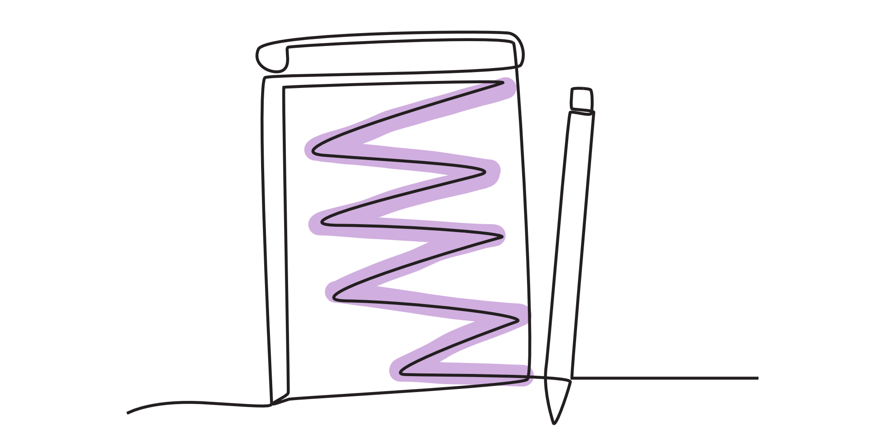
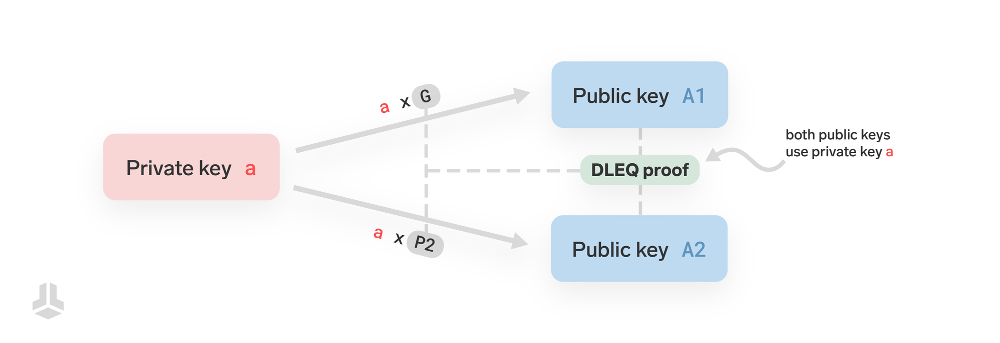
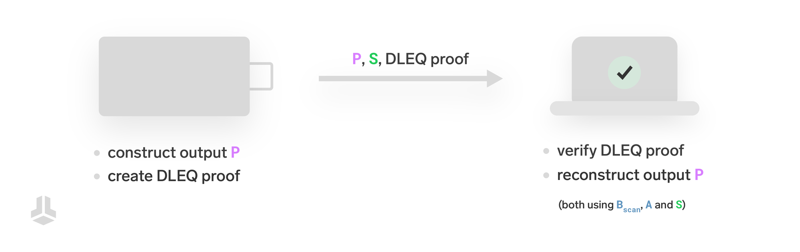
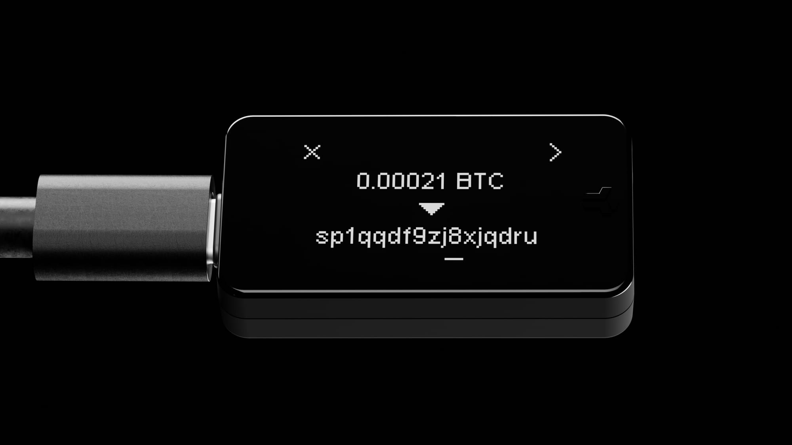

> *作者：benma & Sebastian*
>
> *来源：<https://blog.bitbox.swiss/en/understanding-silent-payments-part-two/>*
>
> *[前篇见此处](https://www.btcstudy.org/2025/08/06/understanding-silent-payments-part-one/)*

在[上一篇文章](https://blog.bitbox.swiss/en/understanding-silent-payments-part-one/)中，我们学习了静默支付的技术基础。现在，该凑近一点，看看静默支付在硬件签名器（比如 BitBox）中如何工作了。

我们极度推荐先阅读本系列的上一篇文章，因为本文建立在上一篇文章所论述的知识之上，具体来说就是私钥和公钥的性质以及静默支付的工作原理。**跟上一篇文章一样，在本文中，我们也用小写字母来代表私钥，用大写字面来代表公钥。比如：**`A = a × G `。

回顾一下，当 Alice 要给 Bob 发送一笔静默支付时，安排给 Bob 的交易输出，是从 Bob 的静默支付地址和 Alice 的私钥中动态派生出来的：

`P = B_spend + hash(input_hash × S) × G`

其中的 `S` 就是 Alice 和 Bob 的共享秘密值。Alice 的硬件签名器可以用自己的私钥 `a` 和 Bob 的公钥 `B_scan` 将它计算出来：

`S = a x B_scan`

这里，Alice 用到的 `B_spend` 和 `B_scan` 都是从 Bob 的静默支付地址中得到的，而 `a` 是这笔交易的所有输入的私钥之和。

## 创建交易和签名交易

我们要理解的第一件事情是，静默支付极大地改变了硬件签名器在处理比特币交易时的角色。

在以往的支付形式中，主机钱包（你的电脑或者手机上的软件，比如 BitBoxApp）**创建**交易，硬件签名器（比如你的 BitBox02）只是**验证它和签名它**（提供许可）。

而在静默支付上，事情不一样了。硬件签名器不仅要负责签名，还要负责**生成生成交易的一部分**，具体来说就是给 Bob 的交易输出。这是因为，生成给 Bob 的交易输出需要 Alice 的私钥，而且只有她的硬件签名器才知道这些私钥。

这一范式转移带来了一些新的风险：

- **内存损坏**：如果硬件签名器有 bug ，或者内存故障，可能会派生出不正确的输出，从而将资金发送到不可花费的地址，实际上就是弄丢了钱。
- **恶意行为**：如果硬件签名器被篡改了，它可能会在主机钱包不注意的时候创建一个直接发送给攻击者（而不是 Bob）的输出。

这个问题可以通过让主机钱包验证由硬件签名器生成的静默支付输出的正确性来优雅解决。这在概念上类似于 “[anti-klepto](https://blog.bitbox.swiss/en/anti-klepto-explained-protection-against-leaking-private-keys/)”  —— 那是另一个要让主机钱包来验证硬件签名器没有不轨行为的案例。

## 离散对数相等证明

那么，主机钱包怎么验证由硬件签名器生成的静默支付输出是正确的呢？

主机钱包没法直接验证它，因为主机钱包自己无法重新生成出静默支付输出。这要么需要 Alice 的私钥 `a`，要么需要 Bob 的私钥 `b_scan`，才能计算出共享秘密值 `S`，但无论哪一个，主机钱包都是无法得到的。

反过来，我们使用一种密码学工具来允许主机钱包验证硬件签名器所生成的静默支付输出，它叫 “离散对数相等（DLEQ）证明”。

一个离散对数相等证据让你能够证明，同一个私钥 `a` 被用来生成了两个不一样的公钥，虽然这两个公钥是通过不同的 “起点”（也叫 “基础点（base point）”）生成的。

第一个公钥是 `A1 = a x G`，其中的 `G` 是常用的基础点（生成元）。第二个公钥是 `A2 = a x P2`，其中的 `P2` 是另一个基础点。证据保证了这两个公钥都来自同一个私钥 `a`，而无需向验证者揭晓私钥本身。

用大白话来说，你证明的是，尽管这两个公钥是通过不同的基础点（`G` 和 `P2`）生成的，但它们都用到了同一个秘密值（私钥 `a`）。

而用技术属于来说，这个证据表明，公钥 `A1` 对应于基数 `G` 的离散对数，与 `A2` 对应于基数 `P2` 的离散对数，是一样的。

## 验证正确性

让主机钱包能够验证静默支付输出正确性的协议如下：

硬件签名器创建静默支付输出，以及一个 DLEQ 证据，证明公钥 `A = a x G` 和共享秘密值 `S = a x B_scan` 中的秘密值是同一个（私钥 `a`）。

- 因为 `A` 和 `S` 都是从同一个私钥 `a` 中派生的，DLEQ 证据保证了公钥秘密值 `S` 也是用 Alice 的私钥生成的。

硬件签名器发送自己生成的支付输出 `P` 以及共享秘密值 `S` 和 DLEQ 证据给主机钱包。

主机钱包使用以下三者来验证 DLEQ 证据：

1. 公钥 `A`，就是 Alice 要发送的交易的所有输入的公钥之和；
2. 来自静默支付地址的 `B_scan`，以及
3. `S`，由硬件签名器提供

- 如果证据能够通过检查，主机钱包就能确信，这个 `S` 是由 `a x B_scan` 正确计算而来，即使主机钱包不知道私钥 `a` 。

现在，主机钱包可以通过独立的重新计算，验证静默支付输出：

`P = B_spend + hash(input_hash × S) × G `

为此，主机钱包需要从 Bob 的静默支付地址中取出 `B_spend`、从交易输入中独立地计算 `input_hash`，以及从硬件签名器中得到的 `S`（在上一步中，已经得到了验证）。

- 如果重新计算出的静默支付输出与硬件签名器所返回的输出一致，那么主机钱包就可以安全地终局化并广播交易，因为它知道其中的静默支付输出是正确的、没有被篡改过。

### 流程总结

- Alice 的硬件签名器创建静默支付输出，并使用一个 DLEQ 证据来证明自己使用的是正确的私钥。
- 主机钱包验证证据，以保证共享秘密值是正确计算得出的。
- 主机钱包使用共享秘密值和来自交易的已知输出，重新计算并验证静默支付输出；如果一切检查都能通过，就敲定交易。

这一方法表征了硬件签名器无法搞小动作，不论是因为硬件损坏还是因为恶意活动。

## 推出

保证静默支付安全性的特性，包括在 BitBoxApp 中实现本文所述的正确性检查，将在 BitBoxApp 的下一个版本 4.45 和 BitBox 固件版本 9.21 中发行。

BitBox02 是第一款支持发送静默支付的硬件签名器。如果广大的生态系统不支持发送静默支付，想让其它钱包软件、交易所、服务商等等说服自己添加对静默支付的支持，可就难了。这是一个鸡生蛋、蛋生鸡的问题。我们希望我们可以用这种办法帮助静默支付得到采用。

## 感谢开源协作

我们第一次听说静默支付，是在 2023 年 [BTC Azores unconference](https://btcazores.com/) 上，来自 BIP 作者 [josibake](https://x.com/josibake/) 和 [Ruben Somsen](https://x.com/SomsenRuben) 的演讲。[这个 BIP 本身](https://github.com/bitcoin/bips/blob/master/bip-0352.mediawiki)收获了非常多的高质量评审。

当我们开始草拟在 BitBox02 中的实现时，我开始思考上面提到的风险，并发了一条[推特](https://x.com/_benma_/status/1800910791585267948)，列举了我的担心。Josie、Ruben 和 [Andrew Toth](https://x.com/andrew_s_toth) 很宽指出，DLEQ 证据是一种可能的解决方案，并为我提供了这一主题的一些[非常有用的阅读材料](https://delvingbitcoin.org/t/bip352-psbt-support/877/1)。唯一缺失的拼图是一个高质量的、经过评审的 DLEQ 实现。

当 Andrew Toth 开始编写一个[详细描述 DLEQ 的 BIP 草案](https://gist.github.com/andrewtoth/df97c3260cc8d12f09d3855ee61322ea)时，密码学家 [Tim Ruffing](https://x.com/real_or_random) 想起 [secp256k1-zkp](https://github.com/BlockstreamResearch/secp256k1-zkp/) 代码库中已经有一个实现，而那时 BitBox02 已经依赖的代码库。那是 [jesseposner 为另一个使用场景提供的](https://github.com/BlockstreamResearch/secp256k1-zkp/pull/117/files#diff-af7e1bf67c999123aba5f3f14622539c6ac8eb6ce92676ccaa1f5c418bed6574)，但幸运的是，这个实现被证明也非常适合静默支付。

在来自 BIP 的测试界面、上述 DLEQ 实现以及一个有用的[参考实现](https://github.com/cygnet3/rust-silentpayments)的帮助下（虽然我们不能直接使用这个参考实现，因为硬件签名器有不同的要求），我们可以顺利地在 BitBox 集成对静默支付的支持。

当这么多人自愿贡献自己的时间和精力，在开放的环境中打造一些东西，并最终能够聚沙成塔，总是让人新潮澎湃。

衷心感谢 Josie、Ruben、Andrew，以及许多帮助我们完成这一特性的其他人。