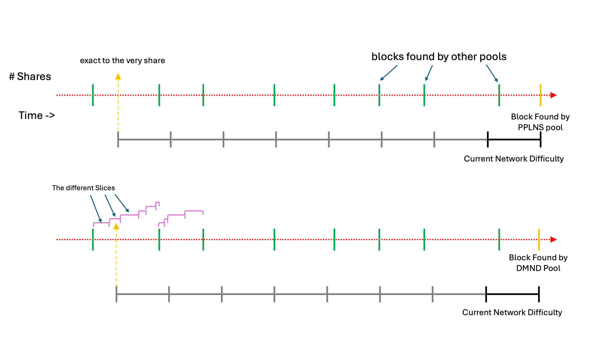
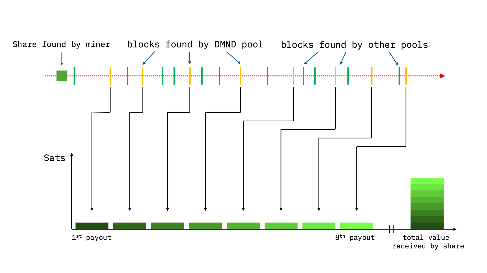
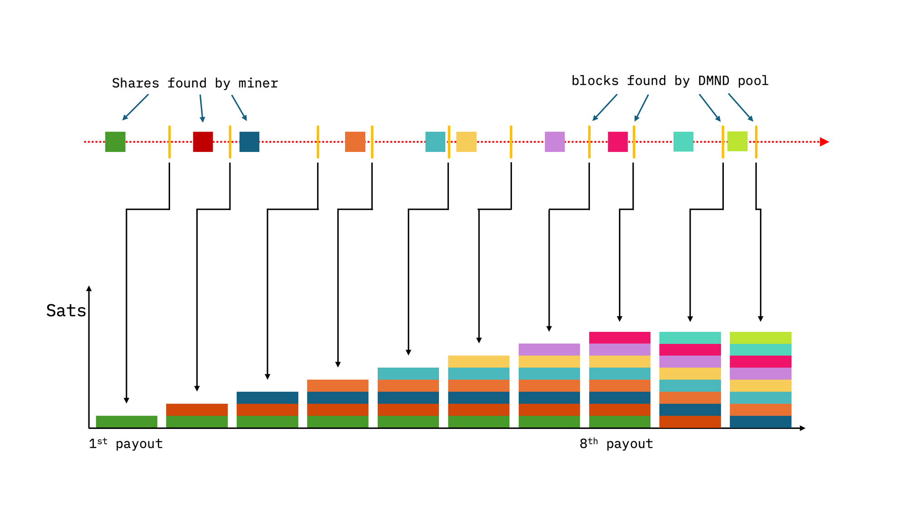

> *作者：DMND*
> 
> *来源：<https://blog.dmnd.work/understanding-slice-pplns-jd/>*

## 引言

DMNP 矿池是第一家使用 Stratum v2 协议的矿池；这套协议由比特币领域的 FOSS（自由且开源软件）开发者们（主要是 “Stratum 参考实现（SRI）” 团队）历时五年合力开发而成。Stratum V2 的目标是去中心化比特币，说具体点是挖矿和矿池行业。实现这个目标的主要杠杆是纠正以往的实现 —— Stratum V1 —— 所犯下的错误：将创建区块模板的工作从矿工转移给了矿池。但将池化挖矿模式去中心化是一个复杂的任务，因为挖矿位于技术和经济因素的十字路口。

过去几年，技术与经济因素的这种相互作用变得越来越明显。我们已经看到了池化挖矿的版图如何因为 “完全按 share 支付（FPPS）” 的采用而变得越加集中化。在 FPPS 和 Stratum V1 的夹击下，整个网络被限制在一条日益中心化的路线上，少数几个矿池就决定了什么样的区块能被添加到区块链上。因此，即使矿工全面采用 Stratum v2，趋向中心化的经济激励依然存在。

SLICE [1] 是一种新的矿池支付系统，是为了解决这个问题而设计的。SLICE 被设计成与 Stratum V2 协作，确保两种中心化因素（技术因素和经济因素）能同时得到解决。SLICE 确保矿池和矿工的经济激励，在公平性、透明化、低波动和去中心化上更加一致。在下文中，我们将简化地总结和解释 SLICE 的工作原理。

## SLICE：让 PPLNS 适应 Stratum V2

对于我们追求去中心化的矿池来说，PPLNS 是最好的选择之一。它为矿池的经济收益如何在矿工间分发提供了清晰的概念。而且，它是透明的，很容易验证矿池是否作弊了。它也是一种真正的支付系统，不是 FPPS 那样的保险条款，而且对矿池运营者和矿工来说都更加便宜。

但 PPLNS 在开发的时候还没有 Stratum v2 呢。更具体来说，PPLNS 不考虑矿工们行使自己的自由、使用自己的节点来构造自己的区块的可能性，而这正是 Stratum V2 鼓励的一种特性。这其中也包含了不去挖掘经济收益最高的区块的自由。这就是 PPLNS 的 “阿喀琉斯之踵” ，并且，随着交易手续费占据收益的比重越来越高，这个盲区还会越来越大。

因此，SLICE 将区块收益分为两部分，区块补贴（增发的比特币）和交易手续费。区块补贴使用经典的 PPLNS 方法来分发，完全基于回溯窗口（lookback window）内矿工贡献的哈希率数量。另一方面，交易手续费则根据所贡献的哈希率，以及与该哈希率相绑定的金融价值来分发。Stratum V2 中的 “作业生成器（Job Declarator，JD）” 会帮助矿工确定手续费的部分，这也是为什么 SLICE 也叫做 “PPLNS + JD” 。

## 创建公平的切片

目前我们建立了一个很好的基础，既考虑贡献的工作量（哈希率），又考虑与这些哈希率相关的经济价值（交易手续费）。我们还要添加最后一项修改，以让这个系统是公平的。这跟打分（或者说加权）有关：每一个 share 在经过与它有关的交易的调整（也就是 SLICE 的作业生成器部分）之后，就得到一个权重。因为如果在 PPLNS 回溯窗口中的所有交易（在手续费上）都得到同样的权重，更早的 share 就会无端受到惩罚。

（译者注：“share” 是矿池对矿工的哈希率贡献的统计。）

这是非常容易理解的，只要你能想到：随着时间推移，一个区块能够收取的手续费可能会增加。因此，一个在早上 10 点提交的 share，就比 5 分钟之前提交的更有经济价值，因为在这 5 分钟里，新的交易会出现，通常来说手续费率会比已有的交易更高。如果我们不考虑这一情形，我们就会像老旧的矿池支付方式（比如 SCORE）一样失败。

（译者注：这里的意思是，如果一个 share 的收益只靠其挖矿时候的交易手续费来调整，那么较早提交的 share 因为可以确认的交易天然更少，收益也就天然更低，因此，需要再乘以一个乘数（加权），来纠正这种 “惩罚”，或者说，保持 PPLNS 挖矿的激励因素）

这个概念 —— 考虑一个区块能够以交易手续费形式获得的最大价值 —— 在技术上叫做 “交易池最大可抽取价值（MMEV）” 。这是因为交易会出现在每个节点的交易池中，而它们正是矿工用来构建区块的材料。

这就是 “slice（切片）” 派上用场的地方。如果让所有的 share 都是一个巨大的回溯窗口的一部分，就会惩罚那些无法得到更多有价值交易的 shares（尽管它们本身没有任何过错），因此，我们将回溯窗口分割成较小的时间切片。在每一个切片内，所有提交的 shares 都会被比较、根据产生最高收益的 share 来打分。因为我们假设，在这样一个较小的时间窗口中，每个人产生最高交易手续费的能力是相同的。随着新的带有更高手续费的交易出现在交易池中，这个基准会持续更新， 从而为努力生产最好的区块提供持续的激励。

现在，得益于大的 PPLNS 回溯窗口被切分成较小的切片，我们可以用一种公平的方式来衡量所有的 shares ，不仅考虑交易手续费，还考虑手续费在时间中的变化。这项创新让  PPLNS 能够适应 Stratum V2 的全部潜能，让所有矿工都能行使构筑自己的区块的自由，因为他们知道自己会得到矿池收入的公平份额。

## 切片的大小

这里要指出的重点是，切片可长可短，就看矿池怎么设置。此外，还有一些判断一个切片何时结束、另一个切片何时开始的标准：

1. 发现了一个新区块，那么当前的切片结束、新的切片开始
2. 可以从一个区块中获得的最大手续费已经增加了一定的数量 X，因此我们开启一个新的切片，直到手续费增加的幅度再次超过 X ，那就开始再下一个切片。

在这些设定之下，矿池可以选择自己要多大的 X ，从而调整切片的动态时长。通常推荐将 X 设得非常小，因为这将创建更多切片，也就能让 shares 的跨时间打分更加公平。

因此，切片是以动态的方式一个接一个到来的，并且它是高效、可编程和公平的。每一个切片都由矿工在此期间提交的所有 share 组成，每个 share 都带有一个难度值，以提醒矿池这个 share 贡献了多少工作量。因此，每一个切片最终都会有一个确定的大小，是用它内部的难度值计算出来的。

一个冷知识：没有一种办法能够确切地 *知道* 任何一个东西的哈希率，不论是一台机器、一个矿场还是一个矿池，乃至比特币网络本身。我们 “知晓” 任何东西的哈希率的唯一办法都是从它提交的 shares 以及这些 shares 所在的难度来推测哈希率。这也是为什么你的挖矿设备、矿池乃至网络的哈希率从来无法稳定，总是在波动，因为我们只能根据设备所提交的 shares 来推算哈希率。

一个简单的实验就能检验这个事实的：使用比特币网络本身。你可以到 Glassnode 或者 Coinmetrics 网站，然后比较每日区块数量和当天的全网哈希率。你会发现它们在两周内完全一致，直到下一次难度调整周期，它们会稍微变化。这是因为，从整个网络角度看，每天只允许 144 个有效的 shares（每天大致只能产生 144 个区块），因此方差非常大。但随着我们收集到更多 shares，我们的计算也就越来越接近真实值。这就是为什么矿池总是要每分钟收集许多个 shares 了，就是为了降低方差。

## SLICE 的 share 处理

Share 的难度是由矿池决定的，在 DMND 矿池中，我们将目标定为每分钟从一个客户端收集 6 个shares 。我们是靠为每一个矿机动态调整提交 shares 的矿池难度来实现的。

一旦一台矿机找到了一个高于我们设定的难度的 share，它就把它发给矿池，矿池会把它添加到当前切片中。重点是，shares 是用矿池难度来估价的，不是根据一个 share 本身的计算难度。这是为了确保分配公平，因为 DMND 矿池使用了一个基于难度的回溯窗口。具体来说，DMND 矿池使用比特币网络的难度，并将它乘以 8 来创建回溯窗口。

关于这一点的重要性，一个很好的例子是：某个矿工发现了一个区块。当前找到一个区块的难度略微超过 110T，而 DMND 矿池的回溯窗口就是矿工们提交的 shares（的难度）总计达到网络当前难度的 8 倍的这段时间。但是，只要一个矿工找到了一个区块，TA 必然会获得一个 share，这个 share 本身的难度至少等于网络当前的出块难度，因此占据这个回溯窗口的至少 1/8 （并凭借该 share 获得奖励）。

乍听起来，这似乎对找到区块的矿工是个好买卖，但对所有其他矿工既不公平也不高效，甚至连幸运的矿工都会抱怨（如果下一次 TA 没有挖到区块的话）。因此，我们再强调一次：所有的 shares，哪怕是幸运的那个（挖到区块的那个），都是按矿池的设定难度来为矿工统计的，这样可以衡平整个系统，让它变得公平。

## SLICE 的清账

如前所述，DMND 矿池的回溯窗口是先用网络当前出块难度乘以 8 ，然后统计总和达到该值的所有 shares，这样得出来的。然而，在 SLICE 中，shares 是根据切片分组和加权的，从而在考虑交易手续费的前提下将它们均等化。这时候，如果回溯窗口刚好截断了一个切片，那么该切片整个会被包含到回溯窗口中，其中的所有 shares 也如此。然后，回溯窗口内的所有 shares，会根据前面提到的方法得到支付：区块补贴只会根据提交的工作量来分发，而交易手续费则会根据工作量以及这些工作量的经济价值来分发。

## SLICE 中一个 share 的生命周期

因为 SLICE 使用网络当前出块难度的  8 倍来决定回溯窗口，这实质上意味着，你的 shares 会被支付 8 次，不论矿池是大是小。这是因为，回溯窗口大了，你的 share 就会被多次统计。这也意味着，每个 share 都要花费稍长时间才能实现其预期价值，总共是 8 次小额支付。

当把你所有的 shares 都加总时，这意味着， 从你的账单开始反映某个 share 为你带来的收益，到这个 share 的收益全部交付给你，会有一段提前期。换句话说，会有一段延后期，哪怕你已经离开了矿池，也还会继续收到支付，只要你的 shares 依然还被统计在回溯窗口中。

## 资料来源与更多学习资料

[1] PPLNS + Job Declaration 白皮书：[https://www.dmnd.work/pplns-with-job-declaration/pplns-with-job-declaration.pdf](https://www.dmnd.work/pplns-with-job-declaration/pplns-with-job-declaration.pdf?ref=blog.dmnd.work)

[2] Delving Bitcoin 论坛关于 PPLNS+JD Whitepaper 的讨论： [https://delvingbitcoin.org/t/pplns-with-job-declaration/1099](https://delvingbitcoin.org/t/pplns-with-job-declaration/1099?ref=blog.dmnd.work)

[3] 比特币池化挖矿奖励系统分析, *M. Rosenfeld*,[https://arxiv.org/abs/1112.4980](https://arxiv.org/abs/1112.4980?ref=blog.dmnd.work)

[4] SV2 share 统计插件：[https://github.com/demand-open-source/share-accounting-ext/blob/master/extension.md](https://github.com/demand-open-source/share-accounting-ext/blob/master/extension.md?ref=blog.dmnd.work)

[5] 比特币矿池奖励方式的激励兼容性：[https://timroughgarden.org/papers/bitcoin.pdf](https://timroughgarden.org/papers/bitcoin.pdf?ref=blog.dmnd.work)