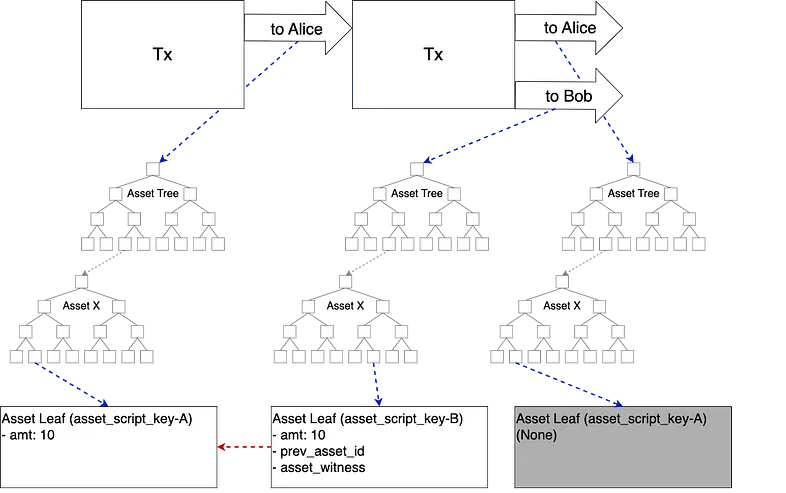

> *作者：Hiroki Gondo*
> 
> *来源：<https://medium.com/nayuta-engineering-blog-en/understanding-taproot-assets-protocol-e2dfe3fc1e07>*


Taproot Assets 协议（曾用名 “Taro”，下文缩写为 “TAP”）是一种在比特币上表示基于 UTXO 的资产的协议。本文致力于解释 TAP 是如何创建和转移资产的。

完整的协议分成许多部分。本文主要解释的是 bip-tap 和 bit-tap-ms-smt 。

- [bip-tap-addr](https://github.com/Roasbeef/bips/blob/bip-tap/bip-tap-addr.mediawiki)
- [bip-tap-ms-smt](https://github.com/Roasbeef/bips/blob/bip-tap/bip-tap-ms-smt.mediawiki)
- [bip-tap-proof-file](https://github.com/Roasbeef/bips/blob/bip-tap/bip-tap-proof-file.mediawiki)
- [bip-tap-psbt](https://github.com/Roasbeef/bips/blob/bip-tap/bip-tap-psbt.mediawiki)
- [bip-tap-universe](https://github.com/Roasbeef/bips/blob/bip-tap/bip-tap-universe.mediawiki)
- [bip-tap-vm](https://github.com/Roasbeef/bips/blob/bip-tap/bip-tap-vm.mediawiki)
- [bip-tap](https://github.com/Roasbeef/bips/blob/bip-tap/bip-tap.mediawiki)

Lightning Labs 作出的实现可见[此处](https://github.com/lightninglabs/taproot-assets)。

## 什么是 Taproot？

“[Taproot](https://github.com/bitcoin/bips/blob/master/bip-0341.mediawiki)” 是一种新型的比特币输出，允许同时指定两种类型的花费条件：密钥花费（`Key Path`）和脚本花费（`Script Path`）。


`Key Path`，就像传统的 P2PKH 输出一样，使用一个公钥的签名来花费。在 Taproot 这里也可以使用 Schnorr 签名的密钥聚合（多签名）。

`Script Path`，则像传统的 P2SH 一样，允许用一种脚本语言编程复杂的花费条件。并且 Taproot 还允许同时指定多个脚本。这些脚本不会直接序列化在 Taproot 输出中，而是会构造成一棵默克尔树、压缩成为一个根哈希值。当输出使用某个脚本来花费时，只需要暴露这一个脚本（而不需要曝光其它脚本）。

TAP 在 `Script Pat` 中嵌入数据（“资产树（Asset Tree）”）。这些数据在比特币节点看来是无法解读的，也检测不出来，因为经过了哈希。


## Taproot Assets 中的资产表示

### 资产树

资产树是一种两级的 “稀疏默克尔总和树” 结构，表达 Taproot Assets 协议。底下的一级表示一种资产（由 “资产 id（`asset_id`）”  标识）的 UTXO。上一级则聚合来自下一级的树。


上一级默克尔树的根哈希值（`asset_tree_root)`）的值会嵌入一个 Taproot 输出的 `Script Path` 中，从而承诺这棵树的状态。

资产的转移还创建一棵新的资产树，并且旧的那一棵也会更新。这可以通过发起新的一笔比特币交易、花费旧的资产树所在的 Taproot 输出来实现；没有满足规范的转移（例如，通胀、重复话费）会被认为是无效的。*

\* 这里用到的方法是一种叫做 “[客户端验证](https://scalingbitcoin.org/transcript/milan2016/client-side-validation)” 的概念；熟悉比特币的显著共识的读者可能会对这里的规范的正确性的基础感到好奇，但我会暂时忽略这个问题。

### 稀疏默克尔总和树

“稀疏默克尔总和树”（以下将缩写为 “MS-SMT”）是默克尔树的一个变种，由 [bip-tap-ms-smt](https://github.com/Roasbeef/bips/blob/bip-tap/bip-tap-ms-smt.mediawiki) 定义。因为其关键字是 256 比特的，所以它有 2^256 个叶子。绝大部分叶子是空的。

每个叶子都包含一个数量，而每个分支节点都承诺其子树上的叶子所表示的数量之和。即使一棵子树的内容不可知，只需检查分支节点，就可以知道该子树所包含的总数量。树根则承诺所有叶子所表示的总数量。

就像通用的默克尔树，只需一棵修剪过的、包含目标叶子的树，就可以提供这些目标叶子在树上的证明（默克尔证明）。但 MS-SMT 还支持 “不包含证明”。这是通过一种限制来实现的：表示不存在的关键字的叶子所包含的数量必须显式设定为一个表明其不存在（None）的值（因此，证明 “None” 的存在就构成了一种不包含证明）。因此，默认的 MS-SMT 会由 2^256 个表示 “None” 的叶子。

### 资产叶子（资产 UTXO）

资产树的低层 MS-MST 以 `asset_script_key` 作为关键字，以资产叶子作为值。每一个资产叶子都代表着该资产的一个 UTXO（为简洁，下文就直接表述为 “UTXO”*），并且，下列属性（包括可选的一个）会被序列化为 [“类型-长度-数值” 格式](https://github.com/lightning/bolts/blob/master/01-messaging.md#type-length-value-format)。

\* 不是比特币的 UTXO 哈。

- `taproot_asset_version`
- `asset_genesis`
- `asset_id`
- `asset_type`
- `amt`
- `lock_time`
- `relative_lock_time`
- `prev_asset_witnesses`
  \- `prev_asset_id`
  \- `asset_witness`
  \- `split_commitment_proof`
- `split_commitment`
- `asset_script_version`
- `asset_script_key`
- `asset_group_key`
- `canonical_universe`

`asset_genesis` 就是推导出 `asset_id` 的原像。

`asset_script_key` 既是资产叶子的关键字，也是一个 Taproot 形式的公钥（以一个独立于比特币的 [tap-vm](https://github.com/Roasbeef/bips/blob/bip-tap/bip-tap-vm.mediawiki) 定义），并且是花费由该资产叶子表示的 UTXO 的条件。

在花费一个 UTXO 时，首先要满足（外部的）比特币花费条件，然后是（内部的）TAP 花费条件，由 `asset_script_key`指定，并且 `asset_script_key` 应该被 `prev_asset_id` 和 `asset_witness` 满足。举个例子，`asset_witness` 是被花费的 UTXO 的 `asset_script_key` 的签名。


如果在一次资产转移中分割了 UTXO，也需要 `split_commitment` 和 `split_commitment_proof`。

`split_commitment` 是一棵 MS-SMT，指代分割之后的所有 UTXO（在这个意义上，资产树其实有三层），而根中的和值是被转移的所有数量。

`split_commitment_proof` 是 `split_commitment` 的一个默克尔证据，证明一次分割的存在。

在所有分割中，只有一个会有 `prev_asset_id`、`asset_witness` 和 `split_commitment`。所有其它分割只有 `split_commitment_proof`。所有的分割共享 `prev_asset_id` 和 `asset_witness`。

## 资产创建


创建一种资产需要在一笔比特币交易的一个 Taproot 输出中嵌入一棵包含新资产的 UTXO 的新的资产树（该交易也就成为这种资产的创世交易）。资产的 ID（`asset_id`）以下列公式确定。

```
asset_id := sha256(genesis_outpoint || sha256(asset_tag) || asset_meta_hash || output_index || asset_type)
```

`genesis_outpoint` 就是被这笔交易花费的前序交易输出，而 `output_index` 就是包含这棵资产树的输出的索引号。这保证了 `asset_id` 是全局唯一的。

新创建的资产 UTXO 省去了 `prev_asset_id` 和 `asset_witness`。 

## 资产转移

就像比特币 UTXO，资产转移时可能会合并或分割资产 UTXO。但我们先从一个简单的例子 —— 既没有分割，也没有合并 —— 说起 *。

\* 下文的解释作了一些简化。比如，比特币交易的找零输出，就省去了。



Alice 有 10 个某资产，全部转移给 Bob。

Alice 创建并广播一笔比特币交易，花费自己的资产 UTXO 所在的 Taproot 输出。这笔交易有两个 Taproot 输出。一个输出包含了一棵新的资产树，包含了一个新的拥有 10 个某资产、且 Bob 可以控制（比如使用 Bob 的比特币公钥）的 UTXO。另一个输出包含了一棵资产树，是由 Alice 控制的原版资产树移除对应的资产叶子后形成的。

属于 Bob 的新 UTXO 用 `prev_asset_id` 来索引 Alice 的前序 UTXO。在 `asset_witness` 中，放着前序 `asset_script_key` 的签名。而在这个新 UTXO 的 `asset_script_key` 中，放着一个新的、由 Bob 提前给出的公钥。

Bob 需要验证花费条件得到了满足，而且资产在转移后没有通胀，以确认接收这笔支付。

- Bob 新创建的资产树是否包含了一个满足花费条件的新的 UTXO ？
- 输入 UXTO 是否已经在 Alice 更新后的资产树上移除了？
- 交易中是否有别的 Taproot 输出？它们是否包含另一棵资产树？*
- 等等。

这都是通过 证明/验证 MS-SMT 的 包含/非包含证据 以及 Taproot 输出的证据和原像来实现的。

\* 如果另一个 UTXO 被添加到了另一棵资产树（而不是 Bob 的资产树）上，并且也花费了输入 UTXO，那就构成了重复花费。

### 合并 UTXO


Alice 有在两个叶子中分别有 3 个、7 个某资产，要全部转移给 Bob。

各个输入 UTXO 可以属于不同的资产树，或同一资产树上的不同关键字（`asset_script_key`）。Bob 的新 UTXO 应该为这两个花费掉的 UTXO 包含 `prev_asset_id` 和 `asset_witness`。

### 分割 UTXO


Alice 有 7 个某资产，准备转 3 个给 Bob。因此，Alice 会留下 3 个，Bob 会得到 7 个。

Alice 的找零 UTXO 将有 `prev_asset_id`、`asset_witness` 和 `split_commitment`；Bot 的新 UTXO 将仅有 `split_commitment_proof` *。

我不会再解释如何同时合并及分割 UTXO。

\* 这跟[规范](https://github.com/Roasbeef/bips/blob/bip-tap/bip-tap.mediawiki)的表述稍有区别，但似乎最新的[实现](https://github.com/lightninglabs/taproot-assets)就是这么做的。

### 资产流转

虽然前面没有体积，但在资产转移可被验证之前，必须先验证每一个输入 UTXO 都是合法的。对于每一个输入 UTXO，必须 证明/验证 从该资产的创世交易到如今这个输入、整个流转路径上的每一笔交易，都是正确执行的。


这条路径是从创世交易到最新交易的一个复杂的图。在上图中，对 `Tx A`，需要验证所有蓝色的交易（其祖先交易）；而对 `Tx B`，需要验证所有蓝色和红色交易。这是重大的可扩展性挑战，因为历史会呈准指数级增长。

此外，因为验证所需的原像和证据是没有发布在区块链上的，如何在资产的发送者和接收者之间传递它们，也是一个问题。

## 可扩展性

逐渐增加的历史是一个重大的可扩展性挑战。已经提出了多种解决方案，但支持闪电网络是最有希望的一个。链下的交易不会使历史增加。

这套协议是新的，规范也不完整。举个例子，我此前就指出了[这个问题](https://lists.linuxfoundation.org/pipermail/bitcoin-dev/2022-October/021047.html)。

