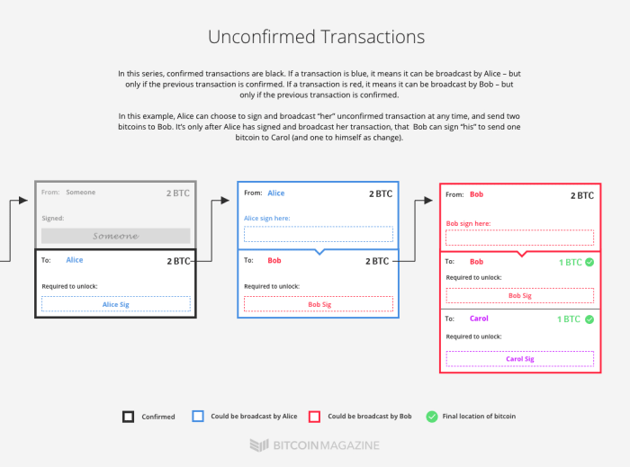
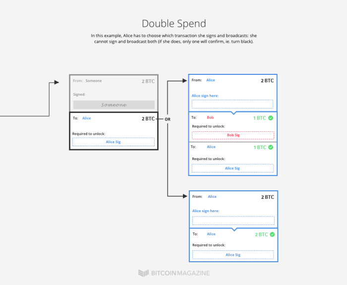
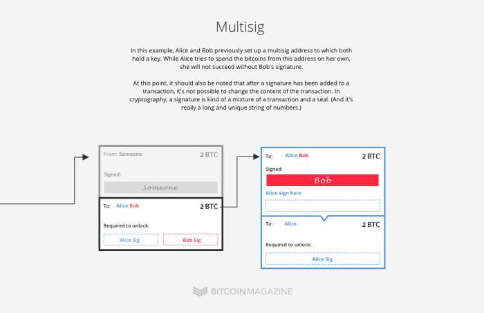
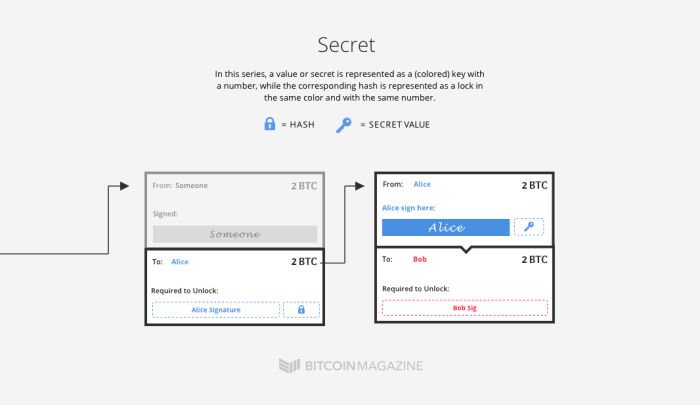
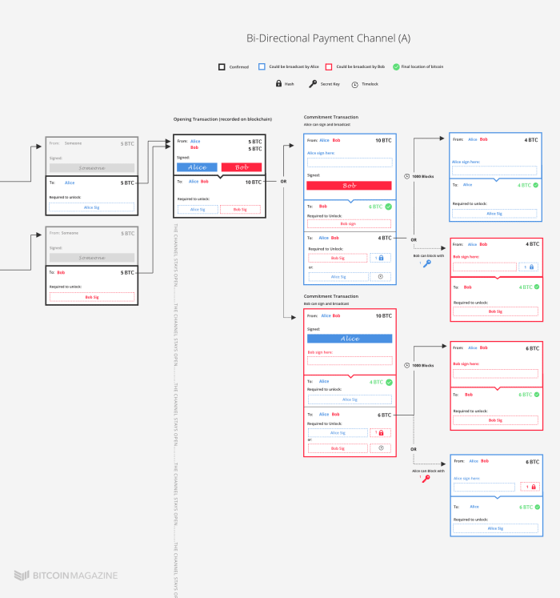
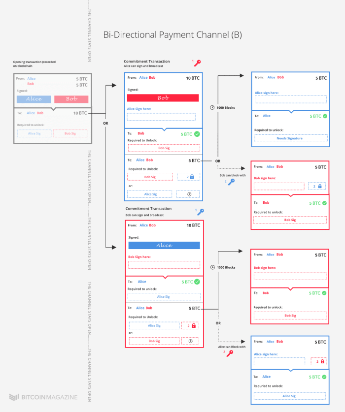

*作者：Aaron Van Wirdum*

*来源：<https://bitcoinmagazine.com/technical/understanding-the-lightning-network-part-building-a-bidirectional-payment-channel-1464710791>*

*译者：阿剑（hongji@ethfans.org）*

闪电网络（Lightning Network）可能是比特币区块链上最受期待的创新（编者注：原文撰写于 2016 年）。这种支付方案最早由 Joseph Poon 和 Tadge Dryja 在一年多以前提出，号称能支持用户之间在链下发送无限次的交易，而且成本极低 —— 还能借用比特币网络提供的安全性。

至少有三家公司 —— Poon 和 Dryja 的 [Lightning](http://lightning.network/)、[Blockstream](https://blockstream.com/2015/09/01/lightning-network/) 和 [Blockchain](https://www.blockchain.com/thunder/index.html) 正在开发这种技术的实现。但在技术人员的小圈子之外，很少有人理解 “微支付的未来” 如何能引爆比特币的潜能。

在本系列文章里，*Bitcoin Magazine*  尝试列举闪电网络最基础的砖石，并展示这些东西如何能组合出闪电网络这种即将到来的协议。

本系列的第一篇文章将列举必要的模块并展示这些模块如何能组合起来创建 “智能合约”；这个概念可以用来理解闪电网络的第一个前提：双向的支付通道。

（*提示：非常熟悉比特币的读者可以跳过对这些模块的介绍。）*

## 模块 #1：未确认的事务（Unconfirmed Transactions）

比特币协议的核心是所谓的 “事务” 的概念；一般来说，一笔事务总是关联着另一笔前序事务，并且可以用在未来的事务中。每笔事务都包括 *输入*，指向 *转出* 比特币的地址；以及 *输出*，指向 *收到* 比特币的地址。此外，为了发送比特币，输入还必须满足一些条件，比如要提供数字签名来证明发送者具有输入地址的 “所有权”。同时，输出也会确立这些比特币在日后使用时候的新条件，在 *后序事务* 发出的时候必须满足。

（译者注：把比特币想象成一张张有面额的支票，在使用时，支票自身给出了资金的来源，而在使用后又会形成新的支票。所以对每一张支票来说，都有形成这张支票的事务，也即是前序事务；而当这些支票被再次花用时，那笔事务就可称为后序事务。）

闪电网络的一个关键特性是，它是由或多或少的常规比特币事务组成的。只是，这些事务一般不会在比特币网络里传播。相反，这些事务都是用户保存在节点本地的 —— 只不过，它们随时可以放到比特币网络中传播。

- （译者注：如图所示，比特币就像支票一样可以拆分，且其流转会形成清晰的链条。） -

## 模块 #2：杜绝多重支付（Double-Spend Protection）

闪电网络所需的第二个模块可能不需要太多解释，因为它可以说是比特币协议本身的存在理由：多重支付的防范措施。如果两笔事务（或者说输入）依赖于同一个输出，那只有其中一笔才会得到整个网络的确认。

谨记：即使尚未确认的事务之间发生了冲突，最终也只有一笔会得到确认。

## 模块 #3：多签名（Multisig）

闪电网络的第三个模块也很好理解：多签名地址。（或者更广义地说：P2SH 地址（脚本哈希值地址）。）

顾名思义，多签名地址就是需要多个私钥来 “解锁”、使用比特币的地址。多签名地址的条件可以设置得很多样。比如，可以要求在 3 把私钥中要有 2 把参与，才能转出比特币；或者是其它的数量要求（比如 2/5，3/4，等等）。

闪电网络一般使用 2-2 的多签名要求。要从这样的地址中转出比特币需要提供跟这两把私钥相关的两个签名，少一个都不行。

## 模块 #4：时间锁（Time-Locks）

第四个模块是时间锁。时间锁功能可以在一个输出中放置一个锁定条件，让这些比特币仅在未来某个时间之后才能花用（也即被用作一笔事务的输入）。

有两种类型的时间锁：1）绝对时间锁，叫做 CheckLockTimeVerify（CLTV）；2）相对时间锁，CheckSequenceVerify（CSV）。CLTV 会锁定比特币直至未来某个（可以说是）具体的具体：一个具体时间和日期，或者一个具体的区块高度；而 CSV 只会使用相对时间。当一个 CVS 输出上链之后，就要等待一定数量的区块后，这笔输出才能花用。

## 模块 #5：哈希值和秘密值

第五个，也是最后一个模块 —— 密码学 —— 也是比特币本身最基础的模块。但在闪电网络中，用法有所不同。

简而言之，一个 “秘密值” 是一个很长而且独一无二的数字串，是几乎不可能猜测出来的，一台电脑暴力运算无数次也猜不出来。而通过特殊的计算，这个秘密值又可以 “打散” 成一个不同的数，叫做 “哈希值”。有趣之处正是这里：知道这个秘密值得人可以很容易地计算出其哈希值，但反之不成立，拿着哈希值你是反推不出那个秘密值的。

在比特币区块链上，这个机关又可以用在 “锁定比特币” 上（实际上，锁定比特币就是比特币协议运行的方式）。举个例子，你可以在一个输出中包含一个哈希值，要求后序的事务只有包含该哈希值对应的秘密值才能花费这笔输出。

## 第一个挑战：双向的支付通道

在闪电网络出现之前，就已经有 “[支付通道](https://bitcoinmagazine.com/articles/checklocktimeverify-or-how-a-time-lock-patch-will-boost-bitcoin-s-potential-1446658530)” 的概念了。标准的支付通道是用于特定用途的，因此也很局限：它们都是单向的通道。Alice 可以在链下向 Bob 发起多比支付，但 Bob 没法用同一个通道给 Alice 支付。

而闪电网络的一个关键特性就是， Poon 和 Dryja 提出的免信任的双向支付通道。

### **开启通道**

要建立一个双向的支付通道，参与的双方都必须首先对一笔开启通道事务达成共识。这笔开启事务决定了他们俩各要在这个通道中存入多少比特币。

假设 Alice 想给 Bob 发送 1 btc。因为他们俩都预期以后会有频繁往来，他们决定开启一个双向的支付通道。（在通道里发送 1 btc 可能有点太大了，毕竟通道可能对小额支付更有用 —— 但也是完全可以做到的。）

要开启这个通道，Alice 和 Bob 每人都发送 5 btc 到一个 2-2 的多签名地址里。这就是 “通道开启事务”。这个地址里面的钱，只有 Alice 和 Bob 签名同一笔事务才能花用。

此外，Alice 和 Bot 都各自创建一个秘密值（也就是一串数字），然后交换哈希值。

现在，Alice 创建一笔通道开启事务的后序事务，且这是一笔 “承诺事务”。在这笔承诺事务里，Alice 把 4 btc 发给她自己，而 6 btc 发送给第二个多签名地址；这个多签名地址更有趣：Bob 可以独自解锁这个地址，但是，要等（Alice 的事务上链后的） 1-00 个区块之后，Bob 才能花里面的钱（这是一个相对时间锁）；Alice 也可以独自打开这个地址，前提是她 *也* 拥有 Bob 给她的哈希值所对应的秘密值。（当然，Alice 是完全不知道这个秘密值的 —— 她只有 Bob 给她的哈希值 —— 所以只是表面上可以这么做而已。）（译者注：比特币的交易系统允许 “IF……ELSE” 这样多层的控制，所以这第二个多签地址可以支持在不同解锁条件下产生不同的行为。）

Alice 签名了她的承诺事务。但是她不会把这笔事务广播出去！相反，她只会把这笔事务发给 Bob。

同时，Bob 也做刚好对称的操作。他也创建一笔承诺事务，把 6 btc 发给自己，4btc 发给一个新的多签地址。Alice 在等待 1000 个区块后就可以独自解锁这个地址，或者 Bob 可以拿 Alice 的秘密值来解锁这个地址。

Bob 签名了这笔事务，然后发给了 Alice。

交换完了这些承诺事务和哈希值之后，他们再共同签名并把那笔通道开启事务广播出去，使之能够上链。现在，一个双向的支付通道就开好了。

开启通道之后，Alice 和 Bob 都可以签名和广播他们从对方那里得到的、部分有效的承诺事务。如果 Alice 广播了（Bob 发给她的承诺事务），则 Bob 会立即得到 6 btc。如果 Bod 广播了，则 Alice 会立即拿到 4 btc。但签名和广播事务的那个，必须等待 1000 个区块才能解锁那个后序的多签名地址，把剩余的比特币拿走。

不过，这就是支付通道的关键技巧：不去签名和广播他们得到的承诺交易。

（译者注：先交互承诺事务，再广播通道开启事务，是为了避免对手欺诈；而获得承诺事务之后，不必广播，也可以获得安全性保证了。）

### **更新通道**

后来，Bob 想给 Alice 发回 1 btc，他们想更新这个通道的状态，使之回到 5：5 的状态。要实现这一点，Alice 和 Bob 需要做两件事。

首先，双方都要把上面所讲的流程再做一遍（除了开启事务的那部分，因为已经记录在链上了）。这一次，Alice 和 Bob 都把 5 btc 分配给对方，都把 5 btc 分配给那个多签名地址。这些后续的多签名地址的条件是类似的，只不过，他们都需要生成 *新的* 秘密值：Alice 和 Bob 都要提供 *新的* 哈希值。他们都签名自己的新承诺事务，并发送给对方。

其次，Alice 和 Bob 都把他们的 *第一个* 秘密值（用在第一次承诺事务中的那个）交给对方。

这时候，Alice 和 Bob 都能签名和广播他们最新得到的这笔承诺事务。他们的对手会立即获得 5 btc，而广播这自己则必须等待 1000 个区块。就这样，通道的状态更新了。

但是，有什么能阻止 Bob 广播旧的承诺事务呢？那笔承诺事务会给他分配 6 btc，比 5 btc 要多 ……

阻止 Bob 的，当然就是他的第一个秘密值，也就是他已经给了 Alice 的那个秘密值。

因为，这时候 Bob 已经无法随心所欲地签名和广播更老的那笔承诺事务了，因为 Alice 已经知道了 Bob 的第一个秘密值。如果 Bob 要签名和广播（Alice 给他的那笔）更老的承诺事务，他会立即把 4 btc 发给 Alice …… 且他自己要等 1000 个区块才能申领，但是，Alice 已经知道他的秘密值了，所以她可以利用这段时间先发制人，直接把剩下的 6 btc 也提走！

而且，因为 Bob 也有了 Alice 的秘密值，所以对 Bob 来说同样如此！要是 Alice 想签名和广播旧的承诺事务，Bob 就可以偷走她放在通道里所有的 btc 了！

这就意味着 Alice 和 Bob 都要重组的激励不去耍小手段，只广播最近的状态。

好了，有了双向的支付通道之后，我们要把它拓展成一个支付网络。这就是我们第二篇的主题。

*感谢 Rusty Russell 和 Joseph Poon 的专门反馈。*

（完）

