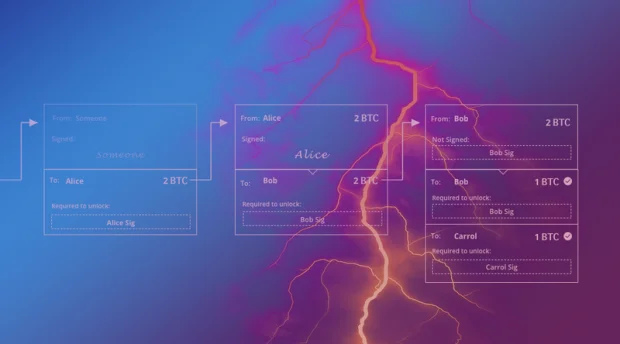
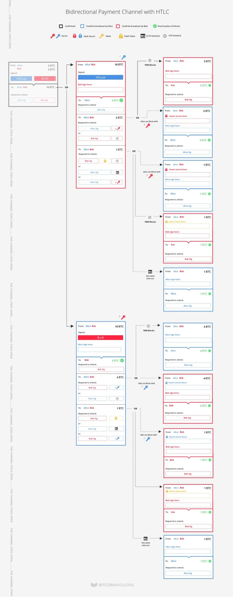
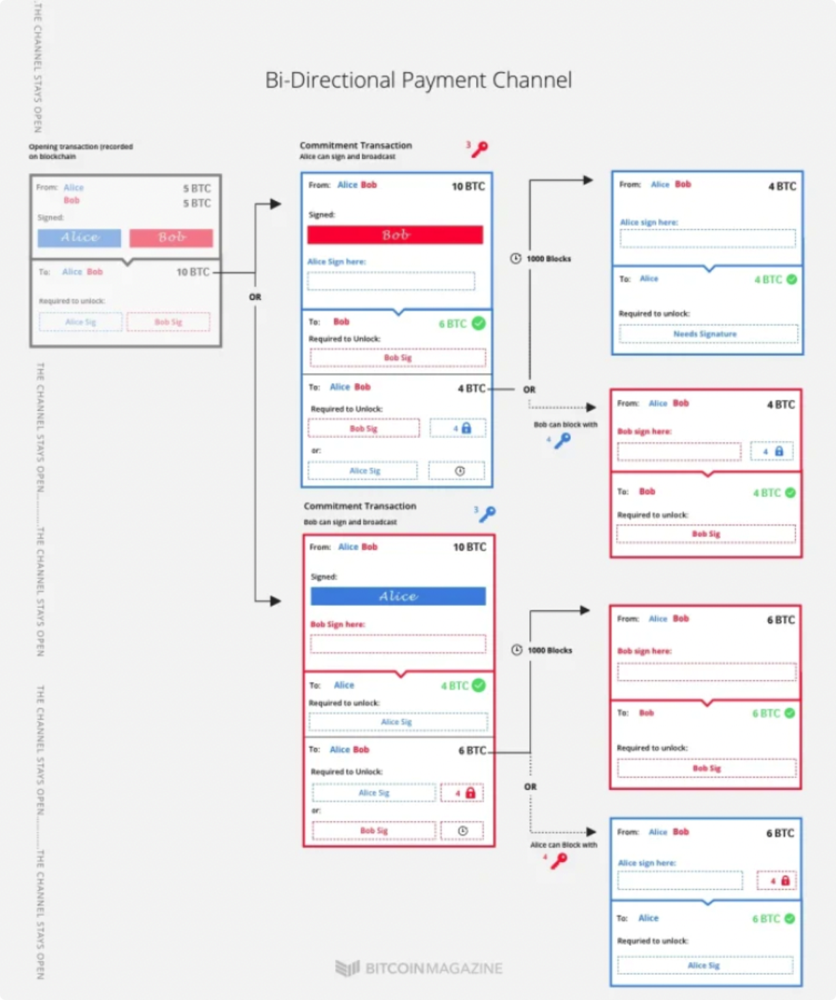
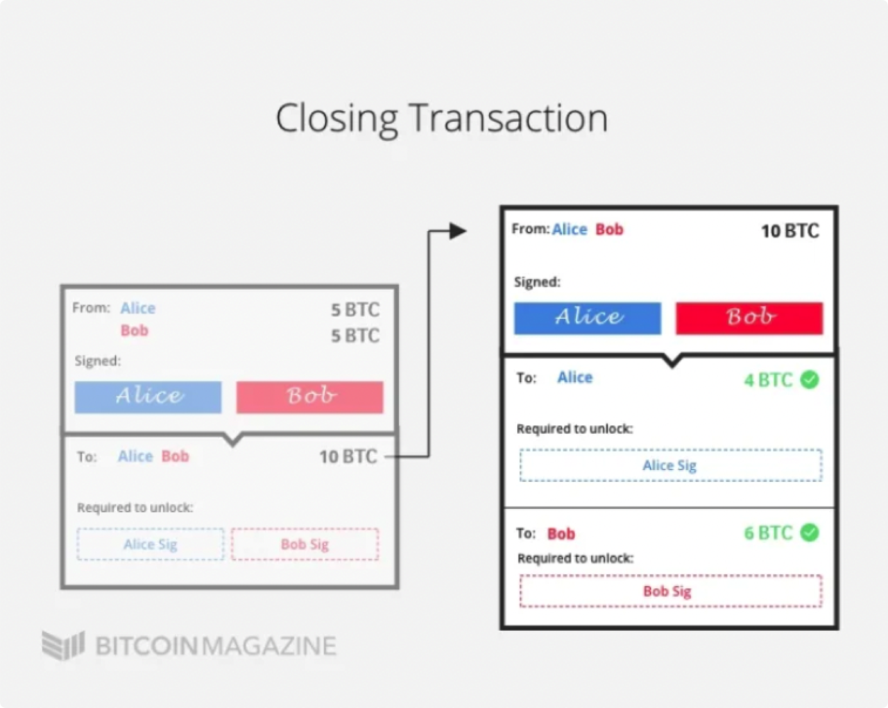

*作者：Aaron Van Wirdum*

*来源：<https://bitcoinmagazine.com/technical/understanding-the-lightning-network-part-completing-the-puzzle-and-closing-the-channel-1466178980>*

*译者：闵敏 & 阿剑（hongji@ethfans.org）*

## 闪电网络

目前，Alice 和 Bob 已经开通了一个双向支付通道，并分别往通道中存入了 5btc。他们已经来回完成了两笔交易。在当前通道状态下，Alice 和 Bob 可以通过终止通道各自取回 5btc。

现在，他们想要在通道中放入一个哈希时间锁合约（HTLC），以确保 Bob 在用 1btc 交换 Carol 手中的秘密值后，Bob 可以从 Alice 那里取回 1btc。

就像之前的步骤一样（详见 Part 1），Alice 和 Bob 先要各自创建一笔新的承诺事务。这两个承诺事务跟之前创建的承诺事务很像，包含一个普通的输出、一个带有 CSV  时间锁（相对时间锁）的多签地址输出和一个特殊的哈希锁。接着，像之前的步骤一样，Alice 和 Bob 交换之前的秘密值来让之前的通道状态失效。一旦交换过秘密值后，Alice 和 Bob 就可以签署各自的承诺事务，并在任何时候将这承诺事务发送到区块链上。

这些步骤与之前的步骤基本相同，除了一点。Alice 和 Bob 新创建的承诺事务包含一个新的输出，而这个输出价值 1btc。（因此，支付通道中的 btc 余额变成了 Alice：4；Bob：5；新的输出：1。）

这个新的输出本质上是哈希时间锁合约，而且相比其它输出更有趣，因为有三种方式可以解锁它。

第一种方法是，只有当后序事务包含 Bob 的签名和秘密值时，(包含在 Alice 和 Bob 的承诺事务内的）新的输出才会释放 btc。无论 Alice 或 Bob 是否签署并广播承诺事务，只有 Bob 可以解锁该输出 —— 只要他将秘密值包含在后序事务内。但是，两个承诺事务存在一处细微差别：如果 Bob 终止通道，会受到 CSV 时间锁的约束。这时，Bob 必须等待 1000 个区块才能取回自己的 btc。（如果 Alice 终止通道，Bob 就可以立即取回自己的 btc。）

为什么 Bob 需要等待 1000 个区块呢？原因跟我们之前解释的差不多：如果 Bob 试图签署并广播过期的通道状态，Alice 就可以拿走 1 btc。这就是解锁输出的第二种方法。如果 Alice 提供 Bob 的（最新）秘密值，就可以 “偷走” 通道内的资金。

Alice 和 Bob 可以玩这样一个游戏：如果 Alice 试图广播过期的通道状态，Bob 可以使用 Alice 的秘密值取走那 1 btc（甚至无需提供秘密值）。

第三种方法是，与其它哈希时间锁合约一样，这两个承诺事务也包含常见的 CLTV 时间锁（绝对时间锁）超时退回机制，即，如果 Bob 没有在限期（比如两周）内将秘密值包含在后序事务内，Alice 就可以取回自己的1btc。在这种情况下，终止通道的人是 Alice 还是 Bob 都没关系。

那么，具体是如何操作的？

Alice 和 Bob 各自持有部分有效的承诺事务。如果 Alice 将自己持有的（也是 Bob 发给她的）承诺事务发送到区块链上，就会立即发送 5btc 给 Bob。Alice 则需要等待 1000 区块之后才能取回自己的 4btc。另外，Bob 有两周时间提供秘密值，解锁 “哈希时间锁合约输出” 对应的 1 btc。（如果他没有在两周内提供秘密值，Alice 就可以取回这 1btc。）

与此同时，Bob 随时都可以将他的承诺事务上链，并立即将 4btc 发送给 Alice。接着，他必须等待 1000 区块过后才能从一个地址那里取走 5 btc，如果他在限期内提供秘密值，还能解锁 “哈希时间锁合约输出” 对应的 1 btc。（如果他没有在两周内提供秘密值，Alice 就可以取回这 1btc。）

当然了，如果 Alice 或 Bob 在将来任何时候试图作恶，签署并广播过期的通道状态，另一方都可以阻止作恶方，并偷走通道内的所有 btc。

## 结算状态

这时，Bob 一定会收到 1btc 来交换他手中的秘密值（假如他有的话）。他要做的只是签署并广播他从 Alice 那里得到的承诺事务，将秘密值包含在一个后序事务内，然后签署并广播该后序事务。

Alice 知道这一点。她没有办法骗走 Bob 的 btc，即使她通过其它手段得到了秘密值。

因此，Alice 和 Bob 还不如在支付通道外进行 “结算”。Bob 可以将秘密值给 Alice，Alice 可以同意更新通道状态，这样就不需要哈希时间锁合约和截止日期了。

假设 Alice 和 Bob 都想让通道保持开启，这也很正常：比起在链上终止通道省事多了。

## 关闭通道

最后才是闪电网络真正强大的地方：

本系列文章中所述内容几乎都不需要实际上用到比特币区块链。

如果 Alice 和 Bob 想要和平关闭通道，可以创建一个事务来完全覆盖掉开启通道事务之后的所有事务。他们可以根据最新通道状态中所示的 btc 余额归属情况，通过关闭通道事务将自己应得的 btc 余额发送给自己。

具体来说，这意味着如果 Alice 想要关闭通道，她可以创建一个事务向自己支付 4btc，同时向 Bob 支付 6btc，然后让 Bob 签署并广播该事务。Bob 没有理由不答应这个请求，他大概率会配合 Alice 关闭该通道。

最后，只会有两笔事务被广播到比特币网络并打包进区块：开启通道事务和关闭通道事务。哪怕 Alice 和 Bob 之间发生了 100 万笔交易也是这个结果，因此极大地减轻了区块链的负担。

格外感谢 Rusty Russell 和 JosephPoon 的信息和额外的反馈。

（完）
