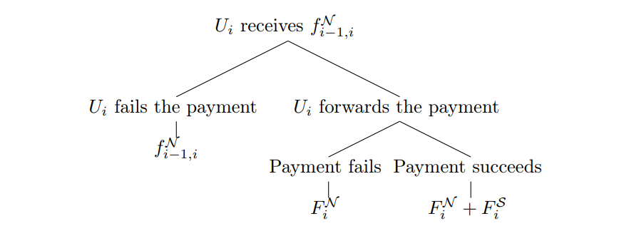
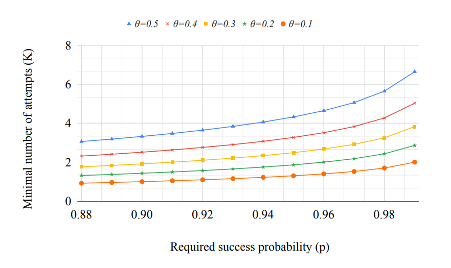

> *作者：Clara & Sergei*
>
> *来源：<https://raw.githubusercontent.com/s-tikhomirov/ln-jamming-simulator/master/unjamming-lightning.pdf>*
>
> *原文出版于 2022 年，提出了一种如今称作 “[HTLC 背书](https://bitcoinops.org/en/topics/htlc-endorsement/)” 的解决闪电通道阻塞攻击的方法。*

## 摘要

去中心化金融网络的用户会遇到新形式的安全性爆破。在这样的网络中，无法应用基于身份的欺诈防范方法，这与其面向隐私的设计哲学相矛盾。因此需要新的缓解策略。然而，推出新的方法可能会伤害网络的其它有用属性。

在这篇文章中，我们提出了一种用在去中心化金融网络中的缓解策略评估框架。这一框架让研究者和开发者可以在多个维度上检验和比较被提议的协议修改，例如隐私性、安全性和用户体验。

作为一个例子，我们分析了闪电网络中的 “通道阻塞攻击（jamming attack）”。闪电网络是一个点对点的支付通道网络，建立在比特币协议上。阻塞攻击是一种便宜的拒绝服务攻击，让一个敌手可以通过泛滥的失败支付来暂时禁用一些闪电通道。

我们为阻塞攻击提出了一种实用的解决方案，集合了无条件支付的手续费和对等节点声誉。根据这个框架的指引，我们证明了，在遏制阻塞攻击的同时，我们的解决方案也保持了协议的激励兼容性。该解决方案也保持了安全性、隐私性和用户体验，而且实现起来也直接。我们用分析和模拟来支撑我们的结论。而且，我们的反阻塞解决发难可能会帮助缓解其它问题，例如恶意的通道余额侦测。

## 1 引言

去中心化的区块链协议，比如比特币，代表着金融网络的一种新范式。它们的核心设计原则是免信任的访问 1 以及用户隐私性。处于这个目的，用户以公钥为身份，而且可以生成事实上无限数量的公钥。任何人都可以加入这样的网络，而无需正式的身份鉴别。这个特性让传统的基于身份的反欺诈方法在协议层面无法实施。

与此同时，去中心化的金融网络，又是攻击者的垂涎之物。在遭受攻击时，用户和服务供应商会失去自己的资金或是曝光自己的隐私。

> 脚注 1：准入型网络则正好相反，是由一组已知的参与者来运行的。这样的系统不在本文讨论范围之内。

在这种环境下，声誉和经济激励变成了缓解策略的主要工具。前者的作用是从诚实用户中辨识出行为不轨的参与者，然后选择性地屏蔽他们。后者则是为不受欢迎的行为施加成本，同时也可能会给受害者补偿。

在提出一项协议变更时，我们要将网络作为一个整体，来分析其效果。新提案不能引入新的攻击界面、牺牲用户体验以及危害隐私性和安全性。如果无法认识和绕过无法避免的取舍，可能会让缓解措施完全无用。此外，还要考虑实现的难度。

本文关注的是对免许可金融网络的攻击的缓解策略。我们的主要顾虑之一是，一项被提议的解决方案，假设能解决攻击，会不会大大损害协议的别的方面的有点。为避免 “把孩子和洗澡水一起泼出去”，我们提出了一种通用的框架，用于设计和评估缓解措施。作为案例，我们考虑的是闪电网络（LN）中的通道阻塞攻击的缓解策略。

闪电网络是建立在比特币上的一个支付网络，其设计目标是解决比特币区块链协议内在的交易吞吐量限制。通道阻塞攻击是闪电网络中一种长期存在【47】、但尚未被解决的 DoS 攻击界面。它让一个攻击者可以便宜且高效地禁用受害者的通道。阻塞攻击会阻止用户使用网络的核心功能，并减少用户的转发费收益。闪电网络的社区已经讨论过许多缓解通道阻塞攻击的措施【16】，但没有一个得到了实现。

> 译者注：“【】” 为参考文献的编号。

为了展现我们的框架的威力，我们用它提炼出了一种能够应对通道阻塞且没有根本缺陷的有效解决方案。

*我们的贡献*

- 我们提出了一种**评估攻击缓解措施的通用框架**。这一框架帮助保证了被建议的变更不会显著削弱现有的协议优点。
- 我们提出了一种**针对通道阻塞的缓解策略**。我们的解决方案结合了无条件支付的手续费以及基于对等节点过往行为的局域声誉系统。我们通过上面定义的框架的透镜来评估我们的解决方案，从而为其设计选择辩护。

下文的结构安排是这样的。首先，我们会提出评估框架（章节 2）。然后，我们会提供关于闪电网络、尤其是通道阻塞的背景只是（章节 3）。我们会在跟通道阻塞缓解措施的相关设计决策上应用上述评估框架（章节 4），然后提出我们对通道阻塞的解决方案（章节 5），该方案结合了无条件手续费（章节 5.1）和局域声誉系统（章节 5.2）。然后，我们会讨论模拟的结果（章节 6）并评审相关的工作（章节 7）。最后，我们会列举未来的工作方向（章节 8）并给出结论（章节 9）。

## 2 一种评估缓解策略的框架

我们建议用从下列角度来评估缓解措施。

*有效性*。缓解措施应该能阻遏或防止攻击。敌手必须付出代价，可以是货币（付出手续费或会遭受惩罚）、时间（在攻击前需要积累声誉），也可以是两者的结合。注意，攻击者的动机并不一定只跟金钱有关（例如想要恶意破坏网络）。

*激励兼容性*。缓解措施应该维持协议的激励兼容性。去中心化的网络依赖于参与者的理性：遵守规则应与他们的最佳利益一致。支付网络应-激励节点转发支付以及诚实地报告故障。

*用户体验*。缓解措施不能摧毁用户体验。交互界面的变更应该符合直觉并且易于解释。用户体验应该从终端用户和专业的服务提供商的视角来评估。

*隐私性和安全性*。缓解措施不应显著牺牲用户的隐私性。至于安全性，我们必须保证被提议的协议的变更不会引入新的攻击界面。缓解措施的负面效果与其潜在好处必须谨慎权衡。

*实现难度*。缓解措施实现起来应该直截了当。协议变更需要在社区（尤其是开发者）中达成粗糙共识【46】。易于实现的提议更要可能被采用，而不会被永久推迟。

上述框架可以这样使用。首先，考虑缓解措施的所有可能分类。其次，排除显然不兼容上述至少一条标准的策略。最后，在具体的网络语境下比较剩余选项的代价和好处。

我们要指出的是，前面两条标准（有效性和激励兼容性）是有用解决方案的硬性标准。后面的三条则常常需要取舍。有时候，使用更中心化的架构或积累更多的用户数据，就能改善用户体验，但这会牺牲隐私性。类似地，实现起来更简单的策略可能需要用户额外信任一些预设的第三方。

注意，上面的一些标准（至少在一定程度上）是客观可以量化的，而其它则很大程度上是主观的。绕过这些取舍取决于具体的网络和攻击。

## 3 闪电网络和通道阻塞概述

免许可的区块链网络面临内在的可拓展性挑战，这正是二层（L2）协议想要解决的问题【19】。它们希望在提高交易的吞吐量的同时利用底层区块链网络的安全性保证。

闪电网络是一种主要的基于比特币的 L2 协议【38】。成对的闪电节点通过在一个共同拥有的资金地址中锁定资金来开启 *支付通道*。然后，它们通过在 *通道状态*  中反映最新的资金分配来实现支付。支付在 *链下* 发生，仅在需要的时候才到 *链上* 结算。一种惩罚机制保证了余额更新的经济安全性。

为了发起一次 多跳 支付，发送者先找出一条可以通向接收者的、由通道连成的合适路径 2 。假定一条路径 $U_0, ... , U_m$ 上有一个节点 （$U_i, 0 <= i <= m$）。伸向发送者（$U_j, 0 <= j < i$）的路径称作 “上游”，通向接收者（$U_j, i < j <= m$）的路径称作 “下游”。而 Ui 在路径上的对等节点（$U_{i-1}$ 和 $U_{i+1}$）分别叫作该节点的上游节点和下游节点。

每一个 *路由节点*，在收到转发请求之后，要么 *转发* 这笔支付，要么让它 *终止*（failed）。如果一个转发节点终止一笔交易，它会提醒发送者，后者可以尝试绕过出错的节点。接收者，在收到支付之后，也可以 *领取* 资金或者终止它。在向最后一个路由节点领取支付的时候，接收者要揭晓一个秘密值，让转发节点可以向自己的上游对等节点领取资金，以此类推。

接收节点在拒绝进入的支付时也必须跟其上游节点更新通道状态。节点被期望仅在缺乏转发支付的资源（例如，流动资金）时才终止一笔支付。节点一般来说不会限制一笔进入的支付可以使用的流动资金数量 3。

一笔支付，无论是被领走了，还是终止了，都叫 *解决了* 。持续一段时间不能得到解决的支付会被取消并出发通道的关闭 4。

未解决的支付会锁住沿路每一条通道的部分流动性。这些流动资金将不能用来转发别的支付。而且，在同一时间，一条通道只能保持一定数量以内的未决支付。这个限制来自比特币协议规则：带有太多未决支付的欺诈性通道关闭将无法在链上裁决 5。因此我们说，每条通道都有限定数量的 *支付槽（payment slot）*。每一个未决支付都会占据一个支付槽和一定比例的流动性。

为了隐私性，闪电支付使用洋葱路由。路由节点至知道自己在路径上的直接对等节点，但无法知道最初的发送者和最终的接收者 6。

> 脚注 2：一笔支付可能会被分割，然后沿不同的路径发送【40】。
>
> 脚注 3：最近有人提出基于阀门的流量控制手段【36】。
>
> 脚注 4：一份全面的协议描述可见，例如【8】。
>
> 脚注 5：在任一给定的时刻，一条通道最多只能维持 483 个未决支付。用户还可能为自己的通道设置更低的限额。
>
> 脚注 6：这一假设在时序攻击中可能打破【43】。

### 通道阻塞

阻塞是一种对闪电通道的拒绝服务攻击。攻击者控制着一条目标路径的两端，在一头发送支付，在另一条拒绝申领，从而阻塞掉整条路径上所有通道的流动性和支付槽。阻塞攻击的目标可能是瘫痪某一组通道（例如，属于商业对手的通道），甚至是整个网络。

我们要区分 *基于流动性* 的阻塞和 *基于支付槽* 的阻塞。前者主要是为了锁住受害者通道的流动资金，而后者是想占住所有支付槽。总的来说，基于流动性的阻塞要付出更大的代价。要占据一个支付槽，只需请求转发超过目标节点愿意转发的最小支付规模 7。基于支付槽的阻塞可以说更加 “高效”，因为不论受害者通道本身有多大的容量，要堵塞它都只需付出同等数量的资金。

我们也要区分 *迅速* 的阻塞和 *缓慢* 的阻塞。在迅速的阻塞攻击中，攻击者发送一连串的阻塞并在几秒内解决，从而模仿失败的诚实支付。相反，缓慢的阻塞要在一个很长的时延（以小时甚至天为单位）之后才会解决，从而受害者可以发现这种攻击。两者之间的界限取决于对诚实支付最大解决时延的主观定义。

攻击者可能会追求多种目标。我们要指出的是，参加网络的用户一般有两个主要目标：发送和接收支付；从转发支付中赚取手续费。因此，攻击者可能是想阻止用户交换支付，也可能是想阻止转发服务的供应商获得手续费收益。

阻塞攻击是完全免费的。攻击者不需要支付手续费，因为路由节点不会对终止的支付收取手续费。对攻击者来说，唯一的代价是攻击期间锁定的资金的机会成本 9，以及开启通道的成本。洋葱路由让阻塞缓解措施更难设计，因为对路由节点来说，发送者的身份是不可知的。

> 脚注 7：基于支付槽的阻塞支付的规模也要大于 *粉尘限制* —— 这是在转发通道中占据一个支付槽的最小数量。小于粉尘限制的支付是允许的（虽然其安全性保证会更弱），但它们无法用在（基于支付槽）的阻塞攻击中，因为它们不占用支付槽。而且，因为它的价值太过微小，用来发动针对流动性的阻塞攻击也是不实用的。
>
> 脚注 8：从技术上来说，攻击者也可能让阻塞乔装成成功的支付，此时会付出手续费。但在下文中，我们总是假设阻塞支付会终止，而不是成功。
>
> 脚注 9：关于通道代价的进一步细节，见【18】。

## 4 阻塞缓解措施的设计抉择

以及出现了多种阻塞缓解策略提议 【16，33】。他们可以归类为基于货币代价的，以及基于声誉的。为了系统地分析解决方案的设计空间，我们先要列出可选的设计抉择，然后，基于章节 2 所述的框架来评估这些选择。

### 4.1 货币方案

货币方案的目标是让攻击变得更昂贵。这些策略也可以补偿受害者。在阻塞攻击的语境下，货币方案的思路是在现有的手续费（*仅对成功支付收取手续费*）的基础上对终止的支付也收取手续费。我们考虑以下的设计抉择。

- **谁能收到这部分手续费？** 接收者可以是：下游节点、一个一致认可的第三方，或者直接是没有人（可证地销毁这部分手续费）。
- **要用哪种货币来支付这部分手续费？** 手续费可以用网络的原生资产来支付（在闪电网络中就是比特币），或是其它资产。而在销毁手续费的方案中，可以用工作量谜题的解来收取手续费。
- **这部分手续费要无条件支付吗？** 最简单的手续费设计是一种 *预先* （也即在提出一笔支付时）无条件支付的手续费。一种替代方案是在支付成功时返回这部分（为终止情形）预付的手续费。也可以考虑别的田间。
- **如何计算这部分手续费的数额？** 当前，闪电网络的手续费是由两部分组成的：一个常量的基础手续费，还有跟支付数额成线性比例的手续费。更复杂的手续费算法可能要取决于其它参数。

向一个对等节点支付手续费要比向一个第三方支付手续费更简单，因为引入一个第三方会让经济激励更加复杂。闪电网络本身也没有提供可证地销毁资金的明显方案 10，所以基于销毁证据的方案是难以实现的。因此，我们将手续费支付的设计空间收窄到向下游对等节点。

不设返还的无条件手续费更易于实现，至少，返回机制需要多次价值转移。

至于手续费数额的计算，为了简单，我们采用跟现有的成功手续费相同的结构（即，基础手续费加上比例手续费）。我们假设手续费的数额总是正数 11（即，总是支付给下游对等节点，而不是上游对等节点）。让手续费的数额跟实际的支付解决时间挂钩是好的，但我们当前还不知道任何实现这种想法的可靠办法。

至于用户体验、隐私性和安全性，可选的设计的好处和缺点都是类似的。

> 脚注 10：相反，基础层的比特币可以发送到可证无法花费的地址。
>
> 脚注 11：双向的手续费（包含支付给上游节点的费用）在【16】中得到了讨论。因为广告负的手续费可能会引来不想要的流动，这种提议需要进一步的评估。

### 4.2 声誉方案

在基于声誉的策略中，节点会跟踪自己对其它节点的信任等级。在阻塞攻击的语境下，声誉评分会帮助路由节点区分好的对等节点和坏的对等节点，然后要么终止由后者发来的支付，要么完全断开跟他们的连接。在设计一种声誉方案时，我们要考虑以下的设计抉择。

- **谁的声誉会影响支付的转发？** P2P 网络【28】的一种常见的设计模式是一个路由节点仅考虑其上游对等节点的声誉。除了这种模式，最初发送者的声誉也可以附加在支付上。我们将仅对对等节点评分的方案称为 *局域* 声誉方案，反之则是 *全局* 方案。
- **声誉机制要求共识吗？** 节点可以独立评分，也可以尝试在网络层面、对所有节点的声誉达成共识。
- **声誉是同质化的吗？** 同质化的声誉评分的形式是 token，可以在节点之间转移。非同质化的声誉评分则相反，跟最初打出评分的节点是不可分割的。
- **如何打分？** 一种办法是基于对等节点过往的行为。另一种方法则是基于对一些稀缺资源的承诺，例如工作量证明或者比特币所有权证据（*权益证书*【34】）。

在支付中附加发送者声誉的方案违反了闪电网络的隐私性目标。

由于节点在客观上只能感受其对等节点的行为，声誉评分应该是局部的。

有感于女巫攻击，我们倾向于独立评分，而不是是基于共识的声誉系统。

我们倾向于非同质化的方案，因为声誉 token 的二级市场对设计的安全性是不小的挑战 12。

最后，我们选择基于过往的行为、而不是对稀缺资源的承诺，来打分。从它作为一种轰炸防范措施的失败来看【25】，工作量证明在这个角度上看起来没什么作用。尤其是，可以阻止攻击的工作量难度对诚实用户来说是高得不可接受的。我们将其它基于稀缺资源的声誉方案的评估交给未来的工作。

> 脚注 12：以往的研究已经证明，设计一种应用型 token 的次级市场是一个很难的事情【10、14、51】。举个例子，大机构可以获得大量这样的 token 来操纵市场。

## 5 我们对阻塞攻击的解决方案

基于章节 4 的论证，我们提议一种双管齐下的策略来缓解阻塞攻击。

1. **无条件的手续费**，支付给下游节点，通过为每一笔支付施加一个小额的代价来解决快速的通道阻塞。
2. **局域声誉**，基于过往的行为，通过惩罚转发需要太长时间来解决的支付的对等节点，解决缓慢的阻塞攻击。

在章节 5.1 和 5.2，我们给出了无条件手续费和局域声誉系统的更多细节。我们通过章节 2 提出的框架来检视我们的解决方案的这两个部分，然后讨论参数选择的最佳做法。

### 5.1 无条件的手续费

考虑一条支付路径 $U_0, ... , U_m$ 。令 $f_{i, i+1}$ 表示一笔由 $U_i$ 支付给 $U_i+1$ 的手续费，其中 $i \in [0, m-1]$ 。我们将成功情形要支付的记作 $f^S$ ，而无条件支付的手续费记作 $f^N$ 。对于 $X \in \{S, N\}$ ，类型 $X$ 的 *手续费收益* 是 $U_i$ 所支付的与所收到的之间的差额：

$$F_i^X = f_{i-1}^X - f_{i, i+1}^X$$ ……（1）

对于路由节点 $U_i$ ，我们一体的手续费方案如下（见图 1）。

- <strong>图 1.</strong> 路由节点 Ui 的决策树。叶子上的数值表示总收入 -

1. $U_{i-1}$ 支付 $f_{i-1, i}^N$ 支付给 $U_{i}$ 。
2. $U_{i}$ 决定要终止还是转发这笔支付。如果 $U_{i}$ 终止支付，就不会再收到更多手续费。
3. 如果 $U_{i}$ 决定转发，则要支付 $f_{i1, i+1}^N$ 给 $U_{i+1}$ 。
4. 上述过程继续，直到支付在某一跳终止，或成功。如果支付成功，$U_{i}$ 会收到 $f_{i-1, i}^S$，而付出 $f_{i, i+1}^S$ 。

如果 $U_{i}$ 终止这笔支付（而不是继续转发），其手续费收益是 $f_{i-1, i}^N$ 。在转发了但支付在下游终止的情形中，是 $F_{i}^S$ ；在转发了且支付成功的情形下，是 $F_i^S + F_i^N$ 。

注意，每一笔支付 $f$，都不仅包含了支付给下游对等节点的手续费，还包含了给未来所有路由节点的手续费。举个例子，想象一条四个节点的路径 $(U_1, U_2, U_3, U_4)$ ，其中 $U_2$ 和 $U_3$ 为每笔支付收取 1 聪的固定费用 13。发送者 $U_1$ 在转发一笔支付给 $U_2$ 的时候要附带 2 聪 的手续费：$f_{1, 2} = 2$；但 $f_{2, 3} = 1$ 。因此，两个节点的手续费收益分别等于：$F^2 = f_{1, 2} - f_{2, 3} = 2 -1 = 1$ ，$F^3 = f_{2, 3} - f_{3, 4} = 1 - 0 = 1$ 。不论支付成功还是失败，都是如此。

> 脚注 13：“聪” 是比特币的最小单位。1 BTC 等于 1 亿聪。

**有效性**

使用无条件手续费之后，阻塞攻击就不再是免费的了。而且，无条件手续费的两个部分（基本手续费和比例手续费）分别解决了基于占位的和基于流动性的阻塞攻击。低价值的阻塞支付本意要占据支付槽，但现在要付出基础手续费；而比例手续费可以更好地阻遏高价值的、以锁定流动性为目标的阻塞。

使用合理设定的手续费系数，无条件手续费可以让路由节点从阻塞中赚取跟诚实支付相仿的收益 14，从而补偿他们在阻塞攻击中受到的经济损失。将无条件手续费设得相对比较低，就可以实现这种效果，因为攻击者要持续发送阻塞支付，以保持攻击效果，而诚实支付通常只会占用小比例的通道资源。模拟也证实了这一直觉（见章节 6）。

> 脚注 14：对于一个节点来说，从诚实支付中赚到的手续费收益取决于其在网络中的位置、其流动性管理习惯（例如，再平衡），以及其它因素。

**激励兼容性**

为转发一笔支付，一个路由节点要在跟下游对等节点的其中一条通道中分配一个支付槽和一些流动性。这些资源在支付未决期间，不可以用作别的用途。因此，我们面临激励兼容性挑战：路由节点可以先拿走无条件手续费，然后故意终止支付。为了保证激励兼容性，成功支付的手续费收益必须补偿路由节点在转发活动中的风险。

令 $\theta$ 为支付终止的概率 15。如果 $U_i$ 决定转发支付，其预期手续费收益是：

$$\mathbb{E}(F_i|Forward)=(1-\theta)(F_i^S + F_i^N) + \theta*F_i^N$$   ……（2）

$$=F_i^N + (1-\theta)F_i^S = (f_{i-1, i}^N + (1-\theta)F^S)$$             ……（3）

如果 $U_i$ 绝对终止支付，那么收益就只是 $f_{i-1, i}^N$ 。为了确保 $U_i$ 倾向于转发支付，转发支付的预期收益必须高于立即终止的收益：

$$f_{i-1, i}^N - f_{i, i+1}^N + (1-\theta)F^S > f_{i-1, i}^N$$                          ……（4）

$$(1-\theta)F^S > f_{i, i+1}^N$$                                                             ……（5）

换句话说，转发支付的 *额外* 预期收益必须能补偿转发节点给下游节点支付的无条件手续费。发送者应该也会避免使用持续终止支付的通道，即使这些通道表示仅收取低手续费：这可能是盯着无条件手续费、不转发支付的恶意策略。

> 脚注 15：我们使用类似于【37】的方法（章节 4.2）。

**用户体验**

用户体验上的关键顾虑是，向失败的支付收取手续费可能会劝退用户。钱包可以恰当地抽象掉这些细节。实际上，每次支付的预期尝试次数是低的 16，即使终止概率 $\theta$ 一般高。要让一笔支付以至少 $p$ 的概率在至多 $K$ 跳中成功，需要满足下列条件：

$$1 - \theta^K > p$$       ……（6）

这就等价于：

$$log(1 - p) > K log \theta$$   ……（7）

因为 $log \theta < 0$ ，所以：

$$\frac{log(1 - p)}{log \theta} < K$$               ……（8）

 

- <strong>图 2.</strong> 在不同的支付终止概率 θ 下，预期的尝试次数是所要求的成功概率 p 的函数。 -

所需的尝试次数只会缓慢增长（与所需要的成功概率 $p$ 成对数）。甚至假设 $\theta = 20\%$，成功概率在一次、两次、三次尝试之后会分别达到 80%、96% 和 99% 。我们的结论是，这对用户体验的负面影响是很小的，因为每一笔支付只需尝试很少几次，因此无条件的手续费也很低（见图 2）。

**隐私性和安全性**

路由节点不应能够知道自己在转发路径中的位置。无条件的手续费会让这种属性变弱：路由节点可以从手续费数额和各节点公开的手续费策略中推断自己到最终接收者的距离 17。这个问题可以通过让发送方将一部分支付额分配为最后一跳的无条件手续费（预期接收者能够收到）来解决，看起来像是路径延伸到了更远的地方。这一方法的缺点在于，较高的无条件手续费会导致路由节点的激励不一致。我们并不认为这个问题会变得非常严重，因为无条件手续费的数额本身较低。

> 脚注 17：在这个角度上，对成功支付收取的手续费就没有那么多困扰，因为路由节点不知道有多大比例的支付额代表手续费。相反，无条件手续费是跟支付额独立的。

**实现难度**

无条件手续费是易于实现的。一种方法是提前支付。另一种方法是，下游节点 $U_i$ 在支付终止时返还资金给 $U_{i-1}$ 时先扣住手续费 $f_{i-1, i}^N$ ，就像一个概念验证实现做的那样【48】。其它实现任务包括在 gossip 消息中公告额外的手续费策略，以及在路由选择中考虑无条件手续费。

### 5.2 局域声誉评分

无条件手续费自身还不足以解决阻塞攻击。因此，我们还需要一种基于声誉的缓解策略。根据定义，声誉方案包含三个部分：初始化、声誉的更新，以及基于声誉评分作出选择。

*初始化* 

在初始化阶段，节点需要设定下列参数：

- τ（秒）—— 区分诚实支付和不诚实支付的最大解决时间；
- t（秒）， T​（秒）、​A​（聪/秒） —— 声誉更新的参数（见下文）；
- K​（整数）、L（聪）—— 支付槽和流动性的高风险配额。

上述参数的具体数值取决于节点的风险偏好。举个例子，K 和 L 的更高数值反映了更高的风险容忍度。路由节点应该权衡从诚实但更高风险的支付（例如，来自新的节点）所带来的收益提升，与相应的阻塞攻击风险。t、T 和 A 的数值可能取决于在现有通道保持阻塞的情况下、开启新通道来处理诚实支付的成本。

*更新声誉评分* 

我们考虑声誉评分的两种可能数值：*高* 和 *低* （更细粒度的方案也是可以做到的）。最初，所有的节点都只有低评分。如果一笔支付在 τ 秒内解决，就被视为 *诚实* 的。否则，它就会被视为一次阻塞。如果一个对等节点仅转发诚实的支付，就被定义成 *好的* 。而且，这些支付只需给路由节点支付每秒 A 聪的手续费。如果一个对等节点在足够长的时间内表现良好，其评分就升级。

更具体来说，声誉评分是这样更新的：

- 如果一个对等节点在时间周期 t 内保持良好行为，将其评分改成 *高* ；
- 如果在时间窗口 T 秒内无法保持良好行为长达 t 秒，就改成 *低* 。

基于滑动时间窗口的声誉更新算法可以容忍偶发的错误，同时惩罚持续的不轨行为。类似的方法眼看用在更早的 P2P 系统中【13】。

如果对等节点提前同意容忍有意延迟解决的支付 18，那么这样的支付就不会影响转发支付的节点的声誉。

> 脚注 18：这对一些 L2 协议来说是有用的，例如原子化互换【55】（例如，潜水艇互换【6】）以及 “谨慎日志合约”【26】。需要更多研究来分析这样的协议在多跳环境中的效果。

*转发*

*提出支付* 的节点可以（但不是必须）将一笔支付标记为低风险的，也就是给它 *背书* 19。它的下游节点（*接受请求的节点* ）在且仅在验证该背书来自高声誉的对等节点时同意该支付是 *低风险的* 。低风险的支付可以尽最大努力转发，相反，高风险的支付则只能使用 K 个支付槽和 L 聪的流动性配额。简而言之，配额应用在下游节点，声誉应用在上游节点。	

> 脚注 19：这将我们的提议与（我们之间已经拒绝过的）基于发送者声誉的方案区别开来：风险评分是附加在支付上的，而与其初始发送者无关。

**有效性**

低声誉的攻击者不再能完全阻塞一条通道，因为通道会留出一些资源给低风险的支付。为了规避这种对抗措施，攻击者需要提前建立声誉，这需要精力和资源。注意，为了获得一个高声誉评分，节点必须转发支付，在至少 t 秒内每秒支付 A 聪作为手续费。

我们这里提议的声誉方案的一个缺点在于，它可能让通道资源处于潜在的低效利用状态。在大额支付中，一些诚实的高风险支付可能会因为缺乏高风险配额而终止。另一个顾虑是，一种不完整的阻塞攻击，可以仅仅针对高风险配额支付槽和流动性，相比完全阻塞会变得更便宜。

**激励兼容性**

路由节点应被激励尽其所知给支付背书，两种可能的偏离策略是背书高风险的支付，以及不背书低风险的支付。不背书低风险的支付显然会降低节点自己的手续费收益。更有趣的是，在背书高风险支付的时候，如果支付成功了，可以提高背书节点的预期收益，风险是在自己的下游节点丢失声誉（如果该支付最终被证明是一次阻塞的话）。通过设定合理的声誉系统参数，可以让这种策略变得无利可图。如果重建声誉是非常昂贵的，那么额外的手续费收益就不足以覆盖错误背书的风险。

**用户体验**

本提议的用户体验困扰主要是对新用户的，他们可能遇到更高的失败概率，因为他们一开始只有低声誉。对于闲人用户，这可能不是严重的问题，因为他们的对等节点的高风险配额足以应对他们的低支付量。而且，专业的闪电网络服务供应商可能会给客户提供更加宽松的声誉策略。

**隐私性和安全性**

无论是否背书一笔支付，节点都会泄露支付可能的源头的信息。为了保护最初发送者的隐私，节点可以选择不背书一些低风险的支付（代价是损失少数手续费收益）。

声誉机制的安全性风险是一种级联式攻击（cascading attack），让阻塞交易通过很长的转发路径，从而降低沿路节点的声誉评分。这将伤害整个网络的性能，因为节点们将错误低终止许多低风险的支付。虽然降低路由节点的声誉评分让支付更有可能失败，它不能完全阻断支付流。

级联式攻击的原理已在多种语境下得到了研究，例如金融业【32】、物联网【17】和病毒扩散。这些论文已经基于理论结果良好了风险（例如【7，11，39】）。受到这些研究和闪电网络属性【29】的启发，我们推测，级联攻击是难以实现的。在参数选择和攻击策略上，需要进一步的研究。

> 译者注：根据 [Carla Kirk-Cohen 等人在 2024 年 9 月的仿真实验](https://delvingbitcoin.org/t/hybrid-jamming-mitigation-results-and-updates/1147/1)，在应用本文作者的方案后，唯一能够长期阻塞通道的攻击正是利用了此处所谓 “级联式攻击” 的方法。可能要通过改进声誉系统来应对。

**实现难度**

我们所提议的声誉系统是相对容易实现的。额外的开发包括要给支付数据结构添加编码背书的字段。节点也要能够在本地的数据库中记录其对等节点的声誉评分。

## 6 模拟

（略）

## 7 相关的工作

关于阻塞攻击的讨论可以追溯到 2015 年【1，47】。前沿方案的总结可见【16，33，41】。

阻塞攻击的影响，以及攻击的改进和潜在对抗措施，已经得到充分研究【15，30，31，35，42，52】。预先支付作为一种对抗措施，在此前已被讨论过【45，22】。相关的方法包括权益证书【34】和节点层面的防御措施【2，36】。中心化的全局节点评分也是可选的，但很少在现实中中使用【5】。

像 “flood and loot”【20】和 “大规模退出”【50】这样的攻击可以通过制造基础层的堵塞来爆破 L2 协议。对闪电网络的隐私性攻击包括余额侦测【12，21】、时序攻击【43】和跨层去匿名化【23，44】。截至今日，尚无缓解策略得到应用。

## 8 未来的工作

未来的工作方向包括模拟更多的攻击场景和基于声誉的防范策略。更广义来说，可以考虑其它的设计选择的可行性。在手续费数额中考虑支付的解决时间和保护隐私的发送者声誉方案，是尤为有趣的方向，虽然这些想法都有尚未解决的理论和实践困难。此外，阻塞攻击的代价和效率，可以在不同的攻击目标和成功标准下研究。

有效的对抗措施也许能缓解其它的闪电网络问题。首先，它会阻遏侦测攻击【21】，因为侦测类似于阻塞，都需要发送许多有意失败的支付。其次，我们的手续费方案可能对免信任瞭望塔的激励也是有用的【9，24，29】—— 瞭望塔是代表用户击败欺诈性通道关闭的第三方服务。

## 9 结论

在本文中，我们为去中心化金融网络的攻击缓解策略建立了评估框架。作为一个案例，我们考虑了阻塞攻击 —— 一种在闪电网络（比特币上的主导性 L2 协议）中长期存在的拒绝服务攻击界面。在我们所提出的框架下考虑了多种设计抉择之后，我们提出了一种有效的解决方案，通过结合无条件手续费和基于过往行为的局域声誉评分来缓解阻塞攻击。我们用仿真和分析计算证明了我们的提议的可行性。

**致谢**

我们感谢 Sergi Delgado Segura 为无条件手续费制作概念验证实现。感谢 Carla Kirk-Cohen、Thomas Huet、Joost Jager、Gleb Naumenko、René Pickhardt、Antoine Riard、Bastien Teinturier 和广大的闪电网络开发者社区的通透讨论。

## 参考文献

（略）