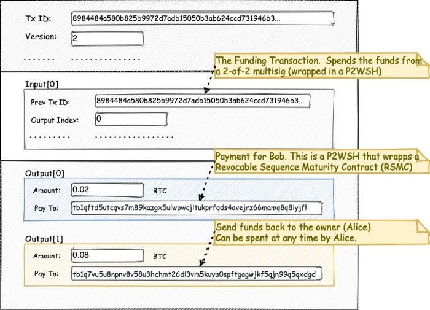
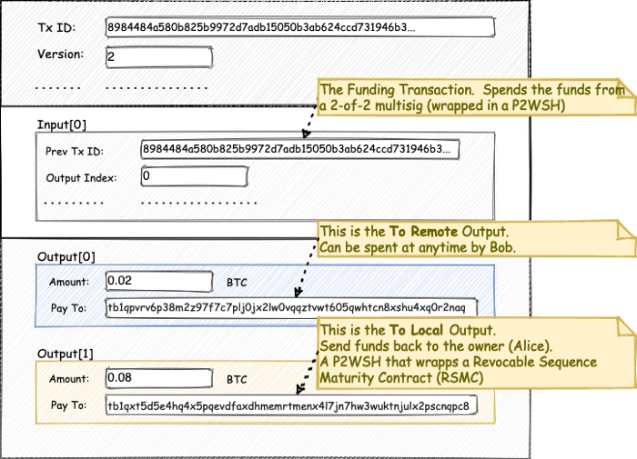
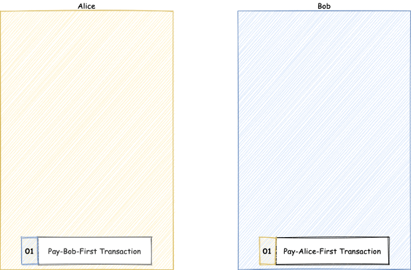
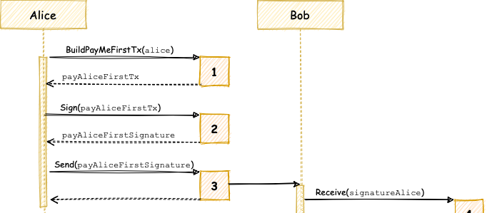
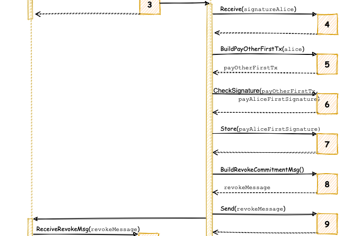
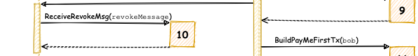
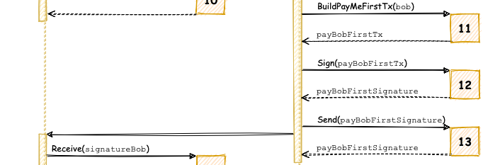
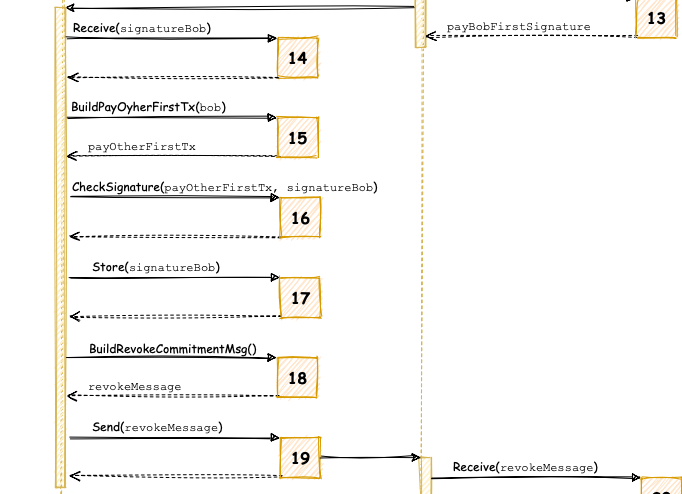
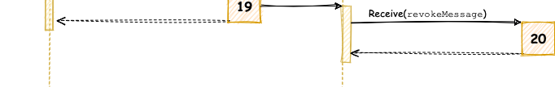

> *作者：Vlad Stan*
> 
> *来源：<https://motorina0.medium.com/updating-the-balance-of-a-payment-channel-944a713a8408>*

在本文中，我们会深入地探究，闪电网络通道是如何做到既能更新余额、又无需任何一方承担资金丢失风险的。

闪电网络是一个对抗性的网络，参与者们并不信任自己的对手。实际上，他们的 *假设* 是对方如有可能就会欺诈他们。参与者**只有**在知晓其操作的安全性时才会签名。而且，需要保证**任何时候**参与者都有拿着资金退出合约（离开通道）的选择。

在这篇文章中，我们假设**支付通道已经开好了**，当前的 Alice 有 0.10 BTC 的通道余额，Bob 只有 0.00 BTC 的余额。

## 承诺事务

在支付通道打开之后，Alice 希望给 Bob 支付 0.02 BTC。双方之间的支付是使用一种特殊类型的交易来达成的，它叫做 “**承诺事务**（commitment transactions）”。

这种事务的特殊之处在于：

- 它是可以撤销的，如果双方都同意的话
- 总是花费充值交易的那个 2-2 多签名输出

承诺事务的初衷是放在支付通道里使用，而不是放到主链上，不过，它们是完全有效的比特币交易，任何一方，只要想的话，都可以将它广播到主链上。

- 一个支付通道内部的多笔承诺事务 -

为了给 Bob 支付，Alice 必须创建两笔交易，**两笔都会**给 Bob 支付 0.02 BTC，但这两笔交易的输出有不同的花费条件。下文我们会管这两笔交易叫 “**先给自己支付**” 交易和 “**先给对方支付**” 交易。记住，**两笔交易都由 Alice 来创建**，无需使用来自 Bob 的输入。在 Bob 发送 `accept_channel` 消息时，Alice 就已经获得了所有的信息。

## “先给自己支付”

在 “先给自己支付” 交易中，Alice 可以立即花用自己的输出，而 Bob 必须遵守 [**RSM 合约**](https://motorina0.medium.com/rsm-contracts-f690cfdf04e8)。RSM 合约（Revocable Sequence Maturity Contract，可撤销的相对时间锁合约）对输出的花费作了以下限制：

- 资金的受益者只能在一段时间的 “成熟期” 之后花费这些资金（不能立即花费）
- 合约可以（被受益者）撤销
- 如果受益者已经撤销了这个合约，但仍尝试花费这些资金，则有可能遭遇惩罚（丧失所有资金）

更多关于 RSM 合约的细节可见[此处](https://motorina0.medium.com/rsm-contracts-f690cfdf04e8)。

这笔交易对 Alice 更有利，你可以在[这里](https://bitcoincore.tech/apps/bitcoinjs-ui/index.html?&tx_note=Sample%20of%20a%20Commitment%20Transaction%20used%20in%20Lightning%20Network.&tx_input_0_note=Spend%20from%20the%20Funding%20Transaction&tx_input_0_script_note=This%20script%20unlocks%20a%20P2WSH.%20Click%20the%20%27Edit%27%20button%20and%20manually%20set%20the%20type%20to%20P2WSH%20in%20order%20to%20view%20the%202-of-2%20multisig%20script.&tx_output_0_note=%5BTo%20Local%5D%20Output%20sends%20funds%20back%20to%20the%20owner%20(Alice)%20of%20this%20commitment%20transaction%20and%20thus%20must%20be%20timelocked%20using%20%60OP_CHECKSEQUENCEVERIFY%60.%20It%20can%20be%20claimed,%20without%20delay,%20by%20the%20other%20party%20if%20they%20know%20the%20revocation%20private%20key.&tx_output_0_script_note=This%20is%20the%20%22naked%22%20unwrapped%20Revocable%20Sequence%20Maturity%20Contract%20(RSMC).%20In%20order%20to%20see%20the%20final%20form,%20click%20the%20%27Edit%27%20button%20and%20%27Wrap%20in%20P2WSH%27.&tx_output_1_note=%5BTo%20Remote%5D%20Output%20sends%20funds%20to%20the%20other%20party.%20If%20%60option_anchor_outputs%60%20applies%20to%20the%20commitment%20transaction,%20the%20%60to_remote%60%20output%20is%20encumbered%20by%20a%20one%20block%20csv%20lock.%20Otherwise,%20this%20output%20is%20a%20simple%20P2WPKH%20to%20remotepubkey.&tx_output_1_script_note=This%20is%20the%20%22naked%22%20unwrapped%20Contract%20that%20pays%20Bob%20with%20no%20restrictions.%20In%20order%20to%20see%20the%20final%20form,%20click%20the%20%27Edit%27%20button%20and%20%27Wrap%20in%20P2WSH%27.&tx_output_2_note=%5BLocal%20Anchor%5D%20Output%20can%20be%20spent%20by%20the%20local%20node%20to%20provide%20incentive%20to%20mine%20the%20transaction,%20using%20child-pays-for-parent.&tx_output_3_note=%5BRemote%20Anchor%5D%20Output%20can%20be%20spent%20by%20the%20remote%20node%20to%20provide%20incentive%20to%20mine%20the%20transaction,%20using%20child-pays-for-parent.&tx_hex=02000000000101bef67e4e2fb9ddeeb3461973cd4c62abb35050b1add772995b820b584a4884890000000000ffffffff04e48d6a00000000004d63210212a140cd0c6539d07cd08dfe09984dec3251ea808b892efeac3ede9402bf2b1967029000b2752103fd5960528dc152014952efdb702a88f71e3c1653b2314431701ec77e57fde83c68acc0c62d00000000002521032c0b7cf95324a07d05398b240174dc0c2be444d96b159aa6c7f7b1e668680991ad51b24a010000000000002200202b1b5854183c12d3316565972c4668929d314d81c5dcdbb21cb45fe8a9a8114f4a01000000000000220020e9e86e4823faa62e222ebc858a226636856158f07e69898da3b0d1af0ddb39940340ca3e2b815f7bf548fa59a79002d8093ee786b38803704130a589f749c33552145a36440a0d7d407dee948c85c2f20e4892479075cf2f166e94c2e6309907971440f89034eba16b2be0e5581f750a0a6309192b75cce0f202f0ee2b4ec0cc39485076c65dc507fe42276152b7a3d90e961e678adbe966e916ecfe85e64d430e75f3475221023da092f6980e58d2c037173180e9a465476026ee50f96695963e8efe436f54eb21030e9f7b623d2ccc7c9bd44d66d5ce21ce504c0acf6385a132cec6d3c39fa711c152ae00000000)看到这种交易的一个例子。

- Alice 创建的 <strong>“先给自己支付”</strong> 的交易 -

## “先给对方支付”

在 “先给对方支付” 交易中，Bob 可以立即花费属于他的输出，但 Alice 受到 [**RSM Contract**](https://motorina0.medium.com/rsm-contracts-f690cfdf04e8) 的约束。这种交易对 Bob 更有好处。你可以在[这里](https://bitcoincore.tech/apps/bitcoinjs-ui/index.html?&tx_note=Sample%20of%20a%20Commitment%20Transaction%20used%20in%20Lightning%20Network.&tx_input_0_note=Spend%20from%20the%20Funding%20Transaction&tx_input_0_script_note=This%20script%20unlocks%20a%20P2WSH.%20Click%20the%20%27Edit%27%20button%20and%20manually%20set%20the%20type%20to%20P2WSH%20in%20order%20to%20view%20the%202-of-2%20multisig%20script.&tx_output_0_note=%5BTo%20Local%5D%20Output%20sends%20funds%20back%20to%20the%20owner%20(Bob)%20of%20this%20commitment%20transaction%20and%20thus%20must%20be%20timelocked%20using%20%60OP_CHECKSEQUENCEVERIFY%60.%20It%20can%20be%20claimed,%20without%20delay,%20by%20the%20other%20party%20if%20they%20know%20the%20revocation%20private%20key.&tx_output_0_script_note=This%20is%20the%20%22naked%22%20unwrapped%20Revocable%20Sequence%20Maturity%20Contract%20(RSMC).%20In%20order%20to%20see%20the%20final%20form,%20click%20the%20%27Edit%27%20button%20and%20%27Wrap%20in%20P2WSH%27.&tx_output_1_note=%5BTo%20Remote%5D%20Output%20sends%20funds%20to%20the%20other%20party.%20If%20%60option_anchor_outputs%60%20applies%20to%20the%20commitment%20transaction,%20the%20%60to_remote%60%20output%20is%20encumbered%20by%20a%20one%20block%20csv%20lock.%20Otherwise,%20this%20output%20is%20a%20simple%20P2WPKH%20to%20remotepubkey.&tx_output_1_script_note=This%20is%20the%20%22naked%22%20unwrapped%20Contract%20that%20pays%20Bob%20with%20no%20restrictions.%20In%20order%20to%20see%20the%20final%20form,%20click%20the%20%27Edit%27%20button%20and%20%27Wrap%20in%20P2WSH%27.&tx_output_2_note=%5BLocal%20Anchor%5D%20Output%20can%20be%20spent%20by%20the%20local%20node%20to%20provide%20incentive%20to%20mine%20the%20transaction,%20using%20child-pays-for-parent.&tx_output_3_note=%5BRemote%20Anchor%5D%20Output%20can%20be%20spent%20by%20the%20remote%20node%20to%20provide%20incentive%20to%20mine%20the%20transaction,%20using%20child-pays-for-parent.&tx_hex=02000000000101bef67e4e2fb9ddeeb3461973cd4c62abb35050b1add772995b820b584a4884890000000000ffffffff04e48d6a00000000004d632103f9b004476ef731bac15887882b99c8756d2451800674e4b9f42d2effde4bebc567029000b27521034e0ec6dc63301141448af127eb2d8eba26e8c2bb24d4bfdf8e29afa7bb02657b68acc0c62d00000000002521034f355bdcb7cc0af728ef3cceb9615d90684bb5b2ca5f859ab0f0b704075871aaad51b24a010000000000002200202b1b5854183c12d3316565972c4668929d314d81c5dcdbb21cb45fe8a9a8114f4a01000000000000220020e9e86e4823faa62e222ebc858a226636856158f07e69898da3b0d1af0ddb39940340ca3e2b815f7bf548fa59a79002d8093ee786b38803704130a589f749c33552145a36440a0d7d407dee948c85c2f20e4892479075cf2f166e94c2e6309907971440f89034eba16b2be0e5581f750a0a6309192b75cce0f202f0ee2b4ec0cc39485076c65dc507fe42276152b7a3d90e961e678adbe966e916ecfe85e64d430e75f3475221023da092f6980e58d2c037173180e9a465476026ee50f96695963e8efe436f54eb21030e9f7b623d2ccc7c9bd44d66d5ce21ce504c0acf6385a132cec6d3c39fa711c152ae00000000)看到这种交易的一个例子。

- Alice 创建的 <strong>“先给对方支付”</strong> 的交易 -

**注意**：交易的输出[按数额大小的升序排列](https://github.com/bitcoin/bips/blob/master/bip-0069.mediawiki)。

Alice **只会**给 Bob 发送 “先给自己（Alice）支付” 交易的签名，但**不会**给 Bob 提供 “先给对方支付” 交易的签名。

Alice 会给 “先给对方支付” 交易签名的**唯一可能性**，就是她自己想把这笔交易广播到比特币网络中（而不是发送给 Bob）。

“给对方支付” 交易的两个输出也叫 “[**to_local**](https://github.com/lightningnetwork/lightning-rfc/blob/master/03-transactions.md#to_local-output)（发给本地）”（即发回给 Alice 的） 和 “[**to_remote**](https://github.com/lightningnetwork/lightning-rfc/blob/master/03-transactions.md#to_remote-output)（发给远端）”（即发给 Bob 的）。

类似地，Bob 也会创建一笔 “先给自己支付” 交易和一笔 “先给对方支付” 交易。

## 通道状态更新 —— 逐步分解

现在我们来仔细看看在 Alice 要通过闪电网络支付通道给 Bob 支付 0.02 BTC 时，整个过程是什么样的。

下面就是 Alice 和 Bob 把余额状态从（Alice：0.10 BTC，Bob：0.0 BTC）转变成（Alice：0.08 BTC，Bob：0.02 BTC）的步骤。

由发起支付的一方先启动整个流程，在我们这个案例中就是 Alice。

### Alice 构建和签名

- Alice 创建和签名她的 “先给自己支付” 交易 -

1. ` BuildPayMeFirstTx( alice) `  —— Alice 构建一笔交易，**不加任何限制**地给自己支付 0.08 BTC、同时使用 [**RSM 合约**](https://motorina0.medium.com/rsm-contracts-f690cfdf04e8) 给 Bob 支付 0.02 BTC。我们将这笔交易命名为 `  payAliceFirstTx` 。

2. ` Sign(payAliceFirstTx) `  —— Alice 签名 `  payAliceFirstTx` 并创建一个相应的签名，我们把这个签名命名为  ` payAliceFirstSignature ` 。

3. ` Send(payAliceFirstSignature) `  —— Alice 发送 ` payAliceFirstSignature ` 给 Bob。发送这个签名不会带来任何风险。最坏的情形也只是  Bob 会广播 `  payAliceFirstTx`并关闭这个通道，这对 Alice 来说也没啥问题，因为她立即就能花费自己的输出，而 Bob 还必须等待。

   在广播 ` payAliceFirstTx ` 的同时，Bob 也暴露了他从 Alice 处收到了 0.02 BTC 的事实。如果 Bob 并不把 ` payAliceFirstTx ` 广播出去，只是没有响应，那么 Alice 可以安全地把前一笔承诺事务广播（表示**状态 01**）（译者注：即通道原来的余额状态）出去，在那个状态中她拥有更多的余额，而且因为她还没有撤销那笔承诺交易，也没有被惩罚的风险。（译者注：如此操作即是不给 Bob 支付，以当前的状态退出合约）

### Bob 检查和撤销

4.  ` Receive(payAliceFirstSignature) ` —— Bob 收到了 ` payAliceFirstSignature ` 消息。注意，Alice 只发送了签名，没有发送完整的交易，因为 Bob 可以自己重构出完全相同的交易。

5.  ` BuildPayOtherFirstTx(alice) ` —— Bob 构建了使用 [RSM Contract](https://motorina0.medium.com/rsm-contracts-f690cfdf04e8) 给自己支付 0.02 BTC 以及不加限制给 Alice 支付 0.08 BTC 的交易。对 Bob 来说，这是 “先给对方支付” 交易，它跟 Alice 构建的 ` payAliceFirstTx ` 其实一模一样。

6.  ` CheckSignature(payOtherFirstTx, payAliceFirstSignature)  ` —— Bob 检查从 Alice 处收到的签名（ ` payAliceFirstSignature ` ）对他刚刚构建的交易（也即 ` payAliceFirstTx `）确实有效。如果来自 Alice 的签名是有效的，那就意味着 Bob 收到了一笔有效的承诺事务（表示**状态 02**）。他可以继续使用通道，也可以加上自己的签名并广播出去，从而关闭通道。

7.  ` Store(payAliceFirstSignature) ` —— Bob 将签名和让他能够重构 ` payAliceFirstTx ` 的数据一起持久化保存。如果 Alice 离线没有响应，Bob 可能会用上这些数据。

8.  ` BuildRevokeCommitmentMsg() `  —— Bob 不需要存储更旧的状态（因为在更旧的状态中他的余额更少）所以他希望让**状态 02**（ ` payAliceFirstTx ` ）变成当前的状态，并撤销（作废）旧的状态（**状态 01**）。他构建了一条 ` revokeMessage ` 来作废**状态 01**。

9.  ` Send(revokeMessage) ` —— Bob 发送 ` revokeMessage ` 给 Alice，这对他来说没有风险，因为他作废的是旧的状态（**状态 01**）。最糟糕的情况是 Alice 变得没有响应，而 Bob 不得不广播 ` payAliceFirstTx ` 交易。

   通过作废旧的状态（**状态 01**），Bob 向 Alice 保证了做接下来的操作是没有问题的。

- Alice 收到了状态 01 的作废消息 -

10.  ` ReceiveRevokeMsg(revokeMessage) ` —— Alice 收到了来自 Bob 的撤销消息。Alice 现在有了惩罚 Bob 的能力，如果 Bob 把旧的承诺事务（代表**状态 01**）广播出去的话。

    她尚未作废自己的当前状态，因为她还没有收到 Bob 对**状态 02** 的签名。

### Bob 构建和签名

- Bob 构建和签名 “先给自己支付” 交易 -

11.  ` BuildPayMeFirstTx(bob) ` —— Bob **不会签名** ` payAliceFirstTx ` 交易并发送给 Alice，这笔交易对他是**不利的**，因为他必须遵守 [RSM 合约](https://motorina0.medium.com/rsm-contracts-f690cfdf04e8)但 Alice 可以立即把属于自己的钱拿走。更重要的是，如果签名了这笔交易，他就**没有了惩罚 Alice 的能力**，即使 Alice 在未来趁着 `payAliceFirstTx` 对自己有利（余额更多）的时候把它广播出去，Bob 也无能为力。因此，Bob 构建了一笔**不设任何限制**给自己支付，但使用 [RSM 合约](https://motorina0.medium.com/rsm-contracts-f690cfdf04e8)来给 Alice 支付的交易。这笔交易我们叫 `payBobFirstTx` 交易。
12.  ` Sign(payBobFirstTx)  ` —— Bob 创建 `payBobFirstTx` 交易的签名，即 `payBobFirstSignature` 。
13.  `Send(payBobFirstSignature)` —— Bob 把 `payBobFirstSignature`消息发送给 Alice。

### Alice 检查和作废

14.  `Receive(signatureBob)` —— Alice 收到 `payBobFirstSignature` 消息。注意 Bob 只需发送签名，无需发送完整的交易，因为 Alice 可以重构出完全相同的交易。
15.  ` BuildPayOtherFirstTx(bob) ` —— Alice 构建出使用 [RSM 合约](https://motorina0.medium.com/rsm-contracts-f690cfdf04e8)给自己支付 0.08 BTC、不设限制给 Bob 支付 0.02 BTC 的交易。对 Alice 来说，这是 “先给对方支付” 交易，它跟 Bob 构建的 ` payBobFirstTx ` 其实一模一样。
16.  `CheckSignature(payOtherFirstTx, signatureBob)` —— Alice 检查从 Bob 处收到的签名（ ` payBobFirstSignature ` ）对她刚刚构建的交易（也即 ` payBobFirstTx `）确实有效。如果来自 Bob 的签名是有效的，那就意味着 Alice 收到了一笔有效的承诺事务（表示**状态 02**）。她可以继续使用通道，也可以加上自己的签名并广播出去，从而关闭通道。如果 Alice 选择广播出这笔交易，Bob 可以立即拿走属于自己的资金，而她只能等待 [RSM 合约](https://motorina0.medium.com/rsm-contracts-f690cfdf04e8)过时。
17.  ` Store(signatureBob) ` —— Alice 将签名和让她能够重构 ` payBobFirstTx ` 的数据一起持久化保存。如果 Bob 离线没有响应，Alice 可能会用上这些数据。
18.  ` BuildRevokeCommitmentMsg() ` —— Alice 构建 `revokeMessage`，如果她尝试广播旧状态（**状态 01**，也就是她还有 0.10 BTC 的状态），她就会受到惩罚。
19.  `Send(revokeMessage)` —— Alice 发送 `revokeMessage` 给 Bob。她现在可以认为支付已经完成了，支付通道的状态已经更新成**状态 02** 了。

20.  ` Receive(revokeMessage) ` —— Bob 收到来自 Alice 的 `revocationMessage`。现在他可以认为支付已经完成了，支付通道的状态已经更新成**状态 02** 了。

（完）