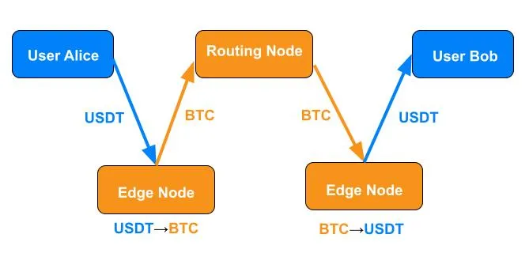
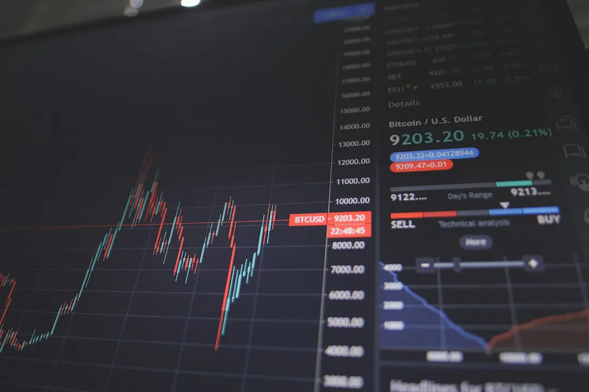

> *作者：Roy Sheinfeld*
> 
> *来源：<https://blog.breez.technology/usdt-on-lightning-the-good-the-bad-and-the-unknown-aefc3aaf6999>*

每个人都听过这句 ~~中国谚语~~ 讹传的英国成语：“[愿你活在有趣的时代](https://quoteinvestigator.com/2015/12/18/live/)”，并且知道为什么它听起来怪怪的。它太过深沉，就像 80 岁的边缘人说的话。

（译者注：引文所链接的网页考证得，该谚语并不来自英语，而是一句中国谚语：“宁为太平犬，不作离乱人”。所以作者使用了删除线来暗示，并说这是讹传。）

但你有没有想过它的反面呢？根据 [Anglo-Saxon 编年史](https://thijsporck.com/2020/09/15/when-medieval-chroniclers-have-nothing-to-report-the-years-190-381-in-the-anglo-saxon-chronicle/)，有一段接近两个世纪的时间，是没有什么事情发生的。[Vivian Mercier](https://en.wikipedia.org/wiki/Vivian_Mercier) 对《等待戈多》的著名评语是“一出在连续两次的无事发生中上演的戏剧”。但如果是连续 191 次的无事发生呢？我还是更喜欢有趣时代。

这就是我们现在的情况。[Tether](https://tether.to/en/) 以及他们发行的稳定币 [USDT](https://tether.io/news/tether-brings-usdt-to-bitcoins-lightning-network-ushering-in-a-new-era-of-unstoppable-technology/)，[即将登陆闪电网络](https://tether.io/news/tether-brings-usdt-to-bitcoins-lightning-network-ushering-in-a-new-era-of-unstoppable-technology/)。关于闪电支付何以是[比特币经济体的通用语言](https://medium.com/breez-technology/lightning-is-the-common-language-of-the-bitcoin-economy-eb8515341c11)（[中文译本](https://medium.com/breez-technology/lightning-is-the-common-language-of-the-bitcoin-economy-eb8515341c11)）、何以[比特币是一种交换媒](https://medium.com/breez-technology/bitcoins-false-dichotomy-between-sov-and-moe-18e3f968a643)介，我们最近已经聊了许多（它真的是；请看我们的[报告](https://breez.technology/report/)）。

这两种看法似乎正在合流。得益于闪电网络作为一种通用语言，比特币可以跟许多相邻的技术互操作，比如 USDT 。USDT 即将大大加快比特币进入新的应用场景、新的市场，以及闪电生态系统还没有经历的大规模挑战。

- 如果可以选择，我宁愿一头扎进未知世界，也不要在沙发上度过一个下午。所有酷的东西都来自未知（图片：<a href="https://c.pxhere.com/photos/d9/f9/skydiving_jump_falling_parachuting_military_training_high_people-747005.jpg!d">pxhere</a>） -

在闪电网络上发行 USDT 就是一个未知领域。真是有趣的时代。那么，我们来想一想，USDT 加入闪电网络（用闪电网络来转移 USDT）意味着什么 —— 机会、风险，以及还没有答案的问题。

## Taproot Assets 101

闪电网络的设计目标是提高比特币区块链的吞吐量，所以比特币是它唯一的货物。[Taproot Assets 则是一种新的协议](https://lightning.engineering/posts/2024-07-23-taproot-assets-LN/)，允许同质化资产（例如稳定币）可以通过闪电通道来传输；因为处理比特币支付的相同基础设施，可以处理作为哈希化元数据附件（hashed metadata piggybacking）的同质化资产。

它的工作原理，对于已经理解闪电网络的人来说非常简单。接收者生成一张发票，跟边缘节点（就是将这个用户连接到广大的闪电网络的节点）请求比特币与相关资产（在我们这个案例是 USDT）的汇率。一旦这名用户接受了某个边缘节点的汇率，就生成一张用于支付的发票，并发送给支付者。支付者将资产发送给自己的边缘节点，这个边缘节点将资产转化为一笔普通的比特币支付，这笔支付（就像普通的闪电支付）穿过闪电网络，抵达接收者这边的边缘节点，这个节点再将比特币支付转化成原本类型的资产（USDT）并转发给接收者。

- Alice 正在给 Bob 支付。一些路由节点可以在两个边缘节点之间转发支付，但他们只能看到比特币在传输。 -

Taproot Assets 利用了闪电网络和比特币的多功能性，让用户可以在闪电网络上传输新类型的资产，同时将比特币作为通用的交换媒介。所有节点都使用闪电通用语言的必然推论是，边缘节点之间的任何路由节点都只能看到比特币在传输。闪电网络告诉他们如何移动比特币，而他们也只知道自己是在移动比特币。太棒了！

但技术之外还有别的。不管怎么说，USDT 本身是一种大规模的交换媒介。如今每天都有[数百亿的 USDT](https://usdt.tokenview.io/en/charts)在换手，支付数量高达几百万笔。它的每日交易额跟巴西雷亚尔和印度卢比是同一级别。这可了不得。所以，闪电网络对 USDT 来说意味着什么、USDT 的加入对闪电网络来说又意味着什么呢？

## 好处

### 对比特币来说

迄今为止，大部分比特币化商业的策略都集中在吸引尽可能多的人选择这橙色药丸（比特币），并在他们中发展[循环经济](https://thebitcoinmanual.com/articles/btc-circular-economies/)（每次只能说服一个用户）。这种策略可能已经触及了它的[规模限制](https://medium.com/breez-technology/orange-pilling-has-stopped-working-4a407252c7a3)。循环在过去十五年间茁壮成长，但依然很有限，我们需要一次能够说服几百万人。

现在，USDT 和 BTC 在闪电网络上可以原生地互操作，这个循环就获得了许多切线。有了 USDT，一笔交易的双方 —— 支付方和接收方 —— 就可以各自选择要使用 BTC 还是 USDT，没有任何一方会被对方的选择限制。客户可以用 BTC 支付，商家可以收到 USDT 。或者客户可以用 USDT 支付但商家收到的是 BTC 。或者他们可以使用同一种资产。*这都不重要。*一旦两种资产都原生于闪电网络，它们就可以自动、无摩擦地相互交换。每个人都能自由选择比特币的优势（作为用户自下而上选出的交换媒介），也可以选择 USDT 的优势（其价格与美元的货币政策以及 Tether 的流动性储备保持稳定）。

结果是，闪电网络和比特币将获得[几百万用户](https://tether.io/news/how-many-usdt-users-are-there/)以及价值数十亿美元的消费能力。这是比特币的功用的质性延申。这种新的应用场景将比一船的橙色药丸带来更大的好处。许多这样的用新用户可能不知道他们在使用闪电网络（因为闪电支付作为[比特币经济体的通用语言](https://medium.com/breez-technology/lightning-is-the-common-language-of-the-bitcoin-economy-eb8515341c11)的力量）。但我们这些老派的闪电网络人知道，这就是我们一直在开发的方向。

- 圆形（circle，循环）当然美丽，但拥有无数切线的圆形美得令人窒息（图片：<a href="https://unsplash.com/photos/time-lapse-photography-of-led-waters-eStCg6FRw_E?utm_content=creditShareLink&utm_medium=referral&utm_source=unsplash">Todd Quackenbush</a> -

此外，USDT 的集成可以让美国用户更容易使用闪电网络。美国的税收法律[将 BTC 当成一种股权](https://www.nerdwallet.com/article/investing/crypto-tax-rate)，从而每一次支付都可能是复杂的税收事件的串联。但如果美国用户可以用一种不涉及资本利得的资产来使用闪电网络，那么他们就能获得闪电网络的许多好处，而无需负担它在监管上的一种缺点。

### 对 Tether 来说

Tether 一般会在久经考验 —— 已经获得显著市场吸引力 —— 的区块链 上发行 USDT，而且他们没有兴趣推出自己的区块链网络。USDT 当前在 Algorand、Celo、Cosmos、Ethereum、EOS、Liquid Network、Solana、Tetos、Ton 和 Tron 上[发行](https://tether.to/en/faqs/)。注意，所有这些都是权益证明（PoS）类型的区块链（除了 Liquid，它是联盟侧链），所以它们必然都比比特币更加中心化。

这些区块链也都有不同方面的牺牲。Ethereum 是相对去中心化的（在 PoS 区块链中），但它的[交易手续费显著更高](https://nowpayments.io/blog/ethereum-transaction-fees-are-too-high-what-should-i-do)。Tron 更便宜。可能这就是 —— [根据一份估计](https://okhlopkov.com/usdt-popularity-across-different-blockchains/) —— Tron 上的散户 USDT 用户的月度活跃量是 Ethereum 上的 7 倍，而且发送数量是 8 倍。但 [Tron 是非常中心化的](https://www.financemagnates.com/cryptocurrency/news/tron-is-a-highly-centralized-project-ex-cto-says/)，这就成了 USDT 的一个瓶颈。如果 Tron 失败，Tether 就会失去其总发行量的一半。通过允许 USDT 在闪电网络 —— 天然去中心化的网络 —— 上移动，Tether 就能缓解它对便宜的中心化网络的依赖。

而且，就像 USDT 可以协助美国用户访问闪电网络，闪电网络也可以让 USDT 在美国市场上用起来更加便利。美国的交易所有时候会限制使用 USDT 的区块链。例如，[Coinbase 说](https://www.coinbase.com/en-de/price/tether) “Coinbase 只支持 Ethereum 区块链（也即 ERC-20 标准）上的 USDT。不要在其它区块链上向 Coinbase 发送 USDT”。闪电网络让 Binance、Coinbase 和 Kraken（已经支持了闪电网络）这样的大交易所在给用户提供 USDT 支付时多了一个去中心化的替代选择。

## 坏处

新一届美国政府已经提出要吸引整个稳定币行业回到明国，并将监管它们当成自己的 “[首要任务](https://www.nbcchicago.com/news/business/money-report/white-house-crypto-czar-david-sacks-says-first-priority-is-stablecoin-legislation/3665689/)”。换句话说，他们会密切关注这里的进展。只要 USDT 这样的稳定币是锚定美元的，那些控制美元并从中获益的人就会想要控制稳定币。

监管者甚至认为他们可以通过监管我们的自由来提高我们的自由。这不可能。但这就是他们的本性。随着 USDT 在闪电网络上获得使用、闪电网络因为可以转移 USDT 而具备效用，我们都会吸引更多来自监管者的关注。很难说他们可以干预多少、准备怎么干预，但都不会是什么有趣的事。监管永远只是摩擦。

一个可能吸引监管审查的就是边缘节点。传统的中心化交易倾向于接受许多司法辖区的 KYC/AML 规则。如果边缘节点能够自动交换 USDT 和 BTC 并转发支付，对于（不会喜欢去中心化的）[监管者](https://medium.com/breez-technology/why-bitcoin-needs-to-become-a-medium-of-exchange-80d5c9e1de65)来说，他们看起来就非常像传统的交易所。

## 未知的

### 代价是什么？值得吗？

虽然闪电网络给用户和 USDT 提供了显著的好处，但显然，并非对所有涉及 USDT 的交易来说，闪电网络都是最优的解决方案。闪电网络的用户希望低手续费。使用中心化区块链和托管交易的 USDT 用户也这么希望。但向闪电支付加入第二种资产，就会带来每个人 —— 路由节点、用户、尤其是边缘节点 —— 都不得不考虑的金融因素。

首先，边缘节点提供的是跟 LSP 一样的标准化服务—— 保证用户能够连接到闪电网络，并具有足够的通道和足够的流动性来保证支付送达 —— *还要* 转换资产。资产转换是一种有价值的服务，应该得到补偿，而且也可能是有风险的（见下文）。

其次，USDT 可能会显著提升交易量，这就意味着 LSP 和路由节点需要向网络投放更多流动性以路由这些支付。他们不能采取跟托管交易所一样的捷径 —— 仅仅更新自己的内部账本。[流动性配置的经济原理](https://medium.com/breez-technology/lightning-economics-how-i-learned-to-stop-worrying-and-love-inbound-liquidity-511d05aa8b8b)依旧适用，只多不少。

闪电网络能够跟 Tron 这样的中心化交易所竞争 USDT 支付吗？答案可能跟大部分尝试匹配技术和用途的问题相似：每一种技术都有自身的长处和短处，使之适合于某一些用途、不适合另一些用途。通常来说，市场会分辨出来。不过，因为闪电网络并不是为这个用途量身定制的，所以价格发现将会是个反复试错的过程，这需要时间。

### 免费看涨期权？

边缘节点面临 “[免费看涨期权问题](https://diyhpl.us/~bryan/irc/bitcoin/bitcoin-dev/linuxfoundation-pipermail/lightning-dev/2018-December/001752.txt)” 的风险，非常有趣，值得在这里单独讨论。这是一种新的风险，存在于任何在一笔闪电支付中涉及两种资产的情形。

闪电支付要在一段时间内完成，才能正常结算，否则，发票会自动失效。这个时间就是 “[HTLC](https://www.voltage.cloud/blog/how-do-htlc-work-lightning-network)（哈希时间锁合约）”中的 “T”。

当边缘节点给出他们对 USDT↔BTC 支付的汇率时，他们是根据一些参数（比如他们当前的流动性条件 *以及现货汇率*）给出的价格。但在用户接受一个边缘节点的出价到相关的 HTLC 过期之间，有一个时间窗口。价格在这个窗口内可能发生变动。即使我在一个汇率时发起了一笔 USDT 支付，我也可以等到汇率对我更优时才释放原像、结算 HTLC 。如果汇率变动不利于我，那我可以不释放原像。在这种情况下，这个边缘节点可以发起通道关闭来赎回资金，但那会很慢（而且也比较昂贵）。如果汇率变动有利于我，那么这个边缘节点就会受到损失。正面，我没有损失；反面，我占到了这个边缘节点的便宜。

任何涉及资产组合的闪电支付都会给用户一份[看涨期权](https://www.investopedia.com/terms/c/calloption.asp)。传统的金融机构，在卖出看涨期权时，会通过在价格中加入风险溢价，来管理风险。这些期权，都没有准备的边缘节点来说可能非常昂贵。[只需要问问在 Boltz 工作的 Kilian 和 Michael 就知道了](https://medium.com/boltzhq/the-problem-with-free-options-69f9f59a2d48)（据我所知他们是最早完整提出这个问题的人，并开设了课堂告诉我们这个生态中的所有人）。替代选择是边缘节点在自己的报价中计入看涨期权的价格，就跟传统金融机构一样。跨期套利是个伟大的事情，如果你能做到的话。

- 有多少早期的闪电网络开发者和崭露头角的 LSP 预料到了，到 2025 年他们需要对冲闪电支付内在的看涨期权？ -

用户并不是边缘节点的唯一顾虑来源。如果一个路由节点失败于转发原像 —— 无论是这个路由节点故意的，还是功能故障 —— 这个边缘节点也会遭遇损失。不过，至少在路由节点上，也许可以实现某种剩余系统来帮助选择转发路线。但是，面对终端用户，剩余系统可能派不上用场，因为新用户会持续不断地加入网络。

到目前为止，免费看涨期权都从来没有成为闪电网络的问题，因为它只处理一种资产：比特币。如果免费期权问题变得非常严重，可以想象会出现多个并行的、只是用一种通货的闪电网络。一个只使用比特币、另一个只使用 USDT，等等。如果比特币被排除在循环经济之外，我们就会失去比特币互操作性的好处。我们甚至会后悔当初将 USDT 带到闪电网络上。

## 我们为有趣时代而来

比特币一直被认为是革命性的。颠覆已经朽坏的法币就是它的目标，一直如此。我们在这里，就是为了这场革命。我们知道这场变革和颠覆不会一帆风顺。

但变化是个好事情。进步就是一种人们欢迎的变化。我们欢迎 USDT 到闪电网络上来，因为我们看到了机会。对 USDT 用户、对闪电网络和对比特币来说，它代表着进步。

但是，跟其它变化一样，它也需要缜密的思考、准备、敏锐的直觉和快速的回应。如果没有合适的装备和技能，你就无法进入未知领域。闪电网络流动性商业中的人，都将面对一些新的挑战，但也都有可能获得巨大的收益。

Tether 将获得一个经济性的、去中心化的分布式网络，并且能更好地服务至关重要的美国市场。闪电网络将获得大规模的流动性和用户。比特币将原生地与 USDT 互操作。这就是我们兴奋的原因。

但监管者也在看着你。而且边缘节点只会提供必要的转换服务（如果这样做有利可图）。所以，面对挑战吧，我们会在闪电网络中尝试一些：更努力地思考、更细致地设计、加强我们的代码、培育我们的市场，并且，永远不忘我们的终极目标 —— 实现无止境的比特币经济。

（完）

