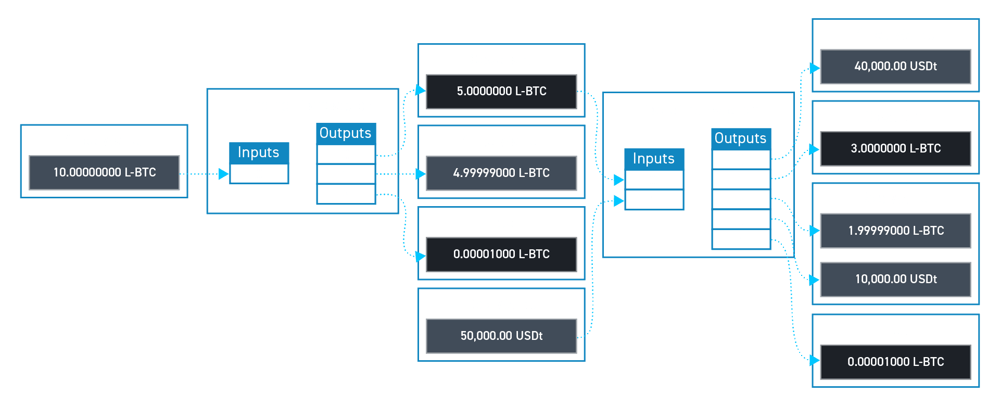
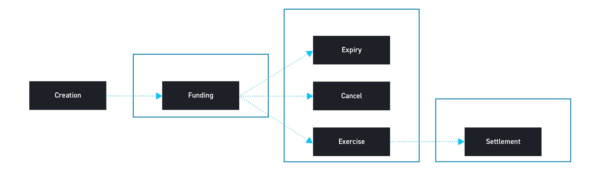

> *作者：Allen Piscitello*
> 
> *来源：<https://blog.blockstream.com/use-smart-contracts-on-liquid-to-deploy-financial-products/>*

在 2021 年 11 月，Liquid 添加了一项升级，[增加了 31 个可用于脚本编程的操作码](https://blog.blockstream.com/tapscript-new-opcodes-reduced-limits-and-covenants/)，用意是简化和提升限制条款（covenants）：事务的内省、64 比特的算术运算，等等。有了这些操作码，Liquid 就可以部署更高级的智能合约、为受困于传统金融世界常见的信任需要、希望减少这种需要的交易员提供金融产品。

本文介绍这样的金融产品的两个例子：（1）非托管的、允许部分成交（partial fills）的限价订单（limit orders）；（2）完全担保的期权合约。Blockstream 已经设计和实现了展示这些应用场景的智能合约，也展示了 Liquid 作为比特币金融层的能力。

（译者注：为避免混淆，作为技术概念的 “transaction” 在本文中译为 “事务”，而作为合约概念的 “trade” 在本文中译为 “交易”。）

## 限价订单

限价订单允许一种资产的买方或者卖方（称为 “挂单者（maker）”）设定一个自己愿意在市场上买入或者卖出这种资产的价格。然后，另一个交易员可以 “吃掉（take）” 这个订单并执行交易。这通常是在托管式交易所中完成的 —— 交易所会托管双方的资金，然后用一个内部的结算系统来分配双方的资金。这样的系统在资金保管上依赖于信任第三方，资金可能会因为系统被黑、监守自盗而丢失，甚至第三方会消失或者卷款潜逃。

过去，在 Liquid 上也可以执行这种交易，但有严格的限制，例如，双方的密钥都必须持续在线、订单需要完全成交。举个例子，如果一个挂单者希望在 L-BTC 的价格为 20000 USDt 时卖出 5 L-BTC，而买家只想要买 2 L-BTC，那么就没有直截了当的成交方法，除非挂单者手动干预、修改订单。这种手动干预和密钥在线的要求提升了复杂性，也带来了安全风险。

而 Liquid 的事务内省操作码可以用来构造限制条款：在这种智能合约中，一个输出只能被一笔满足了特定条件的交易花费。使用限制条款，挂单者可以锁定 5 L-BTC 到一个限制条款中，允许任何人转移任意数量 L-BTC、只要他们为转移走的 L-BTC 支付 20000 USDt 的价格。这种限制条款将允许卖家取出剩余的担保品然后取消订单。限价订单限制条款的注资事务不需要发布到区块链上，可以等到某个吃单者前来执行交易时再发布，这可以节约区块空间以及潜在的手续费。

- 注资事务：Alice 添加 5 L-BTC 到一个限价订单限制条款中。交易事务：Bob 向限制条款支付 40000 USDt，收到 2 L-BTC（减去网络手续费）。 -

## 期权合约

一种更高级的应用场景是 “备兑看涨期权合约（covered call option contract）”，这是一种由底层资产完全担保的期权合约。在这种场景中，期权的卖方卖出一种可以在未来的某个时间（称为 “到期日”）按约定价格购买某种资产的权利（但不含义务）。在到期日后，如果买方没有来行使权利，卖方就可以拿回担保品。当一种资产的持有者愿意按更高的价格在未来卖出资产时，期权合约可以用来让这种资产产生收益；或者说，这是一种让买方可以花费一小笔金钱来获得某种资产的风险敞口的办法。

期权合约通常也是通过第三方托管资金来实现的，或者，是通过跟可信任的对手交易来实现的（对手方必须偿还债务）。在使用一个受信任的第三方时，用户会面临资产丢失或者冻结的风险，无论是技术上的失败、监管措施或是明目张胆的盗窃。而在信任对手方时，则会面临对手方无力偿还债务的风险。大部分的金融交易市场都依赖于这种模型，这就意味着，只有一小部分 “人缘好” 的大公司能够获得信任，而且必须购买保险来保证他们可以履行义务。在使用不需要任何中间人的智能合约时，这些问题会消失。

## 期权限制条款构造

一份期权合约总有两种不同的仓位：一方是卖方（grantor，授予人，提供买入他们的担保品的权利），而另一方是买方（grantee，受让人，得到在未来按约定价格买入约定资产的权利）。这些仓位是可以交易的。而 Liquid 的实现中，这两种仓位由不同的 token 来代表：卖方 token 和期权 token。

期权需要定义下列条款：

- 担保品资产 —— 挂单者卖出的资产 [1]
- 结算资产 —— 吃单者用于支付给挂单者的资产
- 行权价格 —— 买入一个合约单位的担保品资产必须支付的结算资产的数量
- 合约单位 —— 允许转移的担保品资产的最小单位。实际转移的数量必须是这个值的倍数
- 行权起始日期 —— 可以开始执行权利的日期
- 行权到期日 —— 授予人可以开始拿回自己的担保品的日期

## 期权的生命历程

### 定义

期权的创建者定义上述参数，以创建生成期权 Token 和卖方 Token 的能力。最开始，没有什么期权或者卖方 Token，也不会锁定担保品。Liquid 允许这些 token 通过 “重发行 token” 来生成 —— 重发行 token 是一种特殊的资产，可以用在一笔交易中以生成一种关联的资产。定义程序结束时，我们会得到两种重发行 token，称为 *期权 token 生成器* 和 *卖方 token 生成器*。这些 token 会被放到一个限制条款中，以限制生成它们的能力，直到担保品被存入一个单独的限制条款（称为 “担保品限制条款”）中。

### 注资

任何用户都可以通过向担保品限制条款存入担保品来为一个期权合约注资。向担保品限制条款存入担保品的用户，每存入一份合约单位数量的担保品可以生成一对期权 token 和卖方 token。比如，如果合约单位是 1 百万聪的 L-BTC，那么一个用户存入 100 百万聪的 L-BTC，就可以生成 100 个期权 token 和 100 个卖方 token。然后，这个用户就能自由卖出（与自己的愿意持有的仓位）相反的仓位（或者，如果他们催生这个市场，可以两种 token 都卖出）。

### 取消

如果一个用户希望取消自己在一个期权合约中的仓位，他们可以烧掉一对期权 token 和卖方 token，从而收回一个合约单位数量的担保品。当用户想要锁定利润或者亏损，又找不到对手方时，就可以这样做。

### 到期

如果合约到期，卖方 Token 的持有者可以烧掉自己的 token 然后拿回相应的担保品。担保品限制条款保证了这样的事务只能在到期日后执行。每烧掉 1 个 token，就能聪担保品限制条款中拿回一份合约单位数量的担保品。

### 行权

如果一个期权 token 的持有者希望行使自己的权利，那么可以在烧掉 token 的同时向结算限制条款支付行权价格数量的结算资产。如此一来，他们就能领取一份合约单位数量的担保品。结算限制条款存在就是为了允许卖方 token 的持有者领取由受让者支付的结算资产。

### 结算

卖方 token 的持有者可以领取由行使权利的人支付的结算资产。烧掉任意数量的卖方 Token，就可以从结算限制条款中领取相应数量的结算资产。

## 阅读我们的期权白皮书

想要了解关于这些构造的更多信息，请阅读我们的白皮书《使用 Elements 的非托管期权》，是由我、Sanket Kanjalkar 和 Andrew Poelstra 撰写的。想要了解进一步的讨论，可以加入 Liquid 社区的 [Telegram](https://t.me/liquid_community?ref=blog.blockstream.com) 并直接提问。

在未来几周，我们会放出这些构造的一个参考实现，这样你就可以使用 Liquid 创建你自己的期权。或者，你也可以从中寻找启发、在 Liquid 上建立其它有趣的应用。

[1] 对于 L-BTC 看涨期权来说，L-BTC 是担保品资产；而对 L-BTC 看跌期权来说，L-USD 是担保品资产。虽然这些资产在不同市场中扮演不同的角色，但从技术角度来看，它们是完全一样的。

（完）