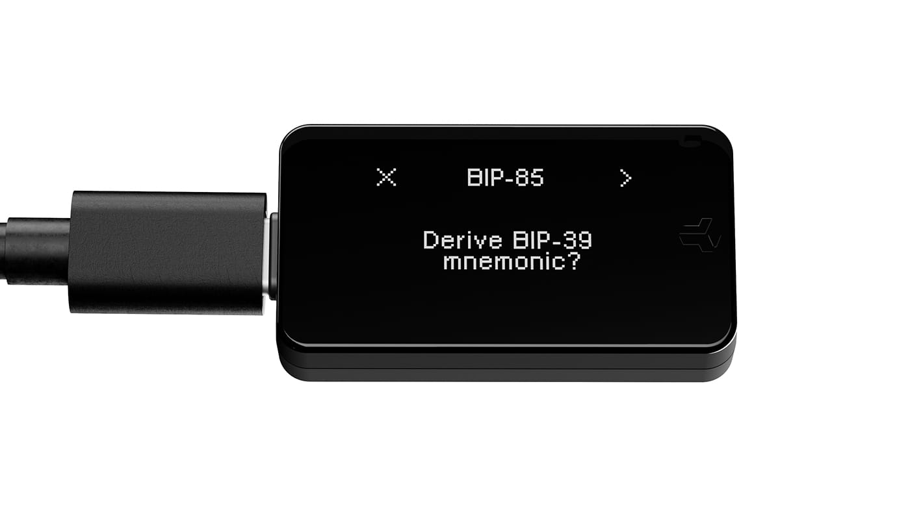
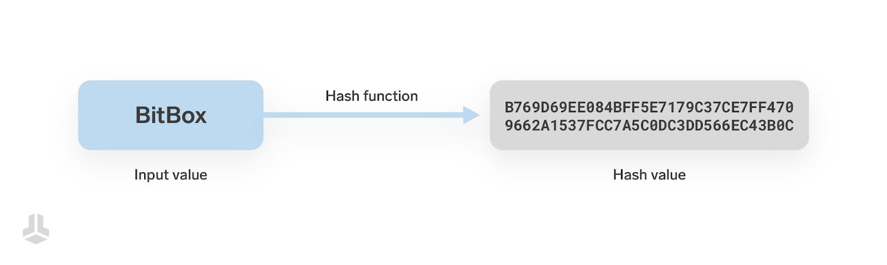
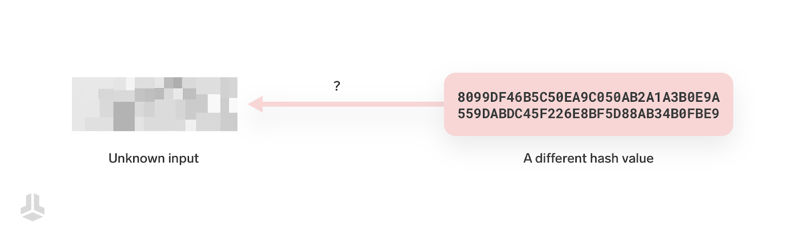
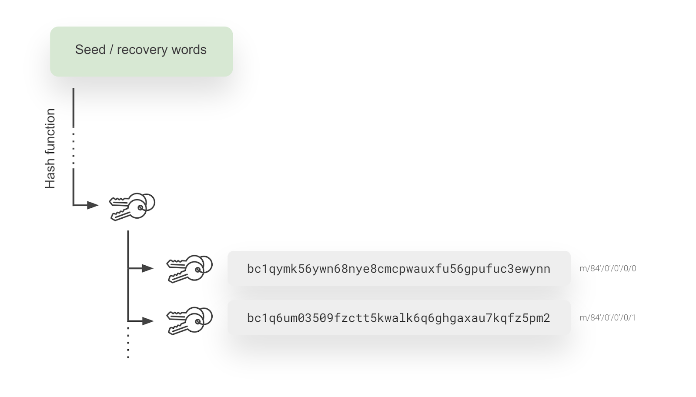
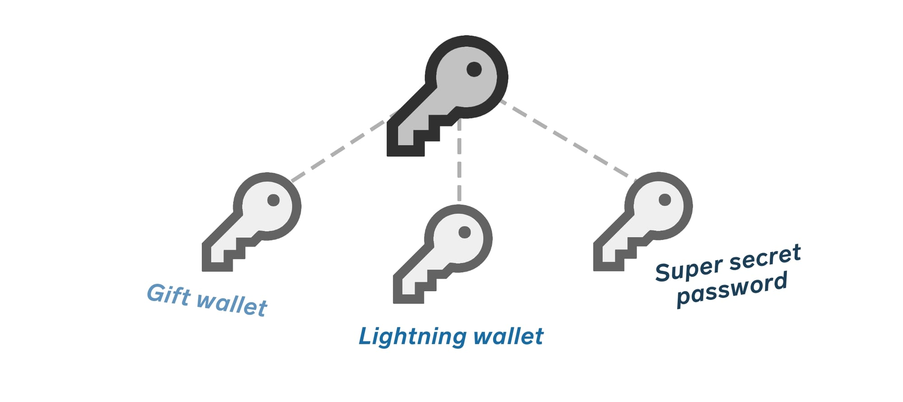

> *作者：Sebastian*
> 
> *来源：<https://blog.bitbox.swiss/en/using-bip-85-child-keys-with-the-bitbox/>*

[管理和保护你的比特币钱包的备份](https://blog.bitbox.swiss/en/how-to-create-and-secure-your-wallet-backup/)，可以说是自主保管中最重要的部分。但随着我们为不同用途而创建钱包，钱包的数量会不断增长，我们就会陷入混乱，因为每一个钱包都需要妥当的备份。

如果能直接使用已有的钱包的备份来生成新的钱包，岂不是好？没错，就可以这么做。[BIP-85 标准](https://github.com/bitcoin/bips/blob/master/bip-0085.mediawiki?ref=bitbox.swiss)以及所谓的 “子密钥”，让你可以从已有的钱包备份中派生新的、独立的种子词；并且，这样的派生的种子词，还能随时在你的 BitBox 设备中的初始钱包中复原。一个备份，就能生成大量不同用途、不同安全层级的钱包。我们来看看这套标准是怎么工作的、有什么好处吧！

## 派生路径

新式的比特币钱包都能创建无限数量的密钥，哪怕你的备份只由仅仅 12 个或 24 个词组成。这是通过使用 SHA-256 这样的密码学哈希函数来实现的；相同的密码学哈希函数也用在众所周知的 “[挖矿](https://blog.bitbox.swiss/en/how-does-bitcoin-mining-actually-work/)” 过程中，用来保护比特币网络。

（译者注：在 BIP32 所定义的由种子词（主密钥）来派生子密钥的过程中，使用的密码学哈希函数是 SHA-512，虽然与 SHA-256 属于同一家族，但它会产生 64 字节的结果，而不是 32 字节的结果。作者在这里应该是为了方便讲解才使用 SHA-256 作为例子。）

这些函数由一种独特而重要的属性：它们是单向的！虽然投入一个输入总是会得到相同的结果（因此很容易验证某一个输入与某一个结果匹配），但你无法反向运算 —— 无法通过结果来知晓与之对应的哈希函数输入。在你知道一个数值是一个哈希值的时候，想知道其所对应的输入，最好的技术手段也不过就是暴力搜索（任意猜测）。

在下图中，你可以看到 “BitBox” 一词的 SHA256 哈希值。你可以在这个[在线工具网站](https://emn178.github.io/online-tools/sha256.html)验证这个结果。

但是，如果你只知道一个哈希值，比如下图所示的，你是无法计算出原本的输入的 —— 你只能不断改变输入、看看会不会产生一样的结果，也就是暴力搜索。这种的猜测要耗费大量的计算资源和能源 —— 所以甚至猜测也是不切实际的。

现在，为了用仅仅一套种子词派生出许多私钥，我们可以连续多次使用哈希函数，下一轮哈希函数的输入是上一轮的输出再加一段稍微不同的数据，从而产生出完全不同的结果。这很棒，因为只要我们知道初始的种子词，就总是能从头重新创建出，或者说 “派生出” 所有私钥，只要我们知道正确的 “**派生路径**” —— 别看这个词这么唬人，实际上，它就是指我们使用哈希函数的次数以及每一轮的附加数值；它就像一个路标，指引我们从种子词得到具体的一个密钥。

这也正是 BitBox 能够从一个种子词派生和复原许多账户和地址的原因：

## 派生 BIP-85 子密钥

现在，我们只需在另一个用途中运用相同的原理：我们不是要为别的账户（或者说新的地址）派生新的密钥，而是使用派生出来的密钥 —— 本质上也只是一个非常大的数字 —— 来创建一个新的种子词，就这么简单！

在这个过程中，BIP-85 的角色是非常直接的。它是一个行业公认的标准，关于如何得到用于这个用途的子密钥。本质上，它是 “保留” 了一个非常具体的派生路径，仅仅用于 BIP-85 子密钥。不论你是使用 BitBox 签名器还是其他支持 BIP-85 的钱包，程序在后台都会使用相同的派生路径，从而复原出相同的子密钥，一个又一个。

还记得哈希函数的 “单向” 属性吗？因为根据 BIP-85 派生出来的子密钥 —— 在这里应该叫新的种子词了 —— 是这样的哈希函数运算几千轮的结果，所以你是无法计算出原本的输入的，也就是说，即使你知道了新的种子词，也不能凭此知道原本钱包的种子词。

这也是为什么，在 BitBox 的安全环境以外使用子密钥，也是安全的。比如说，你可以在你的手机中导入一个子密钥，然后用它来创建一个软件钱包 —— 完全不会影响你的 BitBox 中的原本钱包的安全性。

## 用途

虽然这无疑是一个相当高级的功能，但 BIP-85 种子词有几个巧妙的用途，是我们准备聊聊的。无论你用它来做什么，记住，BIP-85 种子词的创建者，**总是能够完全控制**用这个种子词来创建的任何钱包。

### 个人热钱包

可以说，BIP-85 种子词最有用的地方，就是用来**管理额外的热钱包**。许多用户用 BitBox 这样的硬件签名器来保管大部分储蓄，但依然在自己的手机上使用简单的热钱包或者闪电钱包，用于更小额度的、日常的支付。与其为这样的钱包创建一个全新的备份，不如使用 BIP-85 种子词，它提供了一种简单的方式来保证你在未来总是能复原钱包，而无需担心额外的备份（所具有的风险）。

### 礼物和初学者钱包

类似地，BIP-85 种子词可以用来**为其他人创建新钱包**，比如你要给朋友和家人赠送一些比特币、又希望保证他们不会弄丢钱币的时候。另一个例子是使用 BIP-85 种子词来为你的孩子创建钱包。这样一来，你既给了他们使用自己的钱包的自由，同时，你的原本钱包又是一个故障保护装置，在他们弄丢钱包访问权的时候可以派上用场。

不论是哪一种用途，都请确保使用这些子密钥的人知情 —— 你应然控制着他们的钱包的备份。如果他们希望完全自治，应该独立地创建自己的钱包。

### 口令 …… 用在哪里？

最后，同样重要的是，我们要牢记一个事实 —— BIP-85 种子词（子密钥）只是一个很大的数字，只不过编码成了英文词组。因此，它们可以用在需要强壮秘密口令的几乎所有地方。比如说，你可以用一个种子词来加密你的个人硬盘（包含了你的敏感数据）或者你的家庭照片库。当然，用 12 个英文词来登录社交媒体账号是不现实的。但是，在没有其他复原访问方法的情况下，就像加密硬盘，使用子密钥是完全合理的。

如果你像这样，把 BIP-85 种子词集成到你的数字生活中，那么**管理备份会变得简单很多很多**。你不需要管理和跟踪许多重要口令、也不用存到口令管理器中或者写到软绵绵的便利贴上，子密钥总是能从你的比特币钱包中复原出来。这样一来，你的比特币钱包备份就成了你唯一需要保护的备份 —— 你可以集中精力将它做好。

## 没有额外的安全性

在思考 BIP-85 种子词的使用场景时，还应该清楚的是，它主要是一种**方便特性**，可以创建许多独立的种子词，并且总能从创建它们的初始钱包中复原。但它们并不提供额外的安全性。子密钥最多也只能跟父密钥一样安全。而且记住，任何能够触及原密钥的人，都能立即触及所有的子密钥。

对于希望为钱包装置获得额外安全机制的用户，应该考虑[密语（passphrase）](https://bitbox.swiss/blog/optional-passphrases-benefits-and-risks/)和[多签名](https://bitbox.swiss/blog/what-are-multisig-wallets-everything-you-need-to-know/)。

## 结论

理论上，你的比特币钱包的备份可以变成你唯一需要保管的物理备份，它不仅为你的比特币服务，也为你的所有数字生活服务。使用 BIP-85，你的备份可以作为你的所有钱包和重要口令的 “安全的主秘密值”，结合 BitBox02 Multi 版本的 U2F 认证，甚至可以用来登录你的所有在线账户和服务。

当然，BIP-85 种子词是一个相当特殊的应用，一些用户可能还是更喜欢让事情简单一点、不想使用这个应用 —— 这也完全没问题。BitBox 的目标一直是让自主保管尽可能简单和安全，所以提供高级的特性，是为了方便你在需要的时候启用。

（完）