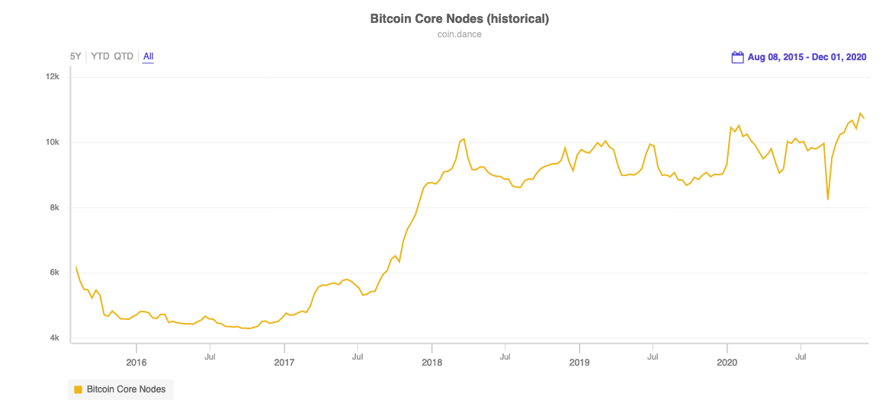
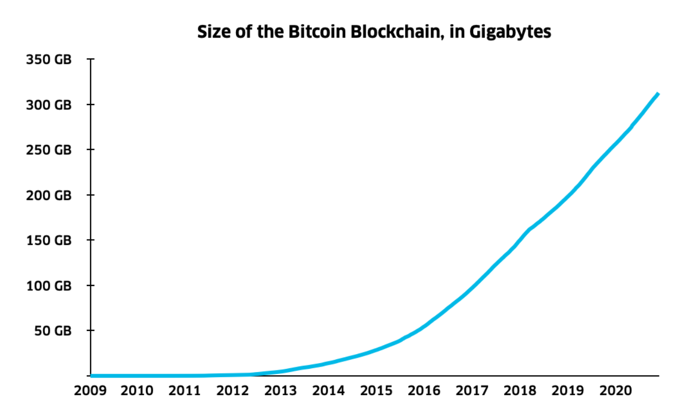
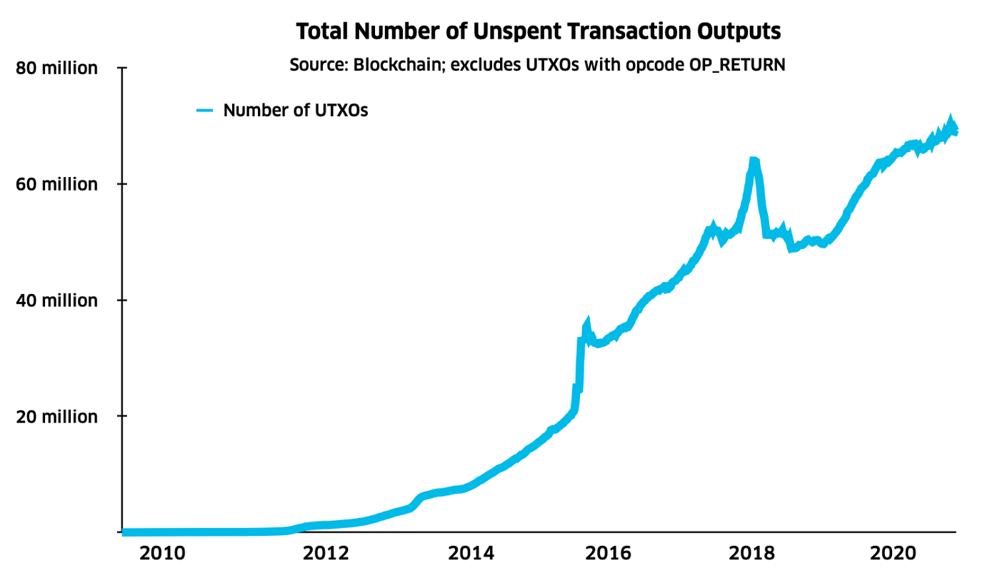
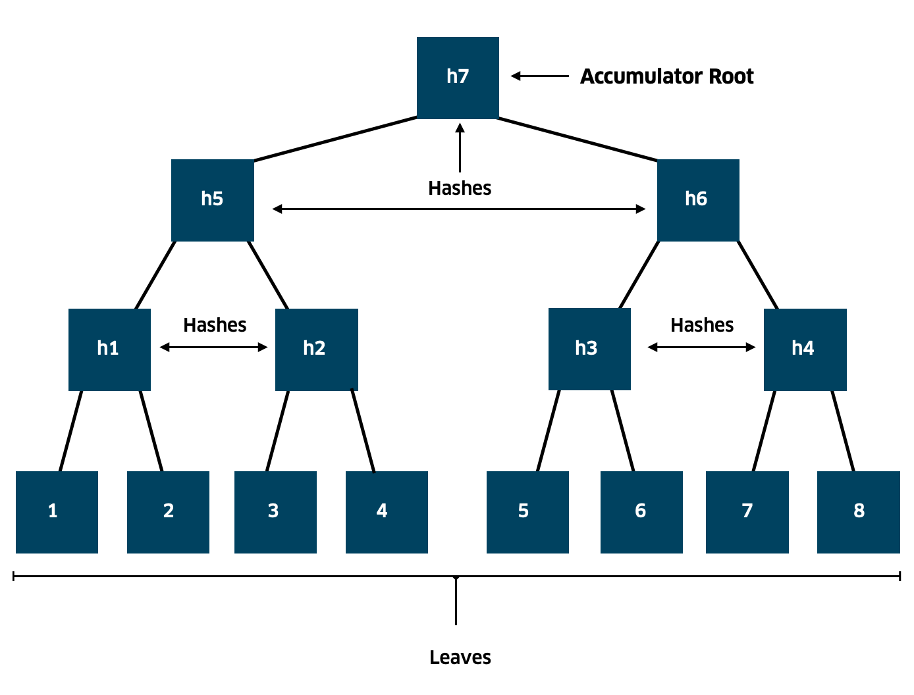
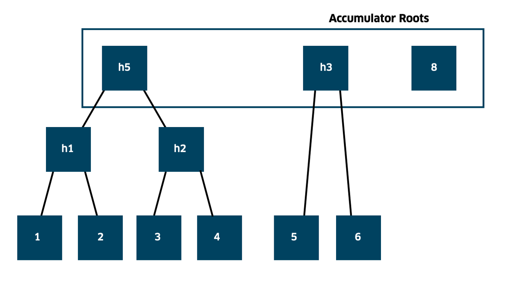
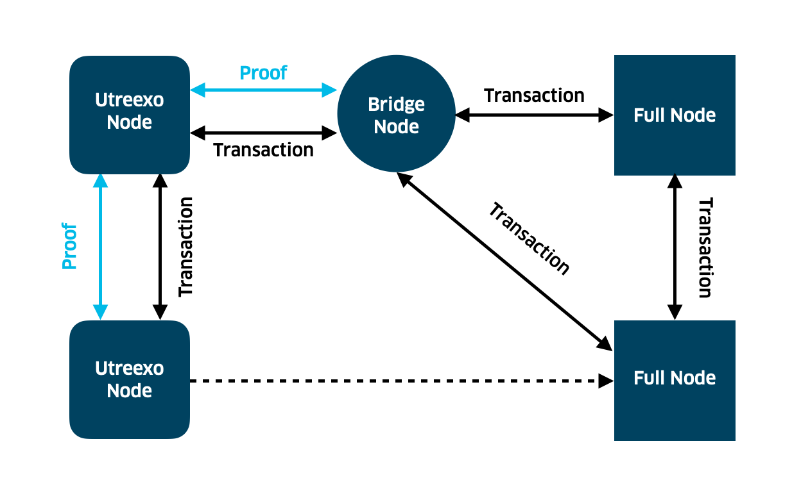

> *作者：Interdax*
> 
> *来源：<https://medium.com/interdax/utreexo-compressing-fully-validating-bitcoin-nodes-4174d95e0626>*

- 图片来自 <a href="https://unsplash.com/s/photos/tree?utm_source=unsplash&utm_medium=referral&utm_content=creditCopyText">Unsplash</a>，作者 <a href="https://unsplash.com/@brandgreen?utm_source=unsplash&utm_medium=referral&utm_content=creditCopyText">Brandon Green</a>  -

随着比特币的价格又一次接近历史最高点，许多新的参与者也将开始尝试加入比特币网络。虽然已经有数以百万计的实体在使用比特币，持续运营的全节点比你想象的要少得多。理想情况下，每个人都应该运行自己的节点，以保护网络的安全性和个人的隐私性。

图 1 显示了，[Bitcoin Core](https://bitcoin.org/en/bitcoin-core/) 节点的数量才刚刚超过 2017 年底的高峰，并在近期有所停滞。随着比特币的价格继续创出新高、为另一轮牛市奠定基础，我们当然也希望看到节点数量的增加。

- 图 1. Bitcoin Core 节点数量的历史记录 -

但要运行你自己的比特币节点，你需要下载从比特币的[创世区块](https://en.bitcoin.it/wiki/Genesis_block)（历史上第一个区块）到现在的全部历史交易、验证所有的 交易/签名，并存储所有区块。这个过程就是所谓的 “初次区块同步”。

因为每一笔链上交易都是永久嵌入比特币区块链的，所以初次区块同步可能要花去好多天，甚至更久，就看你用的硬件是什么性能了。而且，整个区块链的体积超过了 300 GB（而且总会继续增长），搭建一个节点对于全球大部分人口来说都是一个严峻的挑战。

区块链的整体体积包括了完整的交易历史（会永远增长下去）以及资金的当前状态（也叫 “[UTXO](https://en.bitcoin.it/wiki/UTXO) 集”）。如图 2 所示，整个账本的体积从 2015 年的不到 50 GB 增长到 2020 年的超过 300 GB。

- 图 2. 比特币区块链的整体体积（数据来源：<a href="https://www.blockchain.com/charts/blocks-size">Blockchain.com</a>） -

历史交易数据构成了区块链数据的绝大部分，虽然链状态（也就是上文说的“UTXO” 集合）当前只有约 4 GB。但是，追踪链状态可能会比保存交易的历史数据更难。

如图 3 所示，在比特币迎来接受度的增长是，[UTXO](https://en.bitcoin.it/wiki/UTXO) 的数量总会快速增加。因为更多个人和组织使用比特币，他们都要使用至少一个 UTXO，所以管理和存储这些数据的能力会变得越来越重要。

- 图 3. 比特币 UTXO 的数量（来源：<a href="https://www.blockchain.com/charts/utxo-count">Blockchain.com</a>） -

**剪枝节点**可以在一定程度上解决区块链体积不断增长的问题 —— 它只会存储最近的一些区块。但如果每个节点都变成了剪枝节点，区块链的历史就将永远丢失，而新节点就无法加入网络了。

除了剪枝节点，还有**全节点**和**轻节点**：

全节点：最安全的加入比特币网络的方式，在初次区块同步之后会独立地验证 每一笔交易/每一个区块。全节点也可以帮助更启动的节点加入网络、保持网络的安全和去中心化。但正如上文所说，全节点的存储要求和计算成本是非常高的。

轻节点：也叫 “简易支付验证（[SPV](https://en.bitcoinwiki.org/wiki/Simplified_Payment_Verification)）节点”，是最经济的参与网络的方式。SPV 节点只下载和存储区块头（区块的元信息）。并不验证 签名/交易，依赖于全节点来获知某个输入是否存在；假设矿工是诚实的；难以抵御几种[安全](https://breaking-bitcoin.com/slides/SPVSecurity.pdf)和[隐私性](https://eprint.iacr.org/2014/763.pdf)攻击。

对于全节点来说，要求最高的一个任务莫过于验证交易，这会涉及到几个检查：该交易所使用的 UTXO 是否存在？交易的签名是否正确？为了验证区块链，全节点要投入许多的硬盘空间来追踪当前可以花费的资金（即 UTXO 集）。如图 3 所示，当前有超过 6000 万个 UTXO，而且这个数字还会随着比特币采用率的上升而增加。

没有办法能孤立地导出 UTXO 集数据，因为你将不知如何验证这些导出的数据的真假，相反，你只能分享具体的区块和具体的历史。因为 UTXO 集会逐渐增长，全节点（甚至剪枝节点）的存储需求也会越来越高。因此，我们需要有一种节点，既能以紧凑的方式完全下载和验证区块链的状态、降低存储区块链所带来的负担，又不会影响安全性和去中心化。Utreexo 就是这样的方案。

## Utreexo：用几千字节运行一个全节点

Utreexo 的目标是解决比特币节点日益增长的存储需求，又不牺牲去中心化。它就像全节点一样安全，但只需存储几千字节的数据，而且机械硬盘和固态硬盘的同步时间将趋同。

本质上，Utreexo 处理状态（UTXO 集）的方式与剪枝节点处理区块链历史的方式如出一辙：它会先遍历整个状态然后丢掉不需要的数据。通过修剪 UTXO 集，你不必跟踪所有人的 UTXO，可以只跟踪自己的 UTXO。这也消除了使用数据库来存储连数据的需要，因为你不再需要在本地硬盘中检索 UTXO（这正是数据库的用场）。

除了解放存储空间，它还有额外的好处：使共识不必依赖于 [Google 的 levelDB 数据库实现](https://github.com/google/leveldb)，从而加强比特币网络的安全性。当前，比特币的共识依赖于 levelDB 的正确工作，因为我们需要这个数据来检索存储好的交易。

Utreexo [最初的论文](https://eprint.iacr.org/2019/611.pdf)出版于 2019 年 6 月 3 日，作者是 Tadge Dryja，是 [MIT Digital Currency Initiative](https://dci.mit.edu/) 的研究员，也是[闪电网络](https://lightning.network/)白皮书的联合作者。在 2020 年 6 月，Utreexo 的演示表明，这种轻量节点的思想已经成为[可用的代码](https://github.com/mit-dci/utreexo)。Utreexo 项目的其他贡献者包括：Calvin Kim、Janus Troelsen 和 Niklas Goggë。

Utreexo 可以认为是一种全节点，因为它是完全验证的，但它不存储系统的完整状态。Utreexo 只保存自己的币存在的证明，并为所有其他人的 UTXO 保存一个哈希值，这是非常少量的数据。当某人希望花费自己的钱时，他必须证明自己的币也在这个哈希值（所指向的数据）中。Utreexo 的内核其实是一种叫做 “基于哈希函数的累加器” 的密码学工具。

## 给 UTXO 生成默克尔树

基于哈希函数的累加器所做的是，就是给 UTXO 生成一棵 “[默克尔树](https://en.wikipedia.org/wiki/Merkle_tree)”。不使用数据库来跟踪状态，Utreexo 把整个 UTXO 集默克尔化，然后保留一个默克尔树根值。UTXO 可以加入到这个累加器中，我们也可以证明某个 UTXO 是这个默克尔树（UTXO 集）的一部分。我们还可以验证这样的证明、从集合中删去一些数据。

当 Utreexo 节点要验证一笔交易的时候，该交易的发起人可以提供一个默克尔证据，来证明 TA 的币是在默克尔根值（所指向的 UTXO 集合）中的。然后 Utreexo 节点就验证这些币是否存在。如果存在，则证明交易有效，然后 Utreexo 节点就从树上删去它们，并将交易为接收者创建的新 UTXO 作为新的叶子加入到默克尔树中。这个叶子会被哈希，与所有其它 UTXO 一起，形成新的默克尔树和默克尔根值。

下面是一个有 8 个叶子（或者说 UTXO）的默克尔树的简单例子。数字 1 ~ 8 分别代表一个 UTXO，而 h1 ~ h7 代表哈希值。Utreexo 只会保存 h7（累加器的根值）并在验证之后抛弃所有其它哈希值。

- 图 4. UTXO 的默克尔化。这是一棵有 8 个叶子节点的默克尔树。每一个 UTXO 都算出哈希值。这些哈希值再两两拼接并算出新一个哈希值。如此层层哈希，知道最终剩下一个累加器的根。这个累加器的根（以及钱包信息）是 Utreexo 唯一存储的数据。因此，其存储的所有数据也不过几千字节。 -

假设一个用户要花费 7 号 UTXO。TA 需要证明这个 UTXO 存在：TA 提供 7 号叶子和 8 号叶子，h3 和 h5。验证的节点会使用这些数据创建出一棵单独的树，然后计算树根值。如果这个根值等于 h7，也即 Utreexo 节点存储的累加器根，则说明这个 UTXO #7 是存在的。

现在，假设 7 号叶子从图 4 的默克尔树上删去了，我们会得到一个默克尔树的森林，有三个默克尔根值会被累加器存储（如图 5 所示）：

- 图 5. 默克尔树的森林。7 号元素从树上删除，默克尔树成了一片森林。三个根值都会存储下来。 -

（译者注：Utreexo 对 UTXO 集的表示不是单一的一棵默克尔树，而是二叉默克尔树所构成的森林；这是为了适应 UTXO 会被删除的特点。其基本操作是这样的：每当添加一个元素（叶子），该叶子要么自成一棵树，要么加入另一棵单叶子的树，形成两层的默克尔树；这样的合并操作会一直持续，直至无法再合并；每当删除一个叶子时，该叶子所在的树也沿着该叶子的默克尔路径分裂，并导致树高降低。这样的操作使得森林中的每一棵树都是 “完美的树”，即叶子数量为 2 的幂的树；同时，在删除一个叶子时，为该叶子提供的存在性证据，就是删除叶子之后节点所需存储的树根；同时，因为邻居被删除而孤立成树的叶子，也可以在新叶子加入后重新跟原来的表亲合并，这些表亲所在的子树不必重新计算。详见这个视频：https://www.youtube.com/watch?time_continue=8731&v=oLVflcMzj_c&embeds_euri=https%3A%2F%2Fdci.mit.edu%2F&feature=emb_logo ）

在实践中，有超过 6000 个 UTXO，它们会形成一个默克尔树的森林，在新区块产生时随着 UTXO 的 创建/花费 而 增加/删除 叶子，但这些都可以通过计算机非常高效地计算出来。

## Utreexo 能带来哪些好处？

在一个比特币全节点中，所有现存的 UTXO 都要存储在大约 4 GB 的空间中。而有了 Utreexo，存储需求从  GB 级别降低到了 KB 级别，因为你可以只存储 UTXO 的根值。一个好处是，初次区块同步只需在内存里发生，因为 Utreexo 的状态在 KB 级别，在同步过程中不需要查询硬盘。

Utreexo 的另一个优点是，其状态数据小到可以放进一个二维码中。因此，你可以先在电脑上同步出一个全节点，然后把整个状态复制到一台手机中。这样，手机就不用花好几天来下载整条区块链，只需扫描二维码就可以让你的手机实现同步。

最后，与其它的累加器构造（比如 Boneh 等人提议的 [RSA 累加器](https://eprint.iacr.org/2018/1188.pdf)）相比，它不需要软分叉。

## 让 Utreexo 落地：桥节点

现在，我们已经知道了如何让 UTXO 形成一棵默克尔树，这棵默克尔树如何让花费者能够提供证明并减低完全验证节点的存储负担。但是，要让 Utreexo 能运行，它还必须有能力验证那些未提交任何从默克尔树森林推导出的证据的交易（即：像现在的全节点一样验证交易）。

因为用户可以选择，即使 Utreexo 节点可以连接到比特币主网了，大部分交易也不会提供任何 Utreexo 所需的证明。用户可以选择的好处在于这项升级无需软分叉，但是，这也意味着我们需要一种桥节点来为每一个 UTXO 保存一个证据（并向 Utreexo 节点提供），以保证 Utreexo 节点可以验证所有交易，无论交易的发起者是否提供了所需的证监局。

桥节点要做的就是存储完整的默克尔树森林以及所有的证据。它们可以即时为所有需要证据的节点提供任何所需的证据。不过，要让 Utreexo 节点可以运行，只需少数的桥节点。图 6 显示了桥节点是如何工作的：

- 图 6. 桥节点对其它全节点来说是全节点，但对其它 Utreexo 节点来说则是 Utreexo 节点。通过为旧网络中的交易提供证据，桥节点让 Utreexo 节点可以验证所有的交易，无论自己一开始是否收到了证据。 -

桥节点可以提供在一笔交易中花费的 UTXO 所对应的默克尔树叶子，为使用基于哈希的累加器的新型节点传输旧的网络中的常规交易。通过与全节点通信，桥节点可以存储完整的默克尔树森林，使得 Utreexo 节点可以在收到新区块时更新自己的累加器根值。

桥节点没法搞欺诈，如果它提供了错误的证据，哈希的匹配会出错。因为它们必须存储每一笔交易的证据，其存储负担会比全节点更大，甚至可能是当时区块链体积的两倍（比如从现下来看可能是 600 GB）。不过，可以通过缓存和聚合证据来优化。

默克尔树的绝大部分都不会经常改变，因为许多 UTXO 的寿命都是非常短暂的（大约有 40% 的 UTXO 的寿命会小于 20 个区块）。移除休眠的 UTXO，比特币的可扩展性和同步速度都可以提升。

因此，不常改变的树的部分可以缓存下来，而经常改变的树的部分只需有记录即可。用来缓存这些证据的内存越多，需要下载的证据就越少。只要有几百 MB 的缓存，需要下载的数据量就可以极大地减少了。

## Utreexo 的现状

当前，Utreexo 的代码已经在 btcd 节点软件中实现了，但还有优化和清除 bug 的工作。开发者最终将在 Bitcoin core 软件（最流行的节点软件）中实现它，以便用户可以用极低的存储开销在更老旧的设备上运行它。

不过，要指出的是，Utreexo 实际上也是以带宽换存储，即带宽要求更高而存储要求更低，这就意味着它只对网速较快而存储吃紧的用户有价值。在使用 Utreexo 做初次区块同步时，它需要多 20 % 的带宽来下载证明，而桥节点也需要额外的空间来存储证据。

Utreexo 的许诺是通过极大地降低存储负担来让全节点变得更容易运行。但是，它还没有任何经济激励，所以降低存储负担能不能让更多用户来运行自己的节点，还是一个开放问题。但通过减少搭建和运行节点的负担，Utreexo 有望激励更多人以免信任的方式使用比特币，让整个网络更加区去中心化和强壮。

（完）

