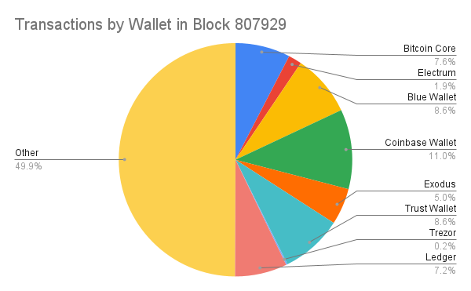

> *作者：Ishaana Misra*
> 
> *来源：<https://ishaana.com/blog/wallet_fingerprinting/>*

这个夏天，我一直在识别比特币交易的 “指纹”，并自动化这个侦测过程。实现了几个启发式分析之后，我能够猜测出 50% 的近期出现的交易最初是用哪个钱包 软件/硬件 来发起的。所谓 “钱包指纹”，是指广播出来的比特币交易的一些表象，它可以帮助识别用来创建这笔交易的钱包 软件/硬件。而识别出创建一笔交易的钱包 软件/硬件，可能最终会导致获知该交易创建者的隐私信息。比如说，如果某人使用的是 Trezor 签名器，那么，该人相比只是使用 “热钱包” 的人更有可能拥有大量比特币，从而是一个更吸引人的攻击目标。

比特币的 “准匿名性（pseudo-anonymity）”，很大程度上意味着，敌手无法了解到关于这笔交易的主人的额外信息，而只能知道他们的公钥。但是，钱包指纹的存在，打破了这种隐私性。在本文中，我辨识了多种钱包软件的多项特征，并且使用它们来证明钱包指纹识别可以有效实现的程度。一旦钱包指纹被识别出来，自动化其侦测就是小事一桩，而且很容易收集到这样的信息：

## 背景

### 有效钱包指纹识别的结果

通过观察一个用户使用的钱包软件，你能了解到很多信息。比如说，如果某人正在使用 `Bitcoin Core`，TA 更有可能对比特币有更深的了解（相比于只是使用带有更少特性的主流钱包软件的其他人）。此外，如果某人使用的是一个硬件签名器，就暗示了此人可能拥有更多比特币（相比只是使用手机钱包软件的人）。此外，任何给你发送比特币的人（比如你的雇主或客户），都能了解到这些信息；你要给 TA 发送比特币的人，也都能知道。如果一个攻击者能够识别出你正在使用的钱包，那么确定你是不是一个适合下手的目标、爆破该软件已知的漏洞，就变得容易很多；这绝非只存在于理论之中（on a practical level）。

当交易很容易被识别出指纹时，还会给隐私措施带来问题。比如，有时候，用户会在一笔 coinjoin 交易的两边（译者注：应指在创建该 coinjoin 交易和花费该 coinjoin 交易的输出时）使用相同的钱包软件。那么，如果一笔 coinjoin 交易的某一个输入使用了某款软件的某一个具体版本，而该交易的某一个输入也使用了完全相同的软件，那就表明，该输入和该输出属于同一个用户。这不仅让 coinjoin 对他们自己失效，还降低了参与同一笔 coinjoin 交易的其他用户的机密性。因为知道某人在使用某款钱包是一种隐私泄露，这让其它隐私保护技术在总体上的效果也变差了。

### 钱包指纹的类型

我已经分辨除了多种指纹，将它们组合起来就能识别出创建给定一笔交易的钱包。我将这些指纹分成四种主要类型：独立型、概率型、依赖型和暂时型。这些群组的边界并不是完全清晰的，而且来自一些群组的指纹可以显现出另一个群组的一些特征。这些群组也展示了识别一笔交易的一个指纹有多困难，以及在辨识创建它的钱包时，该指纹应被赋予多少权重。

“独立型指纹” 可以在交易的表象中直接看到，而且独立于交易的其它表象。这是最容易侦测到的指纹类型。这些指纹总体上比较简单，包括：交易的版本号、发送中的输出的类型。

至于 “概率型指纹”，几乎每一款钱包都会偶然产生显示出这种指纹的交易。一笔交易表现出的特定动作越多，我们就越确信，制作这些交易的钱包是有意为之的。一个有用的例子是交易的输入和输出的排序。一些钱包会按照 BIP-69，以字典顺序为输入排序、 按金额由小到大为输出排序。虽然实现了 BIP-69 的钱包总会这样排序输入和输出然后创建交易，但没有实现 BIP-69 的钱包也偶尔会符合这种规则。

“依赖型指纹” 依赖于其它基于启发式分析的信息已经被正确推理出，比如，能够正确低侦测出找零输出。使用少量的[简单启发式分析](https://en.bitcoin.it/wiki/Privacy#Change_address_detection)，确定找零输出可能非常容易，但依然有可能猜测错误，所以，通常，这种指纹识别手段不会给人那么强的信息。

最少见的指纹是 “临时型指纹”。它们要么需要交易池数据才能侦测出来，要么需要考虑特定交易的区块高度。这让它们更难识别。临时型指纹通常来说跟一些 手续费追加方法 以及/或者 未确认的输入 有关。

### 以往的钱包指纹识别研究

钱包指纹识别在比特币社区中并不是一个无人问津的概念。对它的讨论通常是理论上的，也通常被认为是应该避免的事情。到目前为止，已经完成的指纹识别研究，通常关注仅仅一个指纹，或者只涉及少量钱包软件。这样的例子包括 achow101 的《[Bitcoin Core 和 Electrum 指纹清单](https://github.com/achow101/wallet-fingerprinting/blob/main/fingerprints.md)》以及 0xb10c 的《[使用费率来识别 blockchain.com 上的交易](https://b10c.me/observations/03-blockchaincom-recommendations/)》。在本文中，我志在得出对钱包指纹识别技术及其可应用程度的更广泛理解。

## 方法论

### 假设

因为识别所有可用钱包软件的所有版本是不可行的，所以，在查看下列方法论和结果时，有一些事项需要注意。首先，当我点名某一款钱包时，我仅仅指的是我列出的那一个版本。这些指纹在该软件的其它版本也可能存在，但我并未去验证。其次，哪怕是我说的版本，如果并非以默认设置运行，可能也不会出现指纹。最后，也许还有许多我没有观察到的钱包软件，也带有我这里观察到的相同指纹，所以，这里讨论的任何一种指纹组合，都不应理解成专属于某一款钱包软件。

### 观察多款钱包软件

为了代表不同类型的比特币软件，我决定研究八款钱包软件，它们的安全模式和目标用户都有所不同：

- Bitcoin Core (v. 25.0)
- Electrum (v. 4.4.5)
- Blue Wallet (v. 6.4.6 iOS)
- Exodus (v. 23.7.2 iOS)
- Trust Wallet (v. 9. 0 iOS)
- Coinbase Wallet (v. 28.53 iOS)
- Trezor Suite (v. 23.7.2)
- Ledger Live (v. 2.64.2)

### 识别指纹

**观察软件实现**

我研究的大部分钱包都是开源的（Bitcoin Core、Electrum、Blue Wallet、Trezor、Ledger）。这使我不仅能够观察代码并从中确定指纹，还能回溯代码拉取请求（PR）和问题报告（Issue），以了解已经被解决的指纹和被报告和讨论的指纹。不过，要遍历这五种开源钱包的代码和 GitHub 代码库历史需要花太多太多时间。我会将代码库作为备份，用于确认我观察到的指纹，并检查是否有人已经报告了它们。

一个更快的发现指纹的办法是浏览钱包软件的界面和选项，以及使用它来创建一些交易。

**浏览钱包界面**

许多简单的指纹，都只需观察钱包软件所提供的选项就可以识别出来。包括：可以花费的地址类型、是否允许同时花费多种输出类型、单笔交易是否可以发送给多于 1 个收款方。

**创建交易**

在寻找指纹时，并不是所有交易都一样有用。为寻找指纹而创建的交易应该包含尽可能多的信息。比如说，一笔只有一个输入和一个输出交易就没法告诉我们太多东西；它既不能告诉我们这款钱包软件的通常找零输出索引（译者注：应指找零输出在输出序列中的位置），也不能告诉我们它如何给输入和输出排序，更不能告诉我们它是否会复用输入地址作为找零地址，等等。

有了这些背景知识之后，我使用这些钱包创建了许多笔交易，然后从中寻找指纹。最终，我为更难以找出指纹的钱包创建了更多的交易（详见 “附录 B ”）。在创建了第一笔交易之后，我就开始寻找独立型指纹。然后，我开始寻找所有可以识别出来的模式，比如跟输入排序和找零索引。然后，我创建更多的交易，以尝试在该钱包所创建的所有交易中确认或证否这些模式。找出这些指纹之后，我再编写 Python 程序来验证它们。

## 结果

### 发现

这里是我的研究结果，它是格钱包软件的可能指纹的表格。关于每一个指纹的完整解释，可以在 “附录 A ” 找到。

以下是我认为尤为值得注意的东西：

- `Ledger` 钱包软件在执行 “钱币挑选” 流程之后，似乎不会混洗这些输入（即改变这些输入的排序）。而 Ledger 钱包软件的默认钱币挑选算法是历史性的（最老的 UTXO 最先花掉）。
- 我用 `Trezor` 钱包软件创建的所有交易都遵循 BIP-69 。
- `Exodus `钱包软件只提供一个地址，而且，会在找零输出中复用这个地址，但如果你进入钱包设置中，有一个选项可以使用多个地址。这真有趣 —— 多个地址居然不是默认配置。
- 总的来说，似乎也保管山寨币的钱包（比如 `Exodus` 钱包和 `Trust` 钱包）就会只使用一个地址。可能是因为许多山寨币的钱包实现都这样做（在一个钱包中只包含一个地址）。
- 简单的指纹也可以是非常有用的。比如，支持花费多种 UTXO 类型以及支付给多个收款人，是很容易侦测出来的，但在不同钱包软件中差别非常大。`Bitcoin Core` 是少数允许花费多种 UTXO 类型以及发送到超过两个输出中的钱包软件。`Ledger` 则相反，这两种选项都不允许。

### 自动化对交易指纹的侦测

使用上面发现的指纹，剩下的事情就简单了 —— 编写一系列的函数来：（A）侦测交易中的指纹；（B）通过这些指纹的 存在 或 缺失 来 排除 或者 证实 可能创建这笔交易的钱包；（C）对一大群交易作广泛的调查，比如一个区块中的所有交易，或者某一瞬间交易池中的所有交易。我成功用 Pyhton 编程语言编写了这些函数，可以在这个 GitHub [代码库](https://github.com/ishaanam/wallet-fingerprinting)中找到。它们可以本地运行（详见代码库中的指令），也可以在 [Google Colab](https://colab.research.google.com/drive/1hWVe9U-r5np_QiGNtM6qaapXq8YwQ1FX?usp=sharing) 上运行。

交易和区块是使用 [Bitcoin Core](https://bitcoincore.org/) 或者 [Mempool Space REST API](https://mempool.space/docs/api/rest) 拉取得到的。一部分函数会取得一笔解序列化的交易、检查是否存在一个或多个指纹（比如说，很容易一次性检查输出的类型和排序，而不必分别检查）。有一个 `detect_wallet(tx_hash)` 函数会使用这些函数来识别指纹，然后使用这些指纹来确定创建这笔交易的钱包。

基于特定指纹的存在来确定可能的创建者，这似乎比较符合直觉。但是，因为概率型指纹的存在 —— 即使一款钱包软件并不会有意产生某种指纹，这种指纹在其创建的交易中依然有可能存在 —— 基于指纹的缺失来排除可能的创建者，实际上是更加高效的。比如说，如果一笔交易实施了 “抵抗手续费狙击”（这是一种独立型指纹），但并不遵循 BIP-69（这是一种概率性指纹），那就有可能是由 `Bitcoin Core` 创建的。可能性可以通过指纹的缺失来排除。如果只剩一种可能性，那就有可能是这款钱包软件创建了这笔交易。如果没有剩下任何可能性，那就意味着这笔交易可能不是由上述八款之一创建的。如果还剩下多种可能性，则表明没有足够的信息来确定创建者。

`detect_wallet` 函数可以应用于一个区块中的所有交易，产生出下面这样的结果，它提供了多少交易可能由某一种钱包创建的细分数据。

注意，“ Other ” 的数据表示不可能由上述八款钱包创建的交易的数量 —— 因为它们拥有完全不同的指纹组合。而 “Unclear” 的数据表明可能由上述八款中的某几款创建、没有足够多的信息来进一步排除可能性的交易的数量。

## 结论

关于钱包指纹识别技术，还有许多方面可以进一步研究。有时候，一笔交易中出现的指纹不足以使我们有把握地认定创建它的钱包。为了发现更多的指纹，钱包聚类算法可以用来发现属于同一个钱包的其它地址。这是有用的，因为所有相关的交易都可以用来搜索指纹。拥有多笔相关的交易，在侦测概率型指纹上尤其有用，因为积累了特定动作的更多案例。总的来说，去匿名化技术，越是集团作战，就越是高效。

没有显然的方案可以解决这里讨论的问题。虽然一些指纹很容易消除，但很难完全消除指纹。这仅仅是因为，我们把一个东西当作指纹，并不天然意味着钱包软件不应该这么实现。比如说，如果一款钱包所创建的所有交易都有特定的输入排序或者找零索引，那当然应该改变；但是，抵抗手续费狙击和允许花费 taproot UTXO 这样的特性，则依然应该保留。

## 致谢

感谢 Clara Shikhelman 和 Mark Erhardt 跟我讨论这个项目以及审核我的工作。感谢 Andrew Chow 给了我一些备用的硬件签名器来寻找指纹。任何错误和观点，都仅属于我自己。

## 附录A

### 独立型指纹

- [**抵抗手续费狙击**](https://bitcoinops.org/en/topics/fee-sniping/)：一种反激励区块链重组的机制；包括将交易的 `nLockTime`（生效时间）设置为当前的区块高度，从而该区块无法被更早的区块挖掘，尝试通过重组区块链、在历史高度重新挖出区块（通过打包后来才出现的高手续费交易）来夺取手续费的矿工自然就无利可图。将交易锁定到即将到来的区块保证了这些手续费只能被挖出下一个区块（乃至以后的区块）的矿工得到。
- **输入的类型**：一些钱包软件只创建特定类型的地址。

  - **多种类型的输入**：一些钱包软件允许在一笔交易中花费多种类型的输入。
- **输出类型**：一些钱包软件只支持发送到特性类型的 地址/脚本公钥 。
- **输出的数量**：某些钱包软件（在一笔花费交易中）只支持发送给一个收款方（外加一个找零）。一些钱包软件可尝试创建无找零的交易。
- **可选的 RBF 信号**：某些钱包软件默认创建带有可选 RBF 信号的交易；有一些则并非默认如此，但提供了选项。
- **压缩的/未压缩的 ECDSA 公钥**：未压缩的 ECDSA 现在在所有输出类型中都是非标准的，但以往，P2PKH 和 P2SH 输出类型是可以使用它们的（详见 Bitcoin Core 的 [#8499](https://github.com/bitcoin/bitcoin/pull/8499) 拉取请求）。这种指纹在老旧交易上更加有用。
- **交易版本化**：交易的 `nVersion` 字段只有数值 1 和数值 2 是标准的。使用特定的操作码会要求将 `nVersion` 设为 2 。一些钱包软件普遍使用数值 2，而另一些还在使用版本 1 。

### 概率型指纹

- [**BIP 69**](https://github.com/bitcoin/bips/blob/master/bip-0069.mediawiki)：输入和输出的字典排序是由 BIP-69 规定的。虽然这个 BIP 是为了缓解钱包实现中（对输入和输出的排序）的隐私泄露而制定的，但它自身最终也成了一个指纹。如果只有少量钱包实现了一种反指纹措施，那么这种措施自身就会成为一种指纹。这是概率型指纹，因为钱包软件可能意外产生符合字典排序的交易。

- **低 R 研磨**：在 ECDSA 签名中，r 值是秘密 nonce 值得 x 坐标值。一个 低-r 签名就是其 r 值可以用 32 字节（而非 33 字节）来编码的签名。少量钱包实现会一直生成签名，直到产生一个 低-r 签名，这样交易的整体体积会更小，可以节约手续费并简化手续费估计。这也是概率型指纹，因为钱包总是可能无意中生成一笔全部输入都带有低 r 签名的交易。另一方面，高-r 签名可以用来排除所有实现了 “低-r 研磨” 的钱包。

- **输入排序**：输入排序指纹可能是钱包软件在执行[钱币挑选](https://bitcoinops.org/en/topics/coin-selection/)之后不混洗输入的结果。这是概率型指纹，因为它可能像是钱包软件在按特定的方式排序输入，实际上是混洗之后恰好得到这样的结果。常见的情形有：

  - 小额 UTXO 优先（按 UTXO 的价值）
  - 大额 UTXO 优先（按 UTXO 的价值）
  - 老 UTXO 优先（按 UTXO 的产生时间）

- **手动输入 手续费/费率**：这种指纹的一些信号包括：

  - 随机的美元数额

  - 随机的聪数额

    这是概率型指纹，因为软件的费率建议也可产生随机的美元或聪数额。

### 依赖型指纹

- **找零输出在输出序列中的位置**：某些钱包总是让找零处在交易输出中的特定位置（通常是第一个或者最后一个）。其它钱包则会让随机化找零的索引。
- **找零输出类型**：
  - 找零的类型是否跟其中一个输出的类型一致？
  - 反过来，找零的类型是否跟其中一个输入的类型一致？

### 临时型指纹

- **花费未确认的输出**：
  - 是否曾经花费过未确认的找零输出？
  - 所有类型的未确认输出都被花费过吗？
- **提交替代交易**：这跟前面说的 “直接开启选择性 RBF ” 不应混淆。这里说的是用户为开启了选择性 RBF 的交易实际提交一笔替代交易。有一些钱包在创建交易时会开启选择性 RBF ，但实际上并不允许为自己的交易追加手续费。 
- **费率建议**：钱包软件是否使用了手续费建议？如果有，这些建议是从哪里获得的？如果一笔交易的手续费跟特定钱包的手续费建议相同、并且该手续费建议一定程度上是独一无二的，那就暗示着该交易是使用这个钱包软件创建的。

## 附录 B

以下是表明存在上述部分指纹的交易。

Blue Wallet:

2fd284ed739a59ac6d6bd7f94fa2a244dd0cf88981551272b96708aebf260a57

702903c9818ac7847c9a2d9f948c9ee1ab25236821836170ef6919cd12c9e04c

1bf659e17568e48d6f47bb5470bc8df567cfe89d79c6e38cafbe798f43d5da22

Electrum:

5d857401648a667303cde43295bce1326e6329353eac3dddf15b151e701405e7

Trezor:

C1ba2810ac35c2d17503792ee728a3df9c41c658f5442d9326eb69580bcb7dd6

bc8c701594207360a409d64a9c797a46dd11a2d468948e8bb98e865249ca17e3

999b46e55df4e57a2a8ba0de28ae9547ce9bf2dbc8cceaddf0fb13a7af8923e7

Ledger:

C1094c70a9b23ca5d755234cffefca69f639d7a938f745dfd1190cc9c9d8b5ad

1c2dbae13f1762aae0b427107babfb013849c6e3262bb302b264ef4f93f76e3d

b2863a85081cd113094d50878153fab5c3160999e5fd2e044782b851c4dc72e1

Ffa8a398325ec1a4e39ca5dea0383bbdc2b01528c5ceb215e821d41d435b5d09

Exodus:

6f8c37db6ed88bfd0fd483963ebf06c5557326f8d2a3617af5ceba878442e1ad

Coinbase Wallet:

Bd4a846c05c37029caf7f6cef453112eef362ca511bd6a52f9082d85b7b2f207

60849af6e56c2ad0facd601cc5014398210898a7e6d5b9280b54f6395349663a

9aa3a7086730aadc3fc0a7494b6f8fb27e6a862e707917af96662d145950dbd6

96beaefd8df5b25d95e4fbc1fd3c5949f9a61f59d763629fa768b555426e90c8

Trust:

43f901163b8c27567d365f56bb804bd74904bd78d58017905f3c36cac971d9b6

