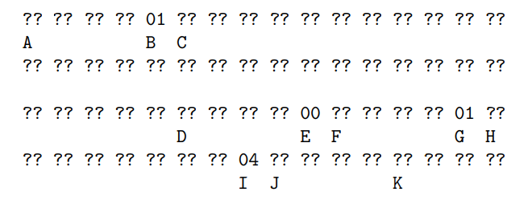
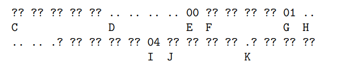

> *作者：Suhas Daftuar*
>
> *来源：<https://lists.linuxfoundation.org/pipermail/bitcoin-dev/attachments/20190225/a27d8837/attachment-0001.pdf>*
>
> *原文出版于 2019 年 2 月。*

## 摘要

比特币的区块头中包含了一个对该块所确认的交易集合的承诺，这是用交易的 id（交易的连续两次 SHA256 计算的哈希值）构造出一棵默克尔树、然后在区块头中包含树根，来实现的。相应地，凭借它，我们可以向一个比特币轻客户端证明某一笔交易被某一个区块确认，办法是提供从树根到交易的默克尔路径。然而，这其中的默克尔树的特殊构造，有几种安全性上的弱点，包括至少两种会影响 Bitcoin Core 共识逻辑的区块熔融性漏洞，以及一种对轻客户端的攻击（一笔无效的交易可以被 “证明” 出现在了某个区块中），比起找出连续两次 SHA256 哈希运算的碰撞，只需少得多的工作量。

## 致谢

许多人都在 bitcoin-dev 邮件组中报告过本总结中描述的部分问题，包括 Sergio Lerner 和 Peter Todd 。本总结基于笔者与 Johnson Law 和 Greg Maxwell 的私人 IRC 讨论。我认为，第三章中讨论的部分观察最初来自 Luke Dashjr 。

## 1 背景

### 1.1 默克尔根的构造

回顾一下，Bitcoin 所用的默克尔根构造从对每一笔交易 <sup><a href="#note1" id="jump-1">[1]</a></sup> 作连续两次 SHA256 运算（double-SHA256）、得出哈希值 $H$ 作为树上的叶子开始。对每一对连续的叶子，我们拼接叶子、并对叶子作连续两次 SHA256 哈希运算，以结果哈希值作为这对叶子的父节点。重要的是，如果树上某一层的节点是奇数个，那么最后一个元素会先被复制，所以，其父节点会是该元素复制自身、相互拼接后的哈希值。举个例子，如果一个区块内有三笔交易，那么默克尔树就会长这样：



这里，Node1 是用 `H(H(Tx1)||H(Tx2))` 计算出来的，而 Node2 是用 `H(H(Tx3)||H(Tx3))` 计算出来的。最后，默克尔根是用 `H(Node1||Node2)` 计算出来的，并且这个默克尔根会出现在区块头中。

如果一个区块只有一笔交易，那么默克尔根就会是这一笔交易的哈希值。注意，每个有效的区块都至少要包含一笔交易。

### 1.2 Bitcoin Core 中的区块有效性

Bitcoin Core 的共识逻辑将区块验证分成几个部分，并跟踪一个区块在所有这些阶段中的有效性。举个例子，在处理一个新的区块头的时候（一般来说会在收到区块之前），区块头会在网络的共识规则下检查有效性。稍后，区块到达的时候，区块也会分阶段处理，先运行无语境（context-free）的检查（不依赖于任何其它区块和区块头），然后是依赖于该区块所在区块头链的检查，最后是对交易及它们的签名的检查、该区块是否属于最多工作量的区块头链的检查。

每一个存储好的区块头都有一个相关的缓存数值，用来跟踪相关的区块已经完成了多少项验证。如果一个区块被发现是无效的，Bitcoin Core 会永久存储该块的无效状态，而且会避免重复处理该块以及该块的后续区块。

在下一章中，我们会讨论围绕这种永久标记无效区块以防止攻击者使用这种优化措施来分裂网络的顾虑。

## 2 复制交易，CVE-2012-2459

这是写在 Bitcoin Core 源代码中的：

```
警告！如果你是为学习密码学 以及/或者 设计一种将要使用默克尔树的新系统，请记住，下面的默克尔树算法有一个跟交易 id 重合相关的严重错误，最终会产生漏洞（CVE-2012-2456）。
原因在于，如果某个时刻，在列表中的哈希值的数量是奇数，则最后一个哈希值会被复制，以计算下一层（这在默克尔树中是不常见的设计）。这导致交易的特定排序会产生相同的默克尔根。举个例子，这两棵树：
      A               A
    /   \          /    \
   B     C        B       C
  / \    |       / \     / \
 D   E   F      D   E   E   F
/ \ / \ / \    / \ / \ / \ / \
1 2 3 4 5 6    1 2 3 4 5 6 5 6

交易列表 [1, 2, 3, 4, 5, 6] 跟 [1, 2, 3, 4, 5, 6, 5, 6]（5 和 6 被重复了）会得出相同的哈希值 A（因为 (F) 和 (F, F) 的哈希值都是 C）。
漏洞在于，你可以发送一个带有重复交易列表的区块，它跟原版区块有相同的默克尔根值、相同的区块哈希值，但却无法通过验证。然而，如果接收节点将这个区块标记为永久无效的，就不再能接收同一区块没有篡改过（因此可能是有效）的版本。我们通过检测这种情形来防止这种误伤：检测在列表末尾哈希两个完全相同的哈希值的行为，并跟具有无效默克尔根的区块采取相同的处理措施。假设没有 double-SHA256 的碰撞，这将检查出所有已知的改变交易而不影响默克尔根的方法。
```

在下一节中，我们会讨论一种新的区块熔融性，是在上述注释撰写之时尚未发现的。

## 3 由默克尔树歧义导致的弱点

Greg Maxwell 已经（在 IRC 私人通信中）指出，一种弱点根源于默克尔树上的 “叶子与节点之间缺乏域分隔”。默克尔树上的非叶子节点是一个 64 字节的输入（其子节点的拼接）的哈希值。同时，叶子节点是一笔交易（不带见证的序列化形式）的哈希值。如果一笔交易的序列化形式（不带见证数据）可以是 64 字节，那么就无法区分叶子节点与非叶子节点，就可能暴露出安全漏洞。

### 3.1 区块熔融性

考虑一个带有 2 笔交易的区块 $B$ 。区块 B 的默克尔根值是这样的：



再想象一个只有 1 笔交易的区块。那么默克尔根会是 `H(Tx1)` 。

假设一个对等节点转发了 $B$ 的区块头，并声称 $B$ 只有一笔交易，而不是两笔交易，而且区块中的交易 $T$ 的序列化形式正是 `H(Tx1)||H(Tx2)` 。如果 T 能够成功反序列化为一笔交易 <sup><a href="#note2" id="jump-2">[2]</a></sup>（并且真的能重新序列化为 `H(Tx1)||H(Tx2)`），那么 $T$ 的哈希值就能跟区块头中的默克尔根值相匹配。如果 T 是无效的，那么收到这种版本的区块 $B$ 的节点就会拒绝这个区块，把它当成无效区块。然而，如果接收节点永久将这个区块哈希值标记为无效的，就再也不能处理也接受真正有效的区块 $B$，即使诚实节点传输过来的是两笔有效的交易。这可以用来让一个节点脱离共识。

这种攻击可以普遍化，在一个带有 $N$ 笔交易的区块中，攻击者声称这个区块实际上有 N/2<sup>k</sup> 笔交易，全部都是 64 字节的 “交易”，它们的哈希值就是原本树上第 k 行的节点。如果这些 64 字节的数值全部都能成功反序列化为交易（因此可以被沟通），那么收到这个区块的节点节点就不应该将这个哈希值永久标为无效的，即使这些 64 字节的交易都是无效的。

**3.1.1 为了制作这样的 2 交易区块，使得默克尔根的原像可以反序列化为一笔交易，需要付出多少工作量？**

交易是这样序列化的：

```
[version][vin][vout][locktime]
```

版本号和锁定时间都是 4 字节长的字段，没有反序列化的要求。而 $vin$（交易输入）和 $vout$（交易输出）是这样序列化的：

```
[|vin|][vin0]...[vinn]
[|vout|][vout0]...[voutn]
```

而 $vin$ 的大小是使用比特币的 “致密体积” 编码的。因为每一个 $vin$ 都包含一个 32 字节的前序交易哈希值，而我们希望创建能够成功反序列化为一笔交易的 64 字节，那么我们可以约束 `|vin|` 为 1，只需要一个字节（`0x01`）就能编码。每一个 $vin_i$ 都由以下字段组成：

```
[hash][index][scriptSig][sequence]
```

其中 `hash` 就是 32 字节的前序交易哈希值，而 `index` 是一个 4 字节长的序列号、索引到由 `hash` 指定的交易的 $vout$ 向量。有效的 coinbase 交易必须是由一个空的前序交易哈希值，而且索引号要设为 `Oxffffffff`，但无效的 coinbase 交易不会受到这些数值的约束。

`scriptsig` 会编码成一个脚本长度加上该脚本的内容，所以会有一个约束：长度必须跟读取的字节数量相匹配。目前，我们可以假设一个空的 $scriptSig$，只长 1 个字节，编码为 `0x00`。

而`sequence` 是一个 4 字节长的字段，没有约束。

$vout$ 数组也会跟长度一起编码，为了让序列化有效，也要遵守这个规则。所以我们也约束 $vout$ 的体积为 1，这会引入多一个固定字节 `0x01`。剩余的 vout 向量会这样序列化：

```
[amount][scriptPubKey]
```

`amount` 是一个 8 字节长的字段，表示数量，而 `scriptPubKey` 跟 `scriptSig` 一样，有一个长度编码，所以至少是 1 字节。

总结以下，一笔可以成功反序列化的 64 字节的交易可以这样构造出来：



A = 版本号（4 字节，无约束）

B = vin 数量（1 字节，有约束）

C = 前序交易 id（32 字节，无约束）

D = 前序输出索引号（4 字节，无约束）

E = 脚本签名（1 字节，有约束）

F = sequece（4 字节，无约束）

G = vout 数量（1 字节，有约束）

H = amount（8 字节，无约束）

I = 脚本公钥的长度（1 字节，有约束）

J = 脚本公钥的剩余部分（4 字节，无约束）

K = locktime（4 字节，无约束）

这里，我们将 $vout_0$ 中的 $scriptPubKey$ 设为总计 5 字节，从而交易是 64 字节长，而且成功的反序列化仅仅约束上述那些字节（长度编码）。但完整地看，我们可以看出，我们只需要 $scriptPubKey$ 和$scriptSig$ 的长度总和为 4 字节。

还要注意，64 个字节中，只有 4 个 字节是被约束的，而它们都出现在不同的半截中。所以，要制作一个默克尔根值的原像可以有效反序列化为 64 字节交易的区块头，只需要搜索 8 个比特，就可以找出一个可用的 coinbase 交易（它会哈希成第一个 32 字节），再加上大约 22 比特的搜索（（1/5）* 2<sup>24</sup>，所以稍小于 22 比特）就可以找出第二笔交易，其哈希值是第二个 32 字节 —— 非常少的计算量。

（译者注：这里的意思是，你需要找出这样一个 64 字节的数值：它本身可以被反序列化为一笔交易；而它的前 32 字节刚好是某个 coinbase 交易的哈希值，而其后 32 字节刚好是另一笔交易的哈希值。也可以说，你要找出 一个 coinbase 交易 + 一个普通交易 的组合，它们的哈希值的拼接，恰好可以反序列化为一笔交易。）

**3.1.2 制作一个其默克尔树的某一行节点全部可以反序列化为有效交易的区块需要多少工作量？**

注意，一个区块的第一笔交易必须是 coinbase 交易，并且，如前所述，这很大程度上约束了代表第一笔交易的前 32 字节：只有 4 个字节的版本号是没有约束的。所以，需要搜索至少 28*8 = 224 比特，才能找出树上给定一行的第一个节点的前一半会跟一笔 coinbase 交易匹配的情形，然后是继续搜索，找出后一半会跟一笔一定程度上有意义的交易相匹配的情形（这会容易很多，只有 16 字节左右是被约束的，所以只需 128 比特的搜索就可以找出一个碰撞）。当然，可以使用默克尔树上的任意一行，但很明显，这在计算上应该是不可行的。

### 3.2 对 SPV（轻）客户端的攻击

SPV 客户端被预期能够接收证明某笔交易出现在某个区块中的证据。这种证据的性质是给客户端提供一条贯通默克尔树的路径，从树根一直到交易。

**沿默克尔树向下**	然而，假设一笔（有效的）64 字节的交易 $T$ 被包含在一个区块中，且其后面 32 字节（比之前 32 字节更少约束）被精心构造过，以至于跟其它假的、无效的交易 F 碰撞。设 $R$ 为默克尔根值，那么我们有：

```
R = H(H(H(...H(T)||H(...)...)
T = [32bytes]||[H(F)]
```

如果这样的交易是可能构造出来的，那么一个节点就可以愚弄一个 SPV 客户端，使之相信 $F$ 在这个区块中 —— 因为他可以提供从默克尔根到 $T$ 的默克尔路径、然后将 $T$ 解释为一个内部节点（而不是叶子节点）。因为一个区块中有多少笔交易，在区块头中是看不出来的，SPV 客户端并不能先知道这个数量，因此，也就无法知道树的正确深度。

**3.2.1 制作一笔有效的 64 字节交易，使得其后 32 字节跟另一笔交易的哈希值相碰撞，需要多少工作量？**

**注意**	Sergio Lerner 已经公开了一项专门的分析，指出可以用 72 比特的搜索实现；Peter Todd 也公开了一项分析，声称只需 60 比特的搜索就可以实现。

从上面的图示，我们可以知道，交易的前 32 字节受到更多的约束，因为它包含的更多是被花费的前序输出，它必须是有效的（否则交易就无效了）。那么，我们关注后 32 字节：



C = 前序交易 id（前序交易 id 剩余的 5 字节，无约束）

D = 前序输出索引号（4 字节，21 比特有约束）

E = scriptSig（1 字节，有约束）

F = sequence（4 字节，如果交易版本号为 1，则无约束）

G = 交易输出的数量（1 字节，有约束）

H = amount（8 字节，约 33 字节是有约束的，见下文）

I = scriptPubKey 的长度（1 字节，有约束）

J = scriptPubKey 的剩余部分（4 字节，无约束）

K = locktime（4 字节，约 29 比特无约束，见下文）

我们可以假设前序交易 id 的剩余比特是没有约束的，因为一旦我们找出一笔候选交易，我们就可以作专门的 40 比特的搜索，找出一个其前序交易 id 的后 5 个比特符合我们要求的输入。类似地，我们可以部分约束前序输出索引号，仅仅要求它不要大于（假设）2048，因为我们可以假设我们有能力创建一个带有 2048 个输出的交易、且合适的输出位置有合适数额的交易。

我们可以假设 $sequence$ 是没有约束的，因为这个字段对版本 1 的交易没有共识上的含义。因为我们假设了交易的前 32 字节是固定的，所以我们假设版本号是 1 。

而 $amount$ 是一个 8 字节的字段。如果攻击者可以获得很多钱，那么就有更多的比特不受约束，因为共识约束是输出的价值要小于或等于输入的价值。然而，因为这种交易的输入资金是任何人都可以花费的（或者任何人都没法花费的），用在这种攻击中的资金可能找不回来（如果攻击者也是一名矿工，则可以尝试通过重新花费同一个区块来找回资金，虽然其他矿工可能孤立这个区块，从而盗取攻击者的手续费和任何人都可以花费的输出）。而且，只要我们资金可能会丢失，我们就必须考虑相同成本可以运行的其他攻击，例如挖掘少量无效区块并使用这些区块来攻击轻客户端（注意，虽然这些攻击的性质是不一样的，因为本攻击可以欺骗轻客户端、使之相信一笔假交易已经得到了任意多数量的区块确认 —— 这可能会比挖出少量假区块更有价值，因为假区块没有这种让目标交易获得任意多数量区块确认的能力）。

为便于讨论，我们将攻击者愿意承担的代价大致设为 25 BTC，当前它的价值是 2 个区块奖励。这时候，被约束的比特数量为 33 个。（如果我们假设攻击者愿意冒 687 BTC 的风险，那么所需的搜索数量就会下降 5 个比特）。

$locktime$ 是一个 4 字节的整数，如果超过 5 0000 0000，就会被解释成 Unix 时间；如果小于这个数值，就会被解释成区块高度。当前的时间大概是纪元以来 14 亿秒，所以我们估计有 9 亿个有效的 locktime 数值，这是大概 29 比特的自由度。

综上所述，我们有 81 比特是受约束的，意思是，可以运行 81 比特的搜索（加上额外的 40 比特，以构造出提供可被任何人花费的资金的注资交易）的攻击者，就可以用这种办法愚弄 SPV 轻节点。（注意：这比我们预期的，需要 128 比特的搜索（找出两笔具有相同哈希值的交易），要小得多。）

## 4 漏洞与缓解

### 4.1 区块熔融性

区块熔融性所带来的共识分裂风险，根源于围绕无效区块的处理逻辑。如上面的 Bitcoin Core 代码注释所述，我们已经意识到，只要被处理的区块可能被熔融，共识逻辑就绝对不能将任何区块头永久标记成无效的：只要对应于同一个区块头的某一个区块可能是有效的，将该区块头永久禁用就可能导致共识分裂。

**复制交易**	复制交易的问题自 Bitcoin-Qt 版本 0.6.1 以来就已经被修复了。那时（和现在）有一组对进入区块的检查（在一个叫做 `CheckBlock()` 的函数中执行），这时候如果检查不通过，则区块不会被存储 —— 而且检查错误也不会被永久缓存。对复制交易的新检查也被加入到这组检查中，从而解决了问题。

**沿默克尔树向上**	另一个也在 `CheckBlock()` 中执行的检查跟 coinbase 交易有关：如果一个区块中的第一笔交易不具有 coinbase 交易所需满足的结构 —— 一个输入，其前序交易哈希值全部是 0 ，而索引号全部是是 1 —— 那么这个区块也将不能通过验证。这个检查的副作用在于，在我们甚至还不知道章节 3.1 所讨论的区块熔融性时，它就已经实质上防止了这个问题 —— 如前所述，它让攻击者需要至少 224 比特的搜索工作量，才能产生一个能够通过 coinbase 交易检查的熔融区块。

从 Bitcoin Core 0.13.0 以来，围绕处理区块熔融性的实现改变了，所以默克尔树熔融的可能性可以在 `CheckBlock()` 中检查出来，然后一个标签会跟踪这个区块是否被熔融过。这个标签会被决定这个区块是否应被永久禁用的逻辑中。但 `CheckBlock()` 依然会被调用两次：一次会带有出现故障提前返回的特性，如前所述；另一次则是在存储区块之前（要求通过检查）。因此，即使一个区块在 `CheckBlock()` 中失败，并且是出于让我们认为它肯定无效（不可能是出于熔融）的理由，函数的逻辑也不会让该区块永久禁用。

因此，调用两次似乎是多余的。在 Bitcoin Core 代码提交 `dbb89dc` 中，看起来多余的调用被删除了，从而，当 `CheckBlock()` 因为不确定知晓的熔融可能而出错时，这个错误会将对应的区块永久禁用。因此，Bitcoin Core 0.13.0、0.13.1 和 0.13.2 都易受 3.1 章节所述攻击的伤害。

当这个问题在私下里发现之后，这个变更在 Bitcoin Core 代码提交 `ba803ef` 中反转了，赶在了 0.14.0 发布的前面。0.13 版本是已知唯一易受这种攻击的版本。

未来可能会有更进一步的缓解措施，例如，如果一个区块完全由 64 字节的交易组成，就绝不会被永久标记为无效区块 <sup><a href="#note3" id="jump-3">[3]</a></sup>；或者，在共识中禁用 64 字节的交易。这些更直接的修复措施的提议已被推迟，等待轻客户端所面临的问题（如章节 3.2 所述）的发现和缓解措施。

### 4.2 轻客户端

为保护轻客户端免受 3.2 章所述的攻击，可以采用许多缓解措施。从 Bitcoin Core 0.16.1 开始，64 字节的交易就无法再进入交易池。如果矿工也采用这个规则，则可以合理提出一项共识变更，让 64 字节的交易无效，如果得到采用，就将永远消除默克尔树上叶子和内部节点之间的模棱两可，而且，也能保护现有的轻客户端（它们不需要任何变更） <sup><a href="#note4" id="jump-4">[4]</a></sup>。

注意，在比特币区块链上，已经出现过少量的 64 字节交易。

轻客户端可以采用的另一个缓解措施是，要求证据也包含对 coinbase 交易的证据以及 coinbase 交易本身（用于确定默克尔树的深度，这个深度对于一个区块中的所有交易来说都必须相同）。这将要求轻客户端软件的变更 —— 尤其是，要验证进入的 coinbase 交易具有预定义的形式 —— 但不需要共识变更。

Sergio Lerner 也在他的报告中讨论了额外的缓解措施。

## 参考文献

Sergio Lerner ，“*Leaf-Node Vulnerability in Bitcoin Merkle Tree Design*”，2017 年 8 月 4 日。https://bitslog.com/2018/06/09/leaf-node-weakness-in-bitcoin-merkle-tree-design/

Peter Todd，“*Trusted merkle tree depth for safe tx inclusion proofs without a soft fork*”，2018 年 6 月 7 日。https://lists.linuxfoundation.org/pipermail/bitcoin-dev/2018-June/016091.html

## 脚注

1.<a id="note1"> </a>在本文中，我们只讨论区块头中的默克尔根值，因此，交易是在没有见证的情况下被序列化、然后运行哈希的。 <a href="#jump-1">↩</a>

2.<a id="note2"> </a>注意，任何区块，无论是否熔融过，仅在可以被沟通 —— 也即消息可以根据网络的消息处理规则被反序列化 —— 的时候，才会被节点认为是一个区块。无法理解的消息会直接被抛弃掉。 <a href="#jump-2">↩</a>

3.<a id="note3"> </a>注意，本文的 “64 字节” 指的是交易不带见证时序列化之后的长度。 <a href="#jump-3">↩</a>

4.<a id="note4"> </a>我们省略了通过沿默克尔树往上、声称一个内部节点是利益相关交易的针对 SPV 节点的攻击。在合理的假设下，可以用 116 比特的工作量来欺骗轻客户端其某个输出已被花费掉了。如果共识变更让 64 字节的交易无效、轻客户端也修改成拒绝 64 字节的交易，就完全不再需要担心这个问题。 <a href="#jump-4">↩</a>