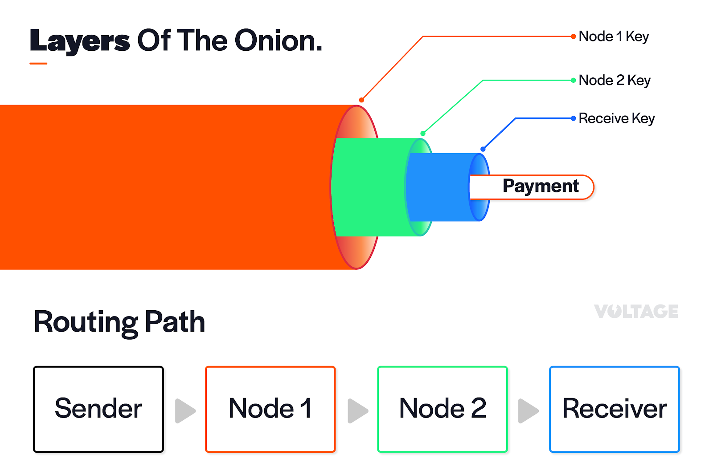
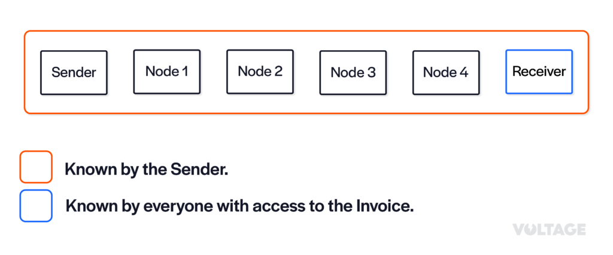
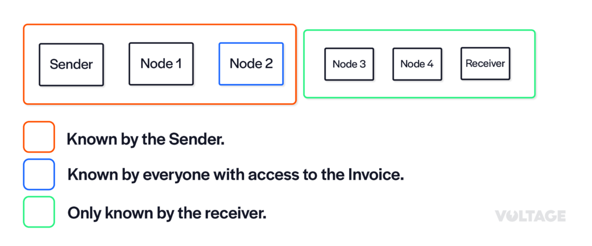
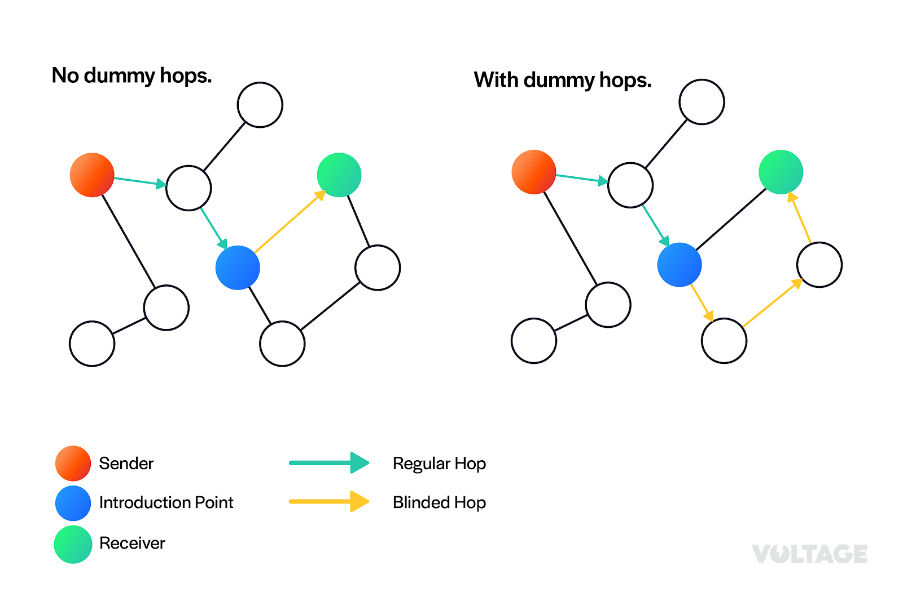

> *作者：BLN*
> 
> *来源：<https://voltage.cloud/blog/lightning-network-faq/what-are-blinded-paths-and-how-do-they-work/>*

在闪电网络中，“路径”指付款方经由一组支付通道将一笔付款发送给收款方所使用的路线。为了让用户能够通过路径转发付款，闪电网络使用了一个叫作“基于源的洋葱路由（Source-based Onion Routing）”的机制，也就是我们常说的“SPHINX”。

SPHINX 是一种用来实现安全通信的工具，需要付款方创建多个加密层。在消息传输过程中，这些加密层逐一由各个中间节点移除，直到预期收款方收到最内层为止。在传输过程中，每个中间节点只知道在自己之前和之后的节点。

通过源路由，付款方负责创建从己方节点到收款方节点的支付路径。

## 隐私问题

SPHINX 为付款方而非收款方提供了良好的匿名性保障。由于付款方需要构建整条路径，他不仅知道收款方节点，还知道整条支付路径上的所有中间节点。

这意味着付款方知道收款方的公钥。但是，隐私泄露不止于此：由于 BOLT 11 发票直接嵌入了收款方的公钥，只要是能够访问此发票的人都能获取收款方的公钥。如果收款方身份敏感或付款方想要将交易保密，这会是一个问题。

## 盲路径

盲路径是使用“路径盲化（route blinding）”技术生成的支付路径。其原理很简单：使用路径盲化使得支付路径的一部分对公众不可见。只有收款方知道完整的隐藏路径，外部观察者只知道到达特定节点（引入节点）之前的那部分付款路径。

这项技术可以保护收款方的隐私。要想知道请求付款的节点的身份并非易事，因为这部分信息被隐藏了起来，不为外部观察者所知。

## 创建盲路径

创建盲路径时需要用到一个叫作“Elliptic Curve Diffie-Hellman” (ECDH)”的加密算法。此算法可以让各自持有密钥的两方创建一个共享秘密，用于加密和解密数据。只有相关方能加密和解密数据。

首先，收款方与盲路径上的每个节点都创建一个共享秘密。这些共享秘密被用来为盲路径上的每个节点生成一个“盲”节点 ID，以掩盖真实的节点 ID，让收款方能够隐藏付款方的支付路径。此外，收款方还为盲路径上每个节点都生成了加密数据，以便每个节点从中获取后一个节点的身份。

最后，为了使用盲路径，收款方须将以下信息发送给付款方：

- 盲路径入口节点的节点 ID，以便付款方如平常那样创建到达此节点的支付路径

- 盲路径中节点的“盲”节点 ID 列表，由共享秘密生成

- 盲路径中每个节点的加密数据

- 第一个“临时盲密钥”（每笔交易更换一个） 

## 发送至盲路径

获得所有必需信息后，付款方会创建一条到达入口节点的支付路径，就像进行普通付款那样。付款方还会将以下数据添加到洋葱中：

- 提供给入口节点的第一个临时盲密钥

- 支付路径中每个节点获取后一个节点身份所需的加密数据

入口节点“剥开”洋葱层后，会得到第一个临时盲密钥和它的专属加密数据。接着，入口节点使用此信息获取盲路径中第一个节点的身份，并为此节点计算临时密钥，以便其执行相同的流程，知道自己应该将付款路由给哪个节点。

此流程会一直持续下去，直到收款方收到洋葱为止。轮到收款方“剥开”洋葱层时，就会得到最里面的部分。这个过程的关键在于，不同于基于源的洋葱路由，付款方既不知道完整的路径，也不知道收款方的身份。

## 采用

你或许已经注意到了，上述路径中所有节点要做的事都与在普通路由时不同：

- 收款方必须计算所有额外数据才能为节点提供看清路径所需的信息

- 付款方必须将额外数据添加到其转发的消息中

- 引入节点以及盲路径上的所有节点必须执行特定流程来获知后一个节点的身份

这意味着路径盲化需要盲路径中的所有节点以及付款方和收款方都启用此功能。在撰写本文时，LND（最常用的闪电网络协议实现，全网占比约为 91%）仍未支持此功能。另一个闪电网络实现 CLN 通过命令行界面支持用户手动构建盲路径，用户体验欠佳。

目前，盲路径功能尚处于起步阶段，用户在使用此功能时会感觉不可靠或体验不佳。一旦此功能得到广泛采用，钱包必须实现可以为盲路径选择节点的方法。用户友好型钱包可以为用户选择盲路径节点，面向重度用户的钱包可以为用户提供自行选择盲路径节点的选项。

## 观察结果

由于付款方不知道盲路径中的节点数量，让他为了满足收款方的隐私保护需求而支付路由费可能有点不公平。理想情况下，收款方应该将盲路径的路由费从总付款额中扣除。

值得注意的是，付款方依然知晓其与收款方之间的距离上限。因此，如果收款方靠近引入节点，不妨考虑在盲路径中添加假跳，因此付款方无法区别假跳和普通的盲跳。



盲路径带来的另一个好处是，由于盲路径中节点的 ID 都经过了匿名化处理，此功能也可以用来通过私密闪电网络通道（没有在 gossip 协议中公开过的通道）路由付款，以防这些通道的身份被泄露。此功能还可以用来强制要求付款途经一组特定的中间节点，为其作见证。

人们对盲路径的一个误解是，需要 BOLT 12 才能实现。BOLT 11 发票也可以用于盲路径，但是发票的数据量会比普通支付大。这会使得静态二维码更难扫描，但是这个问题可以通过动态二维码、NFC 和 LNURL 解决。

最后，目前已知有两种攻击可以对收款方去匿名化：一种是对使用盲路径的付款进行付款探查（payment probing），另一种换汤不换药，但是只能等到盲路径应用于付款后才能探索。第一种攻击可以通过在盲路径中使用利他中继节点来避免，需要路由付款的节点收取低于它们当前设置的费用。就经济激励而言，这类付款显然会被拒绝，因此这种解决方案并不可行。

## 结论

盲路径是使用常规的基于源的洋葱路由技术解决隐私问题的备选方法之一。它为付款方提供匿名性。通过盲路径，我们可以在保密情况下通过私密支付通道路由付款，还可以强制要求付款途经某组节点作为见证。

盲路径的原理是使用加密算法对外部观察者隐藏局部支付路径。这意味着付款方以及任何可以访问发票的人都无法知道请求付款的节点的身份。付款方只知道到引入节点为止的支付路径中的节点。

盲路径尚未得到广泛采用。最常用的闪电网络协议实现尚未支持此功能，而那些支持此功能的实现用户体验欠佳。

我们希望本文能帮助你了解盲路径的原理！

（完）