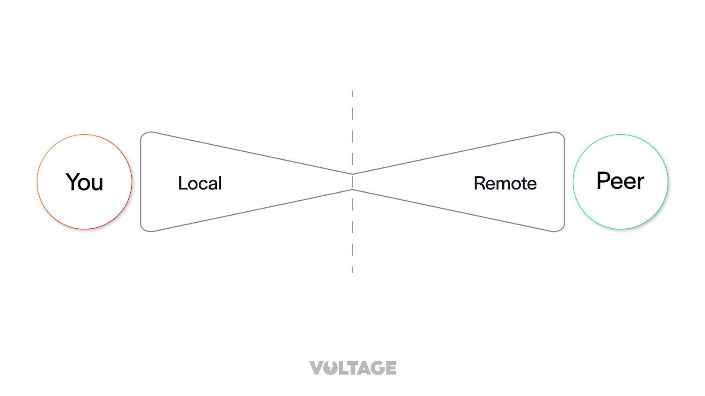
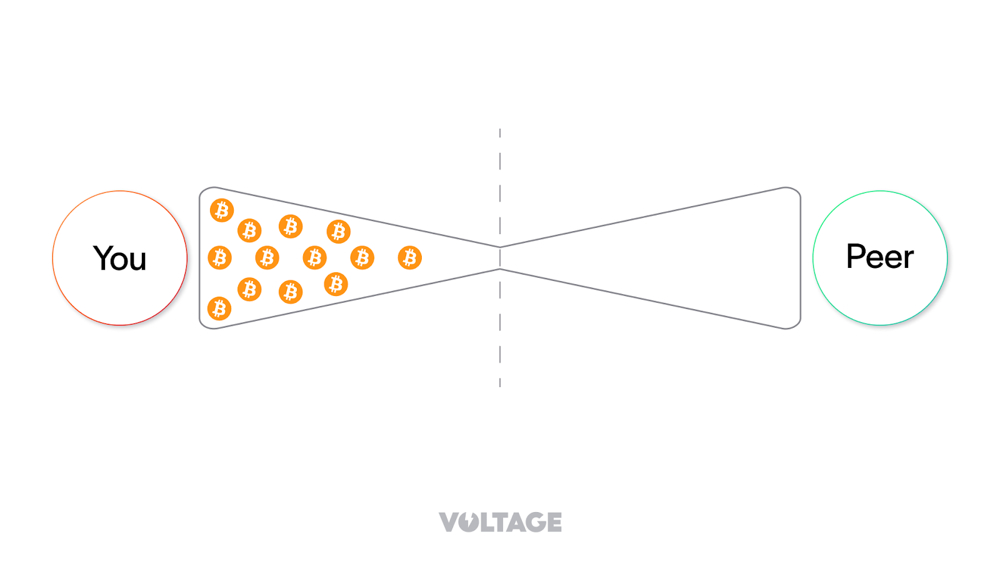
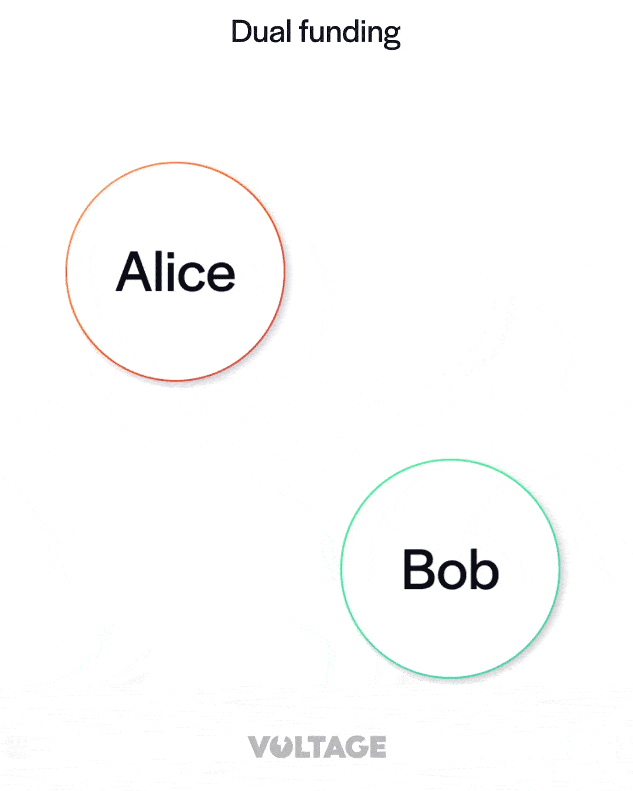

> *作者：Lorenzo*
> 
> *来源：<https://www.voltage.cloud/blog/what-are-dual-funded-lightning-channels>*

## 引言

闪电网络是一个基于支付通道的支付系统。你可以把闪电通道想象成沙漏，沙子就代表比特币，它们被锁定在一条通道里。闪电通道也跟沙漏一样有两端。我们管这两端叫通道的 “本地” 和 “远端”。

通道中的资金，要么在本地，要么在远端。从你自己的角度看，你可以发送的资金都在通道的本地，而你的通道对手也只能发送通道远端的资金。

为了开启一条闪电通道，你必须通过一笔链上的比特币交易，将一些资金锁定到通道中。交易的发起者就是将资金转移到通道中的人。这就意味着，在通道刚刚开启的时刻，通道中所有的资金都位于发起者一端。还是回到 “沙漏” 这个类比：全部沙子都处在发起通道的节点这一端。

这对希望花费资金的用户来说当然不会有什么感觉。这样的通道可以无感地支持出账交易。但在另一方面，它也带来了挑战：通道的发起方，在通道刚刚开启的时候，是无法凭这条通道来接收支付的 —— 因为其通道对手根本没有余额可以转发支付。

通道失衡有时会带来严重的问题，尤其是对商家来说。商人做生意要接收支付，通常来说，他们要接收的支付会多于要发送的支付，因此其通道会逐渐失衡；当通道的余额全部位于本地时，通道就无法用来接收支付了。

这样的失衡不仅会影响商家，网络中任何主要接收支付的主体都会遇到这个问题。

## 什么是 “双向注资”？

“双向注资” 是在创建闪电通道时，双方都为之提供资金。在通道开启的一刻，通道内的余额分布由双方提供的资金数额决定。比如说，如果 Alice 和 Bob 都为注资交易提供了 1 BTC ，那么所建立的闪电通道就有 2 BTC 的容量，并且在其初始状态中，通道的两端都各有 1 BTC 。

为了实现这种效果，需要建立一套新的通道创建协议。它叫 “V2 通道创建协议”。注意，这套协议依然可以用来开启单方注资的通道，但它开启了创建双向注资通道的可能性。

你可能会好奇，为什么闪电网络协议不在一开始就开发双向注资技术呢？因为事实证明，单方注资通道开发起来要简单得多。想要允许双方都为一条通道提供资金、而又不带来攻击界面，是很难的。疏忽大意的协议可能会允许攻击者可以免费或者很轻易地锁住对手的资金。单向注资的闪电通道已经很复杂了，所以协议开发者决定先从单向注资通道入手，并设计未来可以升级的协议。

随着双向注资在协议上成为可能、在客户端软件中得到实现，还可以在此之上建立新功能。比如，节点可以广播他们对通道内资金分布的偏好，然后用双向注资协议来实现这样的资金分布的偏好。此外，这套协议还可以用来在闪电网络内原生地匹配入账流动性（收款额度）的买方和卖方。

## 双向注资如何工作？

V2 通道创建协议的基础是 “交互式交易构造协议”。这套协议允许闪电网络中的一对对等节点合作式构建一笔比特币交易。我们通过一个案例来理解它。

假设 Alice 想要跟 Bob 开启一条双向注资的闪电通道。Alice 是发起人，而 Bob 不是。交互式交易构造协议是回合制的，也就是说，Alice 和 Bob 会轮流变更交易的内容。这里是 Alice 和 Bob 可以交换的消息：

- “tx_add_input”：为交易添加一个输入；
- “tx_add_output”：为交易添加一个输出；
- “tx_remove_input”；从交易中移除一个输入；
- “tx_remove_output”：从交易中移除一个输出；
- “tx_complete”：向对方表示，己方对当前的交易的内容已经感到满意；

在协商过程中，Alice 和 Bob 会来回交换这些消息，添加或移除输入和输出。一旦其中一方感到满意，就会发送 “tx_complete” 消息。但是，只有另一方在收到 “tx_complete” 之后立即回复 “tx_complete” ，协商才会结束。如果 Alice 发送了一条 “tx_complete”，而 Bob 没有回复 “tx_complete”，那么协商就继续。在协商持续期间，Alice 和 Bob 都应在本地构造交易；如果任何一方遭遇故障，协商就失败。

从常见的单方注资通道变为双向注资通道，另一个重要的改变是手续费责任在节点之间的分配。以往，在单向注资通道中，发起方为交易支付所有的手续费。在双向注资通道中，这样是不公平的。如果虽然由 Alice 发起创建请求，但 Bob 为交易加入了许许多多的输入和输出，却让 Alice 来支付全部手续费，那就不公平。在双向注资通道中，支付手续费的责任是这样分配的：

- 每一方都为自己添加的输入和输出支付手续费。
- 发起方为交易的其余字段支付手续费，例如版本号字段、输入和输出个数字段、时间锁字段，等等。

允许对等节点协商通道注资交易的一个缺点是，它开启了攻击者锁住诚实对等节点的流动性的可能。设想一下：当 Alice 发送一条 “tx_add_input” 消息时，没有任何机制能够保证她真的会采取相应的行动。她可以推迟发送消息，也可以中断通信，给 Bob 留下未完成的、无妨广播的交易。如果诚实节点在跟多个对等节点平行协商双向注资时，每个 UTXO 都只用在一个协商中，那就更糟了，相当于 UTXO 中的流动性被对应的协商进程锁住，直到协商完成或者诚实节点放弃这笔交易。相反，如果 Bob 在多个进行中的协商中使用同一个 UTXO 、在某个双向注资成功时才真正花费这个 UTXO ，那么他可以部分缓解这个问题。缺点是，如果 Bob 与之协商的都是诚实节点，那么一旦某个协商进场成功，就得立即为其它协商进程更换 UTXO 。

## 总结

- 单向注资通道：
  - 由参与通道的一方提供创建通道的所有资金，导致通道的初始状态是资金分布不平衡的。
  - 易于发送支付，但难以接收支付；对商家来说尤甚。
- 双向注资通道：
  - 双方都贡献资金，有望使初始状态更平衡一些。
  - 基于 “V2 通道创建协议”。
  - 需要克服启动难题和双向注资系统的复杂性。
  - 有望让节点获得偏安的通道内资金分布，并匹配流动性的买家和卖家。
- 交互式交易构造协议：
  - 允许闪电网络中的节点合作式构造比特币交易。
  - 要求双方交换一系列的消息来协商交易的内软三。
  - 双向注资在参与者之间切分了交易手续费的责任。
- 顾虑：
  - 可能会出现 “流动性请求骚扰”，就是恶意行动者锁住诚实节点的流动性。
  - 建议在多个协商进程中使用相同的 UTXO ，以缓解风险。

（完）