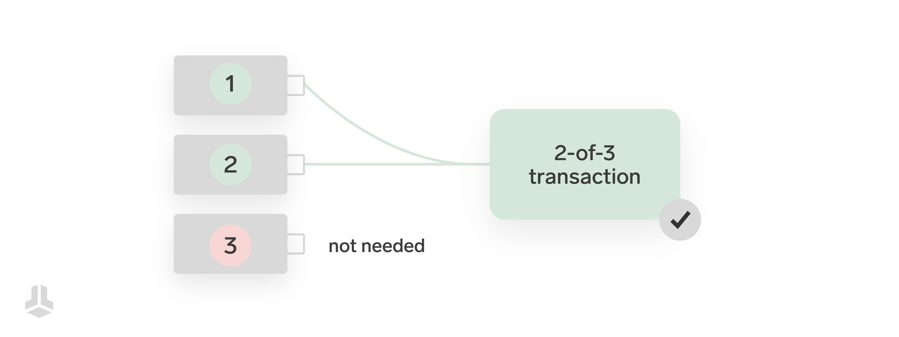
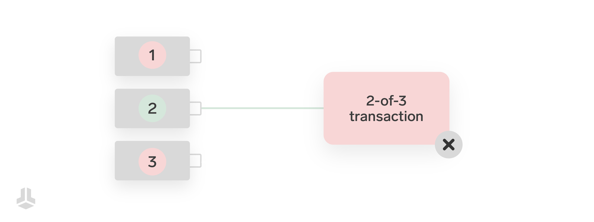
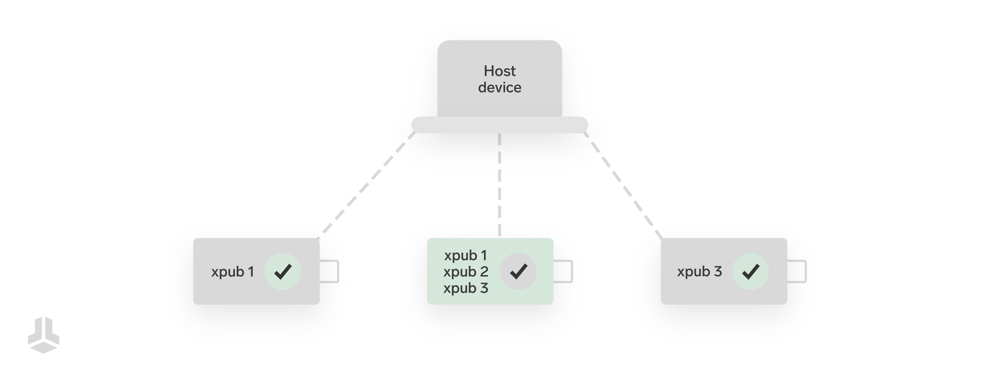

> *作者：Sebastian*
> 
> *来源：<https://blog.bitbox.swiss/en/what-are-multisig-wallets-everything-you-need-to-know/>*

对于大多数人来说，使用一个带有单一备份的硬件钱包已经绰绰有余了。这种方式既安全又易于理解，而且几乎没有出错的余地。这使得它不仅是初学者的绝佳起点，也是进阶用户的可靠方案。

然而，有些用户对于安全囤币有更具体的需求。为了提升钱包设置的安全性（和复杂性），多签钱包可被视为钱包安全的 “圣杯”，因为这是一种广泛应用的标准，可以根据个人的需求进行深度定制。

当然，本文做了一回标题党。要想将多签的所有重要方面以及它所能提供的有趣可能性都塞进一篇短短八分钟的文章里，几乎不可能（译者注：标题原文为 “What are multisig wallets？Everything you need to know”）。因此，本文将聚焦基础知识，探讨多签的工作原理，以及你是否应该在比特币钱包中使用这项高级的安全功能。

## 多签的工作原理
通常来说，发送比特币需要满足的条件非常简单：只需**一个数字签名**，就能完成支付。

多签钱包可以将这个条件扩展为**要求多个签名**，比如来自多个硬件钱包，每个钱包都有各自独立的备份。这样一来，你不仅可以增加钱包备份的总数，还能自定义花费所需的签名数量，也就是所谓的 “阈值（threshold）”。这意味着一个钱包可以要求比如 2 个密钥中的 1 个，7 个密钥里的 5 个，甚至 15 个密钥中的 14 个来签署一笔交易！

举个例子，许多用户常用的设置是 3 选 2：在理想情况下，使用三台不同的独立备份的硬件钱包，创建交易时只需要其中两个签名即可使交易有效。如下图所示，第三台硬件钱包可充当后备方案，以防其他两台设备有一台不可用。

多签与其它方式（例如简单的备份分割或[可选的密语](https://blog.bitbox.swiss/en/optional-passphrases-benefits-and-risks/)）的最大区别在于，它是在网络层面强制执行的：如果一笔比特币交易不满足所需的条件，网络中的其他节点会直接拒绝它。

阈值可以任意设定，比如 2 选 1、3 选 2，甚至 5 选 3。当然，你选择的总备份数量越多，管理和安全存储它们的难度和成本就越高，因此要根据实际情况来合理选择。

## 多签适合的人群
个人使用多签通常有一个共同的目标：提升安全性。然而，该目标的维度不是单一的，它可以通过组合多种优势来实现，具体取决于你的需求：

- **冗余性：** 通过自定义签名阈值，可以为你的钱包设置增加冗余。如果总的备份数量多于交易所需的签名数量，那么即使部分备份丢失（如被盗），只要剩余备份数量满足阈值，你的资金就是安全的。
- **双重保障：** 类似于[可选的密码短语](https://blog.bitbox.swiss/en/optional-passphrases-benefits-and-risks/)可以作为访问资金的第二层认证，多签钱包要求访问不同的钱包备份和设备。如果攻击者无法控制足够数量的备份来完成一笔有效交易，他们就无法盗取资金。
- **多厂商支持：** 如果你不想依赖某一个硬件钱包制造商，使用多种不同设备参与多签设置，可以降低单一设备漏洞危及你资金的风险。需要注意的是，这也会增加钱包设置的整体攻击面。
- **合理推诿：** 单个硬件钱包既可以作为“普通钱包”使用，也能同时参与多签设置。用户可以将真正的资金隐藏在多签钱包中，而将单签钱包作为应对可能攻击的诱饵。

多签钱包还有许多更具创意和强大的用法，适用于其它多种场景，例如：

- **遗产规划：** 结合更复杂的条件，多签可以实现非常细致的遗产规划。例如，父母各自掌控一个钱包，子女则需要共同协作并在特定时间后才能访问他们的钱包。详情可参考我们关于 [BitBox02 与 Liana 结合使用的博客](https://blog.bitbox.swiss/en/exploring-bitcoin-miniscript-with-liana-and-the-bitbox02/)。
- **共享所有权：** 公司钱包可由多名高管共同管理，从而确保没有任何个人可以擅自行动并独自做出财务决策。
- **闪电网络：** 支持快速、低成本比特币支付的闪电网络，本质上就是大量精心配置并定期更新的多签钱包的集合。
- _以及更多场景……_ 

如果你觉得其中一个或多个场景能帮到你，请继续阅读！在决定切换到多签钱包之前，还有一些重要的方面需要考虑。
## 注意事项
设置多签钱包是一回事，但要安全使用它且不削弱其主要优势则是另一回事，这远没有你想象的那么简单。多签钱包在使用上存在[诸多陷阱](https://blog.bitbox.swiss/en/the-pitfalls-of-multisig-when-using-hardware-wallets/)，因此并不太适合初学者。

让我们简要了解一些潜在的风险。这并非全部，更像是一个让你对风险及其缓解措施的复杂性有所了解的起点。
### 联合签名方（Cosigner）验证
多签钱包的接收地址很特别：它包含了多个独立密钥的信息，这些密钥共同决定了比特币的花费条件。因此，确保这些接收地址准确无误地包含了你所期望的花费条件，对于整个设置的安全性至关重要。

首次使用多签钱包时，所有联合签名方的扩展公钥（xpub）都需要在所有设备上仔细核验，以确保信息未经篡改。这也要求多签设置中用到的硬件钱包必须配备[安全显示屏](https://blog.bitbox.swiss/en/heres-why-a-hardware-wallet-absolutely-needs-a-display/)。

BitBox02 允许你在设备上直接注册多达 25 种不同的多签设置 —— 这是在选择签名设备时应关注的重要安全特性。它可以确保在初次验证后，任何设置变更都能被 BitBox02 自身检测到，而无需每次都进行繁琐的手动检查（大多数人都可能在一念之间忽略这一步）。
### 备份不完整
在接收地址这个话题上，还有一个核心问题需要注意：虽然签名阈值（如 3 选 2）决定了花费条件，但这钱包的恢复并不如此。

要重建多签钱包的收款地址并构造能从中花费的交易，钱包软件需要访问设置流程中用到的所有公钥。这就是为什么你应该始终确保在每个独立的备份中都包含你的所有扩展公钥。由于这些信息并不是秘密，你可以直接通过钱包主机打印出来。但请注意，任何能访问这些公钥的人都可以看到你的交易历史和余额。
### 恶意的联合签名方
虽然在常见的如 3 选 2 的多签设置中，单个联合签名方无法花费比特币，但它们仍然拥有一定程度的影响力。

例如，某个恶意的联合签名方可以向其它签名方提供篡改过的扩展公钥，假装这是用户的备份。这样一来，用户的资金可能会被锁定在 “错误的钱包” 中，进而遭遇勒索。

除非其它签名方从自己的备份中推导扩展公钥，否则无法发现这一问题 —— 但这又会削弱多签的部分优势。因此，你应该避免将可能被攻破的联合签名方（如电脑上的热钱包）与安全的联合签名方（硬件钱包）混合使用。一个行之有效的经验是，对待多签中的每个联合签名方，你都应该像对待普通钱包那样，确保其安全可靠。

更多细节请参阅我们关于[多签陷阱的专题博客](https://blog.bitbox.swiss/en/the-pitfalls-of-multisig-when-using-hardware-wallets/)。
## 开始上手

你已经了解了多签钱包的工作原理，并对管理其相关的风险也胸有成足？太棒了！如果你想开始创建自己的多签钱包，BitBox02 是个不错的选择，它支持在设备上注册多签设置，并兼容多种钱包软件。

查看我们关于使用 BitBox02 创建多签钱包的详细指南……
- [Sparrow Wallet](https://blog.bitbox.swiss/en/how-to-create-a-multi-signature-wallet-with-sparrow-and-your-bitbox02/)
- [Electrum](https://blog.bitbox.swiss/en/bitbox02-electrum-bitcoin-multisig/)
- [Specter Desktop](https://blog.bitbox.swiss/en/specter-multisig-guide/)  
## 总结
多签是自我托管领域中最强大的工具之一，能够显著提升你钱包设置的安全性和个性化。然而，就像生活中的大多数事物一样，它也是一把双刃剑，伴随着诸多陷阱与风险，稍有不慎就可能造成高昂损失。

如果你有意为自己的钱包使用多签，请不要被各种免责声明和警告劝退。只要肯花时间学习基本知识，多签会是进一步提升你比特币安全性的绝佳方式。无论你有什么特殊需求，BitBox02 都能让你的多签体验更便捷、更安全。

- - -

## 常见问题
### 什么是多签钱包？
多签钱包被认为更安全，因为它们需要来自不同私钥的多个签名才能完成一笔有效的比特币交易。备份数量和签名阈值都可以灵活调整，这使得多签成为一个非常灵活和强大的工具。
### 多签有哪些优势？
使用多签钱包的好处包括备份冗余性更高、增加双重保障，以及实现合理推诿。此外，使用来自不同制造商的硬件钱包也能降低 “单点故障” 的风险。
### 多签有缺点吗？
使用多签钱包存在一些陷阱，理解这些陷阱对于安全使用多签至关重要。其中包括扩展公钥（xpub）的验证和备份的妥善创建。
### BitBox02 可以用于多签吗？
当然，BitBox02 可以配合第三方钱包软件来使用多签钱包。该设备可注册多达 25 种独立的多签设置，从而使验证的过程更加便捷和安全。

