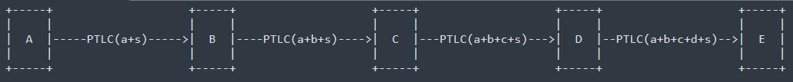

> *作者：Fanis Michalakis*
> 
> *来源：<https://fanismichalakis.fr/posts/ptlcs/>*


闪电网络之所以能够发挥如此大的作用，很大程度上是因为它支持付款**路由**：如果 Alice 想要付款给 Bob，她不一定要直接与 Bob 开启支付通道。假如 Alice 与 Carol 之间有支付通道，Carol 与 Bob 之间又有支付通道，Alice 就可以通过 Carol 的支付通道向 Bob 付款。

上述机制引出了一个新的问题：这种依赖第三方（如 Carol）的付款可以不需要信任吗？长期来看，HTLC（哈希时间锁合约，一类特殊的有条件比特币交易）就是答案所在。但是，这种付款也存在一些缺陷，尤其是隐私性方面。

这就是新的解决方案 PTLC（点时间锁合约）诞生的由来。PTLC 不仅具备与 HTLC 相同的优点，还能保护隐私性。

## HTLC 是什么？

HTLC 在闪电网络的运行中起到了关键作用，因为它们可以让付款以免信任的方式在闪电网络上路由。这使得用户可以在没有直接通道的情况下向另一个用户付款，只要在闪电网络内二者之间存在路由路径即可。

HTLC 采用闪电网络上常见的方式实现了免信任性：创建和签署专门的比特币交易。这类交易一般不会公开，除非用户遇到了问题、需要找回链上资产。

我已经发布了一个介绍 HTLC 运作方式的[视频](https://www.youtube.com/watch?v=-JC4mkq7H48)，配有法英双语字幕。如果你更喜欢这种形式的介绍，欢迎观看该视频。接下来，我将概述 HTLC 是如何运作的。

一笔闪电网络付款的生命周期始于收款方（Bob）创建了一个发票。该发票包含各种信息，如 Bob 的公钥（Bob 在闪电网络上的“地址”）、Bob 的预期收款金额（例如，4 万 satoshi），等等。另外还有一个数字（通常表示为 r）。这个数字是一个秘密值（表示为 s，被称为**原像**）的哈希值，它是 Bob 为这笔付款随机创建的。然后，Bob 将发票发送给他的付款方（Alice）。


```python
请求付款：
1. 随机生成原像 s
2. 计算 r = hash(s)
3. 创建包含 `amount`、`pubKey`、`r` 等信息的发票
4. 将发票发送给 Alice
```

收到发票时，Alice 开始尝试找到一条能够到达 Bob 节点的路径。理想情况下，Alice 与 Bob 之间存在直接的支付通道。但是，通常情况下，她需要通过其它节点将付款路由给 Bob。举个例子，Alice 选择了一条经过 Susie 的节点的路径。

```python
+-----+        +-----+        +-----+
|     |        |     |        |     |
|Alice|<------>|Susie|<------>| Bob |
|     |        |     |        |     |
+-----+        +-----+        +-----+
```

接着，Alice 创建了一笔有条件付款（HTLC）发送给 Susie。这个 HTLC 的大意是：“这里有 4 万 satoshi。如果你想要得到它们，必须给我秘密值 s'， s' 的哈希值等于 r。”在下文中，我们将使用 `HTLC(r)` 代表 HTLC <sup><a href="#note1" id="jump-1">1</a></sup>。这个 HTLC 也让 Susie 明白，获得秘密值的最好办法是问 Bob。因此，Susie 也创建了一个包含 4 万 satoshi 的 HTLC(r)，并提出了相同的条件（要求 Bob 提供哈希值等于 r 的秘密值 s'），然后将这个 HTLC 发送给 Bob。

现在，Bob 只需提供哈希值等于 r 的秘密值即可解锁来自 Susie 的有条件付款，拿走 4 万 satoshi。根据 `r = hash(s)` ，Bob 刚好有符合这个等式的秘密值。于是，Bob 将原像 s 告诉 Susie，从而“解锁”有条件付款并拿走 4 万 satoshi。现在 Susie 知道了 s，就可以把它告诉 Alice，满足 Alice 的 HTLC 提出的条件。两个 HTLC 都解锁后，付款完成：Alice 的余额减少了 4 万 satoshi，Bob 的余额增加了 4 万 satoshi，Susie 的余额不变。为了将 4 万 satoshi 从 Alice 转移给 Bob，Alice 先通过与 Susie 之间的支付通道将 4 万 satoshi 转给 Susie，而 Susie 也要通过与 Bob 之间的支付通道将 4 万 satoshi 转给 Bob（译者注：这一句应该理解成实现支付的先决条件：Alice-Susie 通道、Susie-Bob 通道中都必须有这么多余额可用，否则无法完成路由；在闪电网络中，余额是分布在不同通道中，不能直接从一个通道转去另一个通道的），这里面涉及的所有转账都是原子化的 <sup><a href="#note2" id="jump-2">2</a></sup>。

假设这笔付款要经过两个中间节点（Susie 和 Tim），Susie 和 Tim 之间会新增一个 HTLC。每个中间节点只知道前一个节点和后一个节点分别是谁：Susie 知道她只有将 HTLC 发送给 Tim 才能获得秘密值，但她不知道 Tim 是否为最终收款方。她也不知道 Alice 是付款方还是路由者之一。这就叫作洋葱路由（Onion Routing），有助于增强闪电网络上付款的隐私性。

```python
+-----+        +-----+        +-----+        +-----+
|     |        |     |        |     |        |     |
|Alice|<------>|Susie|<------>| Tim |<------>| Bob |
|     |        |     |        |     |        |     |
+-----+        +-----+        +-----+        +-----+
```

例如，以 4 个节点的路径为例，整个付款流程如下所示：

```
1. Bob 随机生成原像 s，计算 r = hash(s) 并通过发票将 r 发送给 Alice
2. Alice 选择一条经过 Susie 和 Tim 到达 Bob 的路径
3. Alice 将 HTLC(r) 发送给 Susie
4. Susie 只知道她从 Alice 那里收到了一个 HTLC(r)，以及她可以询问 Tim 获得对应的秘密值。她发送了一个 HTLC(r) 给 Tim 以获取秘密值。
5. Tim 只知道他从 Susie 那里收到了一个 HTLC(r)，以及他可以询问 Bob 获得对应的秘密值。他发送了一个 HTLC(r) 给 Bob 以获取秘密值。
6. Bob 将原像（秘密值）s 告诉 Tim，解锁 Tim 的 HTLC，获得来自 Tim 的转账额
7. Tim 将刚知道的原像告诉 Susie，解锁 Susie 的 HTLC，获得来自 Susie 的转账额
8. Susie 将刚知道的原像告诉 Alice，解锁 Alice 的 HTLC，获得来自 Alice 的转账额
9. 哎呀! 🎉 付款完成了!
```

这样一来，即使存在多个第三方，HTLC 也可以通过免信任方式完成付款。通过向中间节点隐藏付款方和收款方身份的方式，洋葱路由似乎起到了隐私保护的作用。既然如此，我们为何还要淘汰 HTLC？

## HTLC 不好吗？

HTLC 的问题之一是，整条路径使用的都是同一个原像。此外，鉴于原像由收款方随机生成，两笔不同付款使用同一个原像的可能性不大。因此，如果一个实体（个体、公司等等）控制了某条付款路径上的多个节点，就可以根据某个节点得到的输入和另一个节点的输出获得完整的交易信息。然后，这个实体可以使用某种启发法（根据路径长度或节点类型）猜出路径中的哪个节点是付款方，哪个节点是收款方。洋葱路由在隐私性方面所做的努力全都白费。这就是 HTLC 的不足之处！

我们来举一个涉及 5 个节点的简单例子：Alice、Bob、Carol、Daniel 和 Eve。Alice 想要发送一笔付款给 Eve，但是她和 Eve 之间没有直接通道，只得在网络中寻找一条路径。她选择了经过 Bob、Carol 和 Daniel 的路径。然而，Alice 并不知道 Bob 和 Daniel 的节点实际上属于同一个实体（假设是 [Chainalysis](https://fanismichalakis.fr/posts/chainalysis-to-launch-lightning-network-support/)）。

```python
+-----+        +-----+        +-----+        +-----+        +-----+
|     |        |     |        |     |        |     |        |     |
|  A  |<------>|  B  |<------>|  C  |<------>|  D  |<------>|  E  |
|     |        |     |        |     |        |     |        |     |
+-----+        +-----+        +-----+        +-----+        +-----+
Emitter         Spook       Honest Node       Spook        Recipient
```

由于 HTLC 都使用相同的原像 s（r 是这个原像的哈希值），控制 Bob 和 Daniel 的攻击者可以判断出它们源自同一笔交易。Bob 的节点知道它从 Alice 那里收到了一个 HTLC(r)，并发送了一个 HTLC(r) 给 Carol。Daniel 的节点知道它从 Carol 那里收到了一个 HTLC(r)，并发送了一个 HTLC(r) 给 Eve。

掌握了上述信息后，攻击者已经可以确定 Carol 只是一个中间节点。如果 Bob 和 Daniel 之间还存在其它中间节点，攻击者未必知道它们的身份，但他知道 Bob 和 Daniel 之间发生的一切都只是中间节点之间的跳。

但是，攻击者并不能确定 Alice 就是付款方。事实上，Alice 之前可能还有另一个节点，Alice 可能只是另一个中间节点。同样地，攻击者也不能确定 Eve 是收款方。**但是**，我们知道路由路径越长，付款的可靠性越低：节点可能会离线，通道内的流动性可能不在我们需要的那一端，等等。另外，每多一个中间节点，出错的可能性就会大幅增加。因此，攻击者可能会认为一条路径上不可能存在超 3 个中间节点 <sup><a href="#note3" id="jump-3">3</a></sup>。攻击者也有可能看出 Alice 和 Eve 都是移动节点（因为它们经常离线，而且它们的 IP 地址经常改变），这类节点通常只是收付款方，不负责路由付款。根据上述启发法，攻击者可以推断出 Alice 很有可能是付款方，Eve 是收款方。攻击者有可能给出“根据调查，我们有 90% 的把握 Alice 是付款方，Eve 是收款方”之类的结论。

如果攻击者控制了少数几个在闪电网络中连接广泛的节点，而且收费不高，这些节点很有可能成为网络中的事实枢纽，发现自己经常能成功“破坏”洋葱路由的隐私性，找到付款的起点和终点。闪电网络的隐私性还有救吗？

## 更优解决方案 PTLC 

HTLC 在隐私性方面的主要问题是，整条路径上的每一跳都使用同一个原像。更确切地说，整条路径上的每个 HTLC 都只能由同一个原像解锁 <sup><a href="#note4" id="jump-4">4</a></sup>。还有没有其它解决方案？我们需要做到以下几点：

- 一旦付款完成，付款方（Alice）必须能够向收款方（Bob）提供某种付款证明。
- 路径中的每一跳必须能够提供某个秘密值 s 来解锁前一个节点发送的有条件付款。
- 为了获取秘密值 s，每一跳必须向路径中的下一个节点发送需要使用秘密值 s' 解锁的有条件付款。秘密值 s' 可以用来找到秘密值 s。

有一个“简单”的方法可以验证上述 3 个条件：在整条路径中使用同一个秘密值 s，就像我们使用 HTLC 所做的那样。但这不是唯一的方法，因为 s 和 s' 不一定要相同。构建秘密值时只需满足一个要求：节点只要知晓 s'，就一定可以知晓 s。这就是 PTLC。 

如果使用 HTLC，付款方（Bob）首先要创建付款秘密值，即，原像。如果使用 PTLC，付款方同样要创建秘密值，但用的是私钥。原像和私钥都是随机数，二者的区别在于用途。

为了理解接下来要讲的内容，我们需要对椭圆曲线密码学的运作方式（尤其是椭圆曲线点乘法）有最基本的了解。椭圆曲线是一种非常特殊的曲线，具备一些有趣的特性。本文只介绍对理解本文内容有帮助的特性，不作深入探究。

- 我们先定义椭圆曲线上两个点之间的加法运算，用 `+` 表示。椭圆曲线上的点 `P` 和点 `Q` 之和 `R` 也是曲线上的一个点，但它在曲线上的位置与 `P` 和 `Q` 没有直接关联。
- 接着，定义代表同一个点与其自身连续叠加的乘法运算，用 `*` 表示。换言之，假设 `k` 是一个数字，`P` 是曲线上的一个点，则 `k*P = P + P + ... + P`（k 倍）。由于我们将不断将 `P` 与其自身相加， `k*P` 可以是曲线上的任意点。换言之，即使我知晓了 `P` 和 `k*P` ，我也无法找到 `k` 。
- `*` 运算数还有其它一些有趣的特性，例如，分配律：`a*P + b*P = (a+b)*P`。

我们将上述椭圆曲线特性应用到密码学中：

- 私钥 `s` 只是一串很长的数字。
- 与私钥 `s` 关联的公钥是 `s*G` ，其中 `G` 是曲线上一个特定的点，被称为基点或生成器。换言之，G 是曲线上的一点，是一个常数。
- 即使有人知道了 `s*G` ，甚至知道了 `G`，也无法猜出私钥 `s` 。

此处还要强调一点，无关乎椭圆曲线点加法，而是经典的数字加法。具体来说，知道 `a+b` 跟知道 `a` 和 `b` 之间的差别很大。即使我知道了 `a+b+c` 和 `a` ，我也无法知道 `b` 和 `c` 。

既然我们已经了解了上述概念，我们再看上文提到的 5 个节点的例子，其中 Alice 通过 Bob、Carol 和 Daniel 向 Eve 付款，Bob 和 Daniel 实际上是试图实现交易去匿名化的攻击者。

```python
+-----+        +-----+        +-----+        +-----+        +-----+
|     |        |     |        |     |        |     |        |     |
|  A  |<------>|  B  |<------>|  C  |<------>|  D  |<------>|  E  |
|     |        |     |        |     |        |     |        |     |
+-----+        +-----+        +-----+        +-----+        +-----+
Emitter         Spook       Honest Node       Spook        Recipient
```

付款流程大致如下：

1. Eve 持有作为秘密值的私钥 `s` ，并通过发票将公钥 `s*G` 告诉 Alice，就像使用 HTLC 时通过发票提供原像的哈希值。
2. Alice 寻找路径，并选择了一条经过 Bob、Carol 和 Daniel 的路径。
3. Alice 生成了 4 个随机数 `a` 、`b` 、`c` 和 `d` 。她将 `b` 发送给 Bob，`c` 发送给 Carol，`d` 发送给 Daniel。她还将 `(a+b+c+d)` 发送给 Eve（此处指 4 个随机数之和，而非每一个数）。
4. Alice 向 Bob 发送一笔有条件付款，要求 Bob 提供与 `(a+s)*G` 对应的私钥，根据定义就是 `(a+s)` 。Bob （通过洋葱数据包）得知 Carol 知道与 `(a+s)*G+b*G` 对应的私钥，也就是 `(a+b+s)` 。
5. Bob 意识到，如果他知道 `(a+b+s)` ，就可以计算出 `a+s=a+b+s-b` ，并将它告诉 Alice 以获得付款，因为在第 3 步中 Alice 已经将 `b` 发送给了 Bob。因此，Bob 向 Carol 发送了一笔有条件付款，要求 Carol 发送与 `(a+b+s)*G` 对应的私钥给他。
6. Carol 收到 Bob 的有条件付款后，被告知 Daniel 知道与 `(a+b+s)*G+c*G` 对应的私钥，也就是 `(a+b+c+s)` 。知道了 `a+b+c+s` 和 `c` 之后，Carol 可以通过减法计算出 `a+b+s` 。她向 Daniel 发送了一笔有条件付款，要求 Daniel 提供与 `(a+b+c+s)*G` 对应的私钥。
7. Daniel 收到 Carol 的有条件付款后，被告知 Eve 知道与 `(a + b + c + s)*G + d*G`对应的私钥，也就是 `(a + b + c + d + s)`。知道了 `a + b + c + d + s` 和 `d` 之后，Daniel 可以通过减法计算出 `a + b + c + s` ，并解锁 Carol 的有条件付款。为了获得 `a + b + c + d + s`，Daniel 向 Eve 发送了一笔有条件付款，要求 Eve 提供与 `(a + b + c + d + s)*G`对应的私钥。
8. Eve 已经知道了 `s` ，因为 `s` 是最开始生成的秘密值。她还知道 `(a + b + c + d)` ，因为在第 3 步中 Alice 已经将它发送给了 Eve。这样一来，Eve 就能向 Daniel 提供 `a + b + c + d + s` 以获得付款。
9. 已知 `a + b + c + d + s`，Daniel 可以计算出 `a + b + c + s` ，并将它提供给 Carol，得到 Carol 的付款。 
10. 已知 `a + b + c + s`，Carol 可以计算出 `a + b + s` 并将它提供给 Bob，得到 Bob 的付款。
11. 已知 `a + b + s`，Bob 可以计算出 `a + s` 并将它提供给 Alice，得到 Alice 的付款。
12. 现在，Alice 知道了 `a + s`。由于 Alice 已经知道了 `a`，她能够通过减法迅速计算出 `s` 。秘密值 `s` 是 Alice 的付款证明，可以用来向 Eve 证明自己已经支付了发票。


通过上述设计，路径中的每一跳都掌握不同的秘密值。即使 Bob 和 Daniel 串谋，也无法知道足够多的信息来判断他们路由的是否是同一笔付款：

- 一旦付款完成，Bob 只知道 `a + b + s`、`b` 和 `a + s`
- 一旦付款完成，Daniel 只知道 `a + b + c + d + s`、`d` 和 `a + b + c + s`。



即使 Bob 和 Daniel 将这些信息放在一起，他们也无法猜出自己路由的是否是同一笔付款。以我们的上帝视角来看，他们可以通过 `c = a + b + c + d + s - d - (a + b + s)` 计算出 `c` <sup><a href="#note5" id="jump-5">5</a></sup>。但是，知道了 `c` 对他们而言也没什么用。即使他们路由的不是同一笔付款，也能通过上述等式计算出某个随机数。他们就是没有足够的信息计算出整条付款路径上所有节点的公用信息，也就是 `s`。

当然了，如果攻击者控制的是路径上连续两个节点，就可以知道他们路由的是同一笔付款，因为每个路由节点都会从洋葱数据包中获取下一跳的信息。但是，若想使用我们在上文提到的启发法（例如，这条路径不超过 3 跳的可能性很高），攻击者必须控制 Bob、Carol 和 Daniel 这 3 个节点才行。换言之，PTLC 只有在攻击者控制了整条路径上所有节点的情况下才会失效。即使在这种情况下，攻击者依然无法确定 Alice 是付款方，而 Eve 是收款方，因为他们同样依赖于上文提到的启发法。

## 太长不看

由于整条付款路径上使用的都是同一个秘密值，HTLC 可能会大幅降低洋葱路由带来的隐私性（这些隐私性是我们效率上的重大牺牲换来的）。然而，如果是 PTLC，路径中的每一跳都使用不同的秘密值。这样一来，通过洋葱路由实现的隐私性就得到了保护。

## 附加资料

在本文中，我们只聚焦于 PTLC 的隐私性方面。但是，PTLC 还会产生很多其它影响，详见 [Suredbits](https://suredbits.com/payment-points-part-1/) 的系列文章。

## 脚注


1.<a id="note1"> </a>我们忽略了金额部分，因为它与本文关系不大。当然了，对于会向提供秘密值 s' （hash(s') = r）的收款方支付 4 万 satoshi 的 HTLC，更详细的表示应该是 `HTLC(40000, r)` 。 <a href="#jump-1">↩</a>

2.<a id="note2"> </a>简单起见，我们忽略了 Susie 可能会收取的路由费。 <a href="#jump-2">↩</a>

3.<a id="note3"> </a>当然了，4 跳付款（涉及 4 个中间节点）也有可能成功。重点在于，我们可以根据统计数据计算出这类事件的概率。 <a href="#jump-3">↩</a>

4.<a id="note4"> </a>需要注意的是，这种设计不只会影响隐私性。在我们列举的 5 个节点配置（其中，Bob 和 Daniel 实际上是同一个人）中，只要 Daniel 从 Eve 那里获得原像，就可以绕过 Carol 将原像发送给 Bob。然后，Bob 可以将原像告诉 Alice：对于除 Carol 之外的其它节点来说，付款似乎已经完成了。对于 Carol 来说，付款似乎仍在处理中，直到她的 HTLC 最终超时为止。但是，与此同时，Bob 和 Daniel 能够拿走原本属于 Carol 的路由费。 <a href="#jump-4">↩</a>

5.<a id="note5"> </a>需要强调的是，他们只有在付款结算后才能知晓 `c` 。HTLC 则不同，因为 Daniel 能够直接绕过 Carol 将原像发送给 Bob。因此，PTLC 可以有效防止这种路由费窃取攻击。 <a href="#jump-5">↩</a>