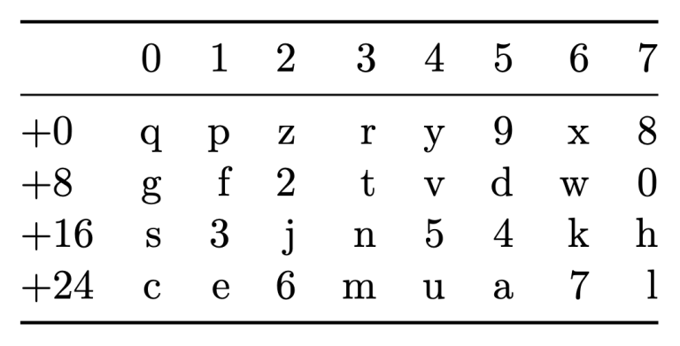

> *作者：SJORS PROVOOST*
> 
> *来源：<https://sprovoost.nl/2022/11/10/what-is-a-bitcoin-address/>*

比特币地址不是比特币区块链的一部分，而是一种记号，比特币（钱包）软件用它来沟通将比特币发送至何处：要么是发给某个公钥（P2PK）、要么是某个公钥的哈希值（P2PKH）、脚本的哈希值（P2SH）、隔离见证公钥的哈希（P2WPKH），或者是隔离见证脚本的哈希（P2WSH）。地址中还包含一些关于其自身所属类型的元数据。

（译者注：比特币的地址类型会随着比特币网络的升级和脚本编写方式的标准化而不断增加。其实上面提到的地址类型，除了 P2PK 和 P2PKH 是随着比特币的初次发布就出现的，其余都是后来才出现的。现在，由于 Taproot 升级在 2021 年激活，比特币又多了一种地址类型 “P2TR”。）

比特币地址使用独有的编号系统来表达上述付款方式。本文将分别介绍这些互不相同的编号系统，并深入分析一般的比特币地址和 bech32 地址具备哪些优点。此外，我们还将解释第一版 bech32 地址所包含的那个（威胁程度较低的）漏洞从何而来，又是如何解决的。最后，我们谈到了量子计算的影响。

- 本文节选自我的新书<a href="https://btcwip.com/">《比特币：未竟的研究》</a> -

## 历史背景

当你向某人发送比特币时，你实际上是在创建一笔包含多个输入和至少一个输出的交易。输出通过内置的约束（在法律上叫作“负担”（encumbrance），即，限制资产所有权的转让）指定可以花费该输出的人。

最微不足道的负担是允许任意人花费这笔比特币。这不是个好主意，因为这一笔比特币将很快被人偷走。因此，在比特币发展初期，区块链上的绝大多数比特币只能使用两种约束：Pay-to-Public-Key (P2PK) 或 Pay-to-Public-Key-Hash (P2PKH)。前者可以理解为“只有持有公钥 X 对应私钥的人才能花费该比特币”，后者可以理解为“只有持有（哈希值为 X 的）（秘密）公钥对应私钥的人才能花费该比特币”。

彼时，我们还可以将比特币发送到收款方的 [IP 地址](https://en.bitcoin.it/wiki/IP_transaction)，但是这个功能已经在 2012 年停用了。其使用方法是，你需要连接到收款方的 IP 地址，向收款方请求公钥，收款方会将公钥给你 <a href="#note1" id="jump-1">1</a>。然后，你的钱包会创建带有 P2PK 脚本的比特币。

这个工作流程放到今天来看会有些奇怪 <a href="#note2" id="jump-2">2</a>，但是符合彼时 Napster 和 Kazaa 等点对点应用的常见模式，即，直接与其他人建立连接，从他们那里下载东西。现如今，你极有可能不知道你的朋友的 IP 地址，如果他们正在使用移动设备，他们的 IP 地址甚至会一直发生变化。虽然你可以指示你的比特币节点专门连接到你的朋友的节点，但是在通常情况下只会连接到随机节点，见[第二章](https://shop.purpledunes.com/product/chapter-2-dns-bootstrap/)。

更常见的交易方式与银行转账类似。收款方给你一个地址，你将比特币发送到这个地址上，就像你把钱发送到银行账户上。最初，我们使用的都是 P2PKH 作为地址的（P2PKH 的含义见下文的解释）。

通过这种方式，交易不是直接发送给收款方，而是经由网络中的所有节点进行广播，最终被挖矿节点发现并打包到区块中。你的对手方的节点有可能从对等节点那里看到该交易，或收到该交易所在区块。

第三种交易方式是挖矿，将挖矿得到的区块奖励发送给自己。最初，比特币软件中内置了挖矿软件。因此，只要你下载了比特币软件，你的比特币软件就会开始挖矿，然后将比特币发送到你的钱包，这种情况下无需交流地址。这些比特币都以 P2PK 为约束 <a href="#note3" id="jump-3">3</a>。

## 地址是什么？

地址是用来表示哪个脚本需要进入区块链的便捷方式。正如我们在上文所述，脚本的目的是在比特币上施加限制，只允许收款方花费它们 <a href="#note4" id="jump-4">4</a>。地址本身并不存在于区块链上，地址甚至不包含完整的脚本。

就以往使用最多的两类脚本而言，地址仅用于 Pay-to-Public-Key-Hash (P2PKH)。当钱包看见这种地址时，会生成一个脚本，要求花费其中的比特币的人必须持有该哈希值的对应公钥（[第 10 章](https://shop.purpledunes.com/product/btcwip-chapter-10-miniscript/)提供了真正的脚本）。只有哈希值会被公开，公钥会一直保密，直到收款方花费这笔比特币为止。

P2PKH 地址以数字 1 开头，后面跟着的是公钥的哈希值。地址使用 base58 编码，如下例所示：

[1HLoFgMiDL3hvACAfbkDUjcP9r9veUcqAF](https://mempool.space/address/1HLoFgMiDL3hvACAfbkDUjcP9r9veUcqAF)

## Base 系统是什么

要想理解 base58，我们首先要了解 base 系统的基本原理。

以 base10 为例，把它想象成你的 10 个手指。因此，如果你想要表达数字 115（1、1、5），你可以用双手做出与 1、1、5 对应的三个手势。自从人类发明了泥板和纸，你也可以用笔写下这些数字，比起使用手指要方便得多。因此，base10 是使用 10 个不同符号的十进制系统，利用这 10 个符号的各种组合来表达任意数字（整数）。

除此之外，还有很多不同的 base 系统。例如，古[巴比伦人](https://blogs.scientificamerican.com/roots-of-unity/ancient-babylonian-number-system-had-no-zero/)使用的是 base60。为了阅读机器代码，我们通常会使用[十六进制](https://en.wikipedia.org/wiki/Hexadecimal)，也就是 base16 —— 使用数字 0 到 9、字母 A 到 F 这 16 个字符。与此同时，计算机内部则倾向于使用 base2（一种二进制数字系统），因为晶体管只有开启和关闭两种状态。这意味着只需要两个数字 0 和 1 就可以完成所有操作，你可以用它们来表示任何数字。

[中本聪引入了 base58](https://tools.ietf.org/id/draft-msporny-base58-01.html) 系统，使用 58 个不同的符号：数字 0 到 9 以及字母表中绝大部分小写和大写字母。但是，一些用户容易混淆和认错的字母和数字不包含在内 —— 例如，数字 0 和大写字母 O，大写字母 I 和小写字母 l。

你见过电子邮件附件的源代码吗？一大串奇怪的数字。这就是 base64，而 base58 正是在 bas64 的基础上诞生的。但是，base64 包含下划线、加号、等号和斜杠之类的字符。base58 去掉了这些字符，让肉眼检查变得更加容易，而且可以有效应用于 URL。

## Base58 和 Pay-to-Public-Key-Hash

这与 P2PKH 有什么关系？P2PKH 地址以 1 开头，紧跟着的是用 base58 编码的公钥哈希值。

这就是当你想要从其他人那里接收比特币时，你需要发送给他们的信息。你也可以只发送 0x00 <a href="#note5" id="jump-5">5</a> 和公钥给他们。或许他们能够成功将 0x00 翻译出来，但是大概率不行。

从理论上来说，你可以向其他人发送用十六进制（区块链上使用的格式）表示的比特币脚本，因为比特币脚本是二进制信息。在区块链上，这样的比特币脚本的大意是：“如果这个人拥有正确的公钥哈希和与之对应的公钥，你就可以花费这笔比特币。”如果你想更深入了解比特币脚本是如何运作的，请参见第十章。

虽然有如此多表示方式可以选择，但是人们选择的通常是标准化的地址格式。这就解释了为什么所有传统比特币地址都以 1 开头，而且长度也都差不多。

除了用来发送比特币地址，base58 也可以用来传递私钥。在这种情况下，为首的符号是 5（代表 128，作为版本字节），后面跟着私钥。

过去，用户用的是可以打印出来的纸钱包。如果它们是在没有后门的情况下安全生成的，那么这张纸的一面是以“1”开头的字符串，另一面是以“5”开头的字符串，并注明只可以出示比特币地址，不应共享私钥。

也有以“3”开头的地址，表示把比特币锁在脚本哈希值里面，而非公钥哈希值内。我们将在第十章介绍 Pay to Script Hash (P2SH)。这类地址通常是多签地址，不过也有可能是 SegWit 地址 <a href="#note6" id="jump-6">6</a>。

虽然 base58 地址表现良好，但还是有改进空间。于是，我们有了 bech32。

## bech32 登场

2017 年 3 月，Pieter Wuille 谈到了一种新的地址格式 bech32。自 SegWit 成功激活以来，bech32 就一直被应用至今。顾名思义，bech32 是一种 base32 系统。也就是说，你可以使用几乎所有字母和所有数字，除去少数容易产生混淆的数字和字母。

讲解视频：https://youtu.be/NqiN9VFE4CU

bech32 和 base58 之间最大的区别是不混用大小写字母。每个字母只会出现一次（要么全部大写，要么全部小写），因此读出口会容易得多。每个字母或数字与其对应值之间的精准映射是固定的，但是相当随意：Q 就表示 0，P 就表示 1，背后没有深层含义。

- bech32 映射表。例如，q 表示 0，3 表示 17（1+16） -

bech32 <a href="#note7" id="jump-7">7</a> 地址由使用“1”分隔的两部分组成，例如，[bc1q9kdcd08adkhg35r4g6nwu8ae4nkmsgp9vy00gf](https://mempool.space/address/bc1q9kdcd08adkhg35r4g6nwu8ae4nkmsgp9vy00gf)。

前半部分是有意让人读懂的，例如，“bc”（代表 Bitcoin）或“Inbc”（比特币上的闪电网络）。“b”和“c”等字母代表的值没有任何含义。它们的存在只是为了让人识别：“懂了，如果地址以 'bc' 开头，指的就是作为密码学货币的比特币。”但是，钱包会查看这些值是否存在，作为可信度检查，而且这些值也包含在校验和内。

“1”只是分隔字符，不代表任何值。如果你查看 bech32 的映射表，你会发现“1”不包含在内，意思是“跳过它”。

后半部分以 SegWit 版本号为开头。版本 0 由 Q（bc1q…）代表（见第三章）。版本 1 就是我们所说的 Taproot（见本书的第 4 部分），用“P”（bc1p…）表示。如果是版本 0 SegWit，版本号后面会跟着 20 或 32 个字节，分别表示公钥哈希值或脚本哈希值。二者的长度不同，是因为 SegWit 使用的是脚本的 SHA256 哈希（32 个字节）， 而非脚本的 RIPEMD160 哈希（20 个字节）。

在 base58 中，脚本哈希值与公钥哈希值长度相同。但是在 SegWit 中，二者的长度不同。因此，只要查看地址的长度，你立马就可以知道你是在向脚本还是公钥哈希付款。顺带一提，Taproot 消除了这种长度差异，进一步提高了隐私性。

因此，bench32 的特征是地址的后半部分只使用 32 种字符，除此之外与 base58 区别不大。看到这个特征，你就会明白：“啊哈，这是一个 P2PKH 地址。”在这种情况下，Pay-to-Witness-Public-Key-Hash (P2WPKH)，其中“Witness”指的是 SegWit，但核心思想没有变：让人和电脑能够根据一个简短的前缀识别地址的类型，前缀后面跟着公钥或脚本的哈希值。

## 32 维掷镖游戏

但是，简洁性并非唯一的优点。还有一个优点是纠错性，至少是检错性。

如果你输错了地址，最坏的结果是你将比特币发送到了错误的公钥哈希值上。当接收方试图花费比特币时，会发现自己的公钥的哈希值并不符合区块链的要求，因为发送方之前输错了地址。这笔比特币就再也找不回来了。

幸好 base58 地址在末端有一个校验和。如此一来，如果你输错了地址，地址末端的校验和验证就会失败。你的钱包会向你发出告警，并拒绝发送该交易（区块链不会保护你，好在你的钱包会）。但是，如果你实在不走运，在输错的情况下也有可能恰好得到正确的校验和。

Bech32 就是为了避免出现如此极端的巧合而设计的。另外，Bech32 不仅会告诉你输错了，还会告诉你错在何处。具体方法是取地址的所有字节，使用某种复杂的[数学公式](https://medium.com/@MeshCollider/some-of-the-math-behind-bech32-addresses-cf03c7496285)对其进行哈希运算。即使你输错了 4 处，Bech32 依然可以知道哪里输错了，以及实际的值是什么。如果你输错了不止 4 处，Bech32 就没办法了。

我们通过一则比喻进行说明：你在一堵墙上画了一堆没有重叠的圆圈。每个圆圈的靶心代表一个正确的值，而圆圈内其它点各代表一个输入错误。如果你是个技术高超的飞镖玩家，大多数时候你会命中靶心，这意味着你输对了值。如果你稍稍错过靶心，但是依然落在圆圈内，这意味着你输入的值稍微有点不对。检错就是知道你错过了靶心。纠错就是将飞镖移动到最近的靶心。

这里面的思路是，你想要尽可能扩大圆圈来方便最粗枝大叶的飞镖玩家，却又不想浪费太多空间。同样地，我们不想将比特币地址变成数百个字符那么长。这是数学家最喜欢的优化问题。

不同于二维墙，bech32 好比是一面带有 32 维超球面的 32 维墙。当你输入地址时，在这个 32 维空间内的某处产生了轻微偏差，但无论看起来如何，你仍位于这个超球面内。在这种情况下，你的钱包知道错在哪里，可以有效防止因发错地址而造成比特币丢失的问题 <a href="#note8" id="jump-8">8</a>。

## bech32 的漏洞

在 2019 年，人们发现如果一个 bech32 地址的最后一个字符是 P，你又意外在后面多输入了一个或几个 Q，依然能通过校验和验证，你也不会收到输入错误的提示。你的钱包软件会认为地址输入正确，任由你将比特币发送至错误地址，导致这笔比特币无法被花费，就像我们在上文解释的那样。

好消息是，bech32 只用于 SegWit，而 SegWit 地址有长度限制 —— 只能是 20 个字节或 32 个字节。幸运的是，如果你在长度为 20 或 32 字节的地址后面多输了一个 Q，你输入的地址就会因为超出长度限制而无效。你的钱包会发现这个问题，并拒绝发送比特币。人们原本考虑针对 Taproot 引入类似的地址长度限制，但是下文提到的解决方案免去了这一需求。灵活的地址长度更有助于我们未来改进 Taproot。 

## bech32m 诞生

为了修复 bech32 的漏洞，有人提议了一个叫作 bech32m 的新标准 <a href="#note9" id="jump-9">9</a>。bech32m 实际上是非常简单的改变：在 bech32 校验和公式中额外添加了一个数字，以确保任何新增字符都会生成无效校验和。 

这个新标准只应用于 Taproot 地址和未来地址。对于 SegWit 地址来说，一切都没有改变，因为它们已经有了 20 或 32 字节长度限制的保护。在笔者撰文期间，大多数钱包软件都支持新的 bech32m 标准。

## 是什么让我摆脱焦虑，爱上量子计算？

顺带一提，Pay-to-Public-Key-Hash (P2PKH) 被认为更能抵御量子攻击，因为你无需透露自己的公钥。缺点是哈希占用的空间更大 —— 但这在当时不成问题，因为区块远不到填满的程度。

很多人担心量子计算机最终会破坏比特币密码学的安全性，让妄图窃取比特币的量子黑客有可趁之机。如果他们成功窃取数百万个比特币，甚至会导致市场崩盘。

问题是，尽管 P2PKH 被广泛采用，其中有 500 万至 1000 万比特币的公钥已经公开。具有讽刺意味的是，鉴于如此多比特币容易遭到量子黑客窃取，试图以此保护剩余的比特币已经意义不大。即使你的比特币因为使用了 P2PKH 二不会被盗，也免不了因价格崩盘而变得一文不值。

物理学家 [Stepan Snigirev](https://www.whatbitcoindid.com/podcast/the-quantum-threat-to-bitcoin-with-quantum-physicist-dr-stepan-snigirev) 和数学家 [Andrew Poelstra](https://www.whatbitcoindid.com/podcast/andrew-poelstra-on-schnorr-taproot-graft-root-coming-to-bitcoin) 在两集题为《比特币做了什么》的播客中解释了量子攻击在短期内造成毁灭性后果的可能性以及可行的应对措施。

区块空间现在变得非常稀缺，因此无需将公钥哈希存储在宝贵的区块空间内可以帮助用户节省费用。这就是为什么在新的 Taproot 软分叉中（见本书的第四部分），比特币地址又成了 P2PK <a href="#note10" id="jump-10">10</a>。请注意，使用 Taproot 地址不具有强制性，因此如果你不认同上述推理，你可以选择不使用 Taproot。

## 脚注

1.为满足代码“考古”爱好者的好奇心：发送方节点会有一个 UI 对话框提示转账数额和 IP 地址。函数 StartTransfer() 创建一个空白支票交易，接收方节点上的 checkorder 会在其中插入一个 P2PK 脚本（作为 scriptPubKey）。随后，OnReply2() 会插入数额，签署交易，将交易返回给接收者并进行广播。[源代码](https://github.com/bitcoin/bitcoin/blob/v0.1.5/main.cpp#L2004-L2042)。 <a href="#jump-1">↩</a>

2.而且是不安全的，中本聪也[承认](https://bitcointalk.org/index.php?topic=158.msg1322#msg1322)了这点。 <a href="#jump-2">↩</a>

3.为什么中本聪最初发布的版本同时支持 P2PK 和 P2PKH？我们并不确定具体原因。P2PK 的支付方式实际上只用来向 IP 地址付款，以及向矿工支付区块奖励。二者都不需要人际交互。在涉及人际交互的场景中，用户使用的是 P2PKH。使用地址指的是 P2PKH 而非 P2PK 。自动化系统不需要地址的概念，因为它们也可以处理脚本，也就不需要像 P2PK 地址这样的概念。 <a href="#jump-3">↩</a>

4.到目前为止，脚本都与银行账户类似。我们将在[第十章](https://shop.purpledunes.com/product/btcwip-chapter-10-miniscript/)了解到脚本的功能远不只是为所有者保管资金而已。 <a href="#jump-4">↩</a>

5.一对以 0x 为前缀的十六进制数字通常被用来表示一个字节，它可以表示 16 × 16 = 256 个不同值。因此，0x00 表示一个字节且它的值为 0。 <a href="#jump-5">↩</a>

6.正如[第三章](https://shop.purpledunes.com/product/btcwip-chapter-3-segwit/)解释的那样，SegWit 通常使用 bech32 地址。但是，过了很长时间，我们才等到所有钱包和交易所都支持向 bech32 地址付款。为了继续利用 SegWit 的一些优点，我们引入了一种在发送方角度看起来像是普通 P2SH 的地址类型，但是背后包含了 SegWit 的魔力。这类地址叫作 [P2SH-P2WPKH 地址](https://bitcoincore.org/en/segwit_wallet_dev/)。 <a href="#jump-6">↩</a>

7.bech32 由 BIP173 提出。  <a href="#jump-7">↩</a>

8.早期的以太坊钱包不使用错误检测，因为它们的地址标准缺少校验和。虽然 EIP55 在 2016 年引入了校验和，但不是所有钱包都执行错误检测。直到 2017 年末，仍有人[因输错地址而丢失以太币](https://bitcointalk.org/index.php?topic=2161699.0)。 <a href="#jump-8">↩</a>

9.bech32m 由 BIP 350 提出。 <a href="#jump-9">↩</a>

10.具体原因见 [BIP 341 的注释](https://github.com/bitcoin/bips/blob/master/bip-0341.mediawiki#cite_note-2)。 <a href="#jump-10">↩</a>