> *作者：David A. Harding*
> 
> *来源：<https://bitcointechtalk.com/what-is-a-bitcoin-merklized-abstract-syntax-tree-mast-33fdf2da5e2f>*

默克尔化抽象语法树（Merklized Abstract Syntax Trees, MAST）是一项为比特币提议的升级，可以实现更小的交易体积、更好的隐私性，以及更大的智能合约。在本文中，我们会解释 MAST 的基本原理，讲解其潜在好处，并总结目前一些包含这项技术的提案。

## 问题：没用到的脚本数据

中本聪给了比特币一个有趣的特性，是他[没有写在](https://gist.github.com/harding/dabea3d83c695e6b937bf090eddf2bb3#2-transactions) [比特币白皮书](https://bitcoincore.org/bitcoin.pdf)里的。除了可以通过公钥来接收比特币、用私钥数字签名来花费比特币，用户还可以编写程序（叫做 “script”，脚本），当成动态的公钥和签名来用。

当你指定一个脚本后 —— 这在每一种比特币钱包里都是基本操作 —— 由比特币网络强制执行的比特币协议就不会让任何人花费这个脚本所控制的比特币，除非脚本返回 True。这让你可以指定资金的花费条件，称为 “encumbrances”（财产条件），比如要求花费的交易一定要得到你的私钥签名。

更加复杂的财产条件也是有可能实现的，比如下面这个例子，我们会用它贯穿整篇文章：Alice 希望能够随时花费她的比特币，但如果她连续三个月没有花费自己的比特币（可能因为身故或者丧失行为能力），她希望自己的兄弟姐妹 Bob 和 Charlie 拥有自己的比特币，在任何两人能达成一致的地方使用这些财产。

下面这个条件脚本就实现了上文所说的目标，它不仅纳入了 Alice 的公钥（需要验证一个来自她私钥的签名），但也加入了以下条件性逻辑：一个超时条件，以及 Bob 和 Charlie 的公钥。

在当前的比特币协议中，上述所有的数据都必须添加到区块链中，在 Alice 的比特币花费的时候，也包括在特定的花费行为中完全无关的脚本部分，也要曝光。就比如在 Alice 花费自己的比特币时 Bob 和 Charlie 的公钥也要曝光。

未使用的条件数据增大了交易的体积，也使用户在必要之外曝光了更多的隐私，同时，也使体积而非验证代价成为智能合约大小的主要限制因素。MAST 旨在改善这些情况，办法就是移除在区块链上直接包含未使用的脚本部分的需要。

## MAST 初始构想

MAST 1 背后的观念来自于两种久已存在的概念， [抽象语义树](https://en.wikipedia.org/wiki/Abstract_syntax_tree)和[默克尔树](https://en.wikipedia.org/wiki/Merkle_tree)。抽象语义树（AST） 是一种通过将一个程序分割成独立的小块来描述程序的方法，这样会让程序变得更容易分析和优化。为了生成一个 AST，你需要把所有的方程与其前提用箭头连接起来，直至所有的前提都被找出。下图即是上文示例脚本的 AST。

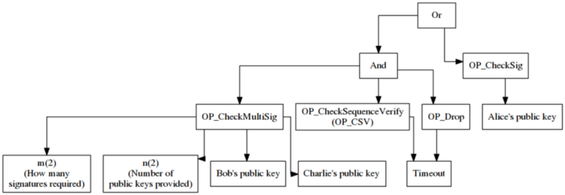

另一方面，默克尔树则可用来验证某个元素是否是属于某个集合，且无需知晓整个集合的全貌。举个例子，比特币的简易支付验证钱包（SPV wallet）就使用默克尔树来验证某笔交易是否存在于某个区块中，这样无需下载完整的区块，可以节省带宽。

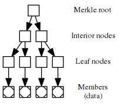

要生成一棵默克尔树，先要把每个元素都各自哈希一次，生成各自唯一的标识符；然后这些标识符配对之后再次哈希，生成这一对标识符的标识符；如此不断重复，直至只剩下一个标识符，称为 “默克尔根”，它就是一个短小精悍、但是标记了整个集合的标识符了。

在验证某个元素属不属于某个集合时，拥有整个集合的人可以向你提供从那个元素到默克尔根路径上的所有标识符。这样就能证明，这个元素确实在这个集合内。

简而言之，AST 背后的技术让你可以把一个程序分成多个小块，而默克尔树让我们可以验证这些小块确实是一个完整程序的一部分，且不必暴露整个程序。这就是 MAST 的基本原理，可以让花费者用一个默克尔证明来替换在单次交易中没有用到的条件 —— 减少交易体积、提高隐私性，并支持更大的合约。

## MAST 的一个例子

我们以上文的财产条件为例，为我们希望的两种可能场景分割为两个子脚本：

1. Alice 可以随时花费自己的比特币（左边的子脚本）
2. 或者，如果连续三个月使用 Alice 的签名来花费，则需要 Bob 和 Charlie 的签名来花费此中的比特币（下图右边的子脚本）

基于这两个独立的子脚本，创建一棵默克尔树：

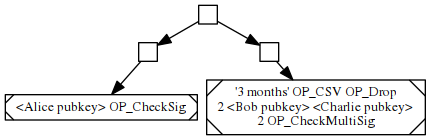

这棵默克尔树的树根最终标识了 Alice 的完整财产条件，而且只有 32 字节的体积。此后，Alice 可以使用一个替代性的条件脚本，声明：一笔花费交易，只有提供其中一个子脚本连接到默克尔根的证据、并且子程序返回 True 的时候，才是有效的。

子脚本的默克尔证据，形象地画出来会像下图这样，就看用的是哪个子脚本了：

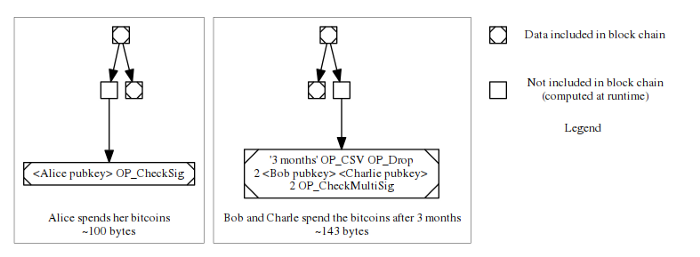

## 好处 #1 —— 更小的交易

我们先来看看 MAST 如何能让复杂财产条件的用户创建更小的交易。这是 MAST 给我们带来的第一个好处。

在上文的例子中，我们使用了一个具备两个子脚本的财产条：要么 Alice 自己花自己的钱，要么 Bob 和 Charlie 在等待三个月之后一起花她的钱。我们来设想一个无限延伸的版本：其第三个子脚本指明，三个月零一天后，Dan 和 Edith 可以花费此中的资金；第四个子脚本指明，三个月零二天后，Fred 和 George 可以使用这笔资金；等等等等

这个思维实验可以使我们得到下面的这张图，它显示了，子脚本的数量与需要加入区块的条件数据量，在有和没有 MAST 时候的关系。

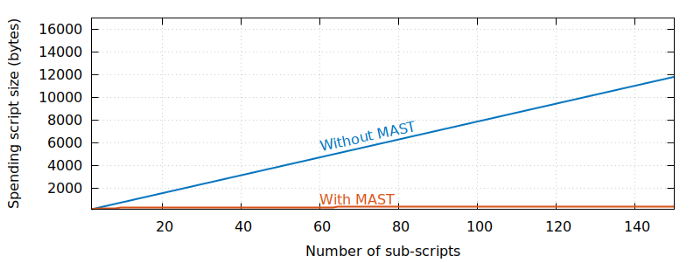

下面是一个对数图，意思是一样的：

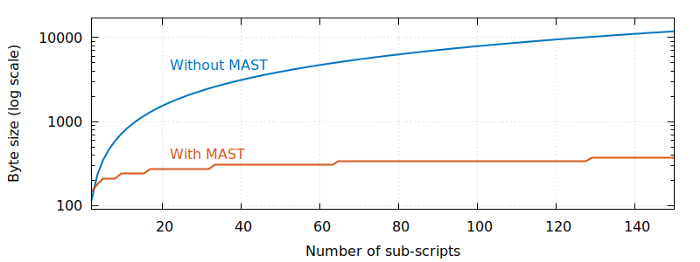

虽然一开始 MAST 交易的体积会比没有 MAST 的同条件交易更大，比如我们的两个子脚本的条件，但非 MAST 的交易体积会（随子脚本的数量）线性增大，而 MAST 交易的体积则只会[对数增大](https://en.wikipedia.org/wiki/Logarithmic_growth)。

如果节省数据量是主要目标，我们还可以进一步优化。对于许多财产条件来说，花费者可能更高频地使用其中某个条件。比如，Alice 希望自己高寿，所以她建构的默克尔树把自己花费的条件放在离顶端更近的地方，而所有其它条件都放在树的底部：

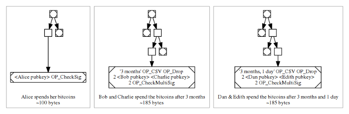

这样设计的话，不同情况下的 MAST 默克尔证据的体积是不一样的，在最理想的情况下，Alice 活着，自己花自己的钱；而另一种情况下，Alice 身故，她的受益人来花这些钱。我们把这些因素呈现到图上。

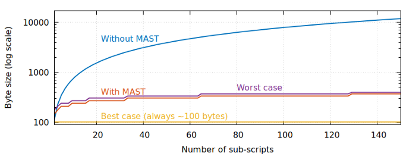

可以看出，Alice 使用时，其交易的数据量一直是最优的情形，无论她的财产条件中的受益人有多少个；而在她的受益人使用这笔资金时，交易的数据量也只比前述标准构造的默克尔树多用几个字节。

无论 Alice 选择什么安排，可以看出 MAST 可以让多子脚本的财产条件交易体积更小，因此用户可以少付一些手续费，而区块里可以装入更多的高级交易。

## 好处 #2 —— 更强的隐私性

我们在上文的讲解中，把 Alice 的财产脚本全部曝光了出来，但你可以设想，如果在 Alice 花费自己的比特币时，你在区块链上仅仅看到了下图左边的数据：

只有这些信息，你是没法知道 Alice 以外是否还有人能花费这里的资金、以及他们花费是需要面对什么约束条件的。你可以从 MAST 中猜测可能有一些别的条件，但也仅限于猜测而已 —— Alice 可能只是假装她的默克尔树还有其它可以花费的部分。

对应地，如果你看到的是另一个分支（也就是上图的右边的子脚本），你不会知道这笔资金在超时之前是否能花费，也不知道是不是只需一把私钥就能花费它。你同样可以猜测存在其它的花费条件，但你没法在区块链上确证这一点。

保证未使用的财产条件不曝光在某些时候非常有用，比如某些商人可能希望自己的智能合约尽可能保密，不要被潜在的竞争对手看到。这一点与某些标榜自己是专为智能合约设计、但实际上又不能为这些合约提供隐私性的山寨币恰好相反。

隐私性也可以为所有的比特币用户提供额外的好处，即使某些用户根本不在乎财产条件的隐私性。假设从本文一开始，Alice 就是唯一一个使用非 MAST 条件模板的人。因为所有条件都是公开的，那么任何人都可以跟踪 Alice 的花费行为，只需在区块链上观察这个模板被使用的情形即可，这样 Alice 的隐私就荡然无存。

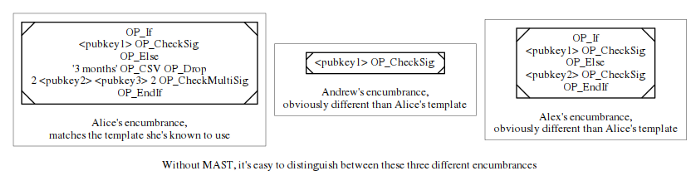

任何让识别特定用户更容易的设计，也会让人们可以更容易地区别对待他们的比特币和别人的比特币，这叫做 “同质性的缺失”。如果某些人知道了 Alice 的财产条件长什么样，他们就可以贿赂或者强迫矿工不要打包这些人的交易，以此阻止 Alice 使用自己的比特币。

MAST 不能完全解决这个问题，因为 Alice（或者 Bob 和 Charlie）仍然需要揭示部分的产权负担，但是许多别的复杂财产条件可以解析成少量的简单 MAST 类型条件。

举个例子，Alice 的默认花费行为看起来就像其它只需提供单签名的普通支付行为，所以 Alice 的基于 MAST 的交易跟其它基于 MAST 的单签名交易就没有任何分别。这反过来提高了 Alice 的隐私性，也提高了她的资金的同质性，以及所有使用基于 MAST 的单签名条件的用户的货币同质性。

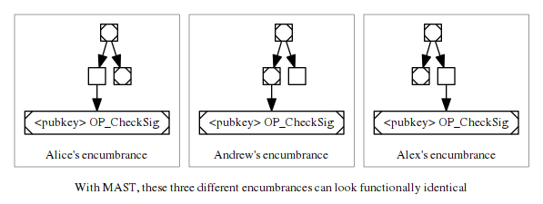

MAST 的这一好处还很有可能与其他提高比特币隐私性和同质性的提议结合在一起。有些提议是让某些复杂的财产条件可以用单签名来使用，比如 Pieter Wuille 和 Gregory Maxwell 的 “[通用门限树](https://blockstream.com/2015/08/24/treesignatures.html#h.mxbj7rz0xoe5)”、Andrew Poelstra 的 [“无脚本式脚本”](https://diyhpl.us/wiki/transcripts/mit-bitcoin-expo-2017/mimblewimble-and-scriptless-scripts/)，还用 Thaddeus Dryja 的 [“离散对数合约”](https://adiabat.github.io/dlc.pdf)；MAST 就可以和这些方案相结合。

但即使这些方案都不能在比特币上实现，MAST 自身也能为复杂财产条件的用户提供更多的隐私性和可互换性，不论是与当前相比，还是与支持用户自定义智能合约的山寨币相比。

## 好处 #3 —— 更大的智能合约

比特币现在为单个脚本设置了三种不同的体积限制：裸露脚本大小不能超过 1 万字节，在 2010 年 7 月引入；P2SH 脚本不能超过 520 字节；segwit 脚本不能超过 1 万字节。我们把这几个大小在上面的图中展示出来：

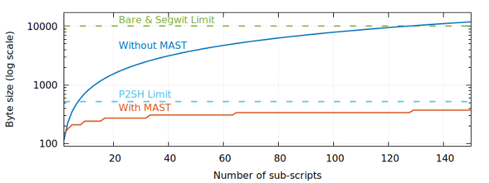

可以看出来，即使是极端的无限延长的例子，MAST 也比当前所有的机制支持更多的条件分支。实际上，MAST 的扩展性非常之好，以至于即使你拥有现在可观测的宇宙中所有的能量，若是只用来创建一棵标准（平衡）的默克尔树，其默克尔证据也只有 8448 字节。即使是这么大的默克尔证据，任何现在的笔记本电脑，都能在 1 毫秒之内完成验证。

因为免去了全节点处理未使用的子脚本的任务，MAST 还能帮比特币脚本绕过别的一些硬性限制。在这一方面，MAST 很好地保存和延伸了比特币智能合约长期的设计目标，也就是合约的负担应尽可能由合约的参与者承担，而节点付出了带宽、内存和处理能力，却无法得到补偿，因此应尽可能少承担。

所以，MAST 的真正成就不是让比特币用户可以创建（比以往）更加高级的合约，而是它打开了这种可能性，还不会给比特币的节点增加新的负担。

## 实现 MAST：现有的多种提议

迄今为止，bitcoin-dev 邮件组里提出了两种方法在比特币协议中启用 MAST，两种方法都仍在草案阶段，可能会有所变更。

第一种提议是 Johnson Lau（化名 “jl2012”）提出的 [BIP114](https://github.com/bitcoin/bips/blob/master/bip-0114.mediawiki)，使用了一个基于隔离见证的延伸特性，使得原生的隔离见证地址（[bech32](https://github.com/bitcoin/bips/blob/master/bip-0173.mediawiki)）可以成为对 MAST 财产条件的默克尔根的承诺。花费交易因此可以从树上选择一个子脚本。

第二种提议是 Mark Friedenbach（化名“maaku”）提出的两个未命名的 BIP（[1](https://gist.github.com/maaku/f7b2e710c53f601279549aa74eeb5368)、[2](https://gist.github.com/maaku/bcf63a208880bbf8135e453994c0e431)），它提高了脚本语言的灵活性，使得编程者可以编写脚本来验证基于 MAST 的财产条件。如果用 Friedenbach 更喜欢的方式来实现，那会让比特币现在支持的三种脚本类型（裸露脚本、P2SH 和隔离见证脚本）都可以使用默克尔证据。

这几种提议互有短长，但都提供了上文所说的 MAST 的好处（字节数可能有加有减）。每一个都可以用软分叉来激活。

## 结论：我们什么时候才能用上 MAST？

上文我们讲解了 MAST 的好处，也简要提及了两种在比特币上实现 MAST 的提案，你可能也好奇，什么时候我们能用上 MAST。遗憾的是，我也不知道。

从理念，到提案，到完整的实现，到提议软分叉，到激活软分叉，道阻且长。围绕隔离见证升级，[为期两年的大戏](https://bitcoinmagazine.com/articles/long-road-segwit-how-bitcoins-biggest-protocol-upgrade-became-reality/)已经很清楚地展现了这一点。

但从我的角度看，MAST 背后的基本理念已经在比特币技术社区中获得了广泛的支持，而对 MAST 最感兴趣的开发者也会继续开发，除非有人能证明这种技术完全不靠谱。有朝一日这些开发者成功提出可供同行审议的软分叉代码，就轮到读者你们和其他比特币用户，来决定 MAST 是否能成为比特币协议的一部分了。

## 延伸阅读

- [BIP114: Merklized Abstract Syntax Tree](https://github.com/bitcoin/bips/blob/master/bip-0114.mediawiki) by Johnson Lau
- [Tail Call Sematics](https://gist.github.com/maaku/f7b2e710c53f601279549aa74eeb5368) by Mark Friedenbach
- [MerkleBranchVerify opcode](https://gist.github.com/maaku/bcf63a208880bbf8135e453994c0e431) by Mark Friedenbach
- [Discussion at core.tech meetup](http://diyhpl.us/wiki/transcripts/bitcoin-core-dev-tech/2017-09-07-merkleized-abstract-syntax-trees/) by Mark Friedenbach (transcribed by Bryan Bishop)
- [Merklized Abstract Syntax Trees](http://www.mit.edu/~jlrubin/public/pdfs/858report.pdf) by Jeremy Rubin, Manali Naik, Nitya Subramanian
- [An explanation and justification of the tail-call and MBV approach to MAST](https://lists.linuxfoundation.org/pipermail/bitcoin-dev/2017-September/015028.html) by Mark Friedenbach
- [Making MAST Meaningful](https://medium.com/@BrianDeery/making-mast-meaningful-bitcoin-atomic-swaps-become-private-ff003f7c2b7a) by Brian Deery
- [The next step to improve Bitcoin](https://bitcoinmagazine.com/articles/the-next-step-to-improve-bitcoin-s-flexibility-scalability-and-privacy-is-called-mast-1476388597/) by Aaron van Wirdum

## 致谢

感谢 Mark Friedenbach、Jimmy Song 和 John Newbery 对本文草稿的评论。当然，文中出现的所有谬误，都属于我的责任。

## 脚注

1. Russell O’Connor 被公认为是第一个描述了 MAST 雏形的人，有些来源则还会加上 Pieter Wuille。来源：[Peter Todd](https://bitcointalk.org/index.php?topic=255145.msg2757327#msg2757327)、Gregory Maxwell（由 Jeremy Rubin 等人[引用](http://www.mit.edu/~jlrubin/public/pdfs/858report.pdf)） 和 Mark Friedenbach（在私人通信中）。

感谢 John Newbery。

根据[自由创作-分享协议 4.0](https://creativecommons.org/licenses/by-sa/4.0/)，保留署名权，且在后续分享和改编中应维持同样的要求。

（完）

