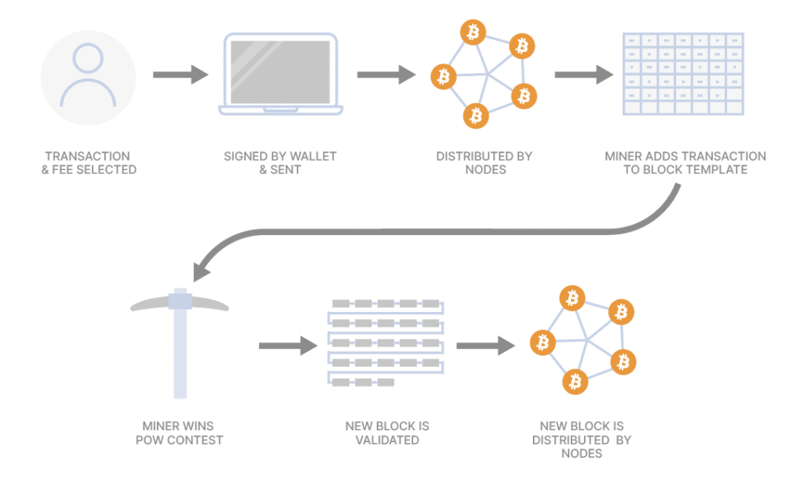
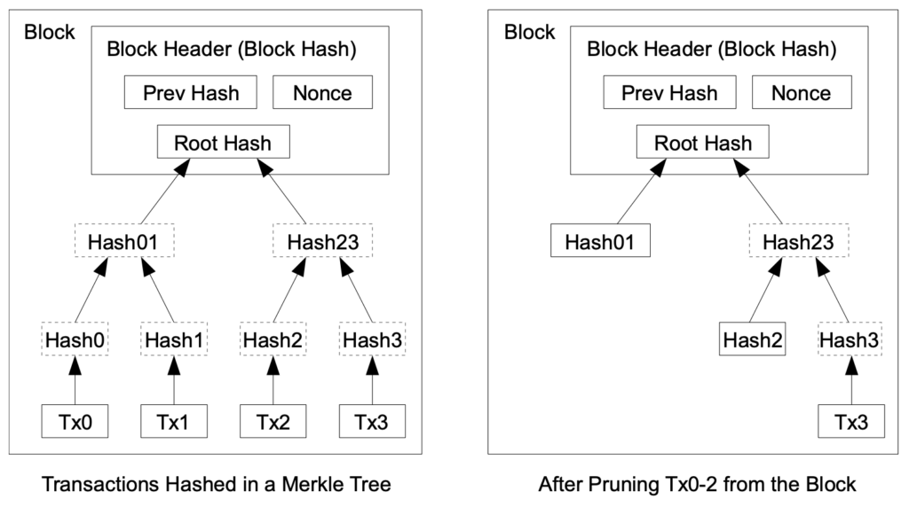

> *作者：Ted Stevenot*
> 
> *来源：<https://unchained.com/blog/what-is-a-bitcoin-node/>*

大多数人都知道，比特币没有执法者（ruler），但确实有规则（rules）。这些规则得到维护，对每个持有比特币的人都很重要。但是，没有权威，比特币的这些规则是如何得到执行的呢？答案是，由遍布全世界的许多比特币用户所运行的成千上万个节点所组成的网络来维护。

## 什么是比特币节点？

比特币节点是一类计算机软件，可以连接到比特币的点对点网络中。节点会根据网络规则来验证、接收和发送新的比特币交易（transaction）。要理解比特币节点会做什么以及它是如何工作的，我们要从理解比特币的两个最根本的部分（*账本* 和 *规则集*）开始：

- 比特币的**账本**是一个分布式的数据库 —— 你可以把它理解为一张用于会计账本的电子表格。这个账本包含了每一笔比特币自其创生以来的流转记录，以及现在谁持有比特币、持有多少（即哪个地址持有多少比特币）。这个共享的公开账本就是所谓的 “比特币区块链”。
- 比特币的**规则集**，是由比特币用户的共识建立、由比特币节点的代码实现的规则集合，它们定义了比特币的具体特性和网络的运行流程。这个规则集决定了如何验证交易和区块，如何检查签名，被花费的比特币是否存在，在前一个区块上正确构建一个新区块需要多少工作量证明，等等。

一般来说，个人电脑和便宜的专用电脑（比如[树莓派](https://www.raspberrypi.com/products/raspberry-pi-4-model-b/)）就可以运行比特币节点。在更低功耗的硬件（比如智能手机）和远程硬件（比如云服务器）上运行也可以，但一般不推荐这样做。

最流行的比特币节点软件是 Bitcoin Core，你可以[免费下载](https://bitcoincore.org/en/download/)。

## 比特币软件会做什么？

一笔比特币交易被签名授权后，它就会被广播给网络中的所有节点。收到这笔交易的节点会立即根据规则集来验证它是不是一笔有效的交易，以此决定要不要把它转发给自己知道的其它节点。

节点会追问下面几个问题：

- 发送者（也即钱包地址）真的拥有 TA 想花费的币吗？
- 被话费的的币之前有没有被花过（有没有重复花费）？
- 交易是否有正确的签名授权？
- 交易构造是否符合比特币当前的规则集？

每一个节点都根据规则集，对每一笔待打包的交易运行独立的验证。这个过程是：

- **可验证的**：任何人都能自己运行一个节点。每个节点都必须验证每一笔交易。
- **冗余的**：网络中的每一个节点都重复相同的工作，从而保证每一笔交易都符合规则集。
- **安全的**：节点比较和验证比特币区块的唯一密码学指纹，从而保护比特币区块链的数据、以往交易的历史，以及钱包地址的余额。

区块在节点间传播和验证的冗余，提高了欺骗任何一个节点和一群节点（让他们接受无效信息）的难度，降低了下列风险：

- 日蚀攻击（[Eclipse attacks](https://river.com/learn/terms/e/eclipse-attack/)）：攻击者围绕目标节点建立一个欺骗性的网络环境，来操控该节点，使之采取行动（或者不采取行动）。通过支持连接到许多独立的对等节点，比特币网络限制了一个节点被传入连接欺骗的可能性。
- 分布式拒绝服务式攻击（[Distributed denial of service](https://en.wikipedia.org/wiki/Denial-of-service_attack)，DDOS）：攻击者用大量的无用流量来冲击某个网络或服务器，以阻止它运行或使之拒绝真实的用户连接。比特币网络的节点广泛分布，而且节点是不依赖于信任、独立验证的，所以想通过 DDOS 来压垮比特币网络是不切实际的。

## 节点、矿工和待确认交易

理解节点的角色还需要你基本了解比特币挖矿，因为两者是相辅相成的。待确认交易（pending transactions）就是还没有添加在区块链上的交易，需要传播给矿工，由矿工从中挑选出一些，加入到包含待确认交易的区块模板中。

- 比特币交易的传播、验证和确认 -

然后，赢得工作量证明竞赛的矿工会将自己挖出的新区块传播到网络中。即使到这时候，验证的流程也会继续：节点会检查矿工挖出的区块，进一步确认其有效性。矿工在组装交易到区块时，必须验证遵守规则集。要是他们不遵守，节点就会在验证的时候拒绝这样挖出的区块，而挖出该区块的矿工就无法得到该区块的区块奖励（增发的比特币），也无法得到该区块所包含的交易的矿工手续费。

平均每 10 分钟，会有一个新的区块被某个矿工添加到比特币账本中。当新区块被添加到账本中时，它会跟前面的区块产生关联。整体上，这些前后串连的区块就成了所谓的 “区块链”。每当有区块添加到区块链上，整个区块链的体积就增加一些。下一节我们会讲到，比特币区块链的体积增长会增加比特币节点的负担。

## 全节点：归档节点 vs 剪枝节点

**全节点**指的是包含完整的区块链规则集、可以独立验证比特币的软件。有两种类型的全节点：*归档节点* 和 *剪枝节点*。

**归档节点**有时也叫 “监听节点”，它是保存了全部历史区块（包含了自中本聪在[创世块](https://en.bitcoin.it/wiki/Genesis_block)中挖出第一笔比特币以来的所有比特币的流转事件）的全节点。这些信息会在归档节点本地保存，并在其它节点索要时分享给他们。

归档节点面临的挑战之一是，随着区块链本身的体积增长，下载和存储完整副本的难度或者说成本也会上升，而区块链的体积会随着区块被挖出而持续增加。为帮助控制文件的体积并让节点更亲民，全节点可以搭配比特币账本的 “剪枝” 副本来运行。

**剪枝节点**就是抛弃某个时间点以前的区块链，并使用较为节省空间的压缩区块来代替这个时间点以前的详细交易历史。

- 来源：<a href="https://unchained.com/wp-content/uploads/2022/05/bitcoin.pdf">比特币白皮书</a> -

修剪节点并不会限制其独立验证的能力 —— 因为区块之间是有数据关联的，剪枝节点利用这一点就可以保持验证的能力。即使剪枝节点在压缩数据以外没有保留别的数据，它们也被认为是免信任的，因为它们可以从头验证所有区块数据。

剪枝节点中的压缩区块，实际上是这些区块的数据的 “[哈希值](https://en.wikipedia.org/wiki/Cryptographic_hash_function)”（摘要）。因为它们的体积更小，压缩区块减少了运行剪枝节点所需的存储空间。在验证过程中，这些区块摘要也是可以依靠的，因为如果输入的数据与真正的区块不符，其哈希值也会不同，立即就能被检测出来。

剪枝节点的一个缺点在于，它没法向其它全节点分享完整的区块链，也无法在本地检索历史数据（举个例子，这在运行闪电节点时是有必要的）。在有需要时，剪枝节点必须向归档节点请求数据，因为后者才保存了完全的交易历史。

## 全节点与 “轻钱包” 有何区别？

“轻钱包”，也叫 “瘦客户端”、“轻客户端” 或者 “轻节点”（虽然它并不真的是节点），它没有比特币账本的拷贝，也无法像全节点那样验证交易。

轻钱包依赖于第三方运行的完整的比特币节点来获得区块链数据。这意味着，轻钱包的用户必须信任自己所连接到的节点（以及这个节点背后的实体）。

绝大部分的轻钱包都使用简易支付验证（SPV） —— 一种最先在比特币白皮书中介绍的技术 —— 来最小化验证交易时所需的信任。在验证交易时，SPV 验证区块的摘要（同时也是执行比特币规则集的子集）。但是，SPV 节点并没有消除所有信任因素。如中本聪在白皮书中所说的，“当且仅当诚实节点控制着网络时，SPV 是可以依靠的”。一旦有所疑虑，请运行自己的节点。

轻钱包很常见，也被大多数比特币用户所用。你在使用 BlueWallet、Trezor Suite 乃至 Ledger Live 而不运行自己的节点时，你就是在使用轻钱包。轻钱包将区块链存储和编制索引的负担交给了第三方，这使得轻钱包很容易安装，只需要最小的存储空间和带宽就可以使用，而且同步起来非常快。

轻钱包还面临着隐私上的牺牲，因为一些个人信息，比如 IP 地址、钱包地址和交易历史，都必须分享给第三方。也有一些例外正在开发中，比如为闪电网络设计的 [Neutrino 轻钱包](https://github.com/lightninglabs/neutrino)，可以实现高度的隐私性。

## 比特币与矿工有何区别？

比特币节点不等同于比特币矿工。节点只是比特币的信使和规则维护者，而矿工是抄写员。矿工会运行计算密集型的工作量证明算法（而节点不会）。矿工依赖于节点来知晓新的交易，也依赖于节点来传播和验证自己挖出的区块。

因为节点并不参与工作量证明挖矿的过程，他们也并不需要付出比特币矿工那么多的能源和算力。工作量证明是难以计算但易于验证的。虽然节点在验证和转发关于新区块和待确认交易上扮演着关键的角色，他们无力在比特币区块链上增加新交易。

## 为什么你应该自己运行比特币节点？

在了解这么多关于节点的知识之后，你可能会好奇，我们个人需不需要运行节点呢？其实，运行节点有许多好处，但也有一些成本。你要自己衡量其优点和缺点，自己决定是否要运行节点。

### 个人利益：隐私性和独立验证

运行自己的节点可以帮助你提高隐私性。有了节点，你就可以重播和验证自己的比特币交易，还可以搜索区块链上的信息，不必假手于他人。而且，你可以直接验证和确认自己的钱包收到的任何比特币交易。

当你要使用第三方的服务来完成这些操作时，你的 IP 地址会暴露，也许攻击者可以定位你的地理位置、将你的个人信息与你的交易历史关联起来、找出关于你的更多信息以及跟你交易的人。运行你自己的节点，这样暴露的风险就小了很多。

运行节点也会提高你对计算机、比特币和比特币区块链的了解。这些知识和经验可以帮助你提高从比特币中得到的效用，并让你可以帮助其他人。

### 运行节点可以支持比特币网络

运行你自己的节点可以帮助转发和验证交易和区块，这也是帮助比特币网络保持更新、良好运行。如果你运行了全节点，你可以分享 “初次区块同步（[initial block download](https://en.bitcoin.it/wiki/Bitcoin_Core_0.11_(ch_5):_Initial_Block_Download)）” 所需的信息；新节点要借助初次区块同步来下载区块链以及验证网络的当前状态。这就是在帮助比特币网络。

此外，因为运行节点会存储区块链并执行比特币的规则集，你就帮助了比特币网络的去中心化。

这也会帮助你保护你在比特币上的投资，因为你参与到了比特币规则集的共识过程。运行了节点，你就参与到了决定哪个升级（比如 [Taproot](https://unchained.com/blog/getting-taproot-ready-for-multisig/) 和 [covenants](https://unchained.com/blog/covenants-ctv-bitcoin-custody/)）可以部署到网络的过程中。你的节点持续执行比特币的规则集，也可以帮助维护比特币的独特属性，比如比特币的 2100 万 BTC 供给量上限。

## 运行节点的（小）成本

在大多数情况下，运行节点的总开销都是很小的，但可以分为如下几类：

- **硬件**：你在旧笔记本和便宜的计算机（比如树莓派，还不到 150 美元）上就可以运行比特币软件。但是，请记住，低功耗的硬件的初次同步时间可能会比较长，而且不足以应付性能需求更高的任务（比如运行 [Electrum 服务器](https://en.bitcoin.it/wiki/Electrum)）。如果你在自己的家用电脑上运行比特币节点，你需要让机器全天候开机，有时候会有点麻烦，因为 Bitcoin Core 软件可能很影响你的电脑的运行。许多比特币用户都喜欢在一台专门的机器（比如树莓派）上运行节点。
- **存储**：如果你计划在自己的全节点中存储整条区块链，你需要至少 500 GB 的硬盘；不过，如果你运行剪枝节点，存储负担就会小很多。更推荐你使用固态硬盘（SSD）来避免同步问题。
- **功耗**：虽然不需要负担像比特币矿机那样的功耗，但运行节点也要花一些电力 —— 你的节点最好能24/7 常态运行（译者注：树莓派的功耗在 15 W）。
- **互联网带宽**：按默认设置运行比特币节点可能会消耗许多带宽 —— 最高可达每个月几百 GB。不过，你可以在比特币节点应用中调整带宽设置，来约束带宽开销。

（完）

## 更多有用的资源，来自 Unchained Capital

虽然 Unchained Capital 的客户端使用 SPV 轻钱包模式，你在使用 Caravan（我们的开源金库恢复工具）时也可以直接连接到你自己的节点。要获得关于 Caravan 的最新使用提示，请关注我们的 [YouTube 频道](https://www.youtube.com/playlist?list=PLUM8mrUjWoPRsVGEZ1gTntqPd4xrQZoiH)。

你也可以登录我们的[在线讨论会](https://app.livestorm.co/unchained)，了解如何如何使用 [Unchained IRA](https://unchained.com/bitcoin-ira/) 来控制你的私钥同时获得税收优惠、如何使用 Unchained [多签名金库](https://unchained.com/vaults/)来自主保管比特币同时消除单点故障。

