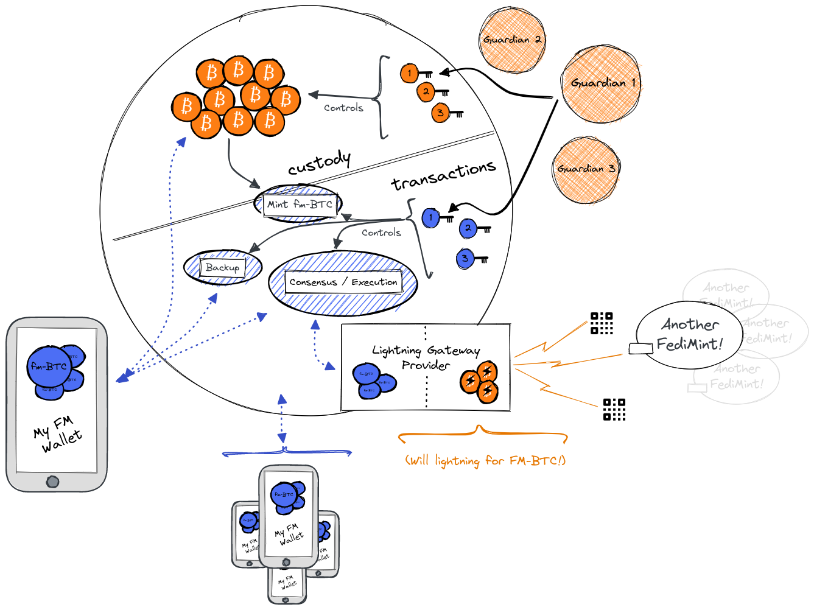

> *作者：Fedimint org*
> 
> *来源：<https://fedimint.org/docs/GettingStarted/What-is-a-Fedimint>*

一个 “Fedimint 实例”（全称为 “Federated Mint”），是一份 <a href="https://fedimint.org/docs/CommonTerms/Blind Signatures">Chaumian eCash</a> 的实现，带有一个由多位守护者（guardians）组成的、负责托管资金的联盟（而不是单个中心化的实体），并且，它原生支持比特币的闪电网络。

Fedimint 的用户体验被设计成类似于托管式的闪电钱包（例如 Wallet of Satoshi），但与之相比，Fedimint 的用户面对托管者（守卫者）可以获得更强的隐私性，并且，它有一套原生的备份机制，可以让用户从联盟处找回资金。

我们预计未来会出现许多个 Fedimint 实例，大的小的都会有。

为一个小团体部署一个 Fedimint 也是有意义的，例如，为一个具有成熟内部循环经济的小社区打造一个社区银行；此外，请记住，会有许多 Fedimint 实例部署在闪电网络上，而不会只有一个全球的 Fedimint 实例。

公开的协议，让比特币人的社区可以自己决定用它来做什么、可以协助彼此的资金保管和备份安排，并通过保护隐私的钱包来发起闪电支付。

一个一个 Fedimint 将由不同的社区各自运行、各自治理。

## Fedimint 部件的结构

Fedimint 由 5 个功能性部件：账户、托管及赎回、备份与复原、交易处理、闪电网关；三类角色参与其中：守护者、用户、闪电网关。我们用一张图将它们都表示了出来。

上图中的所有都系，都由三种核心技术支撑；这些技术的细节可见本说明书的 “[技术](https://fedimint.org/docs/GettingStarted/TechCompontents)” 部分。

### Fedimint 守护者

Fedimint 守护者是懂技术的社区成员，负责建立和运行联盟化的 Chaumian eCash 系统。他们托管和备份用户的资金，并负责铸造和赎回 eCash 票据（这些票据被用来取走比特币储备）。一个 Fedimint 的用户需要相信这个联盟不会形成一个串通的恶意多数（这样的恶意多数派可以偷走用户的资金）。

守护者们使用一套分布式的共识机制（[HBBFT](https://fedimint.org/docs/CommonTerms/HBBFTConsensus)）来协作（HBBFT 是运行在守护者的个人服务器上的 Fedimint 软件的一部分）。这种共识机制是异步的、拜占庭容错的，而且在少数联盟守护者失去互联网连接时也依然能存活和继续运行。如果多数联盟守卫者都是去连接，则会导致执行中止，直至达到阈值的守护者恢复连接，共识才会继续运行。

每个 Fedimint 都具有确定的联盟守护者，只有在一个联盟内部达成共识，才能为之增加和移除守护者。

- **账户和引导进入**：联盟守护者将运行 Fedimint 协议软件包，从而可以创建一种 “加入联盟 QR 码”。
- **托管和赎回**：联盟守护者各自持有保管比特币的门限签名合约的私钥。当一位用户运行存款流程时，守护者们会为之盲签名与所存入的比特币面额相等的 eCash 证书。
- **备份和复原**：联盟守护者将保存用户的钱包数据的 “碎片”（完整文件的一部分）的碎片。当用户发起复原请求时，守护者们将运行一个协议外的程序来确认复原请求的身份信息，并与其他守护者重新构造碎片并复原用户的资金。
- **交易处理**：审核提交给联盟的交易，以保证只有有效的 eCash 证书可以赎回、新的 eCash 证书可以在有需要的时候生成。（关于 FM 交易的工作原理，见[此处](https://fedimint.org/docs/GettingStarted/How-FM-Transactions-Work)。）

### Fedimint 用户

Fedimint 用户使用兼容 Fedimint 协议的钱包软件（比如 [Fedi](https://www.fedi.xyz/)）跟 Fedimint 交互。我们预计未来会出现许多不同的钱包应用，并且有意从兼容不同钱包的角度出发构建 Fedimint 协议。

我们假定 Fedimint 用户不需要专门的技术知识，就可以通过 Fedimint 模式发送和接收比特币。Fedimint 的初始应用场景是一种极为隐私的联盟化托管钱包。

- **账户和引导进入**：用户先要考察所选的 Fedimint 实例的守护者的声誉，确定自己愿意接受之后，只需扫描一个 QR 码，就可以连接一个账户。
- **托管和赎回**：用户可以请求存入比特币（“锚定”），换得 fm-BTC （eCash 票据）；还可以在自己的钱包中使用这些票据，以赎回链上的比特币（注意：用户也可以通过 LN 网关转出资金）。
- **备份和复原**：用户可以通过钱包应用加密自己的数据，并让联盟备份自己的数据。
- **交易处理**：用户可以提交将 fm-BTC 转移给其它用户的交易。此外，用户也可以将得到的 fm-BTC 换成新发行的 fm-BTC、而从结算一笔支付交易。
- **LN 网关**：作为在 Fedimint 内部转账的一种替代方式，用户可以创建合约（由 Fedimint 共识来执行），支付给闪电网络网关，让后者代表他们支付闪电发票，或者为他们生成可以支付的闪电发票。

从原理上来说，任何人都能成为一个 Fedimint 的用户，只要 TA 能拿到一个引导进入的 链接/QR 码。引导进入的流程本身由联盟的具体实现决定。

> 注意：用户所持有的钱 “fm-BTC” 实际上是 “电子化的不记名票据”，或者叫 “eCash 票据”，存储在用户的手机上。
>
> 它们不是账户余额，但是等价于带有面额的电子银行票据。因为它是电子化的，所以可以加密和备份。

### 闪电网络网关提供者

闪电网关指的是同时运行了一个闪电节点的 Fedimint 用户。

联盟可以选择同时运行自己的闪电网关，但我们将 Fedimint 协议的架构设计成任何用户都可以作为一个闪电网关、跟外部的广大闪电网络交互。

闪电网关监控 Fedimint 实例的情形，等待用户请求支付闪电发票或接收闪电发票。

在发送闪电支付时，Fedimint 用户将 eCash 锁定到一个包含一个闪电发票的合约中。闪电网关在支付完发票之后，可以从这个合约中领取 eCash 票据。

为了接收一笔支付，Fedimint 用户广播一个调整过的发票给闪电网关。网关付出 eCash 票据之后，用户就揭晓这个调整因子，网关就能接收闪电支付。

- **账户和引导进入**：类似于用户，闪电网络服务提供者也要愿意接受使某个联盟的 fm-BTC 的交换、提供通向闪电网络的流动性桥梁。
- **托管和赎回**：看用户的需要。可能闪电网关需要更多的赎回和存入服务，以主动维持 fm-BTC、闪电通道余额和链上资金的平衡。
- **备份和复原**：看用户的需要。
- **交易处理**：看用户的需要。闪电网关需要运行额外的后台软件，以自动化接受闪电服务合约的流程（更多细节见[此处](https://fedimint.org/docs/GettingStarted/How-FM-Transactions-Work)）。

需要一个市场发现的过程，让一个 Fedimint 的用户能够跟闪电网关达成合约。具体的规范的说明还在撰写中。

估计需要一个让闪电网关在联盟处注册自己服务的程序，以便于这样的发现，但也可能用多种不对外公开的网关，是用户可以直接达成合约的。

（完）