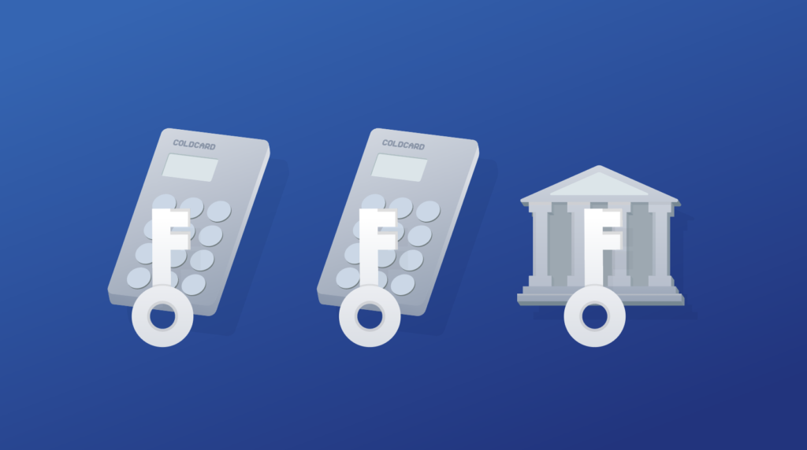
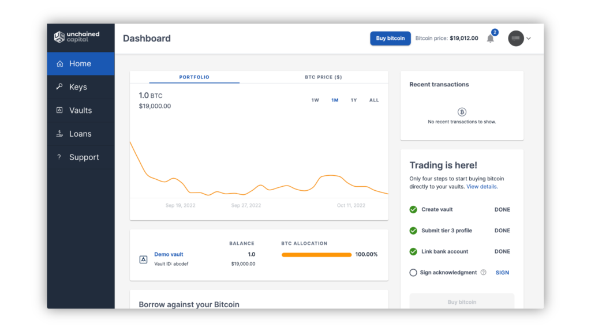

> *作者：Ted Stevenot*
> 
> *来源：<https://unchained.com/blog/what-is-bitcoin-hardware-wallet/>*

比特币硬件钱包是一种小型专用设备，会在断绝互联网的状态下为你生成可以保管比特币的公私钥并安全地存储。

比特币钱包软件使用你的密钥对为你生成地址、授权你的花费操作并确保你能安全访问链上资产。将比特币密钥离线（禁绝互联网连接）存储对保证比特币的安全性来说至关重要，可以最大程度上防范他人通过远程攻击和恶意软件窃取你的资金。硬件钱包通常会提供多样化保护机制，以防止任何能直接接触到你的硬件钱包的人获取保存在钱包内的密钥。

比特币硬件钱包（指设备本身）同样区别于 “比特币钱包”。比特币钱包是由单个主私钥生成的公私钥对集合。因此，一个比特币硬件钱包可以承载多个比特币钱包。

在本文中，我们将探讨以下几个问题：比特币硬件钱包是什么？有什么是它能做的？有什么是它做不了的？硬件钱包是如何签署交易的？硬件钱包具备哪些优势和劣势？

## 哪些是硬件钱包做不了的？

一个常见的误区是，硬件钱包将比特币存储在硬件设备中。事实上，没有哪个比特币钱包 —— 无论软件还是硬件 —— 将比特币存储在内部。相反，所有比特币都存储在链上（译者注：所有比特币的归属都由比特币区块链上记载的交易决定，说穿了所有的比特币都是电子记录）。硬件钱包存储的仅仅是用来控制比特币的 *密钥*。

有太多人误信比特币就存储在硬件钱包内，比特币业内人士建议不再继续使用“硬件钱包”这样带有误导性的叫法。但是，其它更准确的叫法，如“签名设备”或“签名器”，一直没有流行起来。

另外，硬件钱包无法查看链上比特币余额，也不能广播和验证比特币交易。执行这些功能需要另外的比特币钱包软件。（所有比特币钱包都需要连接到[比特币节点](https://unchained.com/blog/what-is-a-bitcoin-node/)，才能接收、传输和验证新的交易。）（译者注：硬件钱包是无法访问互联网的，所以读取不到交易的记录，也无法广播新的交易。）

## 哪些是硬件钱包能做的？

硬件钱包实现了接收、保护和花费比特币所需的多种功能。首次初始化时，（使用 [BIP 39 标准](https://en.bitcoin.it/wiki/BIP_0039)的）硬件钱包会生成一个种子作为构建比特币钱包的基础。地址是基于种子生成的，用来在链上接收比特币。一旦收到比特币，你就可以使用硬件钱包签署（授权）比特币交易。硬件钱包还可以通过备份助记词找回之前创建的比特币钱包。

我们来逐一分析各个功能。

### 生成种子

在设置阶段，大多数硬件钱包会为你生成种子。这个种子是一个随机生成的巨大二进制数字字符串，可以使用人类可读的形式（[助记词](https://unchained.com/blog/what-is-a-bitcoin-seed-phrase/)）来表示。在钱包设置阶段，你会看见一组由 12 或 24 个单词组成的助记词。请你务必将这些单词按正确顺序抄写下来，[并离线存放在一个安全的地方](https://unchained.com/blog/how-to-store-bitcoin-seed-phrase-backups/)。

- 比特币助记词备份 -

[助记词](https://unchained.com/blog/what-is-a-bitcoin-seed-phrase/)不同于生成比特币地址的私钥。助记词生成“主私钥”，主私钥生成钱包的所有地址以及与它们相关的公私钥对。现如今，[确定性钱包](https://en.bitcoin.it/wiki/Deterministic_wallet)可以生成几乎无限多的比特币地址（并为每个地址生成了公私钥对），这些地址都源自同一个助记词。（译者注：从逻辑上来说，主私钥是先生成公私钥对，再生成对应的地址的；当然，最终的结果是，主私钥可以生成无数个地址。这也是软件钱包生成地址的原理。）

**硬件钱包如何生成助记词？**

硬件钱包首先生成一个种子，然后将其映射到[一个包含 2048 个单词的单词表](https://github.com/bitcoin/bips/blob/master/bip-0039/english.txt)上得到助记词。硬件钱包利用[多种方法](https://bitcointalk.org/index.php?topic=5317199.0)来实现随机性，例如，随机数生成器（RNG）。很多硬件钱包都内置了一个独立的微处理器（叫作[安全元件](https://unchained.com/blog/bitcoin-what-is-a-secure-element/)），RNG 固件就在安全元件上运行。有些钱包则将内外部资源结合起来生成熵，最常见的一个例子就是[掷骰子](https://coldcard.com/docs/verifying-dice-roll-math)。

### 存储种子、助记词和私钥

完成初始化之后，你的比特币钱包种子（以及对应的助记词）就存储在硬件钱包内。如果你的硬件钱包使用了安全元件，种子通常就存储于设备内部，无法以明文形式从设备中导出。

对导出种子的限制正是硬件钱包安全性的来源之一。硬件钱包是一种“冷存储”形式，因为它们将种子存储在与互联网隔绝的环境中。由于攻击面较少，硬件钱包从理论上来说可以连接到一个感染了病毒的计算机（不建议这么做！）。即使在这种情况下，硬件钱包仍旧能保护好你的种子。

### 签署交易

硬件钱包的主要用例是安全签署交易，即，授权花费你的比特币钱包里的比特币。如果你使用的是单签钱包，只需一个硬件钱包的一个签名就足以转移你的比特币。如果你使用的是[多签](https://unchained.com/blog/why-multisig/)钱包，通常需要来自两个或以上不同硬件钱包的签名来转移你的比特币。

- 包含 2 个 Coldcard 和一个协同托管方的 2/3 多签机制 -

为了签署交易，硬件钱包必须与桌面或智能手机上的钱包软件通信。不同类型的硬件钱包可能会通过不同方式与你的设备连接，例如，USB、蓝牙或 [NFC](https://en.wikipedia.org/wiki/Near-field_communication)。完全无接触的（即，不直接连接到互联网）解决方案同样可用，包括使用相机、二维码或 SD 卡在硬件钱包和设备之间传输数据。

就离线“冷存储”解决方案而言，将你的硬件钱包连接到联网设备似乎是违反常理的。但是，正如上文所言，即使是在联网的情况下，你的钱包种子连同对应的公私钥对也是与网络隔离的，可以确保安全性。

**硬件钱包是如何签署交易的**

使用硬件钱包签署交易需要完成一系列步骤。在整个过程中，私钥不会离开硬件钱包或接触联网设备。只有（已签署和未签署的）交易数据在硬件钱包和软件钱包之间转移。

典型的交易签署步骤：

1. 在钱包软件中创建一个未签署交易：指定金额、交易费和收款地址。此时，由于该交易尚未签署，我们无法将其发送至比特币网络。
2. 钱包软件通过你正在使用的连接方式（有线连接、非联网方式、二维码等）将未签署交易发送给硬件钱包。
3. 硬件钱包会向你展示交易细节以便你再次检查软件是否篡改了任何交易细节，比如更换了地址。你能借此机会发现问题。
4. 点击硬件钱包上的按钮确认交易。
5. 硬件钱包使用相应私钥签署交易。
6. 硬件钱包将已签署交易传回钱包软件。软件可以看到交易已签署，但是无法通过签名提取私钥。
7. 一旦必要签名全部集齐，交易变得有效。钱包软件会将该交易广播至比特币网络。

### 复原钱包

硬件钱包也可以用来复原钱包。假设你设置了一个比特币硬件钱包，记下了助记词。然后，你的硬件钱包遭遇了意外，如，火灾、盗窃、水灾、故障、丢失等等。找回比特币的一种方式是，使用你的助记词通过新的硬件钱包复原你的钱包。在设置新的硬件钱包时，你可以选择是创建一个新的钱包还是找回已有钱包。如果你选择找回已有钱包，可以输入该钱包的助记词，找回你的比特币。

### 验证地址

比特币交易是无法改变的。也就是说，如果你将比特币发送到了错误的地址上，就会永远失去这些比特币。幸好硬件钱包可以让你在发送比特币之前检查你的比特币地址。在你的硬件钱包上检查你的地址：

1. 你可以确认地址是否正确。如果你使用的是多签模式，设备将告诉你是 2/3、3/5 还是其它阈值（不能是 2/5，否则只要其中有两个私钥是攻击者的，攻击者就能控制你的比特币）。
2. 你可以确认你所使用的计算机没有遭到攻击者的恶意软件入侵。恶意软件会向你展示错误地址。
3. 你可以极度确信自己持有设备所显示的地址的密钥。这个地址就在你的控制下（因为这个地址就由你的设备控制）。

在向某个地址发送一定数量的比特币之前，请你务必检查硬件钱包上的收款和找零地址。

## 硬件钱包软件

大多数硬件钱包需要制造商的钱包软件来初始化设备。很多人也会为了钱包功能而选择使用原始设备制造商的软件。不过，只要你愿意，一旦初始化完成，你就可以使用第三方比特币钱包软件与你的硬件钱包一起管理你的比特币。常见的选择有 Sparrow、BlueWallet 和[我们自己的多签钱包解决方案](http://unchained.com/vaults?_gl=1*1ih67pr*_up*MQ..*_ga*NzM3MDU3NDc1LjE2NzA5MDExMjg.*_ga_N2E2DZCQWE*MTY3MDkwMTEyNy4xLjAuMTY3MDkwMTEyNy4wLjAuMA..)。

- Unchained Capital 钱包用户界面 -

当你将硬件钱包连接到钱包软件时，你主要是会跟安装该软件的设备（惦念或智能手机）交互。但是，如上文所述，硬件钱包绝对不会将你的私钥与该设备共享。所有交易签署都发生在硬件钱包上，然后再（把签好的交易）传给钱包软件。

## 硬件钱包的取舍

就安全存储你的比特币公私钥对而言，硬件钱包的优势远远大于其劣势。相比在线存储公私钥对的[热钱包](https://www.investopedia.com/terms/h/hot-wallet.asp#)等替代方案，硬件钱包具有的优势更大。

我们还需要注意以下几点：

- 硬件钱包虽然适用于冷存储，却未必是大量交易（例如，高频交易或购买咖啡）的最佳选择。

- 硬件钱包可以抵御多种形式的恶意软件，但是有一些恶意软件专门针对硬件钱包（即，<a href="https://unchained.com/blog/21-ways-lose-bitcoin/#:~:text=and%20bitcoin%20wallets-,Clipper,-which%20changes%20a">clipper</a> 恶意软件）。

- 硬件钱包有购买成本，通常是 75 至 150 美元。相比之下，很多软件钱包不会产生任何成本。

## 开启你的比特币自托管之旅

硬件钱包在保护你的比特币的安全性方面起到了关键作用，但是新手用户难免望而生畏。好消息是，即使你是新手，也不需要摸石头过河了。Unchained Capital 提供个性化服务 Concierge Onboarding，可以通过视频通话指导你使用硬件钱包创建多签保险柜。 

（完）