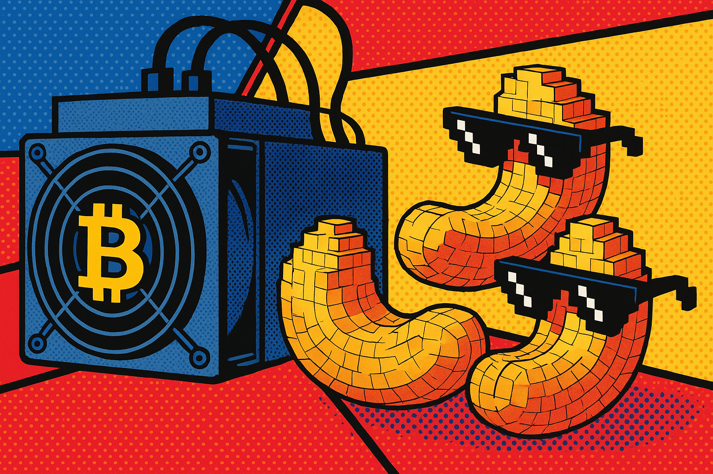
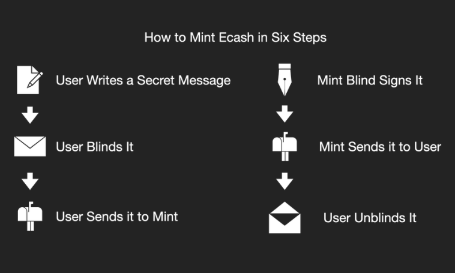
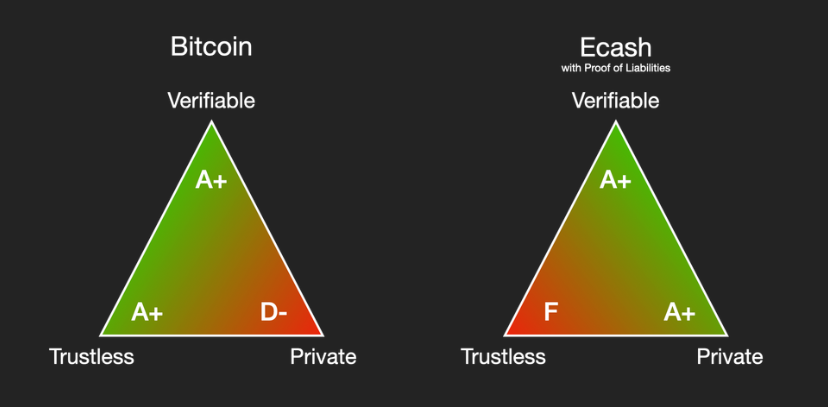

> *作者：vnprc*
> 
> *来源：<https://blog.cashu.space/what-is-hashpool/>*

“Hashpool” 是一种无账户的矿池，使用 ecash 来代表挖矿份额（shares）。与现有的矿池协议不同，Hashpool 利用密码学掩盖了用户的身份，并创建了一种自由市场来交易挖矿份额。

## 矿池的问题

在比特币诞生的时候，每个人都能在自己的笔记本电脑上通过运行比特币软件来挖矿。在最近 15 年间，事情发生了很大变化。矿工需要购买专用的硬件（ASIC 矿机）、加入矿池；而矿池又是为带有几千台 ASIC 矿池、7 乘 24 小时运营的大矿场而优化的。这种环境对刚刚起步的小矿工极其不利。

### 最小取款额度和入场费

所有的矿池都有最小的取款额度门槛，这意味着，如果你想从一台最小型的 ASIC 矿机开始挖矿，你要挖好几年，才能在链上取回第一笔挖矿收入。

一些矿池为闪电取款提供更低的取款门槛，但使用闪电网络也有自身的难题。如果你使用一个托管型闪电钱包，你会交出所有的交易隐私权，而且你的资金将总是处在被托管商盗走的风险中。

如果你决定使用一款自主保管的钱包，可以消除上述跑路风险，但需要付出应付技术复杂性的精力。你需要开启一条闪电通道，然后才能使用自己的钱包，这又需要付出链上手续费。如果你已经有一些比特币了，那么你可以跟另一个闪电节点购买一条通道；为此，你需要付出一笔入场费，跟你要求的通道容量成正比，对于希望从零起步的新用户来说不是愉快的经历。

### 挖矿隐私性

今天的矿池协议在隐私性上也很糟糕。大部分矿池都要求你完成 KYC，然后才能创建一个账户。即使是不要求 KYC 的矿池，运营者也直到你的三项关键信息：你的 IP 地址（很容易关联到你的身份）、你的哈希率，以及对你的比特币支付。结果是，私密地挖矿，或者从小规模开始，变成了一个差劲的选择。

## Hashpool 改进了什么？

Hashpool 使用一种叫做 “ecash” 的隐私技术来解决这些问题。Ecash 并不是一个新想法，它在 1982 年就出现了，但在 1990 年代和 2000 年代都没有获得成功。在比特币作为一种原生的电子健全货币出现之后，ecash 才迎来复兴。

### Ecash 的工作原理

一个 ecash token 是由一个托管商（称作 “铸币厂”）发行的一个不记名的资产。铸币厂就像电子银行，而 ecash 可以理解成一种纸质的银行票据。一个 ecash token 就是一张 IOU（借据），标的是该铸币厂托管的某种资产。现代的 ecash 铸币厂运行在比特币本位上，并且可以发送和接收闪电支付。这让它们可以跟任何交易所、钱包以及闪电网络上的商家互操作。

支撑 ecash 的秘密武器是一种叫做 “盲签名（blind signing）” 的密码学技术。盲签名有点像是复写纸（carbon paper）。如果你在两页纸之间夹一张复写纸，那么你写在上面这张纸上的东西也会自动转印到下面那张纸上。设想你要写一封信，你在写好的信上放一页复写纸，然后将两张纸都塞进信封，封好。现在，你把信封拿到银行取，让一位银行经理在上面签一个名（但不让 TA 拆开）。当你再把信封打开的时候，信纸上就留下了一个来自银行经理的有效签名，但那个银行经理对信的内容可是一无所知。他们一无所知地签名了你在信纸上的信息。

Ecash token 的工作原理就是让铸币厂在用户存入一些资产后盲目地签名一个秘密值。然后，用户私密地解开这个秘密值和签名。感谢密码学，这个解除遮蔽的签名可以由任何知道这个铸币厂的公钥的人验证。成对的解除遮蔽的秘密值和接触遮蔽的签名，就组成了一个 ecash token 。就跟纸币一样，ecash 可以自由转移，不需要让铸币厂知道用户的身份。

### 隐私性

Hashpool 使用 ecash 来实现无需账户的矿池。矿池不再需要维护一个数据库、跟踪每一个用户账户的余额，只需要为每一个挖矿份额发行 ecash token，然后跟踪自己发行了多少 ecash token 就行了。这意味着不需要知道谁在挖矿、谁取走了挖矿奖励。

Hashpool 也是为小型矿池的运营者而开发的。默认情况下它就不需要用户登录，也不需要提交 KYC 信息。但是否要鉴别用户还是取决于运营者自己。只要世界上还有至少一个Nimitz的 hashpool 实例，任何人都可以匿名挖矿。这不酷吗？

### 最小取款额度门槛

因为 ecash 的效率是如此之高，所以它没有最低支付门槛。你可以发送一聪到一个全新的钱包中，就像发送 100 万聪一样容易。只要你的 hashpool 实例支持 ecash 支付，就没有入场费。这意味着 hashpool 可以高效地服务最小体量的矿工。Bitaxe 的粉丝们欢呼吧！（译者注：Bitaxe 是一种体积极小的家用挖矿设备。）

### eHash

挖矿份额是比特币的前身，是挖掘新比特币的过程中的必要组成部分。如果把比特币比作喷气燃料，那么挖矿份额就是原油。它们是可以转化为有价值产品的原料。因此，Hashpool 并不发行比特币支持的 ecash 来交换挖矿份额，相反，它使用一种新的资产，叫做 “eHash”。Ehash token 是由工作量证明（而非比特币）来支撑的 ecash token 。

## 挖矿行业的未来

Ehash 需要一些时间来积累比特币价值。在 eHash token 发行的一段时间之后，它获得该矿池（在这段时间内）找到的每一个比特币区块的价值。一旦这个时间窗口过去，这个 eHash token 就停止积累价值，可以赎回比特币，不论是通过闪电支付还是链上交易，还是使用 ecash 。

Ehash 可以自由交换，但它的价格并不是固定的。每一个 token 都代表着对未来将发放的一些资产的请求权。这让 ecash 成为一种期货工具。挖矿期货是非常有用的，原因有两个：它让矿工可以通过（在完全成熟之前）卖出自己的份额来对冲风险，也让买家可以买到按风险打折的比特币。

在许多国家，期货市场是普通人无缘的。使用 hashpool，任何地方的任何人都可以按任意的操作规模获得比特币区块奖励的期货。感谢 ecash 的效率和隐私性，这些期货工具将迅速流动，而且自由（就像词语一样）。起飞！

## 但 Ecash 不是托管的吗？

ecash 所面对的来自比特币人的最常见的批评就是，它是一个托管系统。这当然是对的。比特币的一个标识性属性之一就是它是免信任的、自我保管的；使用比特币你不需要得到别人的许可。跟比特币不一样，ecash 需要你信任你使用的铸币厂。

但这在现实中意味着什么，则非常简单：*<strong>不要</strong>在一个 ecash 铸币厂中存储你的毕生积蓄。*你应该把这些聪放在链上，用离线的冷存储来保管私钥。Ecash 就像现金，只要钱包里有足以覆盖日常支出的数量就够了。

## 梦幻团队

我喜欢从三个角度描述电子货币：免信任性、隐私性，以及可验证性。比特币在免信任性和可验证性上非常强劲。我们还没发现更容易、更精确验证的别种货币。除了黄金这样的大宗商品，也没有别的东西像比特币那么免信任。在这两种指标上，比特币无与伦比。但因为区块链的特性，比特币的隐私性相当一般。

世界上的任何都可以使用区块链浏览器网站来观察比特币的流动。一旦某个比特币地址被盯上，其所有的交易历史和未来交易都可能被监控，除非地址的主人主动采取措施来重获隐私性，比如 coinjoin、coin swap 或其它隐私技术。这是中本聪在创造比特币的时候作出的取舍。

Ecash 则相反，牺牲免信任性，但加强隐私性。密码朋克们也一直在开发让铸币厂完全可验证的协议，叫做 “债务证据（Proof of Liabilities）”，当前还在开发中。感谢盲签名，ecash 在理论上拥有完美的隐私性。与比特币不同，ecash 没有交易图，所以甚至连铸币厂也没法将用户间的支付关联起来。

现实中，用户可以自由交换 ecash 和比特币，利用它们各自的优势、避开它们的短板。这就是 ecash 何以是比特币的一个梦幻模块、它何以迎来复兴的原因。这两个家伙，是梦幻团队啊！

## 更好的托管商

ecash 铸币厂是最好的那种托管商：尊重隐私的、没有账户的托管商。这是对基于账户的托管商的一个巨大改进，因为它意味着铸币厂不能选择性拒绝服务。所有的矿池都天然是托管服务。而 Hashpool 让矿池可以成为最好的那种托管商：隐私的、可验证的托管商。

Hashpool 应该处在开发的初步阶段，我们渴望得到你的帮助！如果你希望做些事情，就来联系我们！

（完）