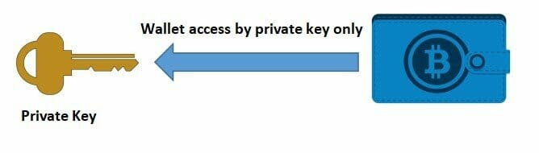
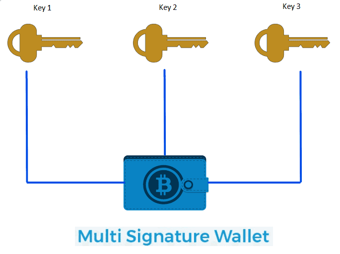
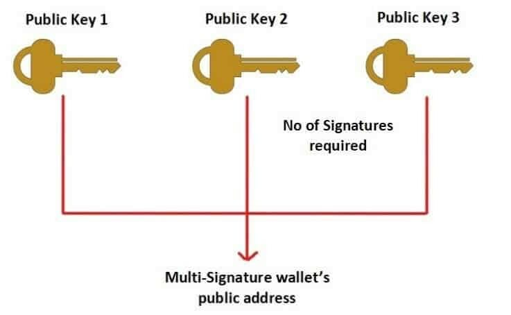
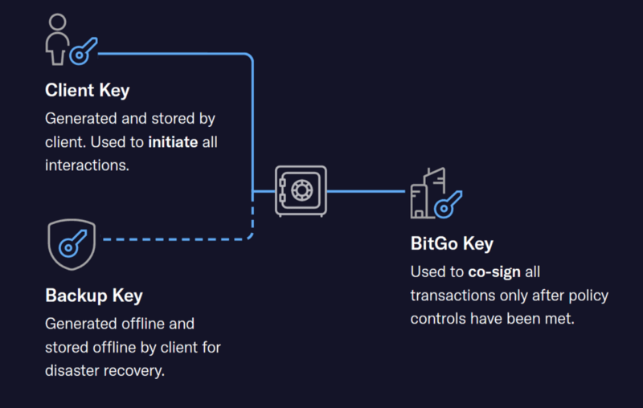

> *作者：Gaurav*
> 
> *来源：<https://blog.coincodecap.com/multi-signature-wallet>*

在本文中，我会介绍多签名钱包。多签名钱包常被缩写为 “Multisig wallet”。本文会给出非常基础的介绍。我会解释人们为什么需要多签名钱包、其运作原理、公开地址的生成流程，以及交易的签名流程。最后，我会介绍集中多签名钱包，比如 [Armory](https://www.bitcoinarmory.com/)、[BitGo](https://www.bitgo.com/services/custody/wallet-platform/)、[CoPay](https://github.com/bitpay/copay)、[Coinbase](https://wallet.coinbase.com/) 和 [Electrum](https://electrum.org/#home)。

## 为什么要使用多签名钱包软件？

所谓的比特币交易，就是在[比特币钱包](https://blog.coincodecap.com/best-btc-wallets-for-android)之间转移资金的操作。比特币钱包的实质是一个秘密字符串（有英文字母、有数字），叫做 “私钥” 或者 “种子”。私钥是用了签名交易的，这个签名是一种数学上的证明，证明这笔资金转移确实是由这个钱包的主人发起的。这个数字签名也保证了，发出的交易在传播过程中不会被人篡改。

- 单签名的比特币钱包，钱包只能由唯一的一把私钥来操作 -

假设我有 100 个比特币，所有的比特币都放在我的一个钱包里，这个钱包只能由一把对应的私钥来操作。如果我想发起比特币交易，比如转 50 个比特币给我的朋友，我必须使用对应的私钥来签名。这也就是说，只要我掌控着这把私钥，就只有我能用这个钱包发起交易。

**但要是我弄丢了我的私钥，或是别人知道了我的私钥呢**？这个钱包里所有的比特币都会丢失！

多签名钱包正是为了处理这种情况而出现的，可以提高你的密码货币的保管安全性。

## 什么是多签名钱包？

多签名钱包可以用多个私钥（比如 3 个）来操作，而且我可以自设规则，比如 “至少需要这 3 个私钥中的任意 2 个才能转移这个钱包里的资金”。也就是说，需要其中任意两个私钥的的签名才能发起交易。我也可以设置 3-3 的规则，即只有全部 3 个私钥的签名才能发起交易。

- 多签名的比特币钱包，不止一把私钥 -

举例，用户可以根据自己的需求设置这样的规则：

**1-2 多签**

两个很要好的朋友相互信任，希望有一个共享的账户。设置 1-2 多签钱包之后，他们都可以凭各自的私钥访问同一批资金。两个人都可以独立发起交易（类似于合伙账户）。

**2-2 多签**

你可以把一个私钥保存在手机里，另一个保存在笔记本电脑上。需要两个私钥才能转移资金。

**2-3 多签**

类似于 [Bitrated](https://www.bitrated.com/faq#trades-payments)。Bitrated 是一个为买家和卖家安排仲裁的平台。它会创建一个三方参与的多签名钱包，释放资金需要且仅需要两个签名。假如买家和卖家都满意，那交易可以直接完成，不需要仲裁员介入。如果某一方请求调解，那仲裁员就介入，评判对错侯参与分割资金。

当然，还可以有 5-8 多签名钱包、3-6 多签名钱包，等等。1-1 的就是单签名钱包啦。

有了多签名钱包，我们就能为两种意外安排预案：

1. **如果 Eric 知道了我的一个私钥**，他还是没法转走我的钱，因为我设置了 2-3 多签名。根据这个规则，Eric 还需要一把密钥来访问我的钱包。
2. **如果我弄丢了我的一个私钥**而我设置了 2-3 的多签，我仍然可以使用另外的两个私钥来操作我的资金、发起交易。

**但这里还有一个问题，我该如何管理我的私钥，或者说我该如何安全地保管自己的私钥呢？**

这里，我们假设需要保管三个私钥。 

如果我把两个私钥保存在手机上，一个保存在笔记本电脑里，并且我设置了 2-3 的多签。那要是 Eric 拿到了我的手机怎么办？

1. Eric 将能使用我存储在手机上的两个私钥操作我的多签名钱包。
2. 我也将毫无还手之力，因为我只剩一个私钥。

因此，妥善管理私钥是个刚需。

为避免单点故障，我们需要在 3 个地方分别存储这 3 个私钥。比如，

甲私钥存在手机上。

乙私钥存在笔记本电脑上。

丙私钥存在一个不联网的保险柜里。

这样一来，即使 Eric 拿到了我的笔记本电脑，也只拿到了乙私钥，他没法用我的多签名钱包发起交易池，因为他只拿到了一把私钥；即使我弄丢了自己的手机，我的钱也还在，我还有两把私钥。

唯一一个我们要牢记在心的事情就是不要把所有的私钥都放在一个地方。

## 多签名钱包地址的概念

我们已经了解了多签名钱包的工作原理。但还有其它的一些问题，比如，如何给一个多签名钱包发送资金，以及在发起交易时如何签名。

首先，我们要理解三个术语：

**公钥**：公钥是一个字符串，可用来接收比特币。由私钥推导而来。

**私钥**：如前所述，私钥用来发送资金。用户必须保证私钥的安全。

**公开地址**：一般来说是公钥的哈希值，当某人想要接收资金时，只需把地址出示给支付的一方。

假设我们想要使用三个私钥来创建一个多签名钱包，这三个私钥都有自己相应的公钥和地址，如：

私钥 1，公钥 1，地址 1；

私钥 2，公钥 2，地址 2；

私钥 3，公钥 2，地址 3。

要生成这个多签名钱包的公开地址，我们需要提供所有三把公钥（即公钥 1、2、3）作为输入。同时我们也要定义发送交易的签名阈值，在我们这个例子中就是 2 个。

- 多签名钱包的公开地址 -

细节此处不表，但这样就生成了**一个多签名钱包的公开地址**，这个地址可以分享给其他人。所有发往这个之地的资金都使用多签名来解锁。与这个地址同时生成的还有一个叫做 “赎回脚本（Redeem Script）” 的数据，用户要保管好这个数据，并在多签名钱包发起交易时提前分享给所有参与方，这样才能验证这个地址的真实性。

现在，大体上来说，你已经知道多签名钱包的地址是如何生成的了。

## 多签名钱包交易的签名

我们继续。

假设私钥 1 的主人希望使用多签名钱包来发送一笔交易（发送 10 btc 给某个地址），TA 要先初始化一笔交易，并使用其私钥签好名。然后，TA 需要把这个交易分享给私钥 2 和私钥 3 的主人。两人中的任何一位给交易签名之后，这笔交易就有两个签名了，满足规则了。这就是交易的处理方式。

## 支持多签名钱包的软件推荐

### **Armory**

- [Armory](https://www.bitcoinarmory.com/) 是一个开源的桌面端比特币钱包软件。
- 用户可使用 Armory 来生成和存储比特币私钥。是这里推荐的钱包中最安全的。
- 它支持冷存储，即私钥只能在离线的电脑上使用。这样做可以降低风险。
- 它也支持多签名钱包。用户可以使用 Lockboxes，以完全分布式的方法创建多签名的钱包和地址。

### **BitGo**

- BigGo 软件拥有桌面版、网页版和手机版。
- 同样支持多签名技术，是这里推荐的钱包软件中功能最强大的。

- 它使用 BitGo 的多签名安全和 3 密钥管理体系来保护你的钱包。
- 私钥 1：也叫客户端私钥，用户自己存储，用于在客户端软件中发起和签名交易。
- 私钥 2：也叫 BitGo 私钥。由 BitGo 团队持有。用于签名由客户端发来的交易。在签名前 BitGo 会检查交易是否满足所有的使用条款。
- 密钥 3：也叫备份密钥。由离线的客户端存储。用于意外之后恢复钱包。

### **Coinbase**

- [Coinbase](https://wallet.coinbase.com/) 仅支持在网页端使用。
- 它是一个托管型的钱包 —— 用户无需存储私钥，Coinbase 会管理一切。
- 它也支持非托管的多签名钱包，用户可以自己控制私钥并使用多签名钱包。

### **CoPay**

- [CoPay](https://github.com/bitpay/copay) 由手机版和桌面版。
- 是一个开源的层级式确定性（Hierarchical Deterministic）钱包，你可以通过 seed phrase 来备份你的钱包、防止丢失控制权。
- 支持多签名钱包，用户需自己保管子要。

### **Electrum**

- 支持手机端和桌面端。
- 开源的层级式确定性钱包。
- 支持多签名和冷存储。

## 结论

我们讲解了多签名钱包的概念，其工作原理，并介绍了几种支持多签名钱包的软件。这里，我们可以稍微做个总结。

- 多签名钱包可以使用多个私钥来操作。用户可以自定义转移资金需要的 签名/私钥 的阈值。
- 多签名钱包的每个私钥都应该保存在不同的设备中，以避免一锅端。举例而言，若分散存储，即使弄丢十三场，用户也可以通过保存在其它设备中的私钥来使用钱包。
- 多签名钱包在安全性上同样有优点。即使某个黑客拿到了你的一把私钥，如果你设置了例如 “需要两个私钥来使用这个钱包” 这样的规则，这个黑客也无法转走你的钱。

希望你觉得这篇文章有用。

（完）