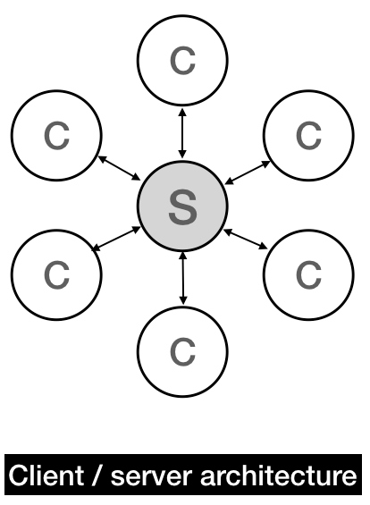
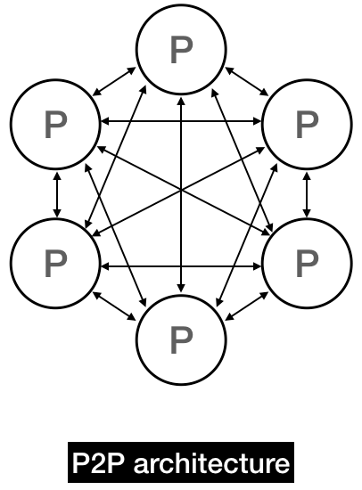
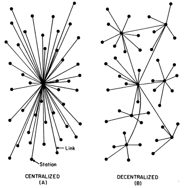
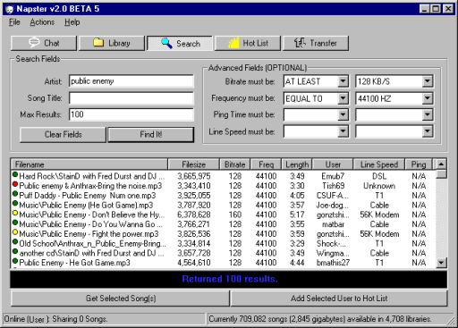
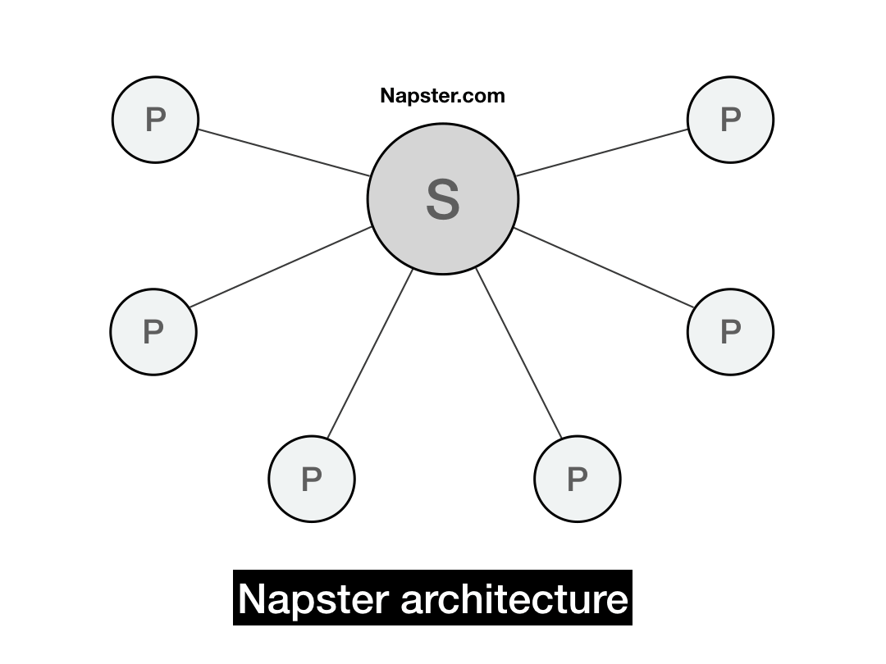
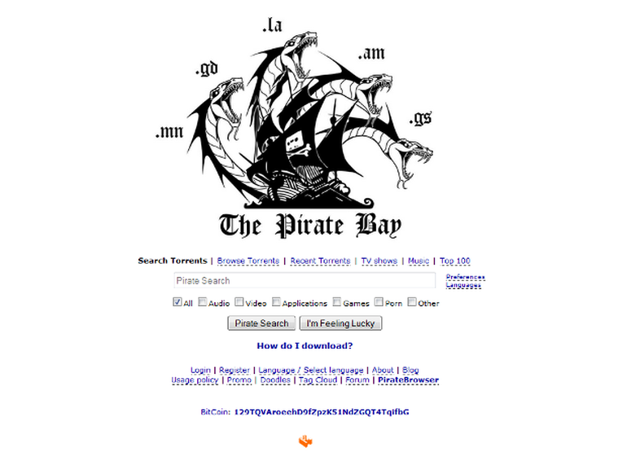

> *作者：Haseeb Qureshi*
> 
> *来源：<https://nakamoto.com/p2p-networking/>*

如果我们想从根本上理解密码学货币的运行方式，光懂密码学是不够的。密码学货币之所以能成功，靠的不仅仅是密码学安全性，还需要去中心化。中本聪在本世纪初的点对点网络的发展进程中学到了很多经验教训，这些经验教训指导了比特币网络层的设计。

我们将在本文探讨比特币的网络模型，以及它是如何实现它的两大主要目标的：去中心化和抗审查。

## 网络架构

传统的网络服务都是以 客户端-服务器 的中心化模式为架构的。中央服务器提供服务，各个客户端则向服务器请求数据或工作。几乎所有网络应用都是这个结构：脸书、谷歌、Wordpress 等等。现在的 “中央服务器” 通常是一个[负载均衡器](https://www.nginx.com/resources/glossary/load-balancing/)背后的服务器集群，但从抽象一些来看，它们的架构是完全一样的。

客户端-服务器 架构是一个中心化网络架构，完全取决于单一的参与方，一旦中心服务器宕机了，服务就中止了（就像 DigiCash 那样）。

而点对点网络则是一种分布式网络架构，不存在中央服务器。每个节点都承担一部分该网络的负载。这就意味着每个节点都可以对网络发起请求但也必须响应其他节点的请求。我们可以把点对点网络看成一个融合了客户端和服务器两个角色的 “蜂群”。

点对点网络之所以受人关注，是因为它能让我们实现**去中心化**。去中心化网络不依赖于任何单一节点，也因此对于任何单点宕机或者离线有高容忍度。

好的，去中心化听起来是挺酷的，但，说到底，它真的能让一个系统变得更优越吗？

去中心化可以给我们带来两个我们想要的特性：第一，**宕机容错**，意味着系统可以承受单个节点错误或故障，即使一个节点死亡，整个系统可以照常运行。这对于可拓展性至关重要，因为[大型网络中的节点故障不可根除](https://www.datacenterknowledge.com/archives/2008/05/30/failure-rates-in-google-data-centers)。

- 来源：维基百科 -

去中心化给我们带来的第二个特性是抗审查性。如果某一个节点遭受审查，但网络整体上是去中心化的，那就无关紧要，系统剩下的节点会继续运行。要做到审查去中心化网络，所有节点都必须串谋配合来执行审查，这在大型网络中很难实现。如果我要在一个去中心化网络中搜索一份文件，只要一个节点愿意响应我的请求，我就能成功找到。

但我们为什么这么关注这些网络特性呢？毕竟也没有谁要拿下或者审查这些网络，对吧？

一段点对点网络的发展简史可能会让你明白为什么中本聪这么看重比特币的这些性质。

## 点对点协议简史

上世纪九十年代，在大型分布式系统中协作大量计算的事情还非常罕见。MapReduce 或者 HDFS 还未发明，因此，大规模的分布式计算非常罕见且成本高昂。点对点协议是第一个在计算机数量上算是大规模的分布式系统（除了互联网本身以外）。

Napster 并不是第一个点对点协议，但它是第一个进入主流的点对点协议，证明了点对点模式的潜力。

Napster 是在 1999 年由两位大学生 Sean Parker 和 Shawn Fanning 创建的。它提出了一个简单的价值主张：你可以从 Napster 网络中的任何客户端上下载 MP3 文件。

- Napster 客户界面，完全是九十年代的复古风格。来源：Andrew Orlowski -

Napster 的架构非常简单，有一个 Napster 中央服务器，可以看作是一个大型检索索引表，了解所有节点与他们分享的内容。它把内容元数据保存为元组：`(filename, ip_address, port_number)`。

一个新节点加入网络时，会给中央服务器发送它愿意分享的文件列表，服务器随后更新自己的检索索引，将新的共享文件放入列表。

用户需要查找一个文件时，服务器就会查询索引表，再把相关结果展示给用户。由于查询出来的结果都是其他节点的文件，用户需要 ping 相关用户的 IP 地址来查看他们的下载延迟与网速。

用户选出自己想要下载的文件之后，TA 所用的协议客户端软件就会直接向该文件指向的 IP 地址提取文件。所有文件都在两个节点之间直接传输，Napster 服务器这时已经完全不参与了。

从某种意义上说，Napster 是 客户端-服务器 模式与点对点模式的过渡，服务器仅仅是 MP3 下载用户的匹配引擎。而且事实证明，很多人都想下载 MP3。

Napster 发布不久后就火了，在鼎盛时期拥有超过八千万用户。2001 年，它时常让大学宿舍的高速网络超载，很快就被许多大学禁了。

- 2000 年 10 月《时代杂志》封面上的 Shawn Fanning -

2000 年，Napster 被 Metallica、Dr. Dre 与 A&M 起诉侵犯版权，这些诉讼为 Napster 带来了更多新闻报道与宣传。但当法官宣判了让 Napster 停止版权音乐交易的禁制令后，事情终于告一段落。

## Napster 给我们的教训

虽然我们把 Napster 称作点对点网络，但在文件查询上，**Napster 的设计完全是客户端-服务器模式**，只有在文件传输方面是点对点的。这就使网络架构中出现了一个被依赖的单点（也就是所谓的 “单点故障”），在 Napster 公司关门大吉后整个网络就消失了。

Napster 对于网络安全方面的考量也不足，所有的消息和请求都以纯文本的形式发送，所有 IP 地址都是公开的，使系统几乎毫无私密性。

但最终，Napster 棺材上的最后一颗钉子是法律的钉子，不是技术的钉子，Napster 被判对用户的侵犯版权行为负有法律责任。即使 Napster 作为公司本身没有直接侵犯任何版权，法官仍旧判定 Napster 引诱其用户侵犯版权，因此 “间接侵犯” 了版权所有人的利益。

法院要求 Napster 立即停止所有侵权行为，Napster 随后声称他们可以实施一项能够阻止 99.4% 侵权行为的解决方案，但法院坚持认为 Napster 应该百分百阻止侵权。

## 后 Napster 时代

最终，Napster 申请破产。其资产被出售，重新包装成了 Rhapsody。但 Napster 掀起了一场巨大的风暴，让我们几乎忘记了风暴的始作俑者。诸如 LimeWire、KaZaA 一类的网络继承了 Napster 的特征，创建出了局限性更少，性能更强且愈加去中心化的点对点协议。

随着时间流逝，所有这些协议最终都被 BitTorrent 所替代。到 2009 年为止，以 BT 为主力的点对点文件共享已占全球互联网流量的 70%。BT 网络发展至今，已成为世界上最大的点对点网络，并且是大多数国家最大的上传流量来源。

我们应该停下来反思一下：为什么 BitTorrent 成功了，而其他大多数协议都随着时间逐渐消失了？

一个原因是 BT [投桃报李](https://en.wikipedia.org/wiki/Tit_for_tat#Peer-to-peer_file_sharing)模式的带宽共享，也就意味着为其他节点提供更大带宽的节点也将获得更大的下载带宽。这种互惠的体制能有效阻止用户白嫖网络资源，也鼓励用户提前付出。（实际上，这种投桃报李的模式并不完全有效，但它也是对先前的文件共享协议的改进）BT 协议在带宽占用方面也非常高效，对于需求量大的文件来说尤其如此。

但在许多方面，BT 协议成功的核心实际应归功于其无可指摘的表态。他们的开发者从不提倡将共享有版权的文件视为对服务的合法使用。他们将 BT 定义为 “一种为网站服务的更好的方式”，并且他们的网站仅提及无关痛痒的用例，例如 Linux 各种发行版或者魔兽世界游戏的更新下载。

即使你想找茬儿，你也找不到一个中心化的 BT 服务。只有一个由私人运行的种子追踪器组成的联盟网络。所以尽管其他点对点网络不断被执法者关停，但对 BT 而言，执法者只能查到单个的种子跟踪器。多亏了 [BT 的 DHT 模型](https://en.wikipedia.org/wiki/Mainline_DHT)，很多种子甚至在跟踪器被取缔之后还能在网络中幸存，因此，针对 BT 的审查也就演变成了一场 “打鼹鼠” 的游戏。

- 海盗湾在其原始域名被查封后，于 2015 年再次出现 -

文件共享革命对于我们与技术和媒体的关系产生了深远的社会影响。但它的冲击远不止于此，它还复兴了工程师对点对点协议兴趣，引导了许多学术项目的发展，比如 [Folding @home](https://en.wikipedia.org/wiki/Folding@home) 和 [SETI @home](https://en.wikipedia.org/wiki/SETI@home)，使个人可以将自己的算力借给世界级的点对点科学计算项目。一些成功的创业公司，比如 Skype，在成立之初都是建立在点对点架构上的。

但随着执法日趋严厉，点对点协议在公众的心目中逐渐成为了 “非法文件共享” 的代名词。在受到过多的污名化后，学术热情也逐渐降温。与此同时，分布式系统的进展使工程师能够构建出大型的中心化系统，也就使大多数商业应用都不需要点对点架构了。

此外，各种经验也证明，围绕点对点协议建立可持续的商业模式非常困难，大多数的内容业务需要一个中心化经纪人或者[数字版权管理系统](https://en.wikipedia.org/wiki/Digital_rights_management)来跟踪使用情况并管理付款。而点对点协议从定义上几乎就可以说是无法实现中心化追踪的。uTorrent 的前 CEO [Daniel Ek](https://www.europeanceo.com/profiles/through-spotify-daniel-ek-has-changed-the-music-industry-forever/) 用脚投票证明了这一点，他抛弃了 BT 世界，与其他人合伙成立了音乐公司 Spotify。所有这些因素都广泛地导致了人们对点对点协议的兴趣下降。

这就是为什么在 2009 年，点对点协议在很大程度上已经不流行的原因。在文件共享网络以外，没有多少新的应用采用了大规模的点对点系统。

然而，中本聪是明白人，他知道点对点架构是建立一个强韧的去中心化货币协议唯一可行的方法。他写道：

> 各国政府很擅长取缔像 Napster 这样的中心化控制的网络，但像 Gnutella 和 Tor 这样的纯点对点网络似乎坚持下来了。

## 点对点架构有什么缺点？

去中心化不是毫无代价的。中本聪选择让比特币使用点对点架构时就必须接受三大障碍。

第一，在中心化的架构中，我们通常很容易得到全局状态的一致的快照（也就是说，我们能清楚看到网络中正在发生的一切）。但在点对点协议中，通常不可能获取这样一个快照。节点仅储存自己本地的知识，要描绘网络全局中正在发生的一切变得非常困难。

比如在 IP 路由这一例子中就是如此，[单个 IP 路由都不拥有整个互联网的路由表](https://www.geeksforgeeks.org/routing-tables-in-computer-network/)，路由器将数据包传递给它们所知的下一个最近的节点，并相信有更多本地信息的节点能够将数据包传递到离其目的地更近的位置。因此，在互联网上展现出路由的活动全局快照是非常困难的。

点对点协议的第二个缺点，在于随着用户不断上线下线，网络的用户流失率很高。这意味着任何的点对点协议都必须高度容错才能使用。中心化架构在容错能力方面的要求通常比点对点协议低很多。

然而，也许点对点协议所面临最大的障碍是无法实施质量控制。由于点对点协议通常是完全开放的，任何恶意参与者都可以自由加入网络并引起骚动。在中心化服务中，阻止一个恶意参与者非常容易。但在去中心化的点对点网络中，又有谁能决定谁是好人谁是坏人呢？节制功能一旦设计不当就可能被恶意用户利用来阻止好的用户访问。这意味着任何点对点网络都必须经过精心设计，使得即使有恶意用户存在，他们也无法颠覆网络。

尽管有着上述缺点，中本聪显然还是认为点对点网络的性质对去中心化货币来说不可或缺。

对点对点协议历史的概述到此为止。在下一节中，我们将深入探讨一个著名但简单的点对点协议 —— Gnutella。它将为我们带来 Gossip 协议的蓝图，该协议最终会帮助我们理解比特币自身的网络模型。

（完）

