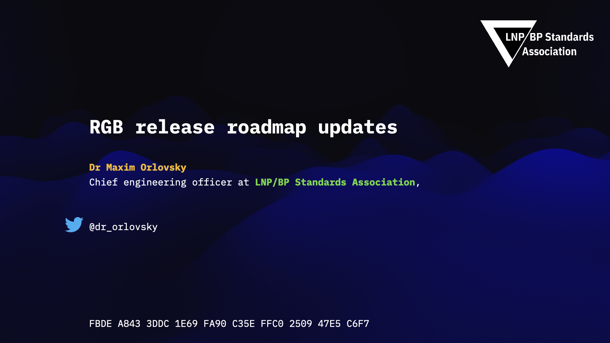

> *作者：Olga Ukolova*
>
> *来源：<https://www.ukolova.ch/bitcoin-and-rgb/what-is-rgb-and-why-should-i-care>*
>
> *本文曾以乌克兰语，在 Bitcoin Magazine UA 网站出版：https://bitcoinmagazine.ua/technologies/1678169018-shcho-take-rgb-i-chomu-mene-tse-mae-hvilyuvati*

“智能合约（smart contract）” 一词在今天已经有很多种含义了，因为人们认为是 Vitalik Buterin 在推出以太坊的时候才把它带到这个世界。实际上，早在 1990 年代初，**Nick Szabo** 就提出了这个概念，并定义为 “一组以电子信息形式作出的承诺，包括让各方得以履行这些承诺的协议”。但问题由此而来：*智能合约是仅存在于信息世界的东西吗，还是说不止于此呢？*

实际上，还有另一种理解这个词语背后的含义的办法，就是分析现实世界中，我们周围的一切是怎么运转的、人们之间是如何达成协定的。我们设想两个互不相识的人、有意愿跟对方沟通、达成约定、交换商品与服务、并相信这些约定会得到履行，就能发现几个问题。

第一个问题，也是最致命的问题：*我们如何证明，在不给出私人信息的、匿名的 以及/或者 缺乏信任的环境中，一方真的拥有自己声称可以提供的东西、另一方真的有足够多的钱？* 可以说，这个问题的答案在许多年前就已经出现，就是 “不记名财产权（[bearer rights](https://en.wikipedia.org/wiki/Bearer_instrument)）”。不记名财产权是一种能够完全拥有和转移某些东西的权利，由物主自己保管（这就是 “bearer（持有者）” 的含义）、记录在一个物理载体（例如，所有权证书）上，而且可以作为证据，提供给你要开展经济事务的对象。有趣的事实是，使用不记名财产权，你不需要向任何第三方、公证处或权威机构登记你拥有某一项资产、某一个合约；在转移所有权的时候，你只需要向对手方提供实体证据，不需要将这些信息放在任何公开的数据库中。因此，不记名产权的概念让人可以保持隐私、完全占有一项资产，同时依然具有跟其他人交易的能力；信息的验证完全由另一方完成，完全点对点，不需要第三方和中心化公证处。

- 一个不记名凭证的例子 -

我们需要考虑的第二件事情是：*如何保证合约的履行？* 因为各方都是匿名的，如果一方欺诈，另一方也不知道应该对什么人施加强制力，此路不通。这时候，经济学（具体来说是博弈论）就派上用场了。通过为约定创建合适的经济激励，我们可以创造出一种合约，使得任何一方尝试欺诈对方都不会得到好处。

总结一下，我们认为 “**智能合约**” 这个术语*既能运用在物理世界中，也能运用在信息世界中，它是一种证明所有权信息、在各方之间保证特定的承诺将得到履行、而且无需使用外部的中心化机构（军队、政府、法庭，等等）和暴力的方法。在这里，计算机科学的方法是强化这些流程，并让人类在现实生活和数字世界中的交互更加高效。*

但为了完全遵循这个定义，智能合约系统还必须具备下列**特性**：

1. *抗审查*：为了让每一个合约参与者都能获得协定的数据的完整所有权，不让任何外部人拿走它；
2. *可扩展性*：为了能扩展到世界范围，让协定能覆盖尽可能多的人；
3. *隐私性*：为了能在私密的环境中运行，无需交出你的身份、你可能拥有的资产的信息以及你参与的合约；
4. *可验证性*：对手方必须有能力验证你的资产的信息、所有权以及保证合约履行，无需信任任何第三方、权威和公证处。

信息世界里存在许多种不同类型的智能合约，它们各有不同的容量、取舍和功能。比特币是智能合约系统的一个非常特别的例子 —— 迄今为止，它是唯一一个拥有抗审查性的协议，虽然可编程性、隐私型和可扩展性都不佳。以太坊的合约更加灵活，但缺乏抗审查性、隐私型和可扩展性，因为作为合约的参与者，你总是不得不把数据的验证委托给全球的社区，因此 —— 你并不真的拥有任何东西。

**迄今为止，世界上唯一一种能够满足上述所有属性的技术，就是 RGB**。

RGB 是一种可扩展的、机密的智能合约系统，可以被视作开发在比特币上的 layer 2 以及/或者 layer 3 技术，并且，最重要的是，截至本文撰写的时间 —— 也是唯一一种能够搭配闪电网络的解决方案。RGB 利用了比特币和闪电网络的最强之处，同时将它们的功能扩展到令人惊讶的程度。RGB 给予了我们将许多不同类型的所有权（对一个合约定义下的不同资产的所有权）从合约的状态（条件、合约的现状）、证据及演化中分离出来的能力；这样的所有权包括拥有、使用、专访、修改和转让的权利，等等。因此，我们可以说，RGB 合约定义了一种 事件-结果型算法（event-consequence algorithm）：“如果这个事件发生，那么后果就是这个”，以及每一步都需要遵循特定验证规则的义务。我们自然会问：*这是怎么做到的呢？*

拥抱 Peter Todd 在几年前提出的 “[客户端验证](https://scalingbitcoin.org/milan2016/presentations/D2 - A - Peter Todd.pdf)” 以及 “[一次性密封条](https://petertodd.org/2016/commitments-and-single-use-seals)” 的概念、加入 bulletproof 这样的零知识证明元件、让所有的活动都能跟闪电网络兼容，RGB 不仅让参与者可以创建复杂的约定，同时还能保证他们的隐私、让交易能以闪电交易的速度发生，并提供了完整的所有权和管理的工具。而且所有的这些，既不需要用到新的区块链，也不需要在比特币上执行分叉，更不会污染 L1 时间链（所有的合约数据都永远保存在链下）而且不需要设立协议层的 token 来让这一切运行起来。

 你可能会问，我们如何让这一切成为现实呢？

RGB 的故事可以追溯到 2016 年，那时候 Giacomo Zucco 希望利用 Peter Todd 的客户端验证和一次性密封条的概念、开发一种更好的染色币（Colored coins）并将这些代币带入闪电网络（这就是 “RGB” 名字的由来）。几年以后，来自 Pandora 的 [**Maxim Orlovsky**](http://dr.orlovsky.ch/) 博士看到了这种技术的潜力远不止于发行 token，就参与了进来。为了实现完全免费和开源的技术集合、将密码朋克的价值观贯彻到底，我们在瑞士成立了一个叫做 “[**LNP/BP 标准协会**](http://lnp-bp.org/)” 的非营利阻止，然后硬核的头脑风暴和开发就开始了。

到 2021 年春天，RGB 已经从一种代币协议的思想，变成了比特币之上的一种成熟的、完全私密和可扩展的智能合约系统，最终为许多复杂的问题提供了解决方案，并壮大了比特币生态系统。而且，所有这些 —— 都不需要发行一种 token，也不需要用数据污染比特币时间链，也不需要牺牲你的隐私型和所有权！有了 RGB，你可以完全忘记垃圾币、不可扩展而且总是可能被黑的 Solidity 合约，专注于解决真实的问题并加强比特币和闪电网络生态系统。

## 为什么 RGB 很重要？

因为**它能做的东西实在是太多了**，举个例子：

1. 同质化的资产和证券（期权、期货）：

   1.1 单一发行方的或是联合发行的；

   1.2 匿名发行的、公开发行的；

   1.3 带有二次发行的、滞期费、通胀的，等等；

2. 不同形式的不记名权利（投票、治理模型，等等）；

3. 非通知的资产（代币化的艺术品、游戏皮肤、收藏品、教育经历证书）；

4. 去中心化的数字身份、漫游配置和密钥管理；

5. 复杂的权利管理、记账系统和效用代币，不止于金融世界：电力、医疗记录、物流记录，等等。

好消息是，我们已经可以使用它了。2021 年，出现了第一批 RGB beta 软件和拓荒者，比如 [**Pandora Prime**](https://www.pandoraprime.ch/) 公司推出的第一款面向用户的产品：[**MyCitadel wallet**](http://mycitadel.io/)、RGBex 浏览器以及 [**Bitcoin Pro**](https://github.com/pandora-prime/bitcoin-pro) 资产发行工具，它们推动了 RGB 的采用。为了尽快让协议稳定下来，[**2022 年 6 月 13 日**](https://youtu.be/VmB5SaaaABI)，RGB 推出了第一个版本的 “共识级别” 的代码库，给予人们更强的信心：协议可以工作了，不会再有剧烈的变更，可以在上面开发自己的业务和解决方案了。随着这个版本的发布，RGB 协议在 2022 年获得了行业的许多参与者的关注，他们接受了 Randora 的倡议，并也开始围绕 RGB 开发自己的产品：从稳定币到艺术收藏品，再到 DAO、继承制度和教育证书。

- 宣布推出 v0.10 的开发者会议的记录，来自 LNP/BP 标准协会的 YouTube 频道：https://www.youtube.com/watch?v=VmB5SaaaABI  -

## 总结

我们非常相信，隐私型、可编程性、不记名产权、安全性和可扩展性，是把比特币带向未来的核心驱动力。RGB 最终给了用户解决许多问题（不仅仅是金融交互问题）的机会，我们提供了工具，让每一个人都能在我们周围的密码朋克世界中成长并保护自己拥有的东西。随着个体日益暴露在社会的管控之中，我们每一个人都日益经历更多的监视和管控，没完没了，像 RGB 这样的技术，是少数我们可以用来保护我们的自我主权和自由的工具。

如果比特币是一种 “fuck you” 货币，RGB 就是一种 “fuck you” 智能合约。

想获得更多关于 RGB 的信息，请看：

- https://www.rgbfaq.com
- https://www.rgb.tech/
- http://youtube.com/@LNPBP
- http://twitter.com/lnp_bp
- https://t.me/lnp_bp
- https://t.me/rgbtelegram