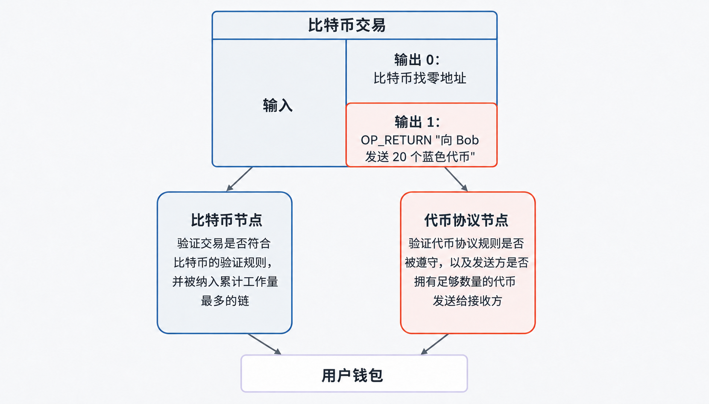
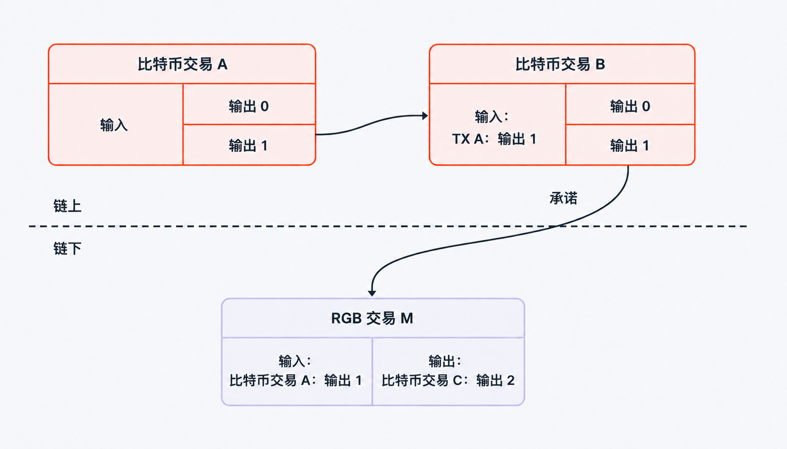
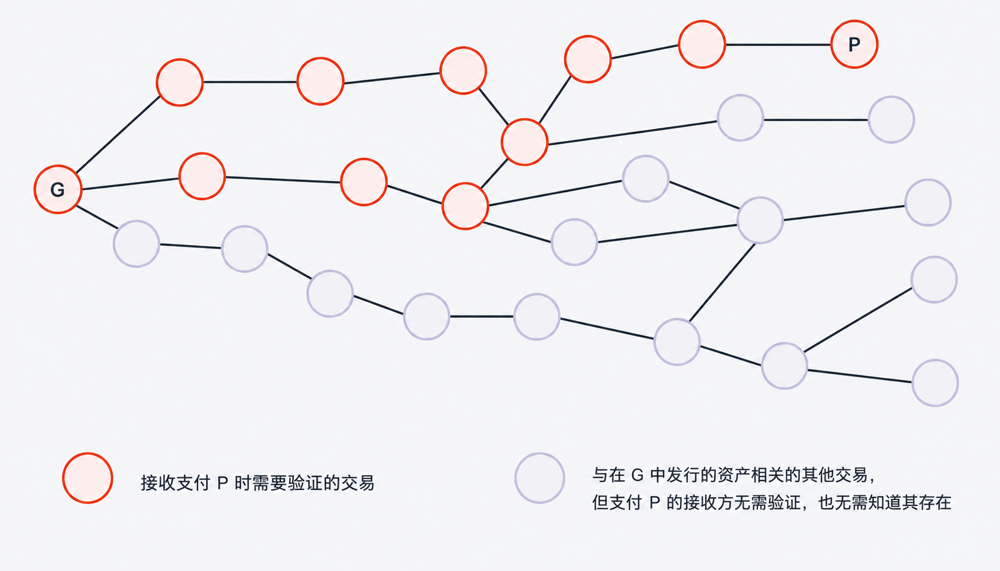
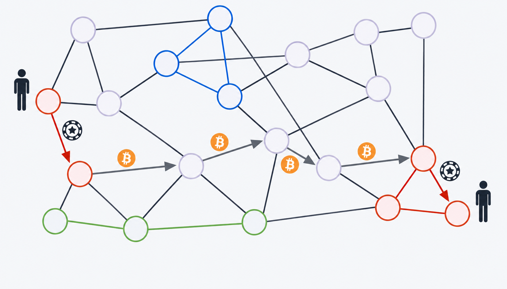

> *作者：Federico Tenga*
>
> *来源：<https://rgb.info/what-is-rgb-protocol-on-bitcoin-technical-guide/>*
>
> *本文是对 Federico Tenga 2022 年原文的更新版本，包含 RGB v0.11.1 的最新数据与技术细节。原文请参阅：[理解 RGB 协议](https://medium.com/@FedericoTenga/understanding-rgb-protocol-7dc7819d3059)。*

*免责声明：出于教育目的，本文简化了部分概念，同时，为避免术语过于繁杂，某些用词可能与正式技术规范有所出入。*

近年来，对在比特币和闪电网络上发行数字资产的兴趣越来越强，但大多数方案都需要做出与比特币原则不符的妥协：链上数据膨胀、隐私丧失，或要求信任的联合系统。[比特币上的 RGB 协议](https://rgb.info)走了一条不同的路。

**比特币上的 RGB 协议**是一个开源协议，用于在比特币和闪电网络上原生地发行和转移电子资产，并且无需使用侧链、无需改变比特币基础层。**所有资产数据保持私密且存储于链外**，而比特币仅被用作承诺层，用于提供防篡改的锚定。

**简而言之**：

- RGB 在比特币和闪电网络上原生发行并转让数字资产
    
- 资产数据保持私密且存储于链外；仅有一个小型密码学承诺被锚定到比特币
    
- 官方资源：[rgb.info](https://rgb.info) · 技术文档：[docs.rgb.info](https://docs.rgb.info)
    

---

目录

1. 为什么在比特币上发行资产需要一个单独的协议？
    
2. 比特币上的 RGB 协议是如何工作的？客户端验证
    
3. RGB 如何防止双花？一次性密封条
    
4. RGB 转移的完整步骤是什么样的？
    
5. 比特币上的 RGB 协议如何保护接收方隐私？
    
6. RGB 资产如何在闪电网络上工作？
    
7. 比特币上的 RGB 协议是否支持智能合约？
    
8. 在比特币上的 RGB 协议中可以发行什么？
    
9. 比特币上的 RGB 协议与 Taproot Assets、Liquid 和以太坊相比如何？
    
10. 如何开始在比特币上的 RGB 协议上构建应用？
    

---

## 为什么在比特币上发行资产需要一个单独的协议？

比特币区块链的卓越之处在于，它可以创造出防篡改的所有权记录， 并且任何人都无需信任第三方就可以验证这些记录。但将这一模型扩展到比特币本身以外的数字资产，在历史上一直面临三个结构性问题。

早期在比特币上发行资产的方案，如彩色币（Colored Coins）、Counterparty 和 OmniLayer，**都将资产数据存储在区块链内**。具体而言，第一代资产协议将资产元数据直接嵌入在比特币交易里面，**通常是嵌入 OP_RETURN 输出中**。每一笔资产转移都被永久写入链上，且对所有人可见。

这种方式带来了三个相互叠加的问题：

**区块链膨胀**。 每笔资产转移都会向区块添加数据，无论一个比特币节点是否关心该资产，都必须永久存储这些数据。如果大规模应用，运行比特币全节点的成本将不断攀升，进而威胁去中心化。

**隐私缺失**。 每笔转移都永久可见。任何人都可以看到谁向谁发送了什么、数量多少、发生在何时。对于金融资产而言，这种设计根绝了一种基本属性。

**可扩展性差**。 验证所有权需要从创世区块开始扫描整条区块链，随着链的不断增长，这项操作会日益昂贵。

以太坊的 **ERC-20** 标准选择了另一条路：一个专门的全局状态系统，**每个节点都公开执行每一个合约**。这一系统实现了大规模的可编程金融，但代价是用户隐私性、比特币的安全模型，以及，有意义的去中心化。

**比特币上的 RGB 协议采取了一种根本不同的方法。**

---

## 比特币上的 RGB 协议是如何工作的？客户端验证

比特币上的 RGB 协议通过 “[客户端验证](https://docs.rgb.info/distributed-computing-concepts/client-side-validation)” 运作：转移双方私下地验证资产数据，而比特币区块链仅接收一个小型密码学承诺。

其核心理念是让比特币区块链做它最擅长的事，也就是提供基于工作量证明的终局性和抗审查的结算。**资产所有权记录、合约规则和转移历史均可在链外由直接有关的各方处理**。区块链只需知道某件事已经发生，无需知道具体发生了什么。

因此，无需每一个节点都验证每一字节的数据。事实上，之所以要使用比特币的全局共识，仅仅是为了在不引入受信任的中介的前提下防止双花（重复花费同一项电子资产）。但是对于其他类型的信息（资产合约规则、钱包余额、转移历史），**没有理由通知整个网络**。

我们可以用一份**经过公证的私人文件**作为类比。公证人（比特币）确认某一特定事件发生于特定时间，且任何人都无法否认。但文件的内容完全保留在相关各方之间。

RGB 协议的设计同时解决了上述三个问题：

- **链上没有资产数据** → 不造成区块链负担
    
- **转移对外部观察者不可见** → 默认具有隐私性
    
- **验证在本地运行，并且可以并行化**→ 可扩展至任意规模

---

## RGB 如何防止双花？一次性密封条

比特币上的 RGB 协议通过 “[一次性密封条](https://docs.rgb.info/distributed-computing-concepts/single-use-seals)” 防止双花：每一项 RGB 资产都绑定到一个比特币 UTXO，授权该资产的转移需要花费该 UTXO，这就使得**不可能重复花费 RGB 资产**，除非能够重复花费它所绑定的比特币 UTXO 。

一次性密封条是 [Peter Todd 提出](https://petertodd.org/2017/scalable-single-use-seal-asset-transfer)的一种密码学原语。其正式定义为：

> “承诺（promise）将在未来提交（commit）一条尚不确定的消息并且只提交一次，使得 “提交” 这件事对特定受众的所有成员都确定无疑。”

一次性密封条在 RGB 中的实现意味着，**每项 RGB 资产都绑定到一个特定的比特币 UTXO**（[未花费的交易输出](https://docs.rgb.info/annexes/glossary)）。要转移这项资产，发送方必须在比特币交易中花费该 UTXO。花费 UTXO 即 “关闭” 密封条，并授权一次[状态转换](https://docs.rgb.info/rgb-state-and-operations/state-transitions)。

比特币自身的工作量证明确保了**一个 UTXO 只能被花费一次**。因此，尽管比特币对绑定在其上的 RGB 资产一无所知，但它仍然保证了密封条只能被关闭一次。为了双花 RGB 资产，你需要双花它背后的比特币 UTXO —— 而整个比特币网络会立即拒绝这样的尝试。

比特币区块链充当**每次 RGB 状态转换的不可篡改的锚点**，却完全不存储任何 RGB 数据。

---

## RGB 转移的完整步骤是什么？

一次 RGB 资产转移由五个步骤组成：发送方准备一个包含完整资产历史的寄售包（consignment），通过链外渠道发送给接收方，接收方在本地进行验证；发送方随后广播一笔携带小型密码学承诺的比特币交易。

1. **寄售包**。发送方准备一个[转让寄售包](https://docs.rgb.info/annexes/contract-transfers)，即一个数据包，包含该资产从最初的发行到当前转移的完整状态转换历史，以及一笔未签名的见证交易。接收方独立验证所有权所需的一切信息都包含其中，无需信任任何第三方。

2. **链外传输**。 寄售包通过链外渠道发送，通常经由一个 RGB 代理服务器，但该协议同样支持电子邮件、即时通讯应用、二维码或 Nostr 中继。这样，资产数据永远不会接触比特币区块链。

3. **接收方验证**。 接收方在本地验证寄售包。他们检查完整的状态转换系列，验证每一次转换都锚定在真实的比特币交易上，并确认密封条被正确关闭。

4. **比特币承诺**。 关闭密封条的比特币交易包含一个[确定性比特币承诺（DBC）](https://docs.rgb.info/commitment-layer/deterministic-bitcoin-commitments-dbc)，用以下两种方式之一编码：

- [**Opret**](https://docs.rgb.info/commitment-layer/deterministic-bitcoin-commitments-dbc/opret)：一个 34 字节的承诺（OP_RETURN + OP_PUSHBYTE_32 + 32 字节 MPC 哈希），放置在交易的第一个 OP_RETURN 输出中；
    
- [**Tapret**](https://docs.rgb.info/commitment-layer/deterministic-bitcoin-commitments-dbc/tapret)：一个 64 字节的承诺，嵌入 Taproot 交易的脚本路径花费中。
    

在这两种情况下，区块链上均不包含任何资产数据。

5. **状态转换捆绑包**。同一合约的多个状态转换可以归入一个[状态转换捆绑包](https://docs.rgb.info/rgb-state-and-operations/state-transitions)，放在一笔比特币交易中，这就允许多笔转移共享同一个链上承诺。这一特性是推动可扩展性的关键一步。

接收资产的 UTXO 在链上与其他任何比特币 UTXO 无法区分。见证交易仅包含一个体积很小的密码学哈希值，而不含任何资产数据，也不含收款地址。链上观察者无法得知哪个 UTXO 当前持有该资产。这一特性对收款方隐私具有直接影响，我们将在下一段中细说。

---

## 比特币上的 RGB 协议如何保护接收方隐私？

比特币上的 RGB 协议通过 “[盲化密封条](https://docs.rgb.info/rgb-state-and-operations/state-transitions)” 保护接收方隐私：接收方提供其 UTXO 的密码学承诺，而非 UTXO 本身，因此发送方永远无法得知哪个输出持有已转移的资产。

当 Bob 想要接收一个 RGB 资产时，他不会向 Alice 发送自己的确切 UTXO。相反，他提供一个盲化密封条，即**对其 UTXO 的密码学承诺**，该承诺向 Alice 隐藏了实际的输出。Alice 将这个盲化密封条嵌入她构建的状态转换中。

其结果是，RGB 代币可以在 UTXO 之间 “传送”，而不在比特币交易图中**留下任何可见的痕迹**。Alice 无法确定她刚刚发送的资产由哪个 UTXO 持有。即使她监控区块链，也无法将 RGB 承诺与 Bob 的具体代币关联起来。

当 Bob 随后将资产转移给 Carol 时，他必须向 Carol 展示自己的密封条，因为她需要验证有关的转让历史。因此，最近一次转移的隐私性是最强的，越是历史久远的转移隐私性就越差。这是一个经过深思熟虑的折中：在**转移时点提供隐私**，同时为接收方保留**可验证的审计证据**。

---

## RGB 资产如何在闪电网络上工作？

RGB 资产[天然可以在闪电网络上流转](https://docs.rgb.info/rgb-over-lightning-network/lightning-network-compatibility)：资产可以与聪一起存放在支付通道中、一样地即时转移，从而继承**闪电通道的全部安全保证**，包括即时结算和每次转移无需链上确认。

开启一个 RGB 通道首先需要一笔标准的比特币注资交易，创建 2-of-2 多签 UTXO，与任何闪电通道的操作方式相同。**RGB 资产随后通过 RGB 状态转换分配到该 UTXO**。通道中的聪数量不必与被转移的资产价值价值相当，但也不应该可以忽略不计。聪的数量应足以使惩罚机制在经济上有意义，并保持 HTLC 输出高于比特币的粉尘限额。

随着通道更新，**新的承诺交易被创建**，其中包含反映改变后资产余额的 RGB 状态转换。RGB 输入始终是资产在链上分配的原始注资多签，直到通道关闭。

**为什么每笔 RGB 闪电支付都要移动聪**：

这一要求根植于闪电网络安全模型的两个具体功能：

- 惩罚机制。 如果一方广播旧的通道状态，对方可以使用撤销密钥花费该输出，取走聪和 RGB 资产。通道中的聪余额确保作弊行为带来真实的经济损失，而不仅仅是损失 RGB 代币。  
      
    
- HTLC 要求。 每笔路由支付都需要包含高于比特币粉尘限额的聪的 HTLC 输出。双重转移（聪 + RGB 资产）确保了无论 HTLC 通过原像还是时间锁解决，比特币和 RGB 分配都可以被主张。

---

## 比特币上的 RGB 协议是否支持智能合约？

支持。比特币上的 RGB 协议通过 [AluVM](https://docs.rgb.info/annexes/glossary)（Algorithmic Logic Unit Virtual Machine）支持可编程合约，这是一种基于寄存器的虚拟机，在参与方的机器上私下执行合约逻辑，而非在全局网络上公开执行。

与以太坊的 EVM（每个节点公开执行每个合约）不同，AluVM 在链外运行验证。只有结果（状态转换是否有效）被承诺到比特币。计算过程及其输入完全保持私密。

AluVM 脚本嵌入在[模式（schema）](https://docs.rgb.info/rgb-contract-implementation/schema)中，并在客户端验证期间执行。模式采用纯声明式方法：它们定义合约的规则和业务逻辑，而这些逻辑不会成为全局状态的一部分，也不会对任何第三方可见。

因此，RGB 合约可以表达复杂的条件，如转移限制、许可发行和多方授权，而这些逻辑无需公开或由网络执行。

一种边缘情况： 如果一次状态转换未能通过客户端验证，但对应的比特币交易已经广播，则 UTXO 密封条被关闭而没有分配有效的状态转换。该资产实际上被销毁。使用 [rgb-lib](https://github.com/RGB-Tools/rgb-lib) 的设计良好的钱包会在广播前通过谨慎的交易构建来处理这一问题。

---

## 在比特币上的 RGB 协议中可以发行什么？

比特币上的 RGB 协议 v0.11.1 支持五种资产类型，称为[模式](https://docs.rgb.info/rgb-contract-implementation/schema)：NIA（Fixed-Supply Fungible）、IFA（Inflatable Fungible Asset）、UDA（Unique Digital Asset）、CFA（Collectible Fungible Asset）和 PFA（Permissioned Fungible Asset）。

模式是声明式模板，编码了合约的完整规则：存在哪些状态、最初的发行结构如何、可能发生哪些转换，以及应用什么 AluVM 验证逻辑。它们编译成 .rgb（二进制）或 .rgba（防护二进制）文件，供钱包集成使用。

v0.11.1 中的五种[官方支持模式](https://docs.rgb.info/rgb-contract-implementation/schema/supported-schemas)如下：

1. **NIA — 非可增发资产（Non-Inflatable Asset）**  
   供应量硬上限的同质化代币。最初的发行后不能再铸造额外单位。这是将比特币货币模型应用于任何资产的方案。  
   用途：等效于比特币的代币、固定供应量积分、具有固定赎回池的代币化大宗商品、游戏内货币。

2. **IFA — 可增发同质化资产（Inflatable Fungible Asset）**  
   具有已定义供应上限的同质化代币。支持增发（Inflate，铸造新单位）、销毁（Burn，可证明地减少供应）和链接（Link，一次性操作以连接到后继合约）。  
   用途：稳定币、按计划排放的奖励代币、凭证计划。

3. **UDA — 唯一数字资产（Unique Digital Asset）**  
   非同质化资产。每个 UDA 可携带内嵌媒体（最多 64 KiB 二进制数据块）或通过哈希摘要引用的附加文件。转移限于单一目的地。  
   用途：数字证书、活动门票、收藏品、可验证凭证。

4. **CFA — 收藏品同质化资产（Collectible Fungible Asset）**  
   在 NIA 基础上为每次发行增加了一个文章标签，用于识别收藏品系列中的每个批次。  
   用途：限量版艺术品系列、编号版画、体育卡牌收藏、按年份或版次标识的年份批次。

5. **PFA — 许可同质化资产（Permissioned Fungible Asset）**  
   一种同质化、不可增发的代币，每次转移都必须在交易元数据中包含发行方的明确密码学签名。  
   用途：代币化股权、需要发行方批准的合规稳定币、受合规限制的代币、代币化房地产份额。

## 比特币上的 RGB 协议与 Taproot Assets、Liquid 和以太坊相比如何？ {#comparison}

比特币上的 RGB 协议比 Taproot Assets、Liquid 和以太坊 ERC-20 提供更高的隐私性和可扩展性，因为它是唯一通过客户端验证将所有资产数据保持在链外的方案。

|   |   |   |   |   |   |
|---|---|---|---|---|---|
|协议|运行平台|隐私性|可扩展性|去中心化|状态|
|比特币上的 RGB 协议 v0.11.1|比特币 + 闪电网络|高 - 链外，客户端验证|高 - 无区块链膨胀|完整比特币安全性|2025 年 7 月起主网运行|
|Taproot Assets（Lightning Labs）|比特币 + 闪电网络|部分|中|完整比特币安全性|主网，单一公司|
|Liquid Network|比特币侧链|机密交易|中|联合多签|生产环境，存在信任假设|
|以太坊 ERC-20|以太坊|无 - 完全公开|受区块大小限制|独立安全模型|成熟，DeFi 高度采用|

RGB++ 跟比特币上的 RGB 协议不一样。 RGB++ 是由 Nervos/CKB 团队开发的独立协议，运行在 CKB 区块链上。它是一个由不同团队处理的项目，采用不同的架构，与比特币上的 RGB 协议没有任何关联。

---

## 如何开始在比特币上的 RGB 协议上构建应用？ {#start}

- 概念： [docs.rgb.info](https://docs.rgb.info) ——从[客户端验证](https://docs.rgb.info/distributed-computing-concepts/client-side-validation)和[一次性密封条](https://docs.rgb.info/distributed-computing-concepts/single-use-seals)开始
    
- 构建钱包： [github.com/RGB-Tools/rgb-lib](https://github.com/RGB-Tools/rgb-lib) ——Rust 和 Python 绑定
    
- 运行带 RGB 的闪电节点： [github.com/RGB-Tools/rgb-lightning-node](https://github.com/RGB-Tools/rgb-lightning-node)
    
- 在测试网尝试 CLI： [github.com/rgb-protocol/rgb-sandbox](https://github.com/rgb-protocol/rgb-sandbox) ——引导式沙盒环境
    
- 核心协议： [github.com/rgb-protocol](https://github.com/rgb-protocol)
    
- 词汇表： [docs.rgb.info/annexes/glossary](https://docs.rgb.info/annexes/glossary)
    

---

  

最后更新：2026 年 5 月

RGB 协议协会——[rgb.info](https://rgb.info) · [docs.rgb.info](https://docs.rgb.info)