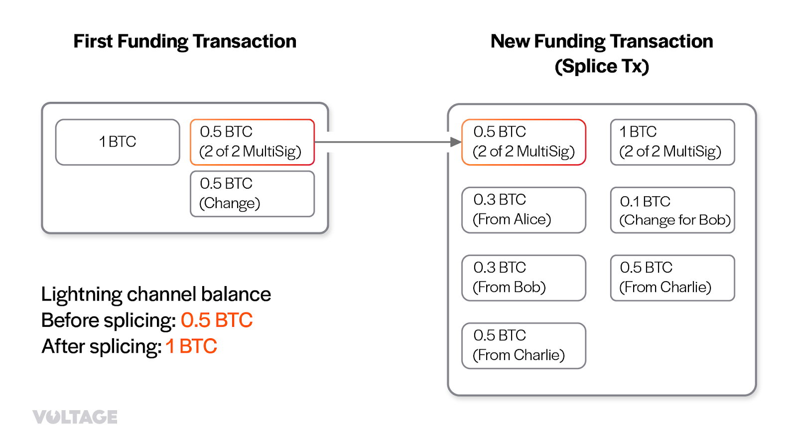
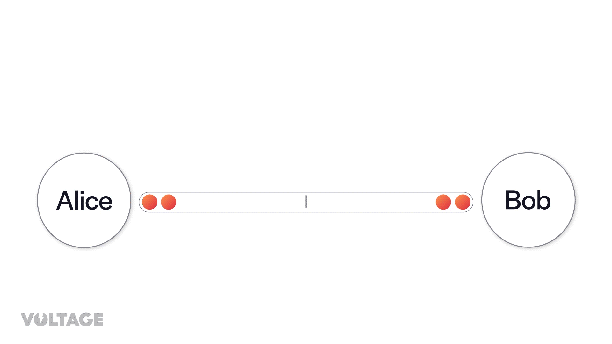

> *作者：Lorenzo*
> 
> *来源：<https://www.voltage.cloud/blog/what-is-splicing-lightning-network-how-it-works>*

## 什么是 “通道拼接”？

一条闪电支付通道的局限性在于，它的总容量由锁定到这条支付通道的资金数量决定。也就是说，一条通道能够转移的数额最大的单笔支付，其数额不能超过该通道的注资交易的对应输出的数额。你可以把一条闪电通道想象成一个沙漏 —— 里面的沙子可以从一边流向另一边，但如果你要往里面加沙子，那就非打破它不可了。

有时候，这种局限性会导致糟糕的用户体验。同时支持比特币和闪电网络特性的钱包软件需要展示两个独立的余额：一个是链上的比特币余额，另一个是可以通过闪电网络来发送的余额。在引导新用户上手使用的时候，这可能会有些不好理解。

同样地，路由节点也需要重新调控自己的流动性，以持续地服务市场。因为无法向支付通道添加比特币、也无法从中拿出比特币，他们就只能先关闭现有的通道、再开设新的通道；这会产生两笔链上交易（以及相应的手续费），一笔用于关闭通道，另一笔是新通道的注资交易。除此之外，他们还需要存储一些闲置的资金，以备突然出现的需求。

如果不需要中断通道的运行、就能往里面添加资金，岂不是好事？这就是 “通道拼接” 做到的事情：重新调整通道的大小。有了通道拼接，钱包就只需展示一个余额、让终端用户的体验更好。同时，路由节点在需要重新分配流动性时，也不再需要先关闭再开启他们的通道，只需要向现有的闪电通道增加资金，或者从中移出资金。

（译者注：这个过程可以理解为是改变同一条通道的容量，也可以理解为在关闭一条通道的同时开设一条新的通道。他们对 “通道” 的理解侧重点不同：前者将通道理解为两个闪电节点之间的持续通信，后者认为双方在比特币网络中形成的未花费多签名输出就是通道本身。）

## 通道拼接的工作流程

在深入介绍通道拼接协议之前，请记住，闪电网络中的对等节点是靠相互发送消息来沟通的。这些在闪电网络中流动的数据包裹包含了关于节点想要实现的目标的信息。在接下来的段落中，我们就会介绍相关的信息。

从抽象的角度看，通道拼接是非常简单的：参与一条通道的双方需要签名一笔交易，花费通道的[注资交易](https://www.voltage.cloud/blog/what-do-open-channel-transactions-look-like-on-chain)、将资金转移到一个新的 2-of-2 多签名输出中；在此过程中，可以为通道增加资金，也可以从通道中移出一部分资金。难的地方在于，要协调双方，并且要让整个过程是免信任的。

第一步是让通道进入一种静默模式、让通道暂停在当前的状态、发送 “基础性变更正在发生”（缩写为 “STFU”）的信号。这让双方进入通道拼接的准备状态，保证通道的状态不会在双方构造新的 2-of-2 多签名输出期间发生改变。这是通过让其中一个参与者发送一条 `stfu` 消息给对方来实现的。如果对方也同意，就会回复一条 `stfu` 消息。

通道进入 STFU 模式后，其中一方可以通过发送 `splice` 消息来启动一次拼接；这条消息的作用是表明 TA 想要向通道注入资金，或者从中移出资金。收到消息的另一方如果同意，就会回复一条 `splice_ack` 消息。

现在，通道参与者们可以开始协商通道拼接。这是通过闪电网络规范中的 “交互式交易构造（interactive tx）” 协议来实现的（“双向注资通道” 也使用同一套协议）。在协商期间，双方互相发送 `tx_add_input` 消息（给拼接交易添加一个输入）和 `tx_add_output` 消息（给拼接交易添加一个输出）。在这个过程中，拼接操作的发起方要承担一些义务。

有趣的是，双方都可以添加输入和输出，不论与发起方的拼接目的有没有关系，比如，通过添加输出，可以开启另一条通道；也可以运用另一个输入，实现另一个拼接；也可以把资金移动到别的地方。让其它活动参与拼接交易，本质上是让人们可以节约一些手续费。就相当于别的一些活动搭了一趟顺风车。

协商过程会一直持续，直到双方对最终的交易达成一致、相互发送 `tx_complete` 消息。此后，他们运用双方原本在通道中的余额、新的输入、新的输出和拼接交易需要支付的手续费总额，计算出新的通道容量和双方的新余额。最后，将新的多签名输出（注资输出）的价值从零数额换成新的通道容量。

上图左边的原来的注资交易 ，右边的是拼接交易；原注资交易中以橙色边框标出的是通道原本的注资输出，它成为拼接交易的输入之一。注意，拼接交易给通道增加了 0.5 BTC 的容量，而且，一个第三方（Charlie）也利用这笔交易来移动资金。

最后，双方都为这笔新交易生成签名，以 `tx_signatures` 消息发给对方，协商过程可以认为完成了，然后这笔交易就会被双方广播到区块链网络中。从这一刻开始，双方可以退出 STFU 模式、继续通道操作。当拼接交易获得 6 次区块确认之后，双方就可以忘记（基于原注资输出的）旧的通道状态，这样可以节约大量存储空间。

退出 STFU 模式之后，双方就可以重新在通道中发送、接收和路由支付。但是，当拼接交易还在等待确认的时候，在更新状态时，双方必须同时对旧的注资输出和新的输出签名（也可以说是同步更新原通道的状态和新通道的状态）。

以下是对整个过程的简化图解：

## 开发和研究

Core Lightning 客户端的开发者 Dusty Daemon 第一个提出了 “通道拼接” 的构想。他在 2021 年公开了这个提议，该提议要改变 BOLT 2、BOLT 7 和 BOLT 9 。Dusty 已经在主网上实现了一次拼接操作。多个闪电网络协议实现都在开发支持技术，包括 CLN 和 Eclair。通道拼接除了能够提升用户体验，还有提高比特币隐私性的潜能，因为拼接交易也可以用作 coinjoin 。你可以在[这里](https://lightningprivacy.com/en/channel-coinjoins)了解更多。

## Phoenix：第三代的自主保管闪电钱包

最近，Eclair 团队为其闪电节点实现[添加](https://github.com/ACINQ/eclair/blob/master/docs/release-notes/eclair-v0.9.0.md)了通道拼接技术的一个原型。这让自主保管的闪电钱包 Phoenix 可以退出其第三代版本。现在，Phoenix 不会再根据用户的使用模式创建多条通道；因为通道拼接技术，Phoenix 服务商跟一个用户只会开设一条（大小动态调整的）通道。这就消除了因为开设新通道而带来的流动性分散和不可预测性问题。

采用拼接技术极大地降低了通道管理的成本。此前，Phoenix 会对收款额度（入账流动性）收取 1% 的手续费（并且一次最少要收取 3000 聪）。而现在，获得收款额度的唯一费用就是相关链上交易的确认手续费；这是能够给现有通道 “拼入” 资金的能力的直接觉果。

如前文所提到的，拼接技术消除了链上资金与通道资金的隔阂。用户可以用自己的通道余额直接发起链上交易，无需额外使用互换服务。

最后，这种新技术还让用户能够更好地控制资金、提高可预测性。有了通道拼接，用户不必再为每一笔交易创建一个新通道，而可以将收款 “拼入” 现有的通道。这有助于准确预测闪电支付到来时、用户将要支付多少通道管理（流动性获取）手续费，而且这个手续费可以直接透明地提前显示给用户。

（完）