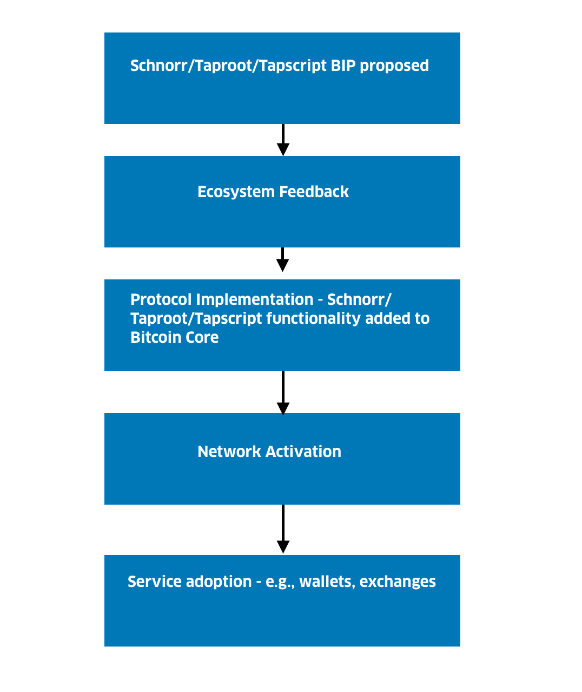

> *作者：Interdax*
>
> *来源：<https://medium.com/interdax/what-is-tapscript-and-how-will-it-benefit-bitcoin-96fbb43a7169>*
>
> *原文发表于 2020 年 3 月 19 日。*

这是我们关于 BIP 340 ~ 342 系列文章的最后一篇。本文将介绍 Tapscript 是什么、该提案有什么优点。

本系列前两篇文章分别介绍了 [Schnorr](https://medium.com/interdax/how-will-schnorr-signatures-benefit-bitcoin-b4482cf85d40?source=friends_link&sk=9fa1f45b98593398fde0f356569321ff) 和 [Taproot](https://medium.com/interdax/what-is-taproot-and-how-will-it-benefit-bitcoin-5c8944eed8da?source=friends_link&sk=c7fa27c66217e29acc30ccf1ec850694)。


本文也将介绍如何激活比特币改进协议（BIP）、实现加入[比特币](http://bitcoin.org/)的升级。

## Tapscript（BIP 342）

[**BIP 342**](https://github.com/bitcoin/bips/blob/master/bip-0342.mediawiki) 的第 3 部分提出了一个叫作 **Tapscript** 的升级，作为对 Schnorr 和 Taproot 的补充。正如我们在[第一篇介绍 Schnorr/Taproot/Tapscript 的文章](https://medium.com/interdax/how-will-schnorr-signatures-benefit-bitcoin-b4482cf85d40)中所言，比特币脚本是用来定义比特币的花费规则的。

BIP 342 通过改进签名哈希方法让我们能够验证 taproot 脚本，支持添加操作码来增强比特币的智能合约功能，还更改了一些针对资源要求的限制。

## 什么是操作码

操作码（opcode）其实就是脚本语言或者说命令。这些命令可能会返回“TRUE”或“FALSE”，用于成功发送/接收交易。

例如，这些命令会指定解锁脚本所需的签名数量。它们也会指明转账的比特币数量，以及收款方的地址。

操作码可以用来移除堆栈中的元素和执行计算，计算结果会被添加到堆栈上。别忘了，由于 Script 是基于堆栈的编程语言，Script 命令是有序执行的，从堆栈顶部开始，到底部结束。

## Tapscript 是什么

**Tapscript** 是比特币编程语言 Script 的升级版，建立在 *Schnorr 签名的批量可验证性* 之上，并且让添加新功能变得更容易。

> 不知道什么是批量验证？点击[此处](https://medium.com/interdax/how-will-schnorr-signatures-benefit-bitcoin-b4482cf85d40)，阅读我们介绍 Schnorr/Taproot/Tapscript 的第一篇文章。

Tapscript 也是对 [BIP 341](https://github.com/bitcoin/bips/blob/master/bip-0341.mediawiki) 中提议的比特币脚本结构改进方案（Taproot）的补充。Taproot 需要更改的操作码正是 [BIP 342 ](https://github.com/sipa/bips/blob/bip-schnorr/bip-tapscript.mediawiki)所关注的。

你还可以这么理解 Tapscript：想象一下 [Taproot](https://medium.com/interdax/what-is-taproot-and-how-will-it-benefit-bitcoin-5c8944eed8da) 的默克尔树，上面每个叶节点都是与所谓的叶子版本（类似 [SegWit](https://help.interdax.com/hc/en-001/articles/360002667557-What-is-Segregated-Witness-SegWit-) 的脚本版本控制）相结合的脚本。

但是，特殊之处在于，这些脚本不会在接收支付时显示，只会在花费时显示。不同的叶子节点可以有不同的版本，但是只有真正使用的那个版本才会被显示出来。Tapscript 是 Taproot 默克尔树叶子版本的建议版本 0。

相较传统比特币脚本和 SegWit 比特币脚本，Tapscript 在操作上大致相同，但是有些许差别：

- **签名操作码验证的是 [Schnorr 签名](https://medium.com/interdax/how-will-schnorr-signatures-benefit-bitcoin-b4482cf85d40)（而非 ECDSA 签名）**

- **使用操作码`OP_CHECKSIGADD` 代替[多签](https://help.interdax.com/hc/en-001/articles/360002545817-What-is-a-Multi-signature-Wallet-)操作码 `OP_CHECKMULTISIG` 和`OP_CHECKMULTISIGVERIFY` ，结合 Schnorr ，将可实现批量签名验证**。

由于签名验证是比特币脚本中最占用 CPU 的操作，这些操作码至关重要，能够帮助基于 Schnorr 的多签方案提升效率。

目前，2/3 多签交易的脚本如下所示：

```java

2 <Public Key A> <Public Key B> <Public Key C> 3 CHECKMULTISIG

```

有了 Taproot/Tapscript，我们也可以通过批量可验证的方式创建 2/3 多签交易，其脚本如下所示：

```java

<A pubkey> OP_CHECKSIG <B pubkey> OP_CSADD <C pubkey> OP_CHECKSIGADD OP_2 OP_EQUAL

```

- **许多操作码都被重新定义为`OP_SUCCESS` 操作码，无条件地让整个脚本有效，以便简化软分叉升级**。

相比当前机制中使用的`OP_NOP`，`OP_SUCCESS` 让添加新的操作码变得更容易。

Tapscript 让之前不可用的操作码从返回“FALSE”变成返回 “TRUE”。每当脚本中存在这些操作码时，你都可以无条件使用该脚本。这么做的优点是操作码可以被重新定义成任何东西，不需要向后兼容。

相比当前的 SegWit 版本控制，新的机制能够利用新的操作码扩展脚本，因此协调和使用起来要简单得多。因此，在新机制的帮助下，我们能轻而易举地将更有用的操作码添加到比特币脚本。

现有的 NOP 操作码的存在目的大概率是为了创建一种升级机制，让我们可以轻松将新的操作码添加至比特币的 Script 语言。

但是，到目前为止，NOP 操作码仅用于 `CHECKLOCKTIMEVERIFY` 和 `CHECKSEQUENCEVERIFY`。为了兼容软分叉，这些 NOP 操作码要么会导致异常，要么不进行任何操作。

由于重新定义了NOP（空操作），操作码 `CHECKLOCKTIMEVERIFY` 和 `CHECKSEQUENCEVERIFY` 无法通过任何方式修改堆栈。因此，这两个操作码不会从堆栈中弹出参数，这时用户必须使用 `OP_DROP` 。

为了解决操作码无作为（即，NOP）的问题，Tapscript 新引入了一种只会 “返回 TRUE” 的操作码 `OP_SUCCESS` 。这种操作码在获得实际用处之后才会被使用，而且前提是它们在网络上已经定义了的不可更改的语义。

这就导致被禁用以及未被定义过的操作码会“返回 TRUE”。之后，这些操作码可以被重新定义成任何东西，因为 “只会返回 TRUE” 的操作码可以兼容任何软分叉。

- **Tapscript 在签名哈希（`SIGHASH` ）的计算方式上有别于传统脚本和 BIP143 v0 SegWit**。

签名哈希是什么？简而言之，签名哈希是对比特币[签名](https://bitcoin.org/en/glossary/signature)的标记，表明[签名](https://bitcoin.org/en/glossary/signature)签署的是交易的哪些部分。

通过 scriptsig（解锁签名），签名能够证明你有权花费比特币。这类签名均通过特定方式构建，而且每个签名都会附加一个字节来注明签署交易的方式。现在的比特币中已经实现了一些`SIGHASH` 标记了。

最常用的标记是`SIGHASH_ALL`，表明除 scriptsig 之外的所有部分都被签署。而其余标记，比如`SIGHASH_ANYONECANPAY`，其使用前提是，只有当前输入被签署，而交易的其它部分均未被签署且不包含在承诺中。

为满足用户只签署交易的特定部分，以及注明想（以及不想）在哪些条件下花费比特币的需求，已经有很多人针对现有`SIGHASH`标记提出了改进建议，还提议了许多新的`SIGHASH`标记，其中就包括 `SIGHASH_NOINPUT`。

这些不同的`SIGHASH` 标记的工作原理时：屏蔽交易的不同部分。`SIGHASH_NOINPUT`标记的原理是，用户并不关心具体输入及其来源交易 ID，只关心转账数量。该标记是[交易可](https://bitcointechtalk.com/transaction-malleability-explained-b7e240236fc7)[变形](https://bitcointechtalk.com/transaction-malleability-explained-b7e240236fc7)[问题的解决方案](https://bitcointechtalk.com/transaction-malleability-explained-b7e240236fc7)，先于 SegWit（同样旨在解决交易可延展性问题）在 2015 年提出。但是，围绕着 `SIGHASH_NOINPUT`标记的担忧和风险，意味着比特币社区并没有采用它（但是 SegWit 再度向这一升级打开了大门）。

`SIGHASH_NOINPUT`标记的主要优点是让[闪电网络](https://help.interdax.com/hc/en-001/articles/360002737698-What-is-the-Lightning-Network-)等方案的支付通道运作起来更简单。还有一项提案 [eltoo](https://blockstream.com/eltoo.pdf) 同样能够降低支付通道的使用难度，它会改变闪电网络运作方式：如果有一方试图提交已经失效的旧状态来关闭通道，不会再触发惩罚机制。

eltoo 需要我们改变比特币脚本，尤其要改变的是将签名应用于交易的方式（即，sighash 系统），让用户能够通过再平衡重新得到一个不同的输入。

尽管已有的一些 sighash 类型只是做出了轻微调整，但是 Schnorr/Taproot/Tapscript 提案不会提供任何类似 [BIP 118](https://github.com/bitcoin/bips/blob/master/bip-0118.mediawiki)（即，`SIGHASH_NOINPUT` ）的东西（原因是人们已经讨论出了多种实现方式和安全保障措施。）

虽然不支持 `SIGHASH_NOINPUT` ，但是 Tapscript 提供了一些灵活机制（即，带标记的公钥），将来能够在不引入额外成本的情况下实现 `SIGHASH_NOINPUT` 功能。有了 Tapscript，我们今后就可以通过软分叉添加新的 sighash 类型或做出其它改变，以扩展签名检查操作码。

有了 Tapscript，即使是以未定义的字节为开头的公钥也会被自动视为有效。因此，无论是引入新型签名方案还是新型 sighash 方案，我们都无需添加新的 checksig 操作码。`SIGHASH_NOINPUT` 之类的标记能够直接作为一种新的公钥版本采用，不会产生额外成本。

- **Tapscript 将改变资源限制**。

例如，Tapscript 不仅能让比特币脚本摆脱目前 1 万字节的大小上限，还能解除操作码数量限制。

由于`scriptCode`并不直接包含在签名哈希中（而是通过可预计算的 tapleaf 哈希间接包含在内），签名校验所消耗的 CPU 时间不再与被执行的脚本大小成正比。

在 Tapscript 中，签名操作码的数量不计入 BIP141 或传统的[签名操作码限制](https://lists.linuxfoundation.org/pipermail/bitcoin-discuss/2016-February/000049.html)。以往的签名操作码限制使得构建区块时的交易选择变得很麻烦，因为它在[区块重量](https://en.bitcoinwiki.org/wiki/Block_weight)的基础上增加了新的限制。相较之下，Tapscript 的签名操作码数量仅受限于见证数据的重量。

在 Tapscript 与 BIP 340/341 的协力之下，比特币有望迎来更多有趣的应用。富有表达力的 Taproot 合约就是其中一例，它不仅能实现较为复杂的多方合约，还使基于比特币的 [DAO（去中心化自治组织）](https://en.wikipedia.org/wiki/Decentralized_autonomous_organization)成为可能。

## 在比特币上激活 BIP 340 ~ 342

*如何将升级添加到比特币协议中*？

BIP 提议者在提交 BIP 之后需要编写符合规范的代码，然后通过 pull request 提交代码。这一阶段过后，用户和开发者就该 pull request 进行投票。即使该 BIP 已经被合并到比特币协议内，用户也可以通过选择是否运行新的代码来表明自己的立场。

Schnorr/Taproot/Tapscript 升级目前正处于生态反馈阶段（如下图所示）。后续阶段需要编写代码，以便提交 pull request 和准备测试网。

尽管下图所示的流程是线性的，但是生态反馈和协议实现阶段之间可能会出现循环反馈（例如，规范在被翻译成代码时，提案可能会发生变化）。



<p style="text-align:center">- 如何将 BIP 添加到比特币协议中 -</p>


正如我们在 2017 年的 SegWit 升级中所见，使用 BIP 9（需要 95% 的矿工表示支持） 可能会在生态系统中的不同参与者，包括开发者、用户和矿工之间引发利益争夺战。

有些人认为比特币矿工可能会利用 BIP 9 在比特币协议中获取优势。例如，SegWit 没有靠 BIP 9 得到激活，而是转向了 shaolinfry 创建的另一种激活方案，即，用户激活软分叉（[BIP 148](https://github.com/bitcoin/bips/blob/master/bip-0148.mediawiki)）。

为了激活 BIP 340~342，比特币开发者 Matt Carallo 吸取 SegWit 升级的经验教训，[提出了一个叫作“大共识清理（Great Consensus Clean Up）”](https://lists.linuxfoundation.org/pipermail/bitcoin-dev/2020-January/017547.html)的解决方案。该提案集 [BIP 8](https://github.com/bitcoin/bips/blob/master/bip-0008.mediawiki) 和 [BIP 9](https://github.com/bitcoin/bips/blob/master/bip-0009.mediawiki) 之长：

1. 该激活方法在初期与标准的 BIP 9 部署流程无异（需要在 1 年内获得 95% 的矿工的支持）。

1. 如果某个升级激活失败，社区有 6 个月的时间讨论失败原因。

1. 用户也可以选择 BIP 8 部署流程，有两年的激活期限。

该激活方法试图找到一个平衡点，既能遵从社区意愿，又能留出足够久的激活期限，确保对比特币协议所做的任何改动都不会产生负面影响。

激活时间尚不确定，因为不知道将这些提案编写成代码时是否会出现意想不到的问题。BIP 340~342 有望在 2020 年底激活，大概率会推迟。

Schnorr/Taproot/Tapscript 对比特币来说可谓是迄今为止最大刀阔斧的改革，有助于增强可扩展性、支出策略隐私性和智能合约的功能。虽然这些升级还需要两年乃至更久才有望实现大规模落地，但是它们会对比特币产生深远影响。

（完）