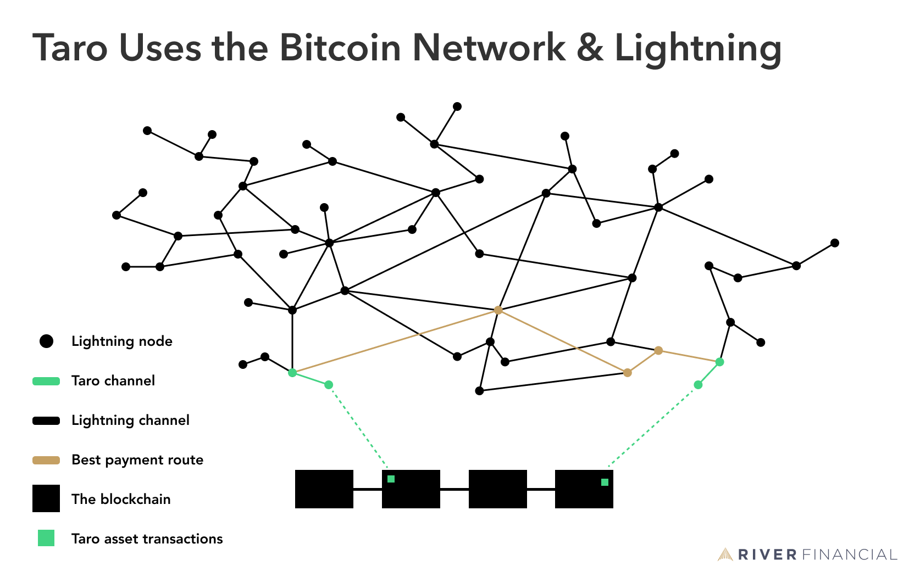
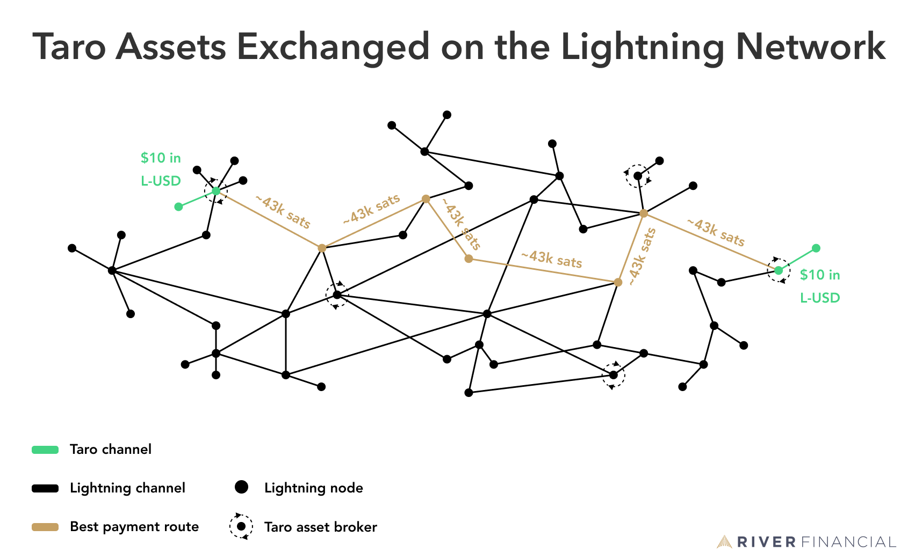
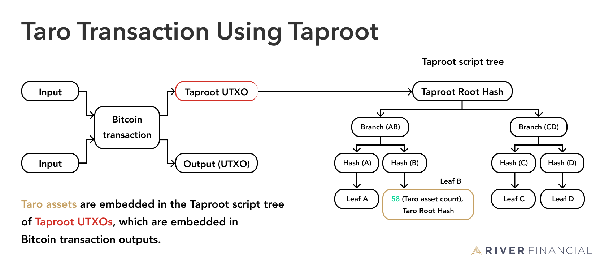
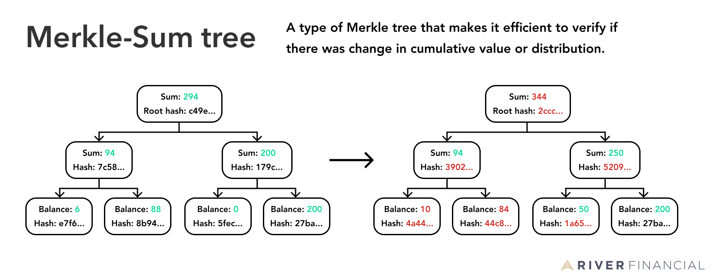

> *作者：River Financial*
> 
> *来源：<https://river.com/learn/what-is-taro-in-bitcoin/>*

“Taro” 是一种能够给比特币区块链带来资产、开启新场景的协议。它被认为是可扩展的，有潜力让比特币成为一个能够容纳多种资产的网络，并且在这个网络上，用户可以使用比特币的可靠性、享受低手续费的即时全球终极结算。

Taro 可以将所有的全球外汇交易市场转化成一套可以在任何闪电网络节点上运行的协议。

那么 Taro 到底是什么样的？它怎么工作？它要什么时候才能部署到比特币和闪电网络呢？

## 什么是 “Taro”？

“Taro（[Taproot](https://river.com/learn/what-is-taproot/) Asset Representation Overlay，使用 Taproot 的资产表示层）” 是一种还在提议阶段的[协议](https://river.com/learn/terms/p/protocol/)，它让我们可以在比特币区块链上发行电子资产。它既可以用来发行[同质化](https://river.com/learn/terms/f/fungibility/)的资产（比如[稳定币](https://river.com/learn/what-are-stablecoins/)），也可以发行非同质化的、独一无二的代币（比如 NFT，或者说收藏品）。当前，这样的资产大部分在放在其它区块链上，因为在这些链上更容易实现、交易费用更低或者吞吐量更高，但是 Taro 有望改变这一局面。

Taro 资产可以通过比特币网络的链上交易来转移。此外，同质化的 Taro 资产也可以（在锁入闪电通道之后）在[闪电网络](https://river.com/learn/what-is-the-lightning-network/)上以更低的手续费、更隐私的方式即时转移。闪电网络预计会成为 Taro 资产转移的主要网络，因为它具有压倒性的实用优势。

如果 Taro 协议被采用，它可以提高比特币和闪电网络两个网络的活跃性并开启新的用户场景，而无需改变用户体验。Taro 将提升比特币的网络效应，这也会跟对比特币以外的资产不感兴趣的用户带来好处。

[Taro 的第一版提案](https://docs.lightning.engineering/the-lightning-network/taro)已经由 Lightning Labs 在 2022 年 4 月发布。这不是第一个尝试在比特币区块链上发行不同资产的协议，但它是第一个利用了比特币的 Taproot 升级来让整个实现变得更优雅和可扩展的。另一个尝试实现类似目标的是 [RGB 协议](https://bitcoinmagazine.com/guides/a-brief-introduction-to-rgb-protocols)。

## Taro 协议怎么工作？

在了解 Taro 协议在技术层面如何工作时，先来思考一下你对一个可以转移同质（和非同质）资产的系统的期望，会有所帮助：

- 可以在同一个网络上使用任何类型的资产。
-  资产转移的代价便宜，而且可以全天候工作。
- 资产不会被一个中心化实体控制。
- 易于审计资产的供应量。
- 非常高的安全性，既是被转移的资产而已，也是对整个网络而言。
- 用户可控的隐私性。
- 不限地域的可触达性。

下面，我们再来看看 Taro 协议使用了什么技术来实现这些关键属性。

### **Taro 使用比特币网络**

Taro 资产是以附加在交易上的[哈希化](https://river.com/learn/terms/h/hash-function/)元数据形式，登记在比特币区块链上的。直接在区块链上存储所有的元数据会占用更多的空间，因此也会更贵。使用哈希值，这种成本就可以省下来，同时，因为哈希值是数据的单向转化，所以很容易验证有没有伪造。

因为可以用哈希值来表示的数据在体积上是没有限制的，所以区块链上的一条交易也可以表示实际上的几百万次交易。Taro 资产转移也是如此，我们会在下文跟[默克尔树](https://river.com/learn/terms/m/merkle-tree/)相关的部分进一步说明。

一笔包含 Taro 资产的交易可以在比特币网络上转移，就像其它任何比特币交易一样。因为比特币自 2009 来拥有高达 [99.98%](https://bitcoinuptime.org/)  的正常运行时间，而且自 2013 年以来没有再出现过故障，所以它是一个非常可靠的资产转移网络，所以 Taro 用户也可以拥有很强的信心，他们的资产总是安全的，也总是可以转移的。比特币网络也会保证 Taro 资产无法被[重复花费](https://river.com/learn/how-bitcoin-solves-the-double-spend-problem/)，就像比特币自身一样。

### **Taro 使用闪电网络**

Taro 使用闪电网络，让同质化的 Taro 资产（比如稳定币）实现更高的交易速度、更好的可扩展性以及更低的手续费（相比于仅使用比特币基础层的状态）。这就类似于使用闪电网络可以更快、更便宜地转移比特币一样。

Taro 能让同质化资产兼容闪电网络是非常重要的，因为比特币自己也无法在基础层扩容到容纳数十亿的用户。比特币的基础层在交易吞吐量上有先天的限制，因为它需要保证使用普通电脑的用户也能加入比特币网络。这使得网络能够保持去中心化。如果每一次 Taro 资产转移都需要在链上发起一条交易，那么比特币底层的吞吐量限制就会反过来成为 Taro 的可扩展性的主要限制。

在 Taro 的提议实现中，闪电网络自身不需要改变。为了路由一笔以某种 Taro 资产计价的支付，只需整条支付路径的第一条和最后一条通道能够识别 Taro 资产；对于途中的路由节点来说，这笔看起来就跟别的闪电转账没有区别，因为都是转移比特币。

Taro 资产最常在网络边缘跟其他资产相交换，这跟传统金融的世界类似，不是每一个人都会参与资产互换。所以一般是由外汇交易所这样的专门机构来操作。

### Taro 在闪电网络上引入了经纪人

只有第一跳和最后一跳需要知晓这种资产的存在，这个特性对所有尝试发行新资产的人都是重大利好。

在 Taro 之前，创建出一种新资产就必须形成一个接受它的市场，而且必须有足够多的用户有兴趣在这个市场上交易这种资产。

而在 Taro 之后，资产的是市场可以是完全去中心化的，而且闪电网络上的节点都可以选择成为经纪人，就像做市商一样接受某一种资产并换成另一种资产。当用户想交换某一种 Taro 资产时，钱包软件会直接找出附近最快、最便宜，并且价格最好的节点来交换。

有了 Taro，即使一种资产只有一小部分感兴趣的用户，它也能从闪电网络的流动性和网络效应中得到好处，就像一种拥有几百万用户的资产一样。

### **Taro 使用 Tarpoot**

Taproot 是比特币在 2021 年激活的升级。它让用户可以为一笔交易的输出（UTXO）创建花费条件，同时，只有在实际花费时被满足的条件才需要在链上公开。这使得 Taro 交易看起来跟普通的 Taproot 交易一样，而且节点甚至不需要知道 Taro 资产存在（这对隐私性有好处）。

花费 Taproot 输出的条件是以一种叫做 “Tarpoot 脚本树” 的形式组织起来的。这种结构最小化了需要验证的交易数据，从而减少了节点的负担。脚本树也保证了外部观察者不知道这棵树是否还存在其它可以被满足的条件，因为只有树的哈希值被包含在交易输出中。

- Taro 资产被嵌在 Taproot 脚本树中，而这个脚本树又放在 Tarpoot 交易输出（UTXO） 中 -

Taro 利用 Tarpoot 将资产的元数据嵌入交易输出中，同时还可以设定与新资产数据交互和验证的具体规则。因为 Taproot 交易中只包含 Tarpoot 脚本树的哈希值，所以没有人能断定这是不是一笔 Taro 交易，因为哈希值可以表示任何东西。

对 Taproot 的利用使得 Taro 迥异于在其它区块链上出现的资产解决方案。这些区块链往往使用账户模型而非 UTXO 模型，所以关于余额的信息一般都会暴露。

### **Taro 使用默克尔树**

默克尔树是一种可以存储大量数据、同时很容易证明某个数据存在于某棵树上的数据结构。验证树上的数据是否被篡改、改了哪个数据，也很容易。

如果你还不熟悉[默克尔树](https://river.com/learn/terms/m/merkle-tree/)，建议你先了解一下，再阅读下面的部分。

Taro 使用了默克尔树的一个变种，叫做 “稀疏默克尔总和（MS-SMT）”，它是 “默克尔总和树（[Merkle Sum tree](https://river.com/learn/terms/m/merkle-sum-tree/)）” 和 “稀疏默克尔树（[Sparse Merkle tree](https://river.com/learn/terms/s/sparse-merkle-tree/)）” 的结合。

默克尔总和树通过为每一个叶子分配一个数值，让我们可以高效地验证默克尔树叶子的值和分布没有变化。假设一种 Taro 资产存储在一棵默克尔树中，默克尔总和树结构让我们可以更快地验证资产的总数量没有变化并且依然放在跟以前相同的位置。

- 在这种默克尔树上，你可以高效低验证树上存储的数值和分布有无改变 -

而稀疏默克尔树则用来搞笑验证某个数据不在树上。在这种默克尔树上，所有的叶子都是带有索引的。完成了一次 Taro 资产的转移之后，这项资产所在的那个叶子将变成空值，这样就可以证明一项资产已经转移，或者它还在那个位置。

- 在这种默克尔树上，数据是跟其位置相联系的，所以你可以证明某个数据不在这棵树上。 -

结合两种结构的特性，稀疏默克尔总和树就拥有下面的属性：

- 可以容纳大量的资产。
- 让用户可以证明某一项资产存储在一棵默克尔树上，并且该默克尔树的根植是一笔比特币交易的元数据。
- 抗伪造，一旦伪造，默克尔根值就会发生改变。
- 易于验证总量，无需公开所有信息。
- 同质化 Taro 资产的合并和分割成为可能，只要他们不会影响总供应量。
- 用户可以证明某一项资产已经不再存储于一棵默克尔树上、已经转移了。这也叫 “非成员证明”。

- Taro 利用稀疏总和默克尔树来实现可扩展性、抗篡改性、可审计性、隐私性和非成员证明。默克尔总和意味着这种 Taro 资产的各分支的计数。这些数值使我们易于验证供应量及其分布。稀疏默克尔树的大部分都没有画在这里，因为整棵树有 256 层高，最底下一层有 2 ^ 256 个叶子，大部分都是空的。一棵稀疏默克尔树的叶子的位置让用户可以证明自己拥有（或不再拥有）一项资产，因为他们的资产所有权使跟位置绑定的。 -

## Taro 资产如何发行和转移

Taro 资产可以在比特币区块链和闪电网络上转移。对用户来说，除了钱包会显示多一种资产、链下要有一个地方存储着证明资产真实性的数据以外，用起来没有太大差别。

在技术层面上，Taro 资产的转移很更复杂一些，因为它是资产脚本、Taproot 和稀疏默克尔总和树的应用。

在构造 Taro 资产交易的这些技术部分以外，非同质化的资产（比如 NFT、收藏品）在转移的时候也会跟同质化的资产（比如稳定币）有区别。

### Taro 上的 NFT

非同质化的资产使用单个的、限制修改的包在一笔链上交易中发行。这种资产不能分割和合并，只能改变所有权，可以在链下通过转移资产的唯一标识符、证明资产真实性的历史交易数据验证文件来完成。这些信息存储在 [Taro Asset Universes](https://river.com/learn/terms/t/taro-asset-universe/) 中，它扮演一个类似于[区块浏览器](https://river.com/learn/terms/b/block-explorer/)的角色，任何对这种资产有兴趣的人都可以运行。

Taro 资产的新主人可以在一个 Taro Asset Universes 中验证数据，并重构放在区块链上的元数据来验证所有权。在传递资产给下一任主人时，他们还可以使用自己的证明来修改元数据。

### Taro 上的稳定币

Taro 上的同质化资产（比如稳定币）可以分割、合并。这意味着，如果一位用户拥有某种资产，他可以跟同一棵默克尔树上的其他产权人改变所有权，也可以将资产转移到另一棵默克尔树上。默克尔树的新版本将证明资产的总量没有变化，但不同所有权人的余额已经更新了。

### 转移一种 Taro 资产，就是转移其规则

我们已经在前面的 Taproot 部分提到，Taro 资产拥有与之交互和验证的具体规则。这些规则存储在资产脚本中，脚本表示一系列由开发者创建的、定义了这种资产如何转移的规则。这些资产脚本也是稀疏默克尔总和树的一部分。

如何处理一种 Taro 资产的知识也需要传递给新的所有权人，这样知道了资产转移方法的人才能在收到资产后转移资产并向下一个人证明自己拥有这些知识。为使这一点成为可能，Taro 将使用一种基于 [bech32](https://river.com/learn/terms/b/bech32/) 的地址格式，包含资产脚本的哈希值。所有权人可以给下一个人提供资产脚本，从而证明自己拥有花费这些 Taro 资产的知识，而后者可以哈希这个脚本来验证前者所提供的资产脚本是相匹配的。

## 我们什么时候能用上 Taro？

可能用户还要好一段时间才能用上 Taro，因为它还在开发的早期。不能保证这些都一定能实现，因为软件开发总是有可能遇到意外的阻碍。

Taro 的概念是在 2022 年四月提出的，比特币世界里的许多人都给出了自己的反馈。这些反馈得到处理后，人们会形成一份最终的 [BIP](https://river.com/learn/terms/b/bitcoin-improvement-proposal-bip/)，然后开发者社区将进行更严格的分析和评价。这个流程可能会花上几个月乃至几年的时间，就看人们在分析中发现什么了。

就连闪电网络本身也是如此，人们是在 2016 年初提出闪电网络的，但到了 2018 年才对愿意承担软件风险的用户可用，但是从那时候开始，就一直在迅猛发展和成熟。我们预计 Taro 也会走过一个类似的过程，但应该会更快，因为不需要创建新的网络。

（完）