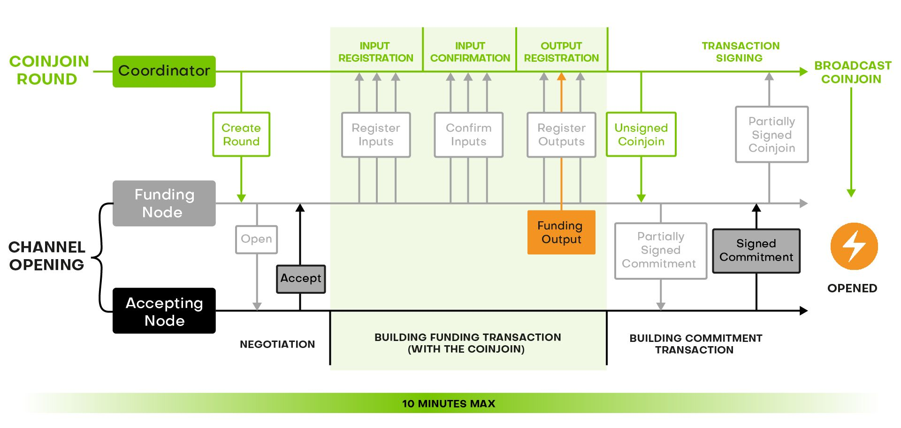
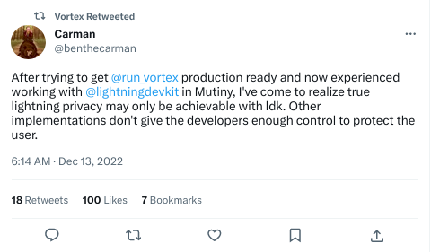

> *作者：Gustavo Flores Echaiz & Turbolay*
> 
> *来源：<https://blog.wasabiwallet.io/what-lightning-network-enabled-wabisabi-coinjoins-might-look-like/>*

**Wasabi Wallet 的 WabiSabi coinjoin 协议实现没有集成闪电网络，但，如果能支持闪电网络的话，会是什么样**？

当前，使用创建自 Wasabi 的资金来开启支付通道，需要分别完成 coinjoin 和通道开启两个步骤，这会产生多个没有必要的链上交易。一种叫做 “Votex” 的新实现，允许 Chaumian coinjoin 交易的隐私输出直接创建一条闪电通道，但也有一些限制。未来，支持闪电网络的 WabiSabi coinjoin 也许可以接近其中一些问题。闪电通道关闭的复杂性又在另一个层次了，但本文不会讨论这部分。

下文将解释为什么闪电网络是比特币的主要扩容解决方案、为什么支付通道的开启和 coinjoin 可以很好地结合在一起、当前如何使用一个 Wasabi Wallet 的隐私 UTXO 开启一条闪电通道、Vortex 如何处理直接在 coinjoin 输出中开启通道的问题，最后，未来启用闪电网络的 WabiSabi coinjoin 可能会如何解决这个问题。

## 闪电网络是比特币的头号扩容方案

到了 2023 年，这已经是一个没有争议的说法了：闪电网络是比特币的主要扩容方案；这是一个事实。新的技术可能会出现，各种研究也能得到许多支持。但是，比特币的企业和开发者社区已经聚焦了，以开发能够让闪电网络的用户体验更加顺滑的解决方案为首要优先级。

## 什么是闪电网络

**闪电网络是一个去中心化的支付网络，允许即时的、低成本的比特币交易**。参与者们要跟一个对手开启一条支付通道，这意味着要跟另一个人一起在区块链上锁定一些资金，从而在链下跟 TA 免费地发送交易。参与者随时可以关闭自己的支付通道，从而让资金 “回到链上”（译者注：恢复自己可以排他式控制、可以给任何人发起比特币交易的状态）。如果你想了解闪电网络是怎么工作的，看[这篇](https://docs.lightning.engineering/the-lightning-network/overview)。

这里要指出的关键之处是，闪电网络不是一种魔法：他需要开启支付通道、关闭支付通道和流动性管理。同样重要的是理解闪电网络的隐私性：你可以通过 [Lightning Privacy](https://lightningprivacy.com/en/introduction) 项目来了解闪电网络对隐私性的复杂影响，这个研究项目是由 zkSNACKs 公司和 Wasabi Wallet 团队资助的。

下面，我们要看看当前的 Wasabi Wallet 如何开启闪电通道。使用隐私 UTXO 来开始你在闪电网络上的旅程，对你极为重要。

## 使用 Wasabi Wallet 中的隐私 UTXO 开启一条闪电通道

在这一节，我们会走一遍实现标题所述效果所需的所有步骤：使用 Wasabi Wallet 获得隐私 UTXO、将你的资金发送到一个闪电网络钱包中，然后开启一条支付通道。

**注意，Wasabi 只能提供用来开启闪电通道的隐私 UTXO，但不能保证闪电网络中发生的交易的隐私性。**

### 使用 Wasabi Wallet

为获得隐私 UTXO，你只需要[在 Wasabi 中生成一个钱包](https://docs.wasabiwallet.io/using-wasabi/WalletGeneration.html)、备份好你的种子词，然后用这个钱包来接[收资金](https://docs.wasabiwallet.io/using-wasabi/Receive.html)，然后[等待 coinjoin 进度](https://docs.wasabiwallet.io/using-wasabi/CoinJoin.html)。这个过程可能需要几分钟，甚至几天，取决于你的数额和设定。

获得了一个隐私 UTXO 之后，你就可以把它发送到一个闪电网络钱包中；不过，首先，你要选择一款闪电网络钱包。

### 选择并使用一款闪电网络钱包

在选择闪电网络钱包的时候，你需要考虑安全性、隐私性，以及你希望的自主程度。举个例子，Wallet of Satoshi 和 Blink（Bitcoin Beach Wallet）这样的钱包，虽然用起来很简单，但完全是托管的。这意味着你在其中的资金有失盗的风险，所以我们不建议你使用托管钱包。

另一方面，如果你可以使用在命令行中使用 LND 或者 Core Lightning，你可以最大限度地控制你在闪电网络中的资金，以及你自己的用户体验，但通常要懂技术的用户才能用下来。

**Breez 和 Blixt Wallet 是自主保管的解决方案，隐私性良好（实现了区块过滤器，具有跟 Wasabi 一样的网络隐私性）而且易于使用**。当然，还有许多别的钱包也是好用的备选。

无论你决定使用哪一款，你都必须先安装软件、生成一个钱包，并从 Wasabi 中发送一笔链上交易到这个新钱包。

### 开启一条闪电网络通道

**如果你留心了，你会发现迄今为之我们已经发送了三笔链上交易，但依然还没实现我们的目标**。你还必须找到一个闪电节点作为你的对手，然后在你的闪电网络钱包中发送最后一笔链上交易（开启通道）。

**这证明了了，要从一个不隐私的 UTXO 变成在闪电网络中拥有隐私资金，是非常费时费力的。**

结合 coinjoin 的隐私性好处以及闪电网络的可扩展性，对比特币的未来至关重要。我们来看看这两项技术如何结合。

## 为何 Coinjoin 和闪电通道开启操作可以相得益彰

要理解为什么 coinjoin 交易是开启闪电通道的好地方，我们先回到最基础的东西：coinjoin 的准确定义：

**一种分布式的任务，要求每一个参与者都同时在线，并作出响应；这样他们就能通过一个协议来构造交易，并在一个特定的时间框架内一起签名这笔交易。**

但是 …… 闪电通道的开启操作不也是如此吗！这就是为什么这两件事如此契合。

唯一真正有难度的地方在于，要在 10 分钟之内解决闪电通道的启动协商，这是通道的时间框架。通道的两个参与者的协商完成后，10 分钟之内，相关的 coinjoin 交易就得到广播。

**构造一笔拥有许多参与者的 coinjoin 交易可能比开启一条通道要花时间得多。**因此，coinjoin 流程很容易超出这个限制，导致通道的其中一方撤销通道开启操作。

但是，因为决定每个节点的时间框架的是协调者，所以，假设参与者之间的通道协调是在 coinjoin 的 “输入登记（input registration）” 阶段的末尾开始的，让整个过程在 10 分钟之内解决是完全有可能的。

上图就展示了两个协议可以如何混合、使用一个 coinjoin 交易的输出作为通道的注资输出、开启一条通道。

接下来，我们看看 Vortex 已经发布的解决方案如何实现这一点，以及，在 Wasabi Wallet 或者其它 Wabisabi coinjoin 协调器上又如何实现。

## 使用 Coinjoin 交易直接开启一条闪电通道

### Vortex 案例

[Vortex](https://lnvortex.com/) 是一个开源工具，你可以在 Core Lightning、LND 上使用，也可以直接在 Bitcoin Core 上使用。它允许你执行由 taproot 赋能的协作式交易（比如 coinjoin），而且可以直接开启一条闪电通道。这个软件还在开发的 alpha 阶段，但这个[交易样品](https://twitter.com/benthecarman/status/1590886577940889600)已经在比特币网络上完成了。它是基于 Zerolink 协议的。

Vortex 的开发者 Ben Carman 在 2022 年12 月宣布，虽然 Vortex 已经实现了直接用 coinjoin 交易来开启闪电通道的目标，搭配 Core Lihgtning 和 LND 并不是最优选择，搭配 LDK 才是，因为闪电网络在其它方面缺乏隐私性。

**他现在正在开发 Mutiny Wallet，预计会实现 Vortex：支持开启闪电网络通道的 coinjoin 交易。**

### Vortex 的实现的局限性

Vortex 有一些局限性，绝大部分都继承自 ZeroLink 协议。

首先，输出必须在输入登记阶段（coinjoin 的第一个阶段）就登记（盲化输出）。因此，通道也必须在这个时候协商，这就加重了时间上的束缚。这跟 Wasabi Wallet 当前的 coinjoin 实现是不一样的。

其次，Vortex 从 ZeroLink 协议继承了 “有毒找零输出（toxic change）” 问题，因为隐私 UTXO 的大小是由协调者服务端选择的。

最后，Vortex 面临的一个问题是流动性。一个 coinjoin 协调员找到足够多对参与 coinjoin 感兴趣的输入就已经够难得了。如果我们还希望每一个参与者都想打开一条闪电通道，那就更复杂了；而且，还有更难得：给每一条通道都注入同样数额的资金。

为了解决最后一个问题，Vortex 在输入注册阶段之前加入了额外的一轮，以获得足够多的输入（需要达到一个阈值，2 就足以打破确定性的关联）。Wasabi Wallet 1.0 也曾使用过相同的技术。

**现在，我们已经了解了 Vortex 的局限性，看看在 WabiSabi 协议中开启闪电通道的方法有何不同吧。**

### Wasabi Wallet 的潜能

对于 Vortex 的第一个问题，WabiSabi 协议使得参与者可以推迟谈判开始的时间，只需在 “输出注册（output registration）” 阶段开始之前完成即可，这跟 coinjoin 交易广播的时间近了很多。这没法完全解决这个时间约束的问题，但至少让它变成了一个更容易克服的问题。

使用 WabiSabi 的主要好处在于，绝大部分时候，来自闪电通道开启操作的找零，也会被 coinjoin 到隐私 UTXO 中。这使得每一个闪电网络参与者的全部余额都变得更加隐私，而不仅仅是为闪电通道而创建的 UTXO。整合这些隐私 UTXO 可能依然会产生问题（削弱隐私性），所以，应该避免在一笔交易中花掉整个钱包的所有余额，以保证一笔支付不会因为数额而被重新关联到某一个 coinjoin 输入。

我们还可以看出，Vortex 的一个问题是获取流动性。这个问题在使用 WabiSabi 时可能更加糟糕，因为这个协议是越多输入越好。举例来说，zkSNACKs 协调者就要求一次 coinjoin 处理 150 个输入。

**解决这个问题最简单的办法就是使用 zkSNACKs 协调者、跟其它服务（Wasabi Wallet、Trezor、BTCPayServer……）的用户开启闪电通道。**即使其它参与者并不开启通道，跟他们 coinjoin 也是非常有用的，会让辨识谁在开启通道变得更难（尤其考虑到许多输入可能参与了双向注资通道（dual-funded channels）的话）。

Wasabi 的实现也是完全开源的，足够轻量的（复杂性都在客户端，而不在后台），而且有意地尽可能能减少了泄露给协调员的隐私。因此，协调员所拥有的信息，跟别的链观察者是一样多的，都无法去匿名化用户。

（未完）

