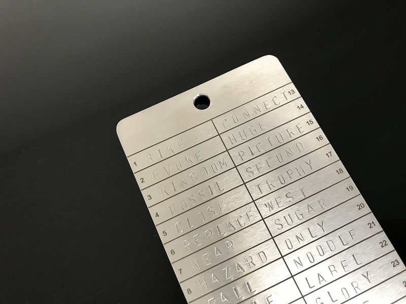

> *作者：ColdBit*
> 
> *来源：<https://coldbit.com/what-types-of-mnemonic-seeds-are-used-in-bitcoin/>*

比特币助记词主要分为 4 类：

- BIP39

- Electrum

- Shamir 备份（SLIP39）

- LND（AEZEED）

助记词存在的意义是什么？不同类型的助记词之间有何区别？我们能轻松辨别它们吗？在这篇文章中，我们将带你找到这些问题的答案。



- 刻在 Coldbit Steel 上的 BIP39 助记词 -

## 使用助记词的目的是什么？

**助记词主要用来将一个巨大的数字（私钥）转换成人类可读的形式，**便于人们在不使用电子设备的情况下对其进行复制和备份。那为什么要方便人们用非电子设备来备份呢？好吧，与物理（如纸或金属）私钥备份相比，电子设备，尤其是联网设备，更容易被黑客入侵。联网设备和存储器容易遭到远程攻击，物理备份则必须亲身接触，而且执行起来难度更大。

## BIP39

这一格式[创建于 2013 年，之后开始成为最受欢迎也是最常用的助记词格式](https://github.com/bitcoin/bips/blob/master/bip-0039.mediawiki)。BIP39 格式支持 128 位和 256 位随机数的编码，另外还可添加校验和（checksum）和口令词（passphrase）来保护私钥。[单词表是固定的，共包含 2048 个单词](https://raw.githubusercontent.com/bitcoin/bips/master/bip-0039/english.txt)。除了英语单词表之外，还有另外 7 种语言的单词表，但是英语之外的语言并不常用。BIP39 格式不支持有意的版本控制（简单至上）。

## Electrum

Electrum 钱包软件有两种助记词格式。从 2011 到 2014 左右，Electrum 使用的是旧版助记词格式。Electrum 2.0 开始使用 “新版” 助记词格式。

- Electrum 的旧版助记词格式（Electrum 2.0 之前的版本）：[**单词表包含 1626 个英语单词**](https://github.com/spesmilo/electrum/blob/master/electrum/old_mnemonic.py#L29-L1656)。这个单词表与 BIP39 单词表之间存在部分重合，但并非完全相同。旧版格式支持助记词和随机数之间的双向编码。“双向” 在这里的意思是你既可以将二进制的随机数转换成助记词，也可以将助记词转换回二进制的随机数。这个格式不使用校验和。当前版本的 Electrum 依然可以识别这种格式并导入这类钱包（输入助记词后整个过程是自动化的）。

- Electrum 的新版助记词格式：**Electrum 2.0 开始采用一种新的助记词格式 “助记词版本系统” 来修复已经发现的 BIP39 不足**。这个格式使用不依赖固定单词表的 UTF8 标准化助记词的哈希值来生成密钥和地址。虽然这个助记词格式不依赖于固定单词表，但它使用了和 BIP39 一样的包含 2048 词的英语单词表。**这个格式的另一个显著特征是，将版本号编码到助记词中。这么做的目的是，使得向前兼容未来钱包版本成为可能。版本号还对输出地址（Legacy、P2SH-Segwit、Native Segwit）的类型、使用的网络（主网或测试网）以及是单签钱包还是多签钱包进行了编码，以降低未来钱包找回的难度**。[**点击此处**](https://electrum.readthedocs.io/en/latest/seedphrase.html)，查看关于这一格式的完整表述。

## Shamir 密钥分割（**SLIP39**） 

2019 年，SatoshiLabs **基于 [Adi Shamir 在 1979 年提出](https://cs.jhu.edu/~sdoshi/crypto/papers/shamirturing.pdf)的密钥分割方案[发布了助记词拆分格式 SLIP39](https://github.com/satoshilabs/slips/blob/master/slip-0039.md)**。这个格式的主要目的是能够使用 N 组单词对助记词进行编码，这样只要拥有 M 组单词即可找回助记词（M < = N）。这是一种门限助记词拆分方案，例如，假设有人使用 3 个不同的份额对助记词进行编码，只需要拥有其中 2 个份额就可以找回助记词。最多可支持 16 个份额。

该编码方案支持基于里德-所罗门码（Reed-Solomon code）的健壮校验和，确保能够检测到影响在 3 个单词以内的任何错误，并且，对影响更大的错误，侦测失败的概率低于 1/10^9。和 BIP39 一样，[**SLIP39**](https://github.com/satoshilabs/slips/blob/master/slip-0039.md) 也支持口令词作为可选项，用于提供额外的 保护/多账户设置。

SLIP39 不支持版本控制。[其单词表包含 1024 个英语单词](https://raw.githubusercontent.com/satoshilabs/slips/master/slip-0039/wordlist.txt)。助记词长度通常是 20 个单词。33 个单词也是有可能的，但是目前没有硬件钱包支持这个长度的助记词。Trezor Model T 使用的是 20 个单词的助记词。

## LND（AEZEED）

无论是 BIP39 还是 Electrum 格式都不够健壮，不能满足 Lightning Network Daemon 开发者的需求，所以他们在 2018 年创建了新格式。反对使用 BIP39 的主要原因是：

- 缺少版本控制（因此，未来的钱包版本不一定知道如何生成所有必需的地址）

- 缺少钱包生日（因此，钱包可能不知道要向前回溯多少个区块）



- 初始状态：已经有 14 种标准了。“什么？14 种？荒唐！我们需要一种通用标准来满足所有用户场景！”“没错没错！” 结果状态：有了 15 种标准。 -

**LND AEZEED** 应运而生。它是一种编码了生日的版本化方案，支持口令词作为可选项，而且同样使用 BIP39 单词表。助记词的长度是 24 个单词。

有趣的是，没有其它闪电网络钱包使用 AEZEED 格式。例如，Eclair 使用的是 BIP39，C–Lightning 使用的是 Bitcoin Core 内置钱包。

**值得一提的是，AEZEED 有一些有趣的特性**：

- 助记词本身就是一段密文。也就是说，如果用户另外设置了口令词，让助记词原样保存也没有问题。相反，在 BIP39 格式下，有时候只需要助记词（不需要口令词）就足以盗取资金。

- 可通过修改一个 cipherseed 来改变口令词。这意味着，如果用户想要安全强度更高的密码，可以先（使用旧口令）解密，然后（使用新口令）加密。最终结果是，用户升级了口令，但使用的还是之前那个 HD 密钥路径（钱包地址不变）。相反，在 BIP39 格式下，如果用户使用了口令，由于映射是单向的，他们无法改变已有 HD 密钥链的口令（在 BIP 39 格式下，改变口令会生成一个全新的 HD 密钥链，因此地址也会改变，既两个密钥链并存）。

- 缺点是你无法为一个助记词设置多个口令（但是 BIP39 支持这一功能）。在 AEZEED 格式下，使用新的口令会创建新的助记词，因为密码是用来对最终助记词进行编码的。在 BIP 39 格式下，口令仅用于将助记词转化为二进制种子的最后一步。

## 结论

|                                | 方向 | 默认长度 | 单词表        | 口令 | 应用年份  |
| ------------------------------ | ---- | -------- | ------------- | ---- | --------- |
| BIP 39                         | 单向 | 12/24 词 | 2048 词       | 可选 | 2013      |
| Electrum (旧版)                | 双向 | 12 词    | 1626 词       | 无   | 2011-2014 |
| Electrum (新版)                | 单向 | 12 词    | BIP 39 单词表 | 可选 | 2014      |
| Shamir Secret Sharing (SLIP39) | 双向 | 20 词    | 1024 词       | 可选 | 2019      |
| LND (AEZEED)                   | 双向 | 24 词    | BIP 39 单词表 | 可选 | 2018      |

## 仅有助记词并不一定能找回比特币钱包？

没错。在某些情况下，如果你只有一个 12/24 词助记词，并不一定可以找回钱包。如果你忘了这个助记词对应的是哪种格式，你可能得尝试几种不同的组合和格式。希望上文的列表可以帮到你。

