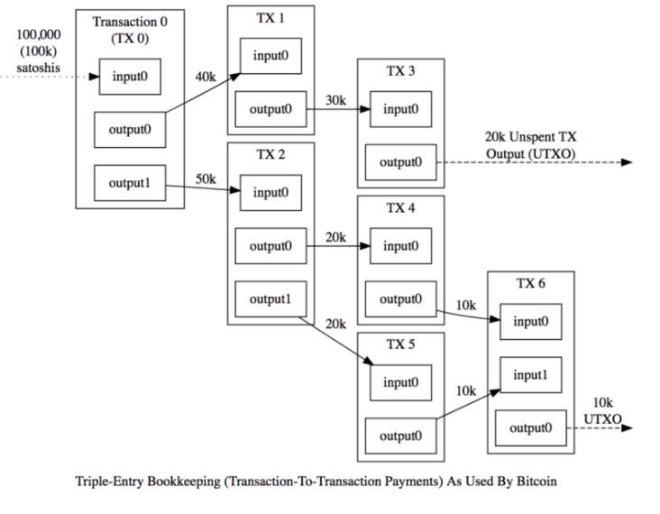
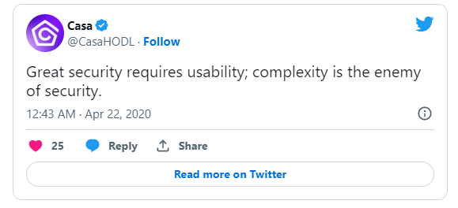
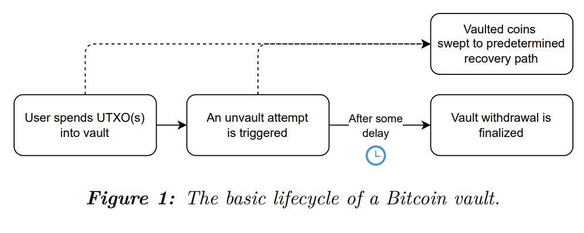
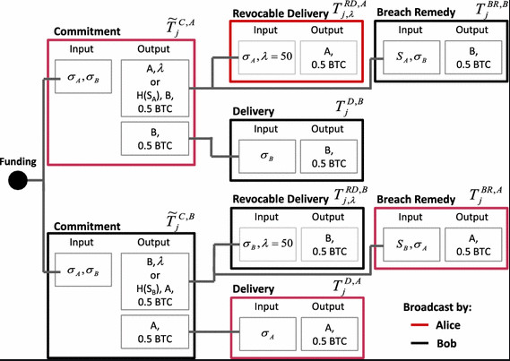
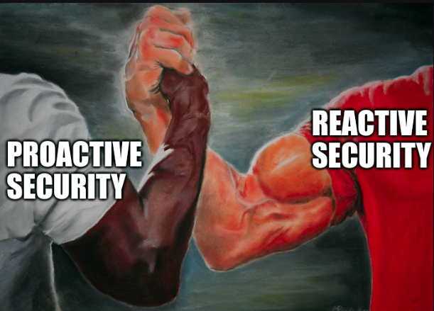

> *作者：Jameson Lopp*
> 
> *来源：<https://blog.keys.casa/why-bitcoin-needs-covenants/>*

比特币脚本用于定义花费某个 UTXO 所需满足的条件。当你创建一个比特币地址来接收资金时，该地址实际上是一个比特币脚本（变换后）的哈希，定义了解锁和花费资金的必要条件。

截至发稿时，比特币脚本 **只** 能定义比特币交易中的输入（被花费的资金）必需满足的条件。没有一种方法能够限制比特币交易输出（被花费的资金的去向）的任何属性。

> 比特币限制条款（covenants）是一种能够给未来的比特币交易设置条件的机制。

我们为何要关注限制输出条件的能力？过去 14 年来，比特币虽然不具备这一功能，却一直保持良好运行不是吗？好吧，这不是因为缺少尝试。

## 限制条款提案的悠久历史

截至发稿时，人们关于限制条款的讨论已经持续了 9 年半以上！

我将我目前找到的所有关于限制条款的讨论（我可能会有疏漏）按时间顺序罗列了出来：

- CoinCovenants（[Bitcointalk 帖子](https://bitcointalk.org/index.php?topic=278122.0&ref=casa-blog)）
- CHECKOUTPUTVERIFY（[白皮书](https://fc16.ifca.ai/bitcoin/papers/MES16.pdf?ref=casa-blog)）
- OP_CHECKSIGFROMSTACK（[博客文章](https://blog.blockstream.com/en-covenants-in-elements-alpha/?ref=casa-blog)）
- SIGHASH_ANYPREVOUT ([BIP-118](https://github.com/bitcoin/bips/blob/master/bip-0118.mediawiki?ref=casa-blog))
- Oleg Andreev 提出的“保险柜（Vault）”概念（[博客文章](https://blog.oleganza.com/post/163955782228/how-segwit-makes-security-better?ref=casa-blog)）
- Bryan Bishop 提出的“预签名保险柜（Pre-signed Vault）”概念（[邮件列表帖子](https://lists.linuxfoundation.org/pipermail/bitcoin-dev/2019-August/017229.html?ref=casa-blog)）
- OP_TAPLEAFUPDATEVERIFY（[邮件列表帖子](https://lists.linuxfoundation.org/pipermail/bitcoin-dev/2021-September/019419.html?ref=casa-blog)）
- OP_CAT（[博客文章](https://medium.com/blockstream/cat-and-schnorr-tricks-i-faf1b59bd298?ref=casa-blog)）
- OP_CHECKOUTPUTSHASHVERIFY（[BIP 草案](https://github.com/JeremyRubin/bips/blob/op-checkoutputshashverify/bip-coshv.mediawiki?ref=casa-blog)）
- 高效比特币保险柜 (Efficient Bitcoin Vault)（[BIP 草案](https://github.com/fresheneesz/bip-efficient-bitcoin-vaults?ref=casa-blog)）
- OP_CHECKTEMPLATEVERIFY ([BIP-119](https://github.com/bitcoin/bips/blob/master/bip-0119.mediawiki?ref=casa-blog))
- OP_TXHASH（[邮件列表帖子](https://lists.linuxfoundation.org/pipermail/bitcoin-dev/2022-January/019813.html?ref=casa-blog)）
- OP_EVICT（[邮件列表帖子](https://lists.linuxfoundation.org/pipermail/bitcoin-dev/2022-February/019937.html?ref=casa-blog)）
- OP_TX（[邮件列表帖子](https://lists.linuxfoundation.org/pipermail/bitcoin-dev/2022-May/020450.html?ref=casa-blog)）
- OP_CAT2（[邮件列表帖子](https://lists.linuxfoundation.org/pipermail/bitcoin-dev/2022-May/020427.html?ref=casa-blog)）
- OP_VAULT（[白皮书](https://jameso.be/vaults.pdf?ref=casa-blog)）

## 限制条款的类型

每个限制条款提案都有各自的特点，但是我们可以根据其运作方式的不同特性将它们大致分成两类。

- **通用型** —— 这类限制条款不仅提供更高的灵活性和更丰富的功能，通常还会带来更多复杂性和取舍，例如 OP_CHECKTEMPLATEVERIFY、OP_CHECKSIGFROMSTACK 和 OP_CAT。
- **限制型** —— 这类限制条款的目的只是增加一组特定功能，理解起来往往更容易，例如 Brian Bishop 提出的预签名保险柜和 OP_VAULT。

有些限制条款提案本质上是一次性的，有些限制条款提案则永远都能将其限制向前传播。

- **非递归型** —— 这类限制条款只能将它们的规则应用于流经你所构建的逻辑树的一“轮”比特币价值，例如 OP_CHECKTEMPLATEVERIFY。
- **递归型** —— 这类限制条款能够在不受限制的情况下将自身（连同其限制）复制到今后接收资金的 UTXO 中，例如 OP_VAULT。

就具体实现层面而言，限制条款提案会通过以下两种方式之一将功能添加至协议。

- **基于操作码型** —— 这类限制条款需要通过软分叉将一个（或多个）新操作添加至比特币的脚本语言，例如 OP_CHECKTEMPLATEVERIFY 和 OP_VAULT。
- **基于签名** —— 不同于将花费限制存储在比特币脚本内，未来的（预签名）交易可以先将其属性构造出来，在执行脚本时再将哈希值与 OP_CHECKSIG 进行比较，以达到验证属性的目的。例如，OP_CHECKSIGFROMSTACK 和 SIGHASH_ANYPREVOUT。

## 限制条款的应用场景

- [批量闪电网络通道](https://utxos.org/uses/batch-channels/?ref=casa-blog)
- [区块链拥塞控制](https://utxos.org/uses/scaling/?ref=casa-blog)
- [Coin Pool](https://lists.linuxfoundation.org/pipermail/bitcoin-dev/2020-June/017964.html?ref=casa-blog)
- [去中心化期权](https://utxos.org/uses/options/?ref=casa-blog)
- [谨慎日志合约优化](https://lists.linuxfoundation.org/pipermail/bitcoin-dev/2023-January/021339.html?ref=casa-blog) ([2](https://bitcoinops.org/en/newsletters/2022/02/02/?ref=casa-blog#improving-dlc-efficiency-by-changing-script))
- [Drivechain 双向锚定](https://utxos.org/uses/drivechains/?ref=casa-blog)
- [非交互式闪电网络通道](https://utxos.org/uses/non-interactive-channels/?ref=casa-blog)
- 无限长度脚本
- [软分叉下注](https://utxos.org/uses/taproot-bet/?ref=casa-blog)
- [Spacechain](https://gist.github.com/RubenSomsen/c9f0a92493e06b0e29acced61ca9f49a?ref=casa-blog#spacechains)
- [Statechain](https://gist.github.com/RubenSomsen/c9f0a92493e06b0e29acced61ca9f49a?ref=casa-blog#statechains)
- 交易级 MAST
- [免信任矿池](https://utxos.org/uses/miningpools/?ref=casa-blog)
- 图灵完备合约
- [保险柜](https://github.com/ariard/bitcoin-contracting-primitives-wg/blob/main/use-cases/vaults.md?ref=casa-blog)

## 限制条款的复杂性

基于签名的限制条款提案需要提前设计并签署所有可能的未来交易，导致私钥和费率被锁定。

一些提案甚至要求你生成短期（临时）私钥用于创建所有预签名交易，然后你有责任安全删除这些私钥，以防攻击者利用它们转移资金。

要求创建预签名交易的限制条款意味着你每生成一笔新的存款都要重复这一过程（因为这会根据你的限制条款中的花费条件创建一个新的 UTXO）。这意味着，你需要持续负担繁重的维护成本。另外，为了通过限制条款路径转移资金，你必须为每个你想要花费的 UTXO 广播一笔单独的交易。显而易见，这种复杂性会膨胀到令人发指的程度。以下是某个使用预签名交易构建的保险柜的逻辑流程图：

- <a href="https://diyhpl.us/~bryan/irc/graphviz-transaction-tree.png?ref=casa-blog">查看原图</a> -

可以想象得到，在上图所示的潜在资金流被使用之前（不限时间长度，可能长达数年），预先承诺它们会产生关于安全性和密钥可用性的各种难题，而这些问题都 *有可能 导致资金丢失。*

一些限制条款结构会使用绝对时间锁来强制造成延迟以延缓攻击者的速度，为你提供“逃生舱”来规避密钥泄露所带来的风险。这会进一步增加复杂性，因为你需要在时间锁到期时更新你的限制条款（以及所有预签署交易）。只使用相对时间锁的限制条款则不存在这一问题。值得注意的是，这并不只是理论上存在的问题，因为用于保护与比特币挂钩的 Liquid 侧链的比特币脚本使用了同样的时间锁逻辑，造成了必须被修补的安全问题。

链接：https://medium.com/blockstream/patching-the-liquid-timelock-issue-b4b2f5f9a973?ref=casa-blog

[恶意限制条款](https://github.com/ariard/bitcoin-contracting-primitives-wg/blob/main/constraints/evil-covenant.md?ref=casa-blog)会造成非常可怕的后果，但是我认为这属于盲目恐慌（FUD，fear, uncertainty, doubt, 懼、惑、疑）。有一种说法是，递归型限制条款可以被用来在现有 UTXO 上形成“污点”，例如，需要某个第三方的签名才能使用。类似的污点会在所有已发行比特币中蔓延开来，并且无法被消除。我之所以认为这是在杞人忧天，是因为我们当下也可以使用 2-of-2 多签脚本实现相似的系统，只要有一方拒绝签署不满足 “限制条款” 的交易即可。在像比特币这样自愿参与的网络中，根本不可能强迫人们采用这类方案。**注意**：[曾有人指出](https://twitter.com/LaurentMT/status/1617925707157630976?ref=casa-blog)，限制条款有时可以用来向收款方隐瞒限制，因此我主张限制条款应该要求用户对其条件做出承诺，以规避“卷款跑路”的风险。

## 保险柜

只要用对了限制条款实现，我们就有可能解锁海量应用场景。鉴于我在高安全多签钱包领域有长达 8 年的工作经验，我最感兴趣的应用场景是 “保险柜（vaults）”。我认为保险柜带来的价值是显而易见的，而且适用于**每个自托管比特币用户**，无论他们使用的是哪种钱包。

> 比特币保险柜是一种限制条款交易，使用时间锁限制资金控制权向热钱包的转移，但是能够将资金即时转移至恢复钱包。

- 图 1：比特币保险柜的基础生命周期（https://jameso.be/vaults.pdf） -

如果 10 年时间 15 个提案都没能下得了定论，限制条款可以说是相当棘手的难题，需要做出**大量取舍**。特别要指出的是，如果需要预先计算和签署大型交易图，我个人会非常不看好其可用性，对采用分布式多密钥架构的用户来说更是如此。

OP_VAULT 是最新的保险柜提案之一，是唯一支持以下功能的：

1. 批量操作
2. 部分花费
3. 动态取款目标
4. 递归存款

OP_VAULT 旨在赋予终端用户更多灵活性，让他们不必承诺未来的特定交易也可以创建一个保险柜，使得他们在花费时享有较高的交易费灵活性，能够轻松进行批量操作，还可以部分花费保险柜里的资金。这里不再进一步讨论更多细节，我只想说此提案感觉已经将简约原则（KISS, Keep It Simple, Stupid）贯彻到底。设计解决方案时，我们更喜欢简单，因为复杂是安全的大敌。

下图中中本聪的这句话原本形容的是多签名托管交易能力，但是我敢说它更适用于保险柜。个人无需寻求受信第三方的帮助或打破任何不可侵犯的协议原则，就能找回被盗资金，是一个巨大的附加价值。

- 想象一下黄金被偷之后变成了铅块 -

## 利用保险柜部署密钥泄露策略

如果密钥泄露，你会怎么办？

过去，在简单的单签名设置下，密钥泄露会造成巨大损失。*只有等到资金被盗后*，你才会意识到密钥已经泄露。

多密钥设置会稍稍降低这种风险。但是这种设置需要通过较为繁重的**主动维护**来定期检查密钥的状态。目前（区块链上）还没有一个通用方法能够在盗窃发生之前知道泄露。

请注意，密码货币安全标准（CryptoCurrency Security Standard）规定即使是通过最低级别的认证也[需要密钥泄露策略](https://cryptoconsortium.org/cryptocurrency-security-standard-documentation/details/?ref=casa-blog#elementor-toc__heading-anchor-7)。迄今为止，密钥泄露策略只对组织/机构托管方有用，但有一个好消息是保险柜可以让个人也能部署密钥泄露策略来保护 1000 美元以上的资产！如果你想了解更多关于密钥泄露策略的内容，可以观看这个视频：https://youtu.be/DngibIYQ3mM

## 博弈论万岁

有了正确的工具，我们在应对密钥泄露事件时不再仅仅依赖主观能动性，而是可以被动响应。如果你具备一定的技术知识，应该不难看懂下面这张图：



- 闪电网络通道结构 -

上图显示了一组用于构建和更新闪电网络通道的预签名交易。闪电网络应用哈希时间锁合约（HTLC）来创建一套博弈论，让参与方难以欺骗彼此。

通过保险柜，你可以创建一套新的博弈论。就像你可以运行瞭望塔来监视试图欺骗你的闪电网络通道对手方一样，你也可以运行一个瞭望塔来确保没有人入侵你的比特币保险柜。如果你发现密钥泄露，你可以通过自动化的方式轻松将资金转移到安全之处。

比特币保险柜远远优于时间锁，我们在 Casa 经常会收到用户对时间锁功能的需求反馈。我曾在一篇文章中阐述过一些时间锁对用户不友好的原因。这也解释了为什么很多钱包都不提供时间锁功能。

视频：https://blog.keys.casa/bitcoin-multisig-time-locking-challenges/

另外，一旦时间锁到期，被攻击的比特币时间锁钱包会引发赛跑。想想看：你和攻击者都持有该钱包的私钥。因此，你实际上是在与攻击者竞争，需要使用更高的交易费贿赂矿工将你的取款交易上链。

这就是只有主动式安全工具的缺点。即使你成功构建了一个很难被窃取密钥的设置，一旦密钥被泄露，也很可能会造成惨重的损失。

需要明确的是，限制条款和保险柜不是灵丹妙药。凡是能被获取的东西都有可能被泄露。因此，保险柜的恢复钱包必须具备极高的安全性，使其难以被攻破，否则攻击者可能会先入侵恢复钱包，再不慌不忙地入侵保险柜，最后将转移到恢复钱包的资金一扫而空。

我发自内心地相信，每个自托管比特币用户和钱包开发者都对用户友好型保险柜功能垂涎三尺。能够追回因安全架构被攻破而丢失的资金意味着比特币用户可以高枕无忧，知道自己有了犯错的余地，不会因为一时疏忽而招致严重后果。

## 扩展阅读

- [BitcoinCovenants.com](https://bitcoincovenants.com/?ref=casa-blog)
- Bitcoin Optech 关于[限制条款](https://bitcoinops.org/en/topics/covenants/?ref=casa-blog)和[保险柜](https://bitcoinops.org/en/topics/vaults/?ref=casa-blog)的主题页
- [比特币合约原语工作组](https://github.com/ariard/bitcoin-contracting-primitives-wg?ref=casa-blog)
- [MATT 限制条款](https://merkle.fun/?ref=casa-blog)
- [TFTC 关于 OP_VAULT 的播客](https://tftc.io/tftc-podcast/388-op_vault-and-bitcoin-governance-james-obeirne/?ref=casa-blog)
- [UTXOs.org](https://utxos.org/?ref=casa-blog)

（完）