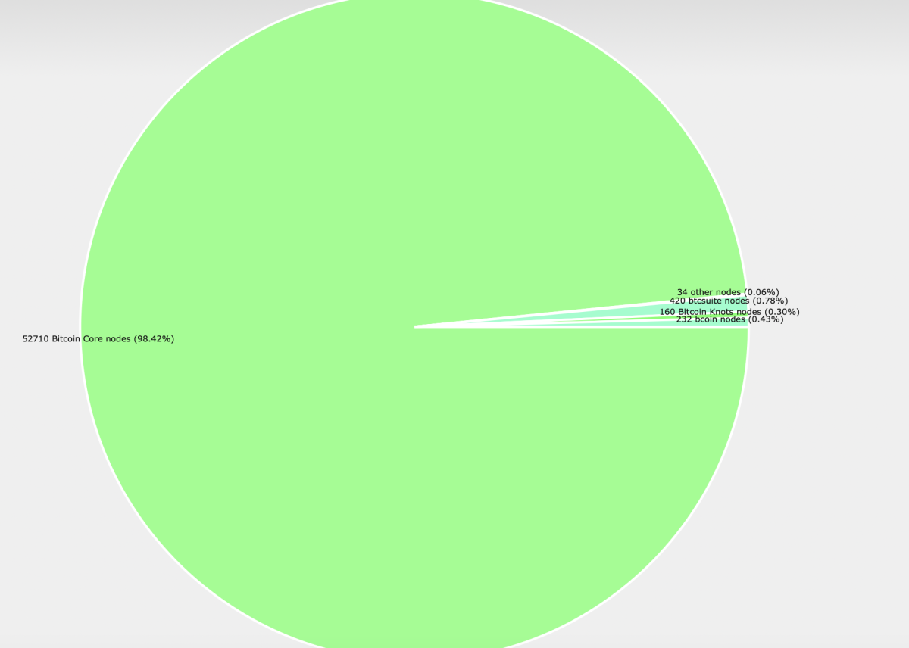
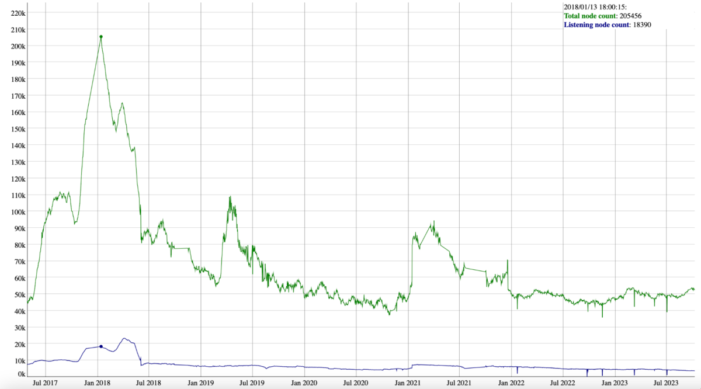

> *作者：Gustavo Flores Echaiz*
> 
> *来源：<https://bitcoinmagazine.com/technical/why-bitcoin-wallets-need-block-filters>*

有了 [BDK](http://bitcoindevkit.org/) 和 [LDK](http://lightningdevkit.org/) 这样的软件开发助手之后，开发一款比特币钱包已经变得前所未有地简单。然而，就像软件开发应该尽可能容易，也应该有一种办法能默认保护用户的安全性和隐私性。比如说，一款轻钱包应该如何连接到第三方的服务端、获取交易数据和发送交易，就是一个重要的问题。

我认为，为保护用户的隐私性，比特币钱包需要区块过滤器。为什么这么说？**因为这是唯一一种阻止并不公开的数据泄露给服务端、让用户的交易跟这些数据关联起来的办法。**

在本文中，我们将探索比特币钱包需要区块过滤器的理由。首先，我们要看看有多少比特币用户运行自己的全节点、何以 API 钱包提供了良好的用户体验却终将导致用户的交易被关联起来、布隆过滤器（bloom filter）为何无法保护隐私、何以区块过滤器是轻钱包在网络隐私性上的唯一解决方案，最后，如何使用仅限 Tor 的通信来保护用户的 IP 地址。

## 仅有少数用户运行自己的全节点

运行和使用比特币全节点是你的最佳解决方案，因为这样你就成了网络的一部分，而且不再需要任何中间人来获得交易数据及广播你的交易。但是，显然，不会每个人都运行自己的全节点；轻客户端（简易支付验证）的存在和需要，是中本聪在[比特币白皮书](https://bitcoin.org/bitcoin.pdf)里就设想的事情。

我们不知道具体有多少用户运行了自己的全节点，我们能够知道仅仅是现在整个网络有多少全节点。保守估计，如果只统计侦听节点（listening nodes），这个数字大概在 16000 个，如 [Bitnodes.io](http://bitcoinnodes.io/) 网站所示。**更准确的估计，需要计入侦听节点和非侦听节点，就像 [Luke Dashjr 的节点统计工具](https://luke.dashjr.org/programs/bitcoin/files/charts/software.html)，那么数字还会再高一些，大约是 53000 个。**

还值得注意的是这个数字的历史维度。根据 [Luke Dashjr 的比特币节点统计史](https://luke.dashjr.org/programs/bitcoin/files/charts/historical.html)，可以看到现在的数量远远低于峰值。在 2018 年 1 月 13 日，统计值曾到达 20 5000 个。这跟比特币的汇率在那个时间点的几周前达到峰值高度相关。在 2021 年，我们也可以观察到节点数量的统计值在比特币汇率上升时上升，但只达到了接近 9 0000 的数值。

**我们可以下结论了：只有少量的用户运行着自己的比特币节点，而且这个数量并不是单向增长的**。相比全节点，轻钱包对用户来说更容易使用，因此我们需要找出一种可以保护网络隐私性的方案。

先来看看当前最常见的技术，API 钱包。

## API 钱包服务供应商会默认收集你的数据

绝大部分比特币钱包都使用 API（应用专属接口）来发送和接收用户的交易数据。这种技术是高度可扩展的，而且提供了最佳的用户体验，因为请求都可以即时受理。然而，它有内在的隐私性问题。我们来看看它是怎么工作的，因此服务供应商如何默认收集你的数据。

在你启动一款标准的比特币钱包时，你会导入或者创建一串助记词，然后设置你想要的密钥派生路径（通常是自动化的）。这会给你一个主公钥，通常称为 “xpub”。看起来是这样的：

> xpub6CUGRUonZSQ4TWtTMmzXdrXDtypWKiKrhko4egpiMZbpiaQL2jkwSB1icqYh2cfDfVxdx4df189oLKnC5fSwqPfgyP3hooxujYzAu3fDVmz

（译者注：从概念上来说，xpub 并不是 “主公钥”，而是主公钥（和主私钥）经过一系列的密钥派生得出来的一个公钥；基于 BIP32，它可以继续派生出许多公钥，从而为用户提供许多地址，但它并不是主公钥。）

完成之后，这个 xpub 会自动发送给服务供应商的服务端，然后推导出一个又一个的比特币地址，并扫描这些地址有无余额；当服务端遇上连续许多个没有余额的地址之后，就会停止扫描，这个叫做 “连续空地址限额（gap limit）”。这些地址会在服务器的索引中查找，如果发现有交易，就将数据发送给用户的客户端（即钱包）。这些地址也会被持续监控，以观察有无新交易进入。此外，当用户发送一笔交易的时候，也会通过同一条信道。

显然，这个过程非常高效，而且允许 API 钱包提供快捷和便利的用户体验。**然而，服务供应商可以将你的所有交易都关联起来，因此默认可以收集你的隐私信息**。幸运的是，许多 API 钱包都允许用户通过 Tor 来连接，所以至少用户可以保护 IP 地址。

现在，我们来看一种并不依赖于单点服务器的替代方法：在轻钱包上使用布隆过滤器。

（译者注：API 钱包之所以最快、用户体验也最好，是因为它们完全信任钱包服务商传来的数据，并不加以验证，因此也不需要下载比特币区块链的任何数据。）

## 为什么布隆过滤器无法保护隐私

一些钱包允许用户通过布隆过滤器来收取和发送交易数据。这种通信方法是由 [BIP37](https://github.com/bitcoin/bips/blob/master/bip-0037.mediawiki) 引入的，最开始也被认为是隐私的。在这一节，我们将解释布隆过滤器是什么、为什么它的隐私性欠佳。

布隆过滤器是一种概率性的数据结构，用来测试某个元素是否在某个集合中。**在比特币的语境下，布隆过滤器有一个轻客户端创建并发送给网络中的一个全节点，用来测试某个地址（元素）是否在某部分[区块链](https://bitcoinmagazine.com/guides/what-is-blockchain)数据（集合）中。**如果出现了匹配，则相应的交易数据就会被发送给轻客户端。这是概率性的，所以可能出现误报（假阳性），但轻客户端可以丢掉误报。

人们曾经以为，这种误报率会足够高，高到被请求数据的全节点不会知道你真正想要的数据是哪一些。然而，因为一个实现上的错误，误报率实际上降低了。

**此外，轻客户端可以为同一个钱包创建多个布隆过滤器，如果两个乃至多个都被同一个全节点获得了，那么 TA 也可以计算出两者的交集来消除误报**。最后，如果区块链数据经过分析，而且用户不参加 coinjoin 或使用 coin control，这个全节点可以推断出哪些地址不属于这个用户。

你可以在这里了解更多 BIP37 的隐私[问题](https://en.bitcoin.it/wiki/BIP37_privacy_problems)。现在，我们来看看另一种轻客户端网络解决方案。

## 比特币钱包需要区块过滤器来保护隐私

截至 2018 年，这个问题都还没有真正的解决方案，还没有人提出区块过滤器。幸运的是，下一年，[BIP157](https://github.com/bitcoin/bips/blob/master/bip-0157.mediawiki) 和 [158](https://github.com/bitcoin/bips/blob/master/bip-0158.mediawiki) 就引入了这个概念，并且现在已经在多种钱包和比特币软件中实现了，比如 [Wasabi](https://wasabiwallet.io/)、[Blixt](http://blixtwallet.github.io/)、[Breez](http://breez.technology/)、[LND](https://github.com/lightningnetwork/lnd)  和 [LDK](http://lightningdevkit.org/)。这种方案通常被称为 “Neutrino”。在本节中，我们会了解它的工作原理，以及为什么它们是网络隐私性的正确解决方案。

**区块过滤器会压缩区块数据，以帮助钱包从全节点处接收交易数据；钱包将下载整个区块，而不是检索单体交易，因此不会牺牲隐私性**。

区块过滤器的使用一般分为三个步骤。首先，用户从一个全节点处下载各区块的区块过滤器；在 Breez 钱包中，你向网络中全节点请求；在 Wasabi 钱包中，向协调者服务端请求。然后，轻节点自己检查，看看自己的地址是否与某个区块过滤器匹配。最后，如果有匹配，则（向另一个全节点）下载对应的区块。

**因为用户下载的是整个区块，而不是单体交易，而且因为总是存在误报率，所以区块过滤方法可以保护用户的隐私性，不让服务端侵犯**。不像布隆过滤器和 API 钱包，服务端无法分辨（或者说无法直接收集）用户的交易之间的关联，因此只能知道公开在区块链上的信息。

区块过滤器是网络隐私性解决方案的一部分，但完整的方案还需要别的东西。

## Tor 是解决网络隐私性的最后一块拼图

Tor 跟区块链过滤器结合，就能解决轻客户端的网络隐私性问题。**Tor 通过在一个网络中路由用户的请求，而从向目标服务端隐藏了用户的 IP 地址。**这个机制通常被称作 “洋葱消息”，因为通信的多层特性。

Tor 和区块过滤器有一个共同点：它们都会降低性能，可能会被察觉并降低用户体验。有些人认为这是不得不接受的，我则认为可以提升到不被发觉的程度。

举个例子，Tor 社区已经实现了一种可靠通信的方案，称为 “[Conflux](https://forum.torproject.org/t/alpha-release-0-4-8-1-alpha/7816)”。客户端使用两条不同的洋葱路径，发起两个请求（而不是一个请求），从而提高快速完成的可能性。**这种技术，加上钱包加载区块过滤器上的技术创新（比如 Wasabi 钱包的 [Turbosync](https://blog.wasabiwallet.io/turbosync-wasabi-wallets-loading-time-reduced-by-90/) 技术），未来的用户将不再需要在可用性和隐私性之间取舍，在两方面都能满意**。

（完）