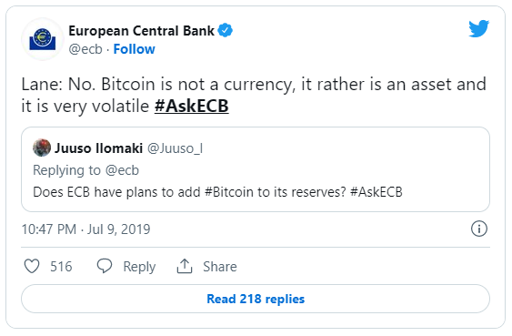
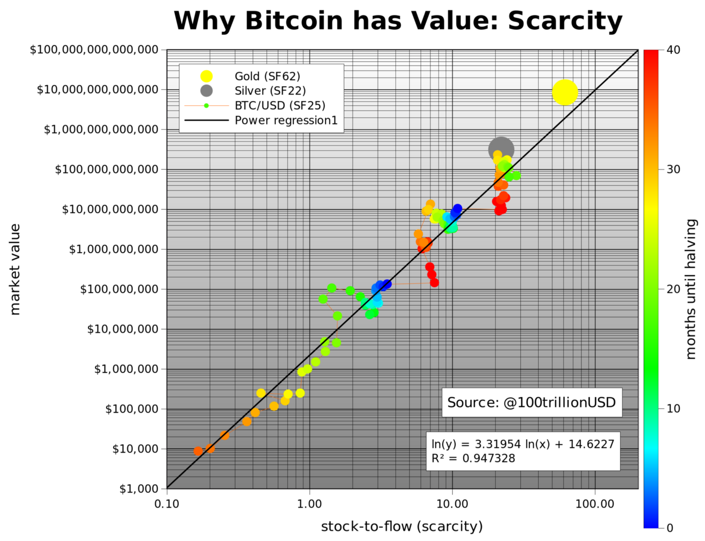

> *作者：wiz*
> 
> *来源：<https://medium.com/@wiz/why-bitcoin-359ada12629e>*

本文首发于 2019 年 7 月 16 日

- 汇率对比：1 美元兑 10 万委内瑞拉玻利瓦尔和 2 万美元兑 1 BTC -

## 什么是财务自主权？

想象你手里有一枚金币，这是最简单、最纯粹的财务自主权形式。持有这枚金币不需要你同意任何服务条款或隐私条件、遵守 KYC 或 AML 合规要求，也不会泄露你的 ID、姓名、身份证号。你可以用它来付款，只需要拿着它交到收款方手里即可。它可以带给你纯粹的自由。

除了交易自由之外，金币还会带来其它好处，例如，没人知道你将金币支付给了谁，或你用金币购买了什么商品或服务，因为金币不会侵犯你的隐私性。在交易隐私性的保护下，没人知道你的交易是什么，也就没人能决定如何限制或控制你用金币购买什么。

在长达千年的历史长河中，黄金都作为国际货币标准。每个人都可以保有自己的财务自主权，货币的隐私性和自由也受到了尊重。就是这么简单。

## 我们为什么不再使用金本位？

现行的国际银行体系和法币体系缓慢发展了 100 多年才得以真正确立。世界各国的银行家与政府联手，后者通过暴力威胁没收了所有人的黄金。例如，美国联邦储备银行于 1913 年成立后，[美国政府在 1933 年暴力没收了所有人的金币](https://en.wikipedia.org/wiki/Executive_Order_6102)，强迫所有人使用美联储发行的纸币。

- “将你的黄全都上交我们的金库，否则我们将对你采用暴力” -

起初，银行用一种叫作黄金券的纸质收据代替了黄金。然而，等过了一段时间，银行就停止了黄金券兑换服务，导致黄金券变成了一文不值的废纸。由于政府的暴力胁迫，人们只能继续使用美联储发行的纸币。

近年来，银行开始使用数字数据库，可以凭空发行货币，甚至不需要在纸上印刷出来。各国银行已经牢牢控制了货币，可以操控并增加货币供应量，监控每个人的金融交易，并控制银行系统内部所有法币的流向。如今，银行控制了一切。

一旦全球货币供应量与人们的交易自由都被央行控制，全世界人民在使用货币时都会失去**安全**、**自由**和**隐私**。

## 法币和央行有何弊端？

当前的全球银行和法币体系建立后，全世界人民别无选择，只能相信银行家和政治家会公平公正地运行全球金融体系。

> “传统货币的根本问题在于需要依赖信任才能发挥作用。它需要人们相信央行不会让货币贬值，但是货币贬值在法币史上屡见不鲜。它需要人们相信银行会保管好他们的钱并如实汇款，银行却在信贷泡沫期间用储户的存款放贷，几乎没有留下多少准备金。”
>
> —— 中本聪

纵观历史，我们可以从三个方面对法币滥用行为进行分类：

- **安全**：不法分子通过或明显或隐蔽的方式**窃取你的钱或背后的价值**。
- **隐私**：不法分子**监控你的一切私人交易**，并使用你的个人金融数据对你不利。
- **自由**：不法分子**控制你的花费方式**、交易对手和花费金额，等等。

### 他人如何窃取你的银行存款？

下面举几个例子：

- 通货膨胀：这是银行窃取你的存款的主要方式，而且是最隐蔽的一种方式。当央行通过印刷毫无价值的纸币或往数据库里添加账目的方式增发货币时，就是在增加总货币供应量。通货膨胀会导致人们手中货币的购买力降低，因为流通中的货币量增加了。由于黄金无法被创造出来，银行家就创建了一个纸币系统取而代之。

- 银行可以通过增印纸币或使用数字数据库无限量发行法币 -

- 没收：这是政府拿走公民财产的一种方式。你听说过民事没收（Civil Forfeiture）吗？只要警方怀疑你的财产涉案，就可以将其没收，你得费很大力气讨回来。再看另一个例子：你可以试试在没有申报的情况下携带超过 1 万美元的现金入境美国，看看会发生什么。结果也是一样：被一群持枪的家伙没收。

- 政府完全有能力也有可能窃取你的法币 -

-  税收：这是政府拿走公民财产的另一种方式。我并非要从道德的角度来评判政府的征税行为，我只是在陈述一个事实：政府完全可以迫使银行交出你名下的存款。这是一个安全漏洞。安全的货币一定是**无法没收的**，而你存在银行账户里的法币是无法抵抗政府强制没收的。

### 他人如何利用你的金融数据对你不利？

如果你以纸币或硬币的形式将法币交给另一个人，保护交易隐私性相对比较容易，就像使用金币那样。

但是，如果你使用的是信用卡、借记卡、电汇、PayPal、Venmo、LINE Pay、微信支付或其它中心化支付网络，就表示你同意放弃自己所有金融交易数据的隐私性，愿意将它们泄露给可信第三方。

如果你的所有金融交易数据和元数据都被记录在中心化数据库中，任何能够访问该数据库的人都可以利用你的数据对你不利。下面看几个简单的例子：

- 如果你购买了有害身体的商品，如香烟，你的银行会告诉你的保险公司提高你的保险费。

- 如果你涉嫌非法交易，你的银行会向政府告发你。

但是，如果是专制政府，就会采取更为极端的措施。它们会收集公民的所有金融交易及其它数据，并创建一个极权主义下的社会信用体系。

届时，乔治·奥威尔（George Orwell）笔下的世界将成为现实，这全都拜央行建立的法币体系和以之为基础的支付网络所赐。如果你认为这一切不可能发生在自己的国家，敬请三思。久而久之，各国政府都将建立起社会信用体系。

### 他人如何控制你的交易对象？

我们依然金币为例，当你直接支付金币给其他人以交换商品或服务时，你的付款交易并未记录在中心化账本中，这赋予了你无懈可击的隐私性。

然而，在央行体系中，由于银行掌握了你的交易数据，又能控制你的资金，它们可以根据一套评估规则来决定是允许还是拒绝你的交易，并通过控制你的资金来强制执行该决定。通过这种方式，政府利用法币和央行体系打造了一个**控制系统**来囚禁公民。

总而言之，一旦你放弃了财产安全性和隐私性，就会同时失去金融自由。

> “隐私性的目的不在于隐藏，而在于保护。”
> 
> —— 爱德华·斯诺登（Edward Snowden）

## 我们如何重获财务自主权？

[密码朋克运动（Cypherpunk movement）](https://en.wikipedia.org/wiki/Cypherpunk)由一群重视保护网络用户隐私和自由的人发起。密码朋克秉持同一个信念：一个尊重和保护个人安全性、隐私性和自由的全新货币体系可以解决上述问题。

许多密码朋克试图创建合乎道德的新型电子现金系统，以取代当前的法币和央行体系。为了创建这样一个真正去中心化的系统，他们需要攻克很多计算机科学难题。一些人功败垂成。

直到 2008 年，一位匿名的密码朋克终于做到了：

- 集数字签名、分布式账本和点对点网络于一体的比特币诞生了 -

## 比特币是如何运作的？

就像你无需了解互联网的运作方式就可以在网上看图片看视频一样，无论你是否了解比特币运作原理背后的技术细节，你都可以使用比特币来实现财务自主权。

这篇文章只是想让大家明白很重要的一点，虽然所有新技术在诞生之初用户体验都欠佳，但是比特币显然无意为了吸引新用户或提升用户体验而牺牲任何底层原则。最富有智慧的密码朋克正在努力改进比特币的用户体验。比特币将随着时间的推移进步，就像互联网那样。

## 那么，我们为何要选比特币？

我来告诉你为什么：

**因为比特币尊重个人的安全性、隐私性和自由。**

## 比特币相比法币体系有何优势？

首先，比特币没有服务条款、隐私协议和 KYC/AML 合规要求。比特币[利用密码学成功创建了一个无政府主义系统](https://en.wikipedia.org/wiki/Crypto-anarchism)，只受到密码学、数学和硬性共识规则的约束。比特币是一个基于经济激励机制的免信任分布式系统。任何人和实体都无法控制比特币。

最重要的是，比特币解决了以下几个核心信任问题，给了你除法币和部分准备金制度之外的另一种选择。

✅ 利用固定供应量实现抗通胀性

✅ 使用密钥控制比特币实现抗没收性

✅ 使用伪匿名身份实现付款隐私性

✅ 使用点对点网络实现抗审查性

### 比特币是如何实现抗通胀的？

比特币最重要的共识规则之一是，发行量不能超过 2100 万。一旦达到发行上限，永远都不会再有新的比特币被创造出来。因此，比特币是一种抗通胀的货币，可以防止有人通过增发来偷走你手中比特币的价值。

### 比特币是如何实现抗没收的？

要想转移一笔比特币，必须持有对应的密码学私钥。无论是政府、银行还是法院都无法强制没收你手中的比特币。任何权力机关都无法执行强制没收令，因为比特币系统内没有所谓的权力机关。比特币系统不仅充分尊重用户的自主权，而且因其分布式性质无法被关停。比特币得以凭借自身的优点存活至今，纯粹是因为人们相信它。

### 比特币是如何保护隐私性的？

比特币不会要求你提供姓名或其它会泄露你个人身份的信息。你的身份基于密码学，而非真实姓名。因此，在比特币系统中，你的身份看起来就像是 `1wizSAYSbuyXbt9d8JV8ytm5acqq2TorC` ，而非“John Smith”这样人类可读的姓名。

另外，没人知道比特币地址上的资金由谁控制。开发者们正在持续开发新技术来提高比特币的隐私性。

### 比特币是如何实现抗审查的？

点对点的比特币网络是完全分布式的。换言之，单个节点无法审查你的交易，除非全网节点串谋起来。

- 中心化网络糟糕，去中心化网络还行，点对点的分布式网络是最优 -

### 政府和银行会如何对待比特币？

有些国家试图监管、控制、关闭比特币，但是至今没有一个成功过。它们似乎想要利用现有的央行体系来控制人们如何使用法币购买比特币。当然了，它们千方百计想要对比特币交易征税。

以下是政府和银行关于比特币的常见论调：

- 欧洲中央银行称比特币不是货币，并警告说比特币价格波动过大 -

### 比特币的价格是否高度波动？

如果你缩放比特币的价格表，就会发现比特币自诞生以来都在稳步增值。从诞生之初到 2017 年底，比特币的交易价格从 0.01 美元不到缓慢攀升至 2 万美元。

这是因为比特币的供应量是固定的，这种稀缺性正是人们看重的特征。由于比特币的供应量保持不变，不断增长的需求拉动比特币的价格攀升。随着时间的流逝，越来越多人开始持有比特币，比特币的价格会继续上涨。

## 比特币是货币吗？

比特币究竟是不是货币？在回答这一问题之前，我们首先要弄清楚“货币”的定义。难的是，“货币”可以指代多个复杂概念，这些概念之间简直天差地别。

“货币”实际上指：

- 价值贮藏手段

- 交换媒介

- 记账单位

- 控制系统

### 比特币是价值贮藏手段

下图这条推特讲到了点子上：

> 儿子的朋友：马特，如果你将一枚 1 英镑硬币劈成两半会怎么样？你只能得到两个不值钱的金属块。如果你将一枚金币劈成两半，你得到的是两小块黄金，每块的价值是原先金币价值的一半。
>
> 儿子：“……比特币跟黄金一样。”

比特币是完全同质化的，也是绝佳的价值贮藏手段，就像有数千年历史的黄金一样。

### 比特币是交换媒介

对于早期采用者来说，比特币也是很好的交换媒介。但是，如何让比特币服务全人类是巨大的挑战，因为底层“区块链”技术尚不能提高吞吐量到世界级规模。

为了解决可扩展性问题，中本聪首创了支付通道概念。过去十年来，其他精通计算机技术的密码朋克又在其基础上进行了改进，这才有了如今的**闪电网络**，让比特币可以发展成世界级交换媒介。

### 比特币是记账单位

比特币的最小记账单位是以其创造者之名 Satoshi 命名的。1 BTC 等于 1 亿 atoshi。随着支持使用比特币付款的商品和服务增多，会有越来越多人将 BTC 或 Sats 作为记账单位。

### 比特币不是控制系统

由于比特币旨在尊重和保护人权，尤其是货币的**安全**、**隐私**和**自由**，它无法成为像法币和央行体系那样“听话”的**控制系统**， 被用作压迫人民的工具。

## 如何看待“下一代比特币”？

全球互联网只能有一个，全球货币同样如此。比特币标准已经兴起。除此之外要么是骗局，要么是在浪费时间。

如果有人想要向你兜售“下一代黄金”，你会买吗？

## 总结

我希望本文能够帮助你理解比特币为何会被创造出来，以及它将如何帮助全球人民挣脱已经深深融入当今社会的法币和央行体系的牢笼。

最后是我个人的一些想法：

- 比特币创造者的目的不是牟取私利，而是改变世界。

- 比特币会还用户以**安全**、**隐私**和**自由**，达到改变世界的目的。

- 比特币已经被用作货币，可以发挥货币的一些用途。

- 比特币并非具有高度波动性，从长期来看其价格呈上涨趋势。

- 很多仿冒犯和诈骗犯会向你推销山寨版比特币。这类骗局就像用黄铁矿充真金一样，别被这伙人愚弄了。

- 做个低调的囤币者吧。

（完）