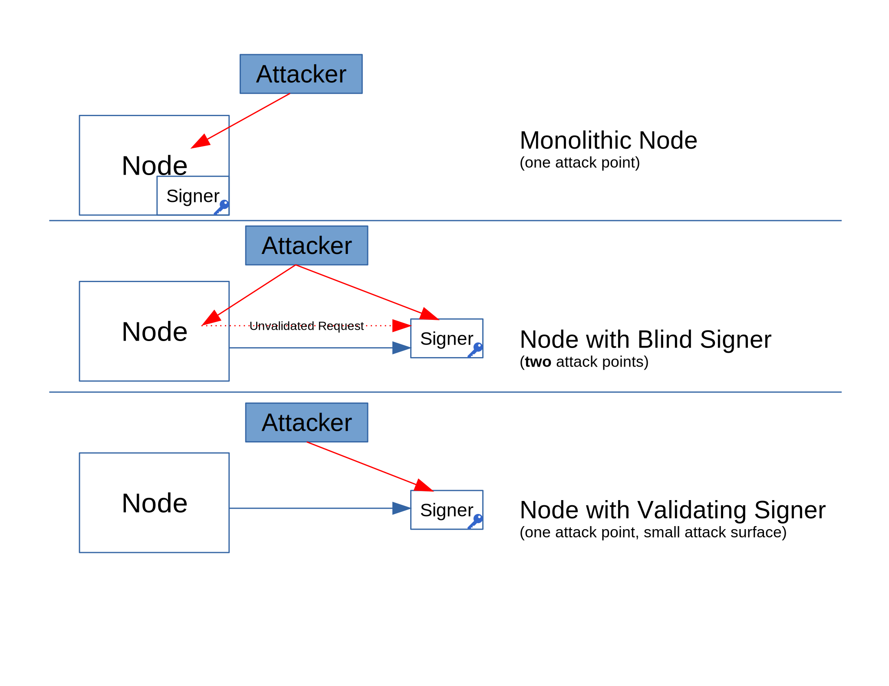

> *作者：VLS*
> 
> *来源：<https://vls.tech/intro/>*

## 引言

VLS（Validating Lightning Signer）将你的闪电节点私钥和安全规则验证从闪电节点中分离出来，装进一个**隔离的签名设备**中。它通过减少攻击界面，提高了用户的闪电通道资金的安全性。

现有的闪电节点采用盲目签名模式，而 VLS 通过验证来自节点的请求遵循了闪电通道的安全模式，强化了安全性。你可以放心睡觉，因为节点被劫持也不会导致你丢失资金。

随着闪电网络对 Taproot、Musig2 和 FROST 的支持趋于成熟，VLS 会成为创建体验顺滑的多签名闪电通道的必需。

## 背景

“**签名器**” 指的是独立于钱包软件、执行密码学操作的组件。比特币的硬件钱包就是一种签名器，它为了保存私钥而专门加固过。但当前没有可以让闪电节点使用硬件签名器的完整解决方案。

“**盲目的签名器**” 指的是不执行验证的签名器。迄今为止，多种商用闪电钱包和节点实现仅支持盲目签名。我们认为这样的配置是不安全的。

“**带验证的签名器**” 执行全面的验证检查，以保证私钥不会被误用。举个例子，带验证功能的比特币硬件钱包会跟用户协作，检查交易目的地、数额和找零输出。

想要在 Layer-2 应用中使用带验证的签名器，会复杂很多，这是因为闪电协议本身的复杂性。

虽然盲目签名器是通往带验证的签名器道路上的一个技术步骤，但如果部署在生产环境中，实际上它会**削弱安全性**。因为它代表了**两种攻击点：节点层面的和签名器层面的**。

## VLS 项目

[Validating Lightning Signer](https://gitlab.com/lightning-signer/docs/-/blob/master/README.md) 项目旨在填补闪电网络生态系统的安全性缺口。它是一个开源的 Rust 库和参考实现。这个项目正在开发 Beta 版，也即能够实现我们的主要目标的状态：即使节点完全被劫持，资金也依然是安全的。

因为闪电协议自身的特性，这个任务有点复杂。需要执行[超过 50 条验证规则](https://gitlab.com/lightning-signer/validating-lightning-signer/-/blob/main/docs/policy-controls.md)，而且其中有一些要求按照协议执行带状态的检查（stateful inspection）。

服务器和消费者设备都是我们的目标，但后者需要通过 Rust 的 `no_std` 编译模式。

## 签名模式分类

以下是一个闪电节点可能的签名模式：

- 整体节点
- 节点 + 单独的盲目签名器
- 节点 + 单独的带验证签名器 —— 签名器确保闪电状态机正常运行、资金不会处在风险之中

## 盲目签名的（不）安全性

- 整体节点有一个攻击点：节点本身
- 使用单独的盲目签名器的节点有**两个攻击点**：节点和签名器。盲目签名器会执行节点请求的任何签名操作，所以**被劫持的节点会导致资金损失**。显而易见的是，签名器被攻破也会导致资金损失。这比整体节点还要糟糕，因为**任一部件**被攻破都会导致资金损失。
- 带验证的签名器只有一个攻击点，并且攻击界面更小。

## 使用盲目签名器的钱包必须信任节点运营者

如果一个盲目签名的钱包使用着由 LSP（闪电服务供应商）运行的节点，那它就不算自主保管的，因为 LSP 可以单方面控制资金。LSP 只需给签名器提供一笔交易、将资金发送给 LSP 或其它目的地。

（译者注：这种情形应该是很罕见的。因为使用 LSP 的服务并不需要使用 LSP 所运行的节点，只需跟他建立通道就可以了。）

## 盲目签名默认被爆破的例子

被劫持的节点可以直接要求盲目签名器签名。下面是可能导致资金被盗的情形：

- 节点提交一笔协同关闭通道的交易，将所得资金发送到攻击者的地址
- 节点要求盲目签名器签名一笔已被撤销的交易，一旦发布，将导致该节点在相关通道内的余额全部丢失
- 等等 ……

被劫持的节点也可能因为不遵守闪电协议而损失资金。比如：

- 节点无法验证通道对手的撤销操作，然后对手广播了一笔旧的承诺交易，将通道的大部分资金划给了自己
- 节点无法申领在路由支付时转入的 HTLC，导致资金逐渐流失
- [等等 ……](https://gitlab.com/lightning-signer/docs/-/wikis/Potential-Exploits)

## 带验证的签名器

如果使用带验证的签名器，节点被劫持也不会导致资金损失。这种设置的安全性仅取决于签名器的安全性。签名器可以按具体场景的需要而加固。

带验证的签名器可以实现的一些验证规则包括：

- 不签名已经撤销的承诺交易
- 不作废签过名的承诺交易（译者注：意思可能是仅在符合协议规则的流程中才提供秘密值以撤销旧的承诺交易）
- 不签名向未获许可的目的地发送资金的通道关闭交易
- 所路由的支付的输入和输出的价值至少相等
- 支付从输入中索取的，必须跟我们在输出中索取的至少一样多
- 等等 ……

## 结论

盲目签名器降低了闪电节点的安全性，而且会面临许多[攻击](https://gitlab.com/lightning-signer/docs/-/wikis/Potential-Exploits)。

带验证的签名器通过减少攻击界面，提升了安全性。VLS 项目旨在未企业服务器和消费者设备提供一个代码库和参考实现。

