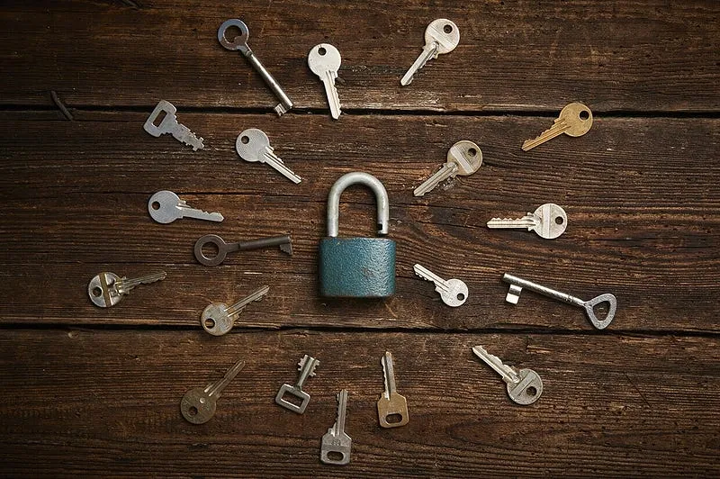

> *作者：Keystone*
> 
> *来源：<https://blog.keyst.one/why-keystone-implemented-shamir-backups-71e319f972a6>*

原文出版于 2021 年 7 月。

Keystone 已经实现了 StatoshiLabs 所提出的 SLIP39“Shamir 备份” 标准，现已可以在 Keystone 硬件签名器上使用。本文解释了这种特性，它的优点和缺点，以及对希望尝试这种特性的用户的提醒。

## 考虑你的种子词所面临的威胁

在了解如何使用 Shamir 备份之前，我们先后退一步，了解一下种子词（recovery phrase）备份会面临哪些类型的威胁，以及，在决定要不要使用 Shamir 备份（私钥分割方案）之前，有哪些威胁是你应该特别关注的。

基本上，有三种因素会威胁你的种子词备份的安全性：

1. 记忆丢失，如果你是把种子词记在脑子里的话（脑钱包亦面临这种威胁）
2. 实体备份被盗，或被抢。
3. 实体备份因为意外或者说灾难（比如火灾和洪灾）而损坏。这类情形有很多种形式，比如被家里的小狗吃了、打翻了咖啡然后电子设备发生了故障，甚至是房屋因为地震而倒塌。

对于第一种因素，我们强烈建议，不要将记忆作为保管你的种子词的唯一方式，因为大脑并不像你认为的那么可靠。大脑创伤会导致失忆，衰老也会导致失忆，阿尔茨海默症会让人记不起任何事情。自然发生的印象流逝也会随着时间推移而扭曲记忆。

对于第二种因素，你应该记住，实施这种攻击的可能不是陌生人，而是熟人，比如你的一个亲戚，或者你请求帮你保管种子词的人。因此，你必须先考虑对方的诚信，才能将你的种子词托付给 TA 。

对于第三种因素，一种非常常见的解决方案是复制多份种子词，分散保存在多个地方，以避免单点故障。但要记住，复制本身就增加了来自第二种因素的风险。[这篇文章](https://blog.keyst.one/deep-cold-storage-how-beginners-can-swim-in-the-deep-end-430af49d03bd)用一些简单的数学计算了相关的概率。

为了实现比简单复制更好的解决方案，我们引入了 Shamir 备份。

## 什么是 “Shamir 备份”？

“Shamir 备份” 让你可以将一套种子词分割成几部分，并且你可以指定凑齐一定数量的片段就可以复原出完整的种子词。分割数量和阈值数量的下限和上限都分别是 2 和 16 —— 最少，你可以将一套种子词分割成 2 份，要求凑齐这 2 个片段才能复原种子词；最多，你可以分割成 16 份，要求凑齐 16 个片段才能复原。虽然这比多签名钱包要复杂：在需要恢复钱包的时候，多签名钱包的剩余完好密钥可以立即签名，而 Shamir 备份需要一个单独的导入步骤，导入足够数量的片段、复原出种子词才能签名；但从安全性角度看，是一样好的，甚至更好：如果你分割为 5 份，阈值定为 3，那么即使你弄丢了 2 个片段，也依然能使用剩下的 3 个片段复原钱包。

Shamir 备份看起来跟多签名钱包相似，不同的是，你指定的不是所需的签名数量，而是复原一个钱包所需的备份（片段）的数量。这样一来，使用 Shamir 私钥分割方案来分散保存钱包备份就变得更加容易。

## Shamir 备份的缺点

就像世间没有无懈可击的系统、没有 100% 安全的方案，保管种子词也没有完美的解决方案。Shamir 备份也有自己的缺点。了解这些缺点将帮助你作出更好的决策 —— 是否要使用这种方案来保护你的种子词。

### 支持的钱包有限

Keystone 的 Shamir 备份特性是对 [SatoshiLabs 所提出的 SLIP39 标准](https://github.com/satoshilabs/slips/blob/master/slip-0039.md)的实现。截至本文撰写之时，只有 Keystone 和 Trezor 的硬件签名器支持这样的实现。

这就带来了第一个缺点 —— 如果你的 Keystone 或 Trezor 设备坏掉了，你没法用其它签名器来复原种子词，你只能再买一个 Keystone 或 Trezor 签名器。想要停用 Keystone 和 Trezor 软件钱包、切换到其它软件钱包的用户，也面临同样的问题 —— 别的软件钱包还不支持 Shamir 备份。目前得到广泛采用的标准是 BIP39 种子词备份。

（译者注：重要的桌面端软件钱包 Sparrow Wallet 在 2024 年 9 月发布的 [v2.0.0](https://x.com/SparrowWallet/status/1836384212716228672) 版本已经开始支持 SLIP39 标准。）

### 复杂性是安全的敌人

有句老话说得好：复杂性是安全性的敌人。这里的复杂性是个相对的概念，因人而异。作为硬件签名器的开发者，我们的职责是创建友好的用户体验，降低用户上手的复杂性。但如果你不能理解它是怎么工作的，那最好不要使用它，使用你熟悉的标准复原方案。

## 给初试 Shamir 备份的用户的建议

下文是给希望使用 Shamir 备份的用户的基本建议。

### 熟能生巧

如前所述，虽然 Keystone 和 Trezor 已经为设定和复原 Shamir 备份创造类非常流畅的体验，它还是有一些复杂性。所以强烈建议，在你为 Shamir 备份的钱包转入大量比特币之前，应该先练习它的使用。

Keystone 的 bitcoin-only 固件也支持比特币测试网，所以你可以用测试网来练习，无需使用真正的比特币。

### 定期执行健康检查

如前所述，种子词备份面临的威胁模型有：（1）灾难破坏；（2）盗窃。虽然 Shamir 备份相比于单纯复制能够取得好得多的平衡，但你依然需要定期执行安全检查。

### 金属好过纸

在备份你的种子词时，你最好只使用更好的选择。面对洪水、火患、甚至是潮湿的环境，金属备份总是好于纸备份。

Keystone 的金属备份板 Keystone Tablet 上设计了一个洞，你可以把它放在挂锁上。如果你选择了一个好的挂锁，那就能带来额外的安全性。相比于纸备份，金属备份上的篡改更容易识别。

### 仔细挑选信得过的人

当你要把一部分 Shamir 备份片段交给别人保管时，你需要仔细挑选保管人。通常来说，最好的选择是家人，或者受法律约束、承担保管义务的法定代表人。（这不是一个金融和法律建议，请在为 Shamir 备份雇用合法保管人之前咨询法律专业人士。）

在你跟家人分享备份时，请确保他们知道这个物件非常重要、应该像保管自己的秘密那样保管它，以防止备份的丢失或意外损坏。合法保管人可能会放在自己办公室的保险箱里，或者，你也可以尝试放一份在银行的保险柜里。

还应该注意，托付了 Shamir 备份片段的人不应该知道其他保管人是谁，否则他们可以串通然后偷走你的钱。不要泄露保管人的身份、限制他们得到的片段的数量。

### 考虑继承

在计划使用 Shamir 备份的时候，让你的继承人知道如何使用它们、你在哪里存放片段、你安排了谁来保管片段，总是明智的。这样一来，当意外发生的时候，你可以确信，你的继承人知道怎么在危急情况下拿到这些钱。

## 结语

在 Keystone，我们总是把安全性放在第一位，并且不懈地提供更好的保管方案。我们的使命是在技术可用时提供先进的安全方案、帮助我们的用户保护他们在互联网上的财富。

我们也衷心感谢 [SatoshiLabs](https://satoshilabs.com/) 对这个行业的贡献，并且欣赏他们以建立共同标准为先的竞争意识，这样，同行们也能使用这样的标准来保护每一位用户的资金。

（完）