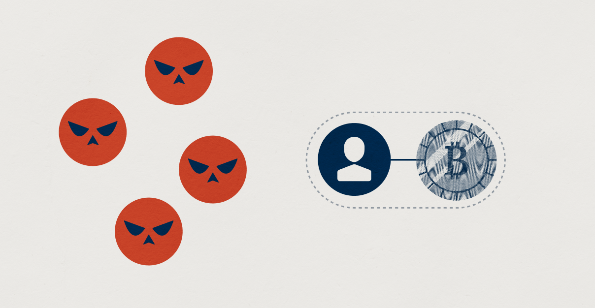

> *作者：Unchained*
> 
> *来源：<https://www.unchained.com/blog/wrench-attacks>*

比特币与黄金相似，是一种不记名的资产，个体可以直接持有它。如果你决定这样做 —— 取得比特币的真正所有权，那么透彻地考虑所有潜在的攻击风险就成了审慎安全性的重要部分。

过去十年间，出现了多个关于密码货币持有者 [遭遇](https://www.ocregister.com/2025/12/09/7-suspects-arrested-in-irvine-home-invasion-robbery-targeting-cryptocurrency/) [人身监禁](https://www.nydailynews.com/2025/07/18/man-kidnapped-queens-held-cash-crypto-tells-nypd/) 和 [勒索](https://bitcoinnews.com/p/bc-family-tortured-assaulted-bitcoin-theft) [威胁](https://www.twincities.com/2025/09/24/texas-brothers-held-washington-county-family-hostage-in-crypto-theft-charges-say/) 的报道。在一些比特币持有者之间，这引发了顾虑和疑问：什么东西能保护他们免受这种威胁。本文尝试阐释这一主题并解答这些问题。我们将评估这些担忧的合理性、讨论防范措施，并思考可以帮助你更轻松地持有你的比特币的策略。

## 扳手攻击有多常见？

在电子安全性的世界，“*五美元扳手攻击* ”（也称 “*扳手攻击* ”）已经成为一个热门词汇，指的是人身威胁；它的起源是在 2009 年 2 月流行的一幅漫画中的黑色幽默。这幅漫画的意思是，保护你的电子身份认证流程的密码学安全措施再多，也无法防止你在被胁迫的时候交出自己的身份认证凭据。

- 来源：<a href="https://xkcd.com/538/">xkcd</a> 。“Crypto” 一词最初指的是 “密码学”，而不是 “密码货币”，但这个问题对任何由电子身份认证来保护的敏感信息都成立 -

- 左图：一个密码学书呆子的幻想：“这人的笔记本电脑加密了，我们要造一个价值几百万美元的设备来攻破它！”“不妙！他用的是 4096 比特的 RSA 加密！”“完蛋了，我们的入侵计划破产了” -

- 右图：真实世界会发生的事：“他的笔记本电脑加密了，先迷晕他，然后用这个价值 5 美元的扳手拷打他，直到他招出自己的口令。”“收到。” -

但是，这种威胁有多大程度是真实地呢？为了回答这个问题，我们必须查看已有的数据和研究。到目前为止，关于这一问题的[唯一一份学术研究出版于 2024 年，作者是 Ordekian 等人](https://www.repository.cam.ac.uk/items/d988e10f-b751-408a-a79e-54f2518b3e70)；但是，安全专家 Jameson Lopp 也对这个话题有卓越的贡献，比如，他维护了一份[不断更新的已知针对密码货币用户的人身攻击事件列表](https://github.com/jlopp/physical-bitcoin-attacks)。

## 首先，要保护自己免于更加常见的风险

在 2025 年 5 月，Loop 解释了扳手攻击是相对罕见的，并且人们因为其它原因而丢失比特币的情形要常见得多：“要放到一个大背景来看。扳手攻击可能是这个领域最罕见的攻击。…… 还有许多许多大得多、常见得多的威胁，是在你远远没到要关心扳手攻击之前，就要应对的。”

对你的比特币的最常见的威胁，包括[信任一个第三方托管商来完全掌控你的资金](https://www.unchained.com/resources/hacks)、采用自主保管却不采取妥当的[比特币密钥](https://www.unchained.com/blog/what-is-a-bitcoin-key)管理措施或者说安全措施（例如不实现[冷存储](https://www.unchained.com/blog/your-bitcoin-isnt-in-your-wallet)），以及被复杂的社会工程学欺骗。犯罪分子更有可能通过电话、短信、社交媒体和电子邮件来盗取你的比特币（远程攻击）。也就是说，盗贼也希望避免肢体接触和监控录像。保护你自己的第一步，应该是看看我们的《[保护自己免遭新颖骗术的 11 项措施](https://www.unchained.com/blog/11-ways-to-defend-bitcoin-scammers)》，并养成这些良好的习惯。

## 扳手攻击非常罕见，但并非绝不可能

扳手攻击有多罕见？根据 Lopp 维护的列表，从 2014 年曝出第一起事件开始，总共有超过 250 起有档案可查的扳手攻击。Ordekian 等人的研究则表明，它的发生概率可能被低估了，真实数字要高得多。但是，密码货币用户群体预计已有[数亿人](https://crypto.com/en/company-news/global-cryptocurrency-owners-grow-to-659-million-through-2024)，人均概率依然是很低的，只是在地区之间有一些差异。

因此，扳手攻击，从统计数据来看，是非常罕见的，但也不是绝不可能。这跟我们生活中的许多其它事情一样 —— 所以我们也可以从中寻找应对的灵感。比如说，遭遇严重车祸的概率是小的，但只要坐上车，就依然有这样的概率。概率较低，并不意味着你就可以完全不当作一回事、鲁莽地驾驶，因为这会提高你遭遇以外的概率。与此同时，从情理上来说，你也不必为此每天担惊受怕、绝不使用汽车。相反，最合理的反应就是在安全通行上作出一些努力，比如谨慎地驾驶。

扳手攻击可以用类似的视角来看。认为 “它绝对不会发生” 是不明智的，而且很有可能导致粗心大意。但是，让一种恐惧变成占据你生命的强迫症，也是一个错误。相反，你只需要保持警惕、留意提升你的状况的机会，以及减少自己的脆弱性。

## 防范扳手攻击的三种方法

未来总是有不确定性，也就是说，不可能让好事发生的概率变成 100%，也不可能让坏事发生的概率变成 0% 。在思考扳手攻击的防范措施时，你的任务是采用合理的步骤来减少自己成为目标的几率。这可以通过避免某些行径以及采用另一些习惯来实现。

从逻辑上来说，在发生一次有针对性地攻击之前，会有两个事件。首先，潜在攻击者直到潜在受害者拥有价值不菲地资产，比如比特币；其次，潜在攻击者会分析成本和收益，也就是衡量尝试攻击的风险和可能的收获（诚然，他们判断力很差，以至于竟然会考虑这种行动）。

这表明，有几个建立防御措施的机会。为了防止出现第一个事件，你可以采取步骤，减少潜在攻击者的数量（也就是知道你拥有比特币的人）。要防御第二个事件，你可以让犯罪分子的成本收益分析难以进行，或得出明显划不来的结论。在下面的章节中，我们会研究实现这些目标的更具体的思路。

### 1. 限制知道你拥有比特币的人的数量

可以减少潜在攻击者数量的措施，有两种基本方法。你既可以尝试减少知道你拥有比特币的人的数量（总量控制），也可以尝试减少你的身份可能接触的潜在攻击者的数量。

此外，还要考虑两种不同的社交环境 —— 物理世界和数字世界。互联网允许跟大量人交互，但物理世界才是扳手攻击实际发生的地方，这意味着距离是一个重要的隐私。长途旅行可能会成为犯罪分子考虑这种攻击时的一种重要成本因素。

**谨慎选择你关联比特币的方式**

对比特币充满热情、想帮助他人了解它，是很常见的。这可能是个好事，但你的方法也可能影响你的隐私性和安全性。有所保留而不是鲁莽地宣传比特币，也许能让你走得更远。

在物理世界，你应该注意，穿着印有比特币相关品牌的衣服、在汽车保险杠上贴个比特币贴纸，会向你周围的人暴露你对比特币的兴趣。此外，在跟陌生人或新朋友交谈时，充满激情地宣讲比特币、急切地请求用比特币来打赏、支付或收取支付，从安全的角度来说可能不是一个好做法。面对面的比特币交易，已经被确认是扳手攻击的一个重要风险因素（Ordekian 等人，章节 5.1.1）。更谨慎的做法是，仅向你信任的人公开你跟比特币的关系，并请他们对你的活动保密。

在网络世界，你也显然需要选择，比如，你讨论比特币的次数、你说的内容、在什么时候说，以及你如何展示自己（例如使用一个假名）。同时，其它将你与比特币关联起来的电子记录，可能更加难以控制，比如你的浏览记录、你在网上购买比特币相关产品的订单、你使用比特币相关服务的账户。第三方可能会存储这些数据，并且他们可能会因为被攻击而泄露数据。因此，你应该记得自己使用了多少个服务供应商，并且在使用新服务商之前三思。

**留意你的社交圈**

对人品的判断准不准确，可能会显著影响你的个人安全性。不管是网上还是线下的社群，如果包含了违法或者不道德的因素，会自然吸引高风险人群。跟这样的群体保持安全距离，可以进一步减少与潜在攻击者接触的几率。此外，Ordekian 等人还指出，报复是扳手攻击的动机之一，这表明你展现给别人的善意也会成为一种对你自己的保护。

### 2. 掩盖比特币的数额和访问途径

如果你已经选择了公开宣传比特币，人们就会就会假设你是持币人。然而，光知道这一点，跟同时也知道你拥有 *多少* 比特币、或者 *能够轻松拿到多少比特币*，是很不一样的。采取防御措施就是要保护这些额外的敏感信息。

**掩盖你的比特币数量**

在你学习比特币时，通常最早了解到的建议之一就是 “不要跟别人说你有多少比特币”。不把比特币当回事的人可能会跟别人说自己有多少比特币，就像炫耀自己打游戏得了多少分一样。但是，事实是比特币是一种非常有价值的资产。如果你不会公开说自己银行账户里有多少钱、自己持有多少黄金，那么你也应该同样对待比特币。避免在不必要时讨论你的比特币数量、不在别人能看到你的屏幕的环境中查看自己的比特币，是明智之举。

此外，你也应该注意那些可能间接说明你的比特币数量的信息。比如说，你 “第一次获得比特币” 的时机、你花了多少法币来购买比特币、你买到过的最低价格、你定期投资比特币了多久、你的比特币投资的收益表现、比特币在你的财富中的占比、你决定一直持有永不卖出，等等。牺牲自己的隐私性来让别人留下深刻印象，可能会在日后让你后悔。

提前考虑你的遗产、帮助保护你的受益人的隐私性，可能也是个好主意。如我们在关于[遗产规划基本知识](https://www.unchained.com/blog/preserving-your-bitcoin-legacy-estate-and-inheritance-planning-basics)的文章中讨论的（[中文译本](https://www.btcstudy.org/2025/10/02/preserving-your-bitcoin-legacy-estate-and-inheritance-planning-basics/)），如果你没有深思熟虑的计划，你的比特币可能会受制于遗嘱法律、进入遗嘱公开流程，这通常需要给法庭提供一份关于死者的资产总价值的详细清单。建立一个[信托](https://www.unchained.com/trusts)，或者指定[死亡转移受益人](https://www.unchained.com/blog/tod-beneficiaries)是加强隐私性的常见做法，让资产可以在遗嘱认证程序之外转移。

**建立困难且不清晰的访问路径**

如果犯罪分子能看到一条清晰、简单的触达贵重物品的路径，他们可能就会受到引诱。另一方面，如果路径是困难的、未知的，他们可能就会退却。这意味着，让你的比特币变得不容易拿到、避免暴露关于访问方法的具体细节，会是个好主意。

如我们在前面的章节提过的，面对面的比特币转账是扳手攻击的风险因素，这在一定程度上就是因为比特币可以立即获得、随时转移。有不计其数的理由可以说明你不应该在手机上保管你的[比特币密钥](https://www.unchained.com/blog/what-is-a-bitcoin-key)，也不该放在 “脑钱包” 中（纯靠记忆来保管比特币密钥），扳手攻击的风险正是其中之一。相比于将比特币锁定为一种很少需要访问的长期储蓄，随身携带比特币会给你带来额外的漏洞。

让比特币变得难以触及的起点是[使用一个冷钱包](https://www.unchained.com/blog/your-bitcoin-isnt-in-your-wallet)，也就是密钥并不存放在你的手机上，也不放在你的脑子里。相反，使用实体和不联网的媒介来存储密钥，就能更有效地保护它们。绝对不要告诉任何人你存放密钥实体备份的地方，除非那是绝对必要的 —— 你委托他们来直接参与你的保管或继承程序。

如果你格外担心扳手攻击的可能性，你可能更愿意不把比特币密钥放在家里，而是寻找机构化的助理。银行保险箱是普通的犯罪分子几乎不可能入侵的，因为即使他们能拿到你的保险箱钥匙，银行也依然会在营业时间要求面对面的身份验证。如果你又担心银行的雇员会打开你的保险箱，那么你可以把密钥材料放到一个不透明、防篡改的安全袋里，然后再把安全袋放进保险箱。这样做，既不会立即曝光那里面是什么，而且，当你再次打开保险箱检查时，只要它保持不变，你就知道里面的材料没有泄露。

对抗窃贼、[保护自己的比特币的最佳办法](https://www.unchained.com/blog/singlesig-vs-multisig)就是[多签名钱包](https://www.unchained.com/blog/what-is-multisig)。经过合理的配置，访问你的比特币将需要多个不同的密钥。这样一来，不同的密钥可以分散到不同的安全地点。盗贼攻陷单个地点无法偷走你的资金。这样的装置也有能力提供最大的安全感 —— 即使一个银行雇员打开了你的保险箱、拆开了你的安全袋（拿到了你的一个比特币密钥），也无法凭此看到你的多签名钱包的余额，更加无法拿到你的比特币（如果没有拿到你存放在别的地方的密钥的话）。Unchained 在所有的 [vault 产品](https://www.unchained.com/vaults)中都使用了多签名钱包。

### 3. 使用安全性和隐私性的最佳习惯，建立威慑

除了跟比特币保管有关的技术，通用的安全性和隐私性习惯，也可以在劝阻犯罪分子上发挥重大作用。采取行动来避免自己成为一个可以轻松宰割的目标，比其什么也不做，会有很大不同。

**加强安全性的机会**

现在，有许多公开的教育材料，可以帮助你识别自己的人身安全中的弱点并加强它，从免费的视频和网站到正式的课程和顾问，林林总总。这是一个很宽泛的话题，但在这里，我们会简单讲讲加强住宅、人身和数字安全性的常见起点。

住宅安全性通常可以通过工具来强化，比如监控摄像头、警报、监控系统、紧急按钮、定时或检测运动的照明装置，以及加固的入口。除此之外，物理障碍，比如大门、栅栏、特定类型的灌木或篱笆，都可以作为阻碍潜在入侵者的有用障碍。跟邻居建立良好的关系，甚至一条宠物狗，都可以帮助发现可疑的活动。

身体健康、力量和耐力可以加强人身安全。包含武术和热兵器训练的个人防卫课程是非常有用的。我们的情境感知能力在这个耳机和智能手机当道的时代已经大大衰退了，所以练习它是非常重要的。对你周围的环境保持警惕、尽量避免落入可以预测的、容易观察的习惯线路。

良好的电子安全性要求使用当代的身份认证标准来锁住你的电子设备和电子账户。像 [passkey](https://www.unchained.com/blog/understanding-passkeys)、口令管理器、生物信息和多因子身份认证这样的解决方案，是良好的工具，熟悉它们并运用它们可以保护你的敏感信息。规避可疑的邮件、电话、短信以及其它形式的通讯，可以帮助减少收到恶意软件和虚假信息的机会，这跟[我们的旨在保护你免受诈骗的指南](https://www.unchained.com/blog/11-ways-to-defend-yourself-from-bitcoin-scammers)意思一致。

### 加强隐私性的机会

在当代的生活方式中，保持个人隐私变得日益困难。著名的密码学家和密码朋克们[曾经说](https://en.wikipedia.org/wiki/Phil_Zimmermann#Zimmermann's_Law)，“科技的进步会自然倾向于让监控变得更容易”，而[买卖隐私信息的市场可能是无法根绝的](https://nakamotoinstitute.org/mempool/meditations-on-cypherpunk-nightmares/)。换句话说，如果有人愿意花足够的时间和金钱，防止他们找到你的个人信息是非常困难的。

尝试 “[隐身](https://inteltechniques.com/book7.html)” 可能需要生活方式的大量变更，对于绝大部分人来说，可能都是不现实的。“如果你想要完美的隐私性，那么你应该立即关闭所有的电子账户、搬到荒无人烟的地方”，前面已经提过的研究员 Jameson Lopp 在他关于[夺回隐私性的详细研究](https://blog.lopp.net/modest-privacy-protection-proposal/)中如此自嘲。但就像我们前面说的，要实现合理的提升，其实无需做到完美。“每个人，只需自己决定，要在便利性和隐私性之间取得怎样的平衡。但你不需要一步登天，可以从小的事情开始，然后逐步尝试更难的事情”，Lopp [这样说](https://www.youtube.com/watch?v=sGbixee041A)。所以我们来讨论一些初步的东西。

使用互联网的默认方法允许大量第三方监视和跟踪你，他们会收集和买卖关于你的活动和个人资料的数据。建立防御措施的起点是使用私人虚拟网络服务（比如 Proton 和 Mullvad）以及 DNS 过滤（例如 Pi-hold、NextDNS）。使用隐私强化的浏览器（比如 Brave）、浏览器插件（比如 uBlock Origin、Privacy Badger）、搜索引擎（比如 DuckDuckGo）、邮件服务商（例如 ProtonMail）和即时通讯软件（比如 Signal），都是有价值的。这些工具可以限制数据被进一步收集。清除已经被收集的数据可能更加困难，但是一些服务可以帮助自动向数据处理商发送退出请求（例如 Incogni、DeleteMe）。

物理世界的隐私性涉及有策略地使用中介或替代性身份来控制个人信息。常见的方法包括通过有限公司或信托来购买房产和车辆、使用邮政信箱和虚拟邮箱而不要使用家庭地址、使用现金来避免交易跟踪，以及使用一次性号码或虚拟号码来通信。此外，还有许多的日常情景，你可以不必交出自己的手机号和真名，比如在叫外卖、收信件的时候。大部分人都不会专门使用假名，而且随时准备交出联系方式，但在意隐私的个人应该三思。

## 应急方案

确保你和你爱的人有清晰的应急方案、能够为自然灾害或其它极端情形做好准备。建立通信策略和逃生路线，在许多情况下都能派上用场，也包括在扳手攻击中。

但是，扳手攻击也有许多形式，因此没有哪一种方案可以充分处理所有可能的情况。理论上应对扳手攻击的最佳行动将重度取决于关键的细节，比如攻击者的精神状态和具体的诉求、威胁。这些细节是无法提前知晓的。因此，如果你预感自己可能要遭遇扳手攻击了，重要的是知道，它的投机程度相当高。

一些比特币保管工具提供了希望在扳手攻击情景下有用的特性，比如[胁迫钱包](https://coldcard.com/docs/glossary/#duress-pinwallet)，或者诱饵钱包。这些特性的设计思路是，希望交出少量的资金就能让他们满意地离开。但是，这种想法以依赖于投机性的假设，而且这种策略是不是真的有用，也是[有争议的](https://blog.casa.io/can-duress-wallets-stop-bitcoin-attacks/)。在比特币生态之外，有能力提供应急响应的绑架和赎金保险服务商，也是一个可以考虑的选择。

最好的计划就是根据这些情景练习良好的判断力。个人防卫和安全系统可以给你更多选择，学习犯罪学和谈判技术也可能排上用场。有些时候，冷静地服从可能是最安全的做法。

## 认真对待，意味着要使用多签名钱包

总结一下，虽然扳手攻击是罕见的威胁，严肃对待它们仍是保护贵重财产（比如比特币储蓄）的明智之举。大大咧咧可能会让你被识别为容易下手的目标，而采取措施来成为一个越来越难以对付的目标，则可以保护你的安全。

我们在[比较比特币所有权的文章](https://www.unchained.com/blog/bitcoin-self-custody-vs-etf)中说的，保护你的比特币免受人身攻击最佳方法就是使用一个 ETF，或者[使用多签名钱包（并且分散密钥）](https://www.unchained.com/blog/what-is-multisig)，但只有后者可以同时消除托管风险。

（完）